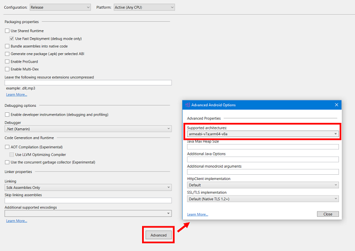
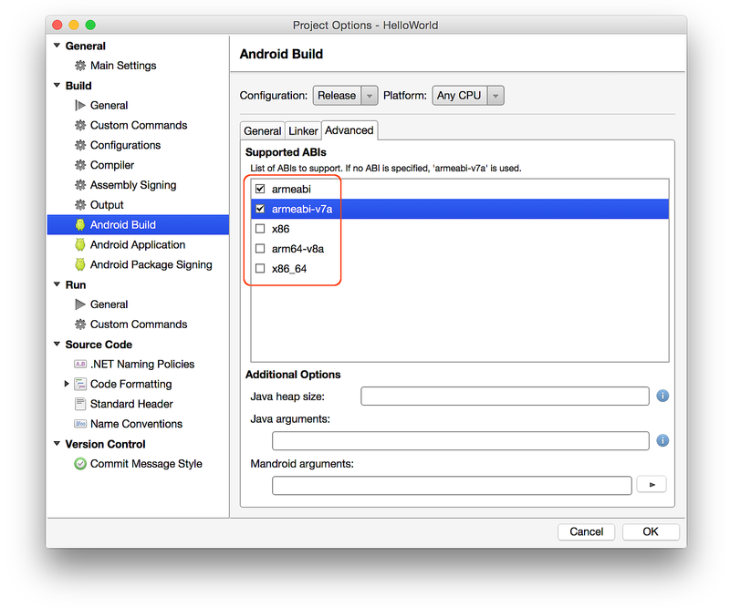

# CPU Architectures

_Xamarin.Android supports several CPU architectures, including 32-bit and 64-bit devices. This article explains how to target an app to one or more Android-supported CPU architectures._

## CPU Architectures Overview

When you prepare your app for release, you must specify which platform
CPU architectures your app supports. A single APK can contain machine
code to support multiple, different architectures. Each collection of
architecture-specific code is associated with an *Application Binary
Interface* (ABI). Each ABI defines how this machine code is expected to
interact with Android at run time.
For more information about how this works, see
[Multi-Core Devices &amp; Xamarin.Android](~/android/deploy-test/multicore-devices.md).

## How to Specify Supported Architectures

# [Visual Studio](#tab/vswin)

Typically, you explicitly select an architecture (or architectures)
when your app is configured for **Release**. When your app is
configured for **Debug**, the **Use Shared Runtime** and **Use Fast
Deployment** options are enabled, which disable explicit architecture
selection.

In Visual Studio, double-click **Properties** under your project in
**Solution Explorer** and select the **Android Options** page. Click
the **Packaging** tab and verify that **Use Shared Runtime** is
disabled (turning this off allows you to explicitly select which ABIs
to support). Click the **Advanced** tab and, under **Advanced
Properties**, check the architectures that you want to support:

# [Visual Studio for Mac](#tab/vsmac)

Typically, you explicitly select an architecture (or architectures)
when your app is configured for **Release**. When your app is
configured for **Debug**, the **Use shared Mono runtime** and **Fast
assembly deployment** options are enabled, which prevent explicit
architecture selection.

In Visual Studio for Mac, locate your project in the **Solution** pad, click
the gear icon next to your project and select **Options**. In the
**Project Options** dialog, click **Android Build**. Click the
**General** tab and verify that **Use shared Mono runtime** is disabled
(turning this off allows you to explicitly select which ABIs to
support). Click the **Advanced** tab and, under **Supported ABIs**,
check the ABIs for the architectures that you want to support:

-----

Xamarin.Android supports the following architectures:

-   **armeabi** &ndash; ARM-based CPUs that support at least the ARMv5TE instruction
    set. Note that `armeabi` is not thread-safe and should not be used on multi-CPU
    devices.

-   **armeabi-v7a** &ndash; ARM-based CPUs with hardware floating-point operations
    and multiple CPU (SMP) devices. Note that `armeabi-v7a` machine code will not
    run on ARMv5 devices.

-   **arm64-v8a** &ndash; CPUs based on the 64-bit ARMv8 architecture.

-   **x86** &ndash; CPUs that support the x86 (or IA-32) instruction set. This
    instruction set is equivalent to that of the Pentium Pro, including MMX, SSE,
    SSE2, and SSE3 instructions.

-   **x86_64** CPUs that support the 64-bit x86 (also referred as
    *x64* and *AMD64*) instruction set.

Xamarin.Android defaults to `armeabi-v7a` for **Release** builds. This
setting provides significantly better performance than `armeabi`. If
you are targeting a 64-bit ARM platform (such as the Nexus 9), select
`arm64-v8a`. If you are deploying your app to an x86 device, select
`x86`. If the target x86 device uses a 64-bit CPU architecture, select
`x86_64`.

## Targeting Multiple Platforms

To target multiple CPU architectures, you can select more than one ABI
(at the expense of larger APK file size). You can use the **Generate
one package (.apk) per selected ABI** option (described in
[Set Packaging Properties](~/android/deploy-test/release-prep/index.md#Set_Packaging_Properties))
to create a separate APK for each supported architecture.

You do not have to select **arm64-v8a** or **x86_64** to
target 64-bit devices; 64-bit support is not required to run
your app on 64-bit hardware. For example, 64-bit ARM devices (such as
the [Nexus 9](http://www.google.com/nexus/9/)) can run apps configured for
`armeabi-v7a`. The primary advantage of enabling 64-bit support is to
make it possible for your app to address more memory.

> [!NOTE]
> **Note:**: 64-bit runtime support is currently an experimental
> feature. Remember that 64-bit runtimes are *not* required to run your app on 64-bit devices. 

## Additional Information

In some situations, you may need to create a separate APK for each
architecture (to reduce the size of your APK, or because your app has
shared libraries that are specific to a particular CPU architecture).
For more information about this approach, see
[Build ABI-Specific APKs](~/android/deploy-test/building-apps/abi-specific-apks.md).
