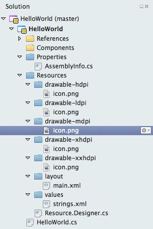
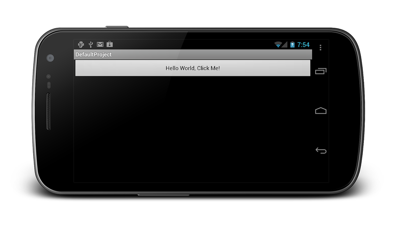
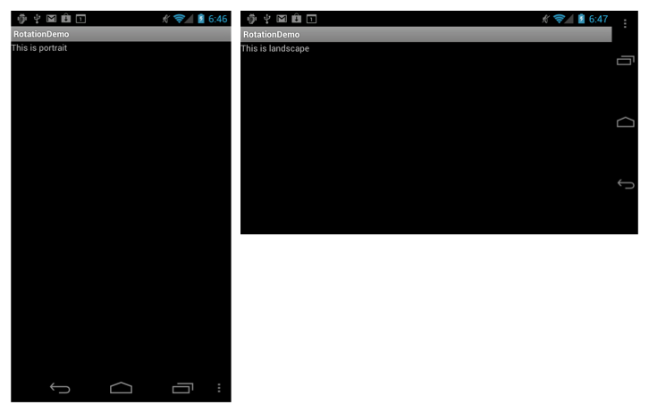
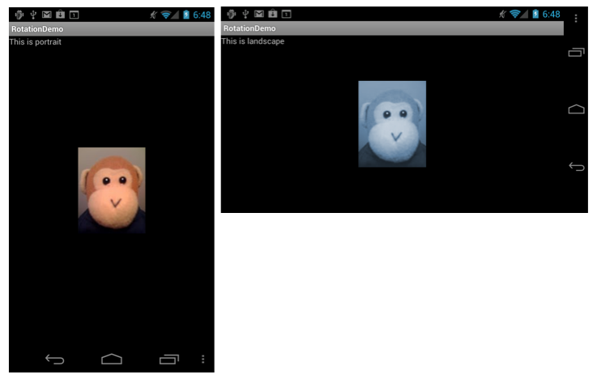
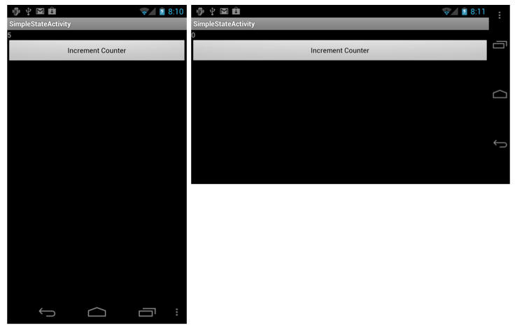
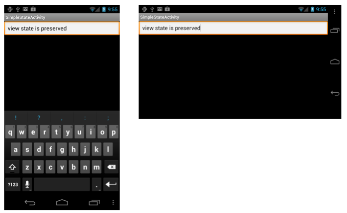

# Handling Rotation

_This topic describes how to handle device orientation changes in Xamarin.Android. It covers how to work with the Android resource system to automatically load resources for a particular device orientation as well as how to programmatically handle orientation changes._


## Overview

Because mobile devices are easily rotated, built-in rotation is a
standard feature in mobile OSes. Android provides a sophisticated
framework for dealing with rotation within applications, whether the
user interface is created declaratively in XML or programmatically in
code. When automatically handling declarative layout changes on a
rotated device, an application can benefit from the tight integration
with the Android resource system. For programmatic layout, changes must
be handled manually. This allows finer control at runtime, but at the
expense of more work for the developer. An application can also choose
to opt out of the Activity restart and take manual control of
orientation changes.

This guide examines the following orientation topics:

-   **Declarative Layout Rotation** &ndash; How to use the Android
    resource system to build orientation-aware applications, including
    how to load both layouts and drawables for particular orientations.

-   **Programmatic Layout Rotation** &ndash; How to add controls
    programmatically as well as how to handle orientation changes
    manually.


## Handling Rotation Declaratively with Layouts

By including files in folders that follow naming conventions, Android
automatically loads the appropriate files when the orientation changes.
This includes support for:

-   *Layout Resources* &ndash; Specifying which layout files are
    inflated for each orientation.

-   *Drawable Resources* &ndash; Specifying which drawables are loaded
    for each orientation.


### Layout Resources

By default, Android XML (AXML) files included in the
**Resources/layout** folder are used for rendering views for an
Activity. This folder's resources are used for both portrait and
landscape orientation if no additional layout resources are provided
specifically for landscape. Consider the project structure created by
the default project template:

[](handling-rotation-images/00.png#lightbox)

This project creates a single **Main.axml** file in the
**Resources/layout** folder. When the Activity's `OnCreate` method is
called, it inflates the view defined in **Main.axml,** which declares a
button as shown in the XML below:

```xml
<?xml version="1.0" encoding="utf-8"?>
<LinearLayout xmlns:android="http://schemas.android.com/apk/res/android"
  android:orientation="vertical"
  android:layout_width="fill_parent"
  android:layout_height="fill_parent">
<Button  
  android:id="@+id/myButton"
  android:layout_width="fill_parent" 
  android:layout_height="wrap_content" 
  android:text="@string/hello"/>
</LinearLayout>
```

If the device is rotated to landscape orientation, the Activity's
`OnCreate` method is called again and the same **Main.axml** file is
inflated, as shown in the screenshot below:

[](handling-rotation-images/01.png#lightbox)


#### Orientation-Specific Layouts

In addition to the layout folder (which defaults to portrait and can
also be explicitly named *layout-port* by including a folder named
`layout-land`), an application can define the views it needs when in
landscape without any code changes.

Suppose the **Main.axml** file contained the following XML:

```xml
<?xml version="1.0" encoding="utf-8"?>
<RelativeLayout xmlns:android="http://schemas.android.com/apk/res/android"
  android:layout_width="fill_parent"
  android:layout_height="fill_parent">
  <TextView
    android:text="This is portrait"
    android:layout_height="wrap_content"
    android:layout_width="fill_parent" />
</RelativeLayout>
```

If a folder named layout-land that contains an additional **Main.axml**
file is added to the project, inflating the layout when in landscape
will now result in Android loading the newly added **Main.axml.** Consider
the landscape version of the **Main.axml** file that contains the following
code (for simplicity, this XML is similar to the default portrait
version of the code, but uses a different string in the `TextView`):

```xml
<?xml version="1.0" encoding="utf-8"?>
<RelativeLayout xmlns:android="http://schemas.android.com/apk/res/android"
  android:layout_width="fill_parent"
  android:layout_height="fill_parent">
  <TextView
    android:text="This is landscape"
    android:layout_height="wrap_content"
    android:layout_width="fill_parent" />
</RelativeLayout>
```

Running this code and rotating the device from portrait to landscape
demonstrates the new XML loading, as shown below:

[](handling-rotation-images/02.png#lightbox)


### Drawable Resources

During rotation, Android treats drawable resources similarly to layout
resources. In this case, the system gets the drawables from the
**Resources/drawable** and **Resources/drawable-land** folders,
respectively.

For example, say the project includes an image named Monkey.png in the
**Resources/drawable** folder, where the drawable is referenced from an
`ImageView` in XML like this:

```xml
<ImageView
  android:layout_height="wrap_content"
  android:layout_width="wrap_content"
  android:src="@drawable/monkey"
  android:layout_centerVertical="true"
  android:layout_centerHorizontal="true" />
```

Let's further assume that a different version of **Monkey.png** is included
under **Resources/drawable-land**. Just like with the layout files,
when the device is rotated, the drawable changes for the given
orientation, as shown below:

[](handling-rotation-images/03.png#lightbox)


## Handling Rotation Programmatically

Sometimes we define layouts in code. This can happen for a variety of
reasons, including technical limitations, developer preference, etc.
When we add controls programmatically, an application must manually
account for device orientation, which is handled automatically when we
use XML resources.


### Adding Controls in Code

To add controls programmatically, an application needs to perform the
following steps:

-  Create a layout.
-  Set layout parameters.
-  Create controls.
-  Set control layout parameters.
-  Add controls to the layout.
-  Set the layout as the content view.

For example, consider a user interface consisting of a single
`TextView` control added to a `RelativeLayout`, as shown in the
following code.

```csharp
protected override void OnCreate (Bundle bundle)
{
  base.OnCreate (bundle);
                        
  // create a layout
  var rl = new RelativeLayout (this);

  // set layout parameters
  var layoutParams = new RelativeLayout.LayoutParams (ViewGroup.LayoutParams.FillParent, ViewGroup.LayoutParams.FillParent);
  rl.LayoutParameters = layoutParams;
        
  // create TextView control
  var tv = new TextView (this);

  // set TextView's LayoutParameters
  tv.LayoutParameters = layoutParams;
  tv.Text = "Programmatic layout";

  // add TextView to the layout
  rl.AddView (tv);
        
  // set the layout as the content view
  SetContentView (rl);
}
```

This code creates an instance of a `RelativeLayout` class and sets its
`LayoutParameters` property. The `LayoutParams` class is Android's way
of encapsulating how controls are positioned in a reusable way. Once an
instance of a layout is created, controls can be created and added to
it. Controls also have `LayoutParameters`, such as the `TextView` in
this example. After the `TextView` is created, adding it to the
`RelativeLayout` and setting the `RelativeLayout` as the content view
results in the application displaying the `TextView` as shown:

[](handling-rotation-images/04.png#lightbox)


### Detecting Orientation in Code

If an application tries to load a different user interface for each
orientation when `OnCreate` is called (this will happen each time a
device is rotated), it must detect the orientation, and then load the
desired user interface code. Android has a class called the
`WindowManager`, which can be used to determine the current device
rotation via the `WindowManager.DefaultDisplay.Rotation` property, as
shown below:

```csharp
protected override void OnCreate (Bundle bundle)
{
  base.OnCreate (bundle);
                        
  // create a layout
  var rl = new RelativeLayout (this);

  // set layout parameters
  var layoutParams = new RelativeLayout.LayoutParams (ViewGroup.LayoutParams.FillParent, ViewGroup.LayoutParams.FillParent);
  rl.LayoutParameters = layoutParams;
                        
  // get the initial orientation
  var surfaceOrientation = WindowManager.DefaultDisplay.Rotation;
  // create layout based upon orientation
  RelativeLayout.LayoutParams tvLayoutParams;
                
  if (surfaceOrientation == SurfaceOrientation.Rotation0 || surfaceOrientation == SurfaceOrientation.Rotation180) {
    tvLayoutParams = new RelativeLayout.LayoutParams (ViewGroup.LayoutParams.FillParent, ViewGroup.LayoutParams.WrapContent);
  } else {
    tvLayoutParams = new RelativeLayout.LayoutParams (ViewGroup.LayoutParams.FillParent, ViewGroup.LayoutParams.WrapContent);
    tvLayoutParams.LeftMargin = 100;
    tvLayoutParams.TopMargin = 100;
  }
                        
  // create TextView control
  var tv = new TextView (this);
  tv.LayoutParameters = tvLayoutParams;
  tv.Text = "Programmatic layout";
        
  // add TextView to the layout
  rl.AddView (tv);
        
  // set the layout as the content view
  SetContentView (rl);
}
```

This code sets the `TextView` to be positioned 100 pixels from the top
left of the screen, automatically animating to the new layout, when
rotated to landscape, as shown here:

[](handling-rotation-images/05.png#lightbox)


### Preventing Activity Restart

In addition to handling everything in `OnCreate`, an application can
also prevent an Activity from being restarted when the orientation
changes by setting `ConfigurationChanges` in the `ActivityAttribute` as
follows:

```csharp
[Activity (Label = "CodeLayoutActivity", ConfigurationChanges=Android.Content.PM.ConfigChanges.Orientation | Android.Content.PM.ConfigChanges.ScreenSize)]
```
Now when the device is rotated, the Activity is not restarted. In order
to manually handle the orientation change in this case, an Activity can
override the `OnConfigurationChanged` method and determine the
orientation from the `Configuration` object that is passed in, as in
the new implementation of the Activity below:

```csharp
[Activity (Label = "CodeLayoutActivity", ConfigurationChanges=Android.Content.PM.ConfigChanges.Orientation | Android.Content.PM.ConfigChanges.ScreenSize)]
public class CodeLayoutActivity : Activity
{
  TextView _tv;
  RelativeLayout.LayoutParams _layoutParamsPortrait;
  RelativeLayout.LayoutParams _layoutParamsLandscape;
                
  protected override void OnCreate (Bundle bundle)
  {
    // create a layout
    // set layout parameters
    // get the initial orientation

    // create portrait and landscape layout for the TextView
    _layoutParamsPortrait = new RelativeLayout.LayoutParams (ViewGroup.LayoutParams.FillParent, ViewGroup.LayoutParams.WrapContent);
                
    _layoutParamsLandscape = new RelativeLayout.LayoutParams (ViewGroup.LayoutParams.FillParent, ViewGroup.LayoutParams.WrapContent);
    _layoutParamsLandscape.LeftMargin = 100;
    _layoutParamsLandscape.TopMargin = 100;
                        
    _tv = new TextView (this);
                        
    if (surfaceOrientation == SurfaceOrientation.Rotation0 || surfaceOrientation == SurfaceOrientation.Rotation180) {
      _tv.LayoutParameters = _layoutParamsPortrait;
    } else {
      _tv.LayoutParameters = _layoutParamsLandscape;
    }
                        
    _tv.Text = "Programmatic layout";
    rl.AddView (_tv);
    SetContentView (rl);
  }
                
  public override void OnConfigurationChanged (Android.Content.Res.Configuration newConfig)
  {
    base.OnConfigurationChanged (newConfig);
                        
    if (newConfig.Orientation == Android.Content.Res.Orientation.Portrait) {
      _tv.LayoutParameters = _layoutParamsPortrait;
      _tv.Text = "Changed to portrait";
    } else if (newConfig.Orientation == Android.Content.Res.Orientation.Landscape) {
      _tv.LayoutParameters = _layoutParamsLandscape;
      _tv.Text = "Changed to landscape";
    }
  }
}
```

Here the `TextView's` layout parameters are initialized for both
landscape and portrait. Class variables hold the parameters, along with
the `TextView` itself, since the Activity will not be re-created when
orientation changes. The code still uses the `surfaceOrientartion` in
`OnCreate` to set the initial layout for the `TextView`. After that,
`OnConfigurationChanged` handles all subsequent layout changes.

When we run the application, Android loads the user interface changes
as device rotation occurs, and does not restart the Activity.


## Preventing Activity Restart for Declarative Layouts

Activity restarts caused by device rotation can also be prevented if we
define the layout in XML. For example, we can use this approach if we
want to prevent an Activity restart (for performance reasons, perhaps)
and we don't need to load new resources for different orientations.

To do this, we follow the same procedure that we use with a
programmatic layout. Simply set `ConfigurationChanges` in the
`ActivityAttribute`, as we did in the `CodeLayoutActivity` earlier. Any
code that does need to run for the orientation change can again be
implemented in the `OnConfigurationChanged` method.


## Maintaining State During Orientation Changes

Whether handling rotation declaratively or programmatically, all
Android applications should implement the same techniques for managing
state when device orientation changes. Managing state is important
because the system restarts a running Activity when an Android device
is rotated. Android does this to make it easy to load alternate
resources, such as layouts and drawables that are designed specifically
for a particular orientation. When it restarts, the Activity loses any
transient state it may have stored in local class variables. Therefore,
if an Activity is state reliant, it must persist its state at the
application level. An application needs to handle saving and restoring
any application state that it wants to preserve across orientation
changes.

For more information on persisting state in Android, refer to the
[Activity Lifecycle](~/android/app-fundamentals/activity-lifecycle/index.md)
guide.


## Summary

This article covered how to use Android's built-in capabilities to work
with rotation. First, it explained how to use the Android resource
system to create orientation aware applications. Then it presented how
to add controls in code as well as how to handle orientation changes
manually.


## Related Links

- [Rotation Demo (sample)](https://developer.xamarin.com/samples/monodroid/ApplicationFundamentals/RotationDemo/)
- [Activity Lifecycle](~/android/app-fundamentals/activity-lifecycle/index.md)
- [Handling Runtime Changes](https://developer.android.com/guide/topics/resources/runtime-changes.html)
- [Fast Screen Orientation Change](http://android-developers.blogspot.com/2009/02/faster-screen-orientation-change.html)
