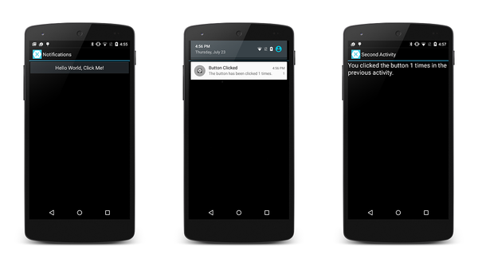
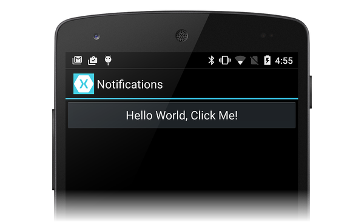
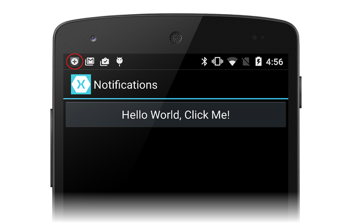
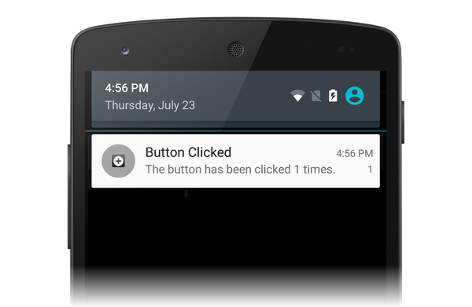
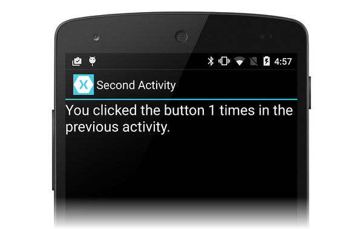

# Walkthrough - Using Local Notifications in Xamarin.Android

_This walkthrough demonstrates how to use local notifications in Xamarin.Android applications. It demonstrates the basics of creating and publishing a local notification. When the user clicks the notification in the notification area, it starts up a second Activity._


## Overview

In this walkthrough, we will create an Android application that raises
a notification when the user clicks a button in an Activity. When the
user clicks the notification, it launches a second activity that
displays the number of times the user had clicked the button in the
first Activity.

The following screenshots illustrate some examples of this application:

[](local-notifications-walkthrough-images/1-overview.png#lightbox)


## Walkthrough

To begin, let's create a new Android project using the **Android App**
template. Let's call this project **LocalNotifications**. (If you are
not familiar with creating Xamarin.Android projects, see
[Hello, Android](~/android/get-started/hello-android/hello-android-quickstart.md).)


### Add the Android.Support.V4.App Component

In this walkthrough we are using `NotificationCompat.Builder` to build
our local notification. As explained in
[Local Notifications](~/android/app-fundamentals/notifications/local-notifications.md),
we must include the
[Android Support Library v4](https://www.nuget.org/packages/Xamarin.Android.Support.v4/)
NuGet in our project to use `NotificationCompat.Builder`.

Next, let's edit **MainActivity.cs** and add the following `using`
statement so that the types in `Android.Support.V4.App` are available
to our code:

```csharp
using Android.Support.V4.App;
```

Also, we must make it clear to the compiler that we are using the
`Android.Support.V4.App` version of `TaskStackBuilder` rather than the
`Android.App` version. Add the following `using` statement to resolve
any ambiguity:

```csharp
using TaskStackBuilder = Android.Support.V4.App.TaskStackBuilder;
```


### Define the Notification ID

We will need a unique ID for our notification. Let's edit
**MainActivity.cs** and add the following static instance variable to
the `MainActivity` class:

```csharp
private static readonly int ButtonClickNotificationId = 1000;
```


### Add Code to Generate the Notification

Next, we need to create a new event handler for the button `Click`
event. Add the following method to `MainActivity`:

```csharp
private void ButtonOnClick (object sender, EventArgs eventArgs)
{
    // Pass the current button press count value to the next activity:
    Bundle valuesForActivity = new Bundle();
    valuesForActivity.PutInt ("count", count);

    // When the user clicks the notification, SecondActivity will start up.
    Intent resultIntent = new Intent(this, typeof (SecondActivity));

    // Pass some values to SecondActivity:
    resultIntent.PutExtras (valuesForActivity);

    // Construct a back stack for cross-task navigation:
    TaskStackBuilder stackBuilder = TaskStackBuilder.Create (this);
    stackBuilder.AddParentStack (Java.Lang.Class.FromType(typeof(SecondActivity)));
    stackBuilder.AddNextIntent (resultIntent);

    // Create the PendingIntent with the back stack:            
    PendingIntent resultPendingIntent =
        stackBuilder.GetPendingIntent (0, (int)PendingIntentFlags.UpdateCurrent);

    // Build the notification:
    NotificationCompat.Builder builder = new NotificationCompat.Builder (this)
        .SetAutoCancel (true)                    // Dismiss from the notif. area when clicked
        .SetContentIntent (resultPendingIntent)  // Start 2nd activity when the intent is clicked.
        .SetContentTitle ("Button Clicked")      // Set its title
        .SetNumber (count)                       // Display the count in the Content Info
        .SetSmallIcon(Resource.Drawable.ic_stat_button_click)  // Display this icon
        .SetContentText (String.Format(
            "The button has been clicked {0} times.", count)); // The message to display.

    // Finally, publish the notification:
    NotificationManager notificationManager =
        (NotificationManager)GetSystemService(Context.NotificationService);
    notificationManager.Notify(ButtonClickNotificationId, builder.Build());

    // Increment the button press count:
    count++;
}
```

In the `OnCreate` method, assign this `ButtonOnClick` method to the
`Click` event of the button (replace the delegate event handler
provided by the template):

```csharp
button.Click += ButtonOnClick;
```


### Create a Second Activity

Now we need to create another activity that Android will display when
the user clicks our notification. Add another Android Activity to your
project called **SecondActivity**. Open **SecondActivity.cs** and
replace its contents with this code:

```csharp
using System;
using Android.App;
using Android.OS;
using Android.Widget;

namespace LocalNotifications
{
    [Activity(Label = "Second Activity")]
    public class SecondActivity : Activity
    {
        protected override void OnCreate (Bundle bundle)
        {
            base.OnCreate (bundle);

            // Get the count value passed to us from MainActivity:
            int count = Intent.Extras.GetInt ("count", -1);

            // No count was passed? Then just return.
            if (count <= 0)
                return;

            // Display the count sent from the first activity:
            SetContentView (Resource.Layout.Second);
            TextView textView = FindViewById<TextView>(Resource.Id.textView);
            textView.Text = String.Format (
                "You clicked the button {0} times in the previous activity.", count);
        }
    }
}
```

We must also create a resource layout for **SecondActivity**. Add a new
**Android Layout** file to your project called **Second.axml**. Edit
**Second.axml** and paste in the following layout code:

```xml
<?xml version="1.0" encoding="utf-8"?>
<LinearLayout xmlns:android="http://schemas.android.com/apk/res/android"
    android:orientation="vertical"
    android:layout_width="fill_parent"
    android:layout_height="fill_parent"
    android:minWidth="25px"
    android:minHeight="25px">
    <TextView
        android:text=""
        android:textAppearance="?android:attr/textAppearanceLarge"
        android:layout_width="fill_parent"
        android:layout_height="wrap_content"
        android:id="@+id/textView" />
</LinearLayout>
```


### Add a Notification Icon

Finally, let's add a small icon that will appear in the notification
area when our notification is launched. You can copy
[this icon](local-notifications-walkthrough-images/ic-stat-button-click.png) to your project or
create your own custom icon. We'll name the icon file
**ic\_stat\_button\_click.png** and copy it to the
**Resources/drawable** folder. Remember to use **Add > Existing Item ...**
to include this icon file in your project.


### Run the Application

Let's build and run the application. You should be presented with the
first activity, similar to the following screenshot:

[](local-notifications-walkthrough-images/2-start-screen.png#lightbox)

As you click the button, you should notice the small icon for the
notification appear in the notification area:

[](local-notifications-walkthrough-images/3-notification-icon.png#lightbox)

If you swipe down and expose the notification drawer, you should see
the notification:

[](local-notifications-walkthrough-images/4-notifications.png#lightbox)

When you click the notification, it should disappear, and our other
activity should be launched &ndash; looking something like the
following screenshot:

[](local-notifications-walkthrough-images/5-second-activity.png#lightbox)

Congratulations! At this point you have completed the Android local
notification walkthrough and you have a working sample that you can
refer to. There is a lot more to notifications than we have shown here,
so if you want more information, take a look at
[Google's documentation on notifications](http://developer.android.com/guide/topics/ui/notifiers/notifications.html)
and the Android
[Notifications](http://developer.android.com/design/patterns/notifications.html)
design guide.


## Summary

In this walkthrough we used `NotificationCompat.Builder` to create and
display notifications. We saw a basic example of how to start up a
second Activity as a way to respond to user interaction with the
notification, and we demonstrated the transfer of data from the first
Activity to the second Activity.


## Related Links

- [LocalNotifications (sample)](https://developer.xamarin.com/samples/monodroid/LocalNotifications/)
- [Design Guide Patterns on Notifications](http://developer.android.com/design/patterns/notifications.html)
- [Notification](https://developer.xamarin.com/api/type/Android.App.Notification/)
- [NotificationManager](https://developer.xamarin.com/api/type/Android.App.NotificationManager/)
- [NotificationCompat.Builder](https://developer.android.com/reference/android/support/v4/app/NotificationCompat.Builder.html)
- [PendingIntent](https://developer.xamarin.com/api/type/Android.App.PendingIntent/)
