# Local Notifications

_This section shows how to implement local notifications in Xamarin.Android. It explains the various UI elements of an Android notification and discusses the API's involved with creating and displaying a notification._

## Local Notifications Overview

This topic explains how to implement local notifications in a
Xamarin.Android application. It discusses the various parts of an
Android notification, it explains the different notification styles
that are available to app developers, and it introduces some of the
APIs that are used to create and publish notifications.

Android provides two system-controlled areas for displaying
notification icons and notification information to the user. When a
notification is first published, its icon is displayed in the
*notification area*, as shown in the following screen shot:


To obtain details about the notification, the user can open the
notification drawer (which expands each notification icon to reveal
notification content) and perform any actions associated with the
notifications. The following screen shot shows a *notification drawer*
that corresponds to the notification area displayed above:

[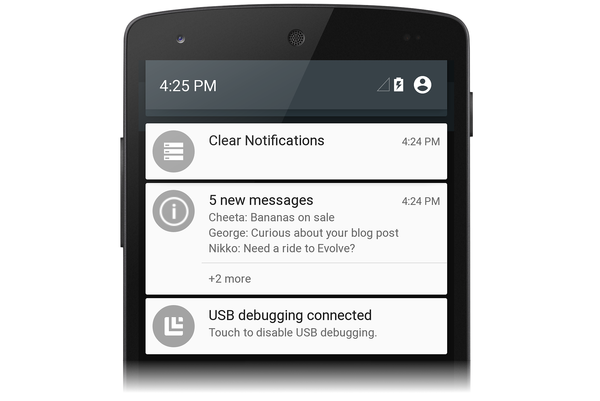](local-notifications-images/02-notification-drawer.png#lightbox)

Android notifications use two types of layouts:

-   ***Base layout*** &ndash; a compact, fixed presentation format.

-   ***Expanded layout*** &ndash; a presentation format that can expand
    to a larger size to reveal more information.

Each of these layout types (and how to create them) is explained in the
following sections.


### Base Layout

All Android notifications are built on the base layout format, which,
at a minimum, includes the following elements:

1.  A *notification icon*, which represents the originating app, or the
    notification type if the app supports different types of
    notifications.

2.  The notification *title*, or the name of the sender if the
    notification is a personal message.

3.  The notification message.

4.  A *timestamp*.

These elements are displayed as illustrated in the following diagram:

[](local-notifications-images/03-notification-callouts.png#lightbox)

Base layouts are limited to 64 density-independent pixels (dp) in
height. Android creates this basic notification style by default.

Optionally, notifications can display a large icon that represents the
application or the sender's photo. When a large icon is used in a
notification in Android 5.0 and later, the small notification icon is
displayed as a badge over the large icon:


Beginning with Android 5.0, notifications can also appear on the
lockscreen:

[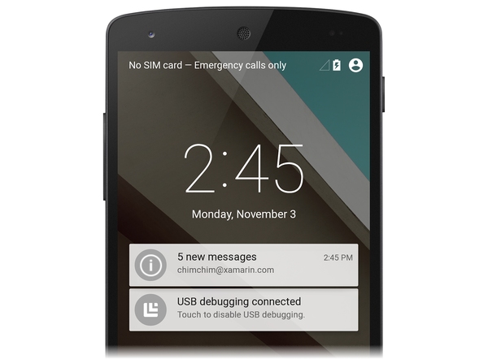](local-notifications-images/05-lockscreen-notification.png#lightbox)

The user can double-tap the lockscreen notification to unlock the
device and jump to the app that originated that notification, or swipe
to dismiss the notification. Apps can set the visibility level of a
notification to control what is shown on the lockscreen, and users can
choose whether to allow sensitive content to be shown in lockscreen
notifications.

Android 5.0 introduced a high-priority notification presentation format
called *Heads-up*. Heads-up notifications slide down from the top of
the screen for a few seconds and then retreat back up to the
notification area:

[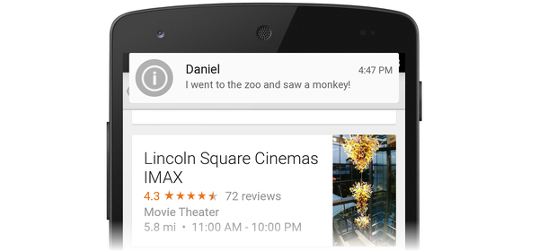](local-notifications-images/06-heads-up-notification.png#lightbox)

Heads-up notifications make it possible for the system UI to put
important information in front of the user without disrupting the state
of the currently running activity.

Android includes support for notification metadata so that
notifications can be sorted and displayed intelligently. Notification
metadata also controls how notifications are presented on the
lockscreen and in Heads-up format. Applications can set the following
types of notification metadata:

-   **Priority** &ndash; The priority level determines how and when
    notifications are presented. For example, In Android 5.0,
    high-priority notifications are displayed as Heads-up
    notifications.

-   **Visibility** &ndash; Specifies how much notification content is
    to be displayed when the notification appears on the lockscreen.

-   **Category** &ndash; Informs the system how to handle the
    notification in various circumstances, such as when the device is
    in *Do not Disturb* mode.

**Note:** **Visibility** and **Category** were introduced in Android
5.0 and are not available in earlier versions of Android. Beginning
with Android 8.0, [notification channels](#notif-chan) are used to
control how notifications are presented to the user.


### Expanded Layouts

Beginning with Android 4.1, notifications can be configured with
expanded layout styles that allow the user to expand the height of the
notification to view more content. For example, the following example
illustrates an expanded layout notification in contracted mode:


When this notification is expanded, it reveals the entire message:


Android supports three expanded layout styles for single-event
notifications:

-   ***Big Text*** &ndash; In contracted mode, displays an excerpt of
    the first line of the message followed by two periods. In expanded
    mode, displays the entire message (as seen in the above example).

-   ***Inbox*** &ndash; In contracted mode, displays the number of new
    messages. In expanded mode, displays the first email message or a
    list of the messages in the inbox.

-   ***Image*** &ndash; In contracted mode, displays only the message
    text. In expanded mode, displays the text and an image.

[Beyond the Basic Notification](#beyond-the-basic-notification) (later
in this article) explains how to create *Big Text*, *Inbox*, and
*Image* notifications.


## Notification Creation

To create a notification in Android, you use the
[Notification.Builder](https://developer.xamarin.com/api/type/Android.App.Notification+Builder/)
class. `Notification.Builder` was introduced in Android 3.0 to simplify
the creation of notification objects. To create notifications that are
compatible with older versions of Android, you can use the
[NotificationCompat.Builder](https://developer.android.com/reference/android/support/v4/app/NotificationCompat.Builder.html)
class instead of `Notification.Builder` (see
[Compatibility](#compatibility) later in this topic for more
information about using `NotificationCompat.Builder`).
`Notification.Builder` provides methods for setting the various options
in a notification, such as:

-   The content, including the title, the message text, and the
    notification icon.

-   The style of the notification, such as *Big Text*, *Inbox*, or
    *Image* style.

-   The priority of the notification: minimum, low, default, high, or
    maximum.

-   The visibility of the notification on the lockscreen: public,
    private, or secret.

-   Category metadata that helps Android classify and filter the
    notification.

-   An optional intent that indicates an activity to launch when the
    notification is tapped.

After you set these options in the builder, you generate a notification
object that contains the settings. To publish the notification, you
pass this notification object to the *Notification Manager*. Android
provides the
[NotificationManager](https://developer.xamarin.com/api/type/Android.App.NotificationManager/)
class, which is responsible for publishing notifications and displaying
them to the user. A reference to this class can be obtained from any
context, such as an activity or a service.


### How to Generate a Notification

To generate a notification in Android, follow these steps:

1.  Instantiate a `Notification.Builder` object.

2.  Call various methods on the `Notification.Builder` object to set
    notification options.

3.  Call the [Build](https://developer.xamarin.com/api/member/Android.App.Notification+Builder.Build/)
    method of the `Notification.Builder` object to instantiate a
    notification object.

4.  Call the [Notify](https://developer.xamarin.com/api/member/Android.App.NotificationManager.Notify/(System.Int32%2cAndroid.App.Notification))
    method of the notification manager to publish the notification.

You must provide at least the following information for each
notification:

-   A small icon (24x24 dp in size)

-   A short title

-   The text of the notification

The following code example illustrates how to use
`Notification.Builder` to generate a basic notification. Notice that
`Notification.Builder` methods support
[method chaining](http://en.wikipedia.org/wiki/Method_chaining); that
is, each method returns the builder object so you can use the result of
the last method call to invoke the next method call:

```csharp
// Instantiate the builder and set notification elements:
Notification.Builder builder = new Notification.Builder (this)
    .SetContentTitle ("Sample Notification")
    .SetContentText ("Hello World! This is my first notification!")
    .SetSmallIcon (Resource.Drawable.ic_notification);

// Build the notification:
Notification notification = builder.Build();

// Get the notification manager:
NotificationManager notificationManager =
    GetSystemService (Context.NotificationService) as NotificationManager;

// Publish the notification:
const int notificationId = 0;
notificationManager.Notify (notificationId, notification);
```

In this example, a new `Notification.Builder` object called `builder`
is instantiated, the title and text of the notification are set, and
the notification icon is loaded from
**Resources/drawable/ic_notification.png**. The call to the
notification builder's `Build` method creates a notification object
with these settings. The next step is to call the `Notify` method of
the notification manager. To locate the notification manager, you call
`GetSystemService`, as shown above.

The `Notify` method accepts two parameters: the notification identifier
and the notification object. The notification identifier is a unique
integer that identifies the notification to your application. In this
example, the notification identifier is set to zero (0); however, in a
production application, you will want to give each notification a
unique identifier. Reusing the previous identifier value in a call to
`Notify` causes the last notification to be overwritten.

When this code runs on an Android 5.0 device, it generates a
notification that looks like the following example:


The notification icon is displayed on the left hand side of the
notification &ndash; this image of a circled &ldquo;i&rdquo; has an
alpha channel so that Android can draw a gray circular background
behind it. You can also supply an icon without an alpha channel. To
display a photographic image as an icon, see
[Large Icon Format](#large-icon-format) later in this topic.

The timestamp is set automatically, but you can override this setting
by calling the
[SetWhen](https://developer.xamarin.com/api/member/Android.App.Notification+Builder.SetWhen/)
method of the notification builder. For example, the following code
example sets the timestamp to the current time:

```csharp
builder.SetWhen (Java.Lang.JavaSystem.CurrentTimeMillis());
```

### Enabling Sound and Vibration

If you want your notification to also play a sound, you can call the
notification builder's
[SetDefaults](https://developer.xamarin.com/api/member/Android.App.Notification+Builder.SetDefaults/)
method and pass in the `NotificationDefaults.Sound` flag:

```csharp
// Instantiate the notification builder and enable sound:
Notification.Builder builder = new Notification.Builder (this)
    .SetContentTitle ("Sample Notification")
    .SetContentText ("Hello World! This is my first notification!")
    .SetDefaults (NotificationDefaults.Sound)
    .SetSmallIcon (Resource.Drawable.ic_notification);
```

This call to `SetDefaults` will cause the device to play a sound when
the notification is published. If you want the device to vibrate rather
than play a sound, you can pass `NotificationDefaults.Vibrate` to
`SetDefaults.` If you want the device to play a sound and vibrate the
device, you can pass both flags to `SetDefaults`:

```csharp
builder.SetDefaults (NotificationDefaults.Sound | NotificationDefaults.Vibrate);
```

If you enable sound without specifying a sound to play, Android uses
the default system notification sound. However, you can change the
sound that will be played by calling the notification builder's
[SetSound](https://developer.xamarin.com/api/member/Android.App.Notification+Builder.SetSound/p/Android.Net.Uri/)
method. For example, to play the alarm sound with your notification
(instead of the default notification sound), you can get the URI for
the alarm sound from the
[RingtoneManager](https://developer.xamarin.com/api/type/Android.Media.RingtoneManager/)
and pass it to `SetSound`:

```csharp
builder.SetSound (RingtoneManager.GetDefaultUri(RingtoneType.Alarm));
```

Alternatively, you can use the system default ringtone sound for your
notification:

```csharp
builder.SetSound (RingtoneManager.GetDefaultUri(RingtoneType.Ringtone));
```

After you create a notification object, it's possible to set
notification properties on the notification object (rather than
configure them in advance through `Notification.Builder` methods). For
example, instead of calling the `SetDefaults` method to enable
vibration on a notification, you can directly modify the bit flag of
the notification's
[Defaults](https://developer.xamarin.com/api/property/Android.App.Notification.Defaults/)
property:

```csharp
// Build the notification:
Notification notification = builder.Build();

// Turn on vibrate:
notification.Defaults |= NotificationDefaults.Vibrate;
```

This example causes the device to vibrate when the notification is
published.

<a name="updating-a-notification" />

### Updating a Notification

If you want to update the content of a notification after it has been
published, you can reuse the existing `Notification.Builder` object to
create a new notification object and publish this notification with the
identifier of the last notification. For example:

```csharp
// Update the existing notification builder content:
builder.SetContentTitle ("Updated Notification");
builder.SetContentText ("Changed to this message.");

// Build a notification object with updated content:
notification = builder.Build();

// Publish the new notification with the existing ID:
notificationManager.Notify (notificationId, notification);
```

In this example, the existing `Notification.Builder` object is used to
create a new notification object with a different title and message.
The new notification object is published using the identifier of the
previous notification, and this updates the content of the
previously-published notification:


The body of the previous notification is reused &ndash; only the title
and the text of the notification changes while the notification is
displayed in the notification drawer. The title text changes from
"Sample Notification" to "Updated Notification" and the message text
changes from "Hello World! This is my first notification!" to "Changed
to this message."

A notification remains visible until one of three things happens:

-   The user dismisses the notification (or taps *Clear All*).

-   The application makes a call to `NotificationManager.Cancel`,
    passing in the unique notification ID that was assigned when the
    notification was published.

-   The application calls `NotificationManager.CancelAll`.

For more about updating Android notifications, see
[Modify a Notification](http://developer.android.com/training/notify-user/managing.html#Updating).


### Starting an Activity from a Notification

In Android, it's common for a notification to be associated with an
*action* &ndash; an activity that's launched when the user taps the
notification. This activity can reside in another application or even
in another task. To add an action to a notification, you create a
[PendingIntent](https://developer.xamarin.com/api/type/Android.App.PendingIntent/)
object and associate the `PendingIntent` with the notification. A
`PendingIntent` is a special type of intent that allows the recipient
application to run a predefined piece of code with the permissions of
the sending application. When the user taps the notification, Android
starts up the activity specified by the `PendingIntent`.

The following code snippet illustrates how to create a notification
with a `PendingIntent` that will launch the activity of the originating
app, `MainActivity`:

```csharp
// Set up an intent so that tapping the notifications returns to this app:
Intent intent = new Intent (this, typeof(MainActivity));

// Create a PendingIntent; we're only using one PendingIntent (ID = 0):
const int pendingIntentId = 0;
PendingIntent pendingIntent =
    PendingIntent.GetActivity (this, pendingIntentId, intent, PendingIntentFlags.OneShot);

// Instantiate the builder and set notification elements, including pending intent:
Notification.Builder builder = new Notification.Builder(this)
    .SetContentIntent (pendingIntent)
    .SetContentTitle ("Sample Notification")
    .SetContentText ("Hello World! This is my first action notification!")
    .SetSmallIcon (Resource.Drawable.ic_notification);

// Build the notification:
Notification notification = builder.Build();

// Get the notification manager:
NotificationManager notificationManager =
    GetSystemService (Context.NotificationService) as NotificationManager;

// Publish the notification:
const int notificationId = 0;
notificationManager.Notify (notificationId, notification);
```

This code is very similar to the notification code in the previous
section, except that a `PendingIntent` is added to the notification
object. In this example, the `PendingIntent` is associated with the
activity of the originating app before it is passed to the notification
builder's
[SetContentIntent](https://developer.xamarin.com/api/member/Android.App.Notification+Builder.SetContentIntent/)
method. The `PendingIntentFlags.OneShot` flag is passed to the
`PendingIntent.GetActivity` method so that the `PendingIntent` is used
only once. When this code runs, the following notification is
displayed:


Tapping this notification takes the user back to the originating
activity.

In a production app, your app must handle the *back stack* when the
user presses the **Back** button within the notification activity (if
you are not familiar with Android tasks and the back stack, see
[Tasks and Back Stack](http://developer.android.com/guide/components/tasks-and-back-stack.html)).
In most cases, navigating backward out of the notification activity
should return the user out of the app and back to Home screen. To
manage the back stack, your app uses the
[TaskStackBuilder](https://developer.xamarin.com/api/type/Android.App.TaskStackBuilder/)
class to create a `PendingIntent` with a back stack.

Another real-world consideration is that the originating activity may
need to send data to the notification activity. For example, the
notification may indicate that a text message has arrived, and the
notification activity (a message viewing screen), requires the ID of
the message to display the message to the user. The activity
that creates the `PendingIntent` can use the
[Intent.PutExtra](https://developer.xamarin.com/api/member/Android.Content.Intent.PutExtra/p/System.String/System.String/)
method to add data (for example, a string) to the intent so that this
data is passed to the notification activity.

The following code sample illustrates how to use `TaskStackBuilder` to
manage the back stack, and it includes an example of how to send a
single message string to a notification activity called
`SecondActivity`:

```csharp
// Setup an intent for SecondActivity:
Intent secondIntent = new Intent (this, typeof(SecondActivity));

// Pass some information to SecondActivity:
secondIntent.PutExtra ("message", "Greetings from MainActivity!");

// Create a task stack builder to manage the back stack:
TaskStackBuilder stackBuilder = TaskStackBuilder.Create(this);

// Add all parents of SecondActivity to the stack:
stackBuilder.AddParentStack (Java.Lang.Class.FromType (typeof (SecondActivity)));

// Push the intent that starts SecondActivity onto the stack:
stackBuilder.AddNextIntent (secondIntent);

// Obtain the PendingIntent for launching the task constructed by
// stackbuilder. The pending intent can be used only once (one shot):
const int pendingIntentId = 0;
PendingIntent pendingIntent =
    stackBuilder.GetPendingIntent (pendingIntentId, PendingIntentFlags.OneShot);

// Instantiate the builder and set notification elements, including
// the pending intent:
Notification.Builder builder = new Notification.Builder (this)
    .SetContentIntent (pendingIntent)
    .SetContentTitle ("Sample Notification")
    .SetContentText ("Hello World! This is my second action notification!")
    .SetSmallIcon (Resource.Drawable.ic_notification);

// Build the notification:
Notification notification = builder.Build();

// Get the notification manager:
NotificationManager notificationManager =
    GetSystemService (Context.NotificationService) as NotificationManager;

// Publish the notification:
const int notificationId = 0;
notificationManager.Notify (notificationId, notification);
```

In this code example, the app consists of two activities:
`MainActivity` (which contains the notification code above), and
`SecondActivity`, the screen the user sees after tapping the
notification. When this code is run, a simple notification (similar to
the previous example) is presented. Tapping on the notification takes
the user to the `SecondActivity` screen:


The string message (passed into the intent's `PutExtra` method) is
retrieved in `SecondActivity` via this line of code:

```csharp
// Get the message from the intent:
string message = Intent.Extras.GetString ("message", "");
```

This retrieved message, "Greetings from MainActivity!," is displayed in
the `SecondActivity` screen, as shown in the above screenshot. When the
user presses the **Back** button while in `SecondActivity`, navigation
leads out of the app and back to the screen preceding the launch of the
app.

For more information about creating pending intents, see
[PendingIntent](https://developer.xamarin.com/api/type/Android.App.PendingIntent/).


<a name="notif-chan" />

## Notification Channels

Beginning with Android 8.0 (Oreo), you can use the *notification
channels* feature to create a user-customizable channel for each type
of notification that you want to display. Notification channels make it
possible for you to group notifications so that all notifications
posted to a channel exhibit the same behavior. For example, you might
have a notification channel that is intended for notifications that
require immediate attention, and a separate "quieter" channel that is
used for informational messages.

The **YouTube** app that is installed with Android Oreo
lists two notification categories: **Download notifications** and
**General notifications**:

[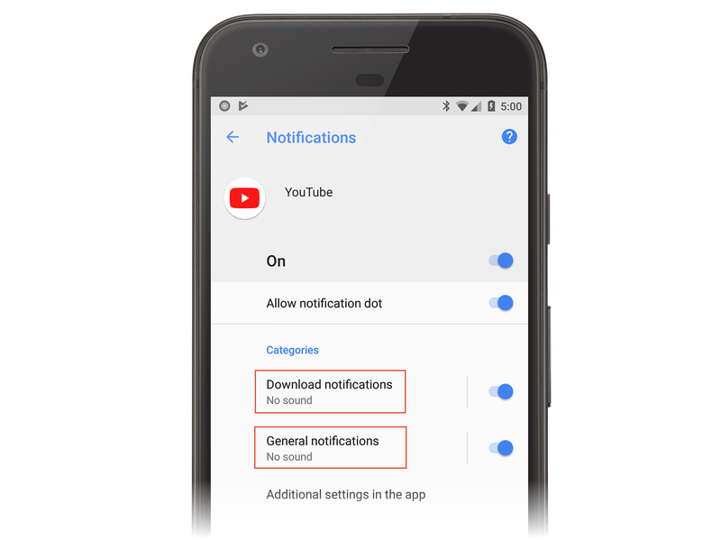](local-notifications-images/27-youtube.png#lightbox)

Each of these categories corresponds to a notification channel. The
YouTube app implements a **Download notifications** channel and a
**General Notifications** channel. The user can tap **Download
notifications**, which displays the settings screen for the app's
download notifications channel:

[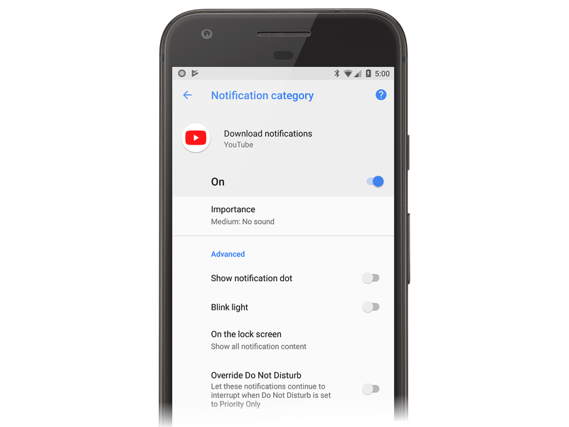](local-notifications-images/28-yt-download.png#lightbox)

In this screen, the user can modify the behavior of the **Download**
notifications channel by doing the following:

-   Set the Importance level to **Urgent**, **High**, **Medium**, or
    **Low**, which configures the level of sound and visual
    interruption.

-   Turn the notification dot on or off.

-   Turn the blinking light on or off.

-   Show or hide notifications on the lock screen.

-   Override the **Do Not Disturb** setting.

The **General Notifications** channel has similar settings:

[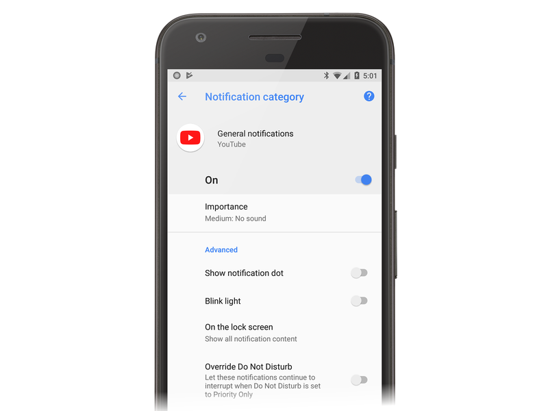](local-notifications-images/29-yt-general.png#lightbox)

Notice that you do not have absolute control over how your notification
channels interact with the user &ndash; the user can modify the
settings for any notification channel on the device as seen in the
screenshots above. However, you can configure default values (as will be
described below). As these examples illustrate, the new notification
channels feature makes it possible for you to give users fine-grained
control over different kinds of notifications.

Should you add support for notification channels to your app? If you're
targeting Android 8.0, your app *must* implement notification channels.
An app targeted for Oreo that attempts to send a local notification to
the user without using a notification channel will fail to display the
notification on Oreo devices. If you don't target Android 8.0, your app
will still run on Android 8.0, but with the same notification behavior
as it would exhibit when running on Android 7.1 or earlier.


### Creating a Notification Channel

To create a notification channel, do the following:

1. Construct a
   [NotificationChannel](https://developer.android.com/reference/android/app/NotificationChannel.html)
   object with the following:

    - An ID string that is unique within your package. In the following
      example, the string `com.xamarin.myapp.urgent` is used.

    - The user-visible name of the channel (less than 40 characters). In the following
      example, the name **Urgent** is used.

    - The importance of the channel, which controls how interruptive
      notifications are posted to the `NotificationChannel`. The
      importance can be `Default`, `High`, `Low`, `Max`, `Min`, `None`,
      or `Unspecified`.

    Pass these values to the
    [constructor](https://developer.android.com/reference/android/app/NotificationChannel.html#NotificationChannel%28java.lang.String,%20java.lang.CharSequence,%20int%29) (in this example, `Resource.String.noti_chan_urgent` is set to **Urgent**):

    ```csharp
    public const string URGENT_CHANNEL = "com.xamarin.myapp.urgent";
    . . .
    string chanName = GetString (Resource.String.noti_chan_urgent);
    var importance = NotificationImportance.High;
    NotificationChannel chan =
       new NotificationChannel (URGENT_CHANNEL, chanName, importance);
    ```

2.  Configure the `NotificationChannel` object with initial settings.
    For example, the following code configures the `NotificationChannel`
    object so that notifications posted to this channel will vibrate the
    device and appear on the lock screen by default:

    ```csharp
    chan.EnableVibration (true);
    chan.LockscreenVisibility = NotificationVisibility.Public;
    ```

3.  Submit the notification channel object to the notification manager:

    ```csharp
    NotificationManager notificationManager =
        (NotificationManager) GetSystemService (NotificationService);
    notificationManager.CreateNotificationChannel (chan);
    ```


### Posting to a Notifications Channel

To post a notification to a notification channel, do the following:

1.  Configure the notification using the `Notification.Builder`, passing
    in the channel ID to the `SetChannelId` method. For
    example:

    ```csharp
    Notification.Builder builder = new Notification.Builder (this)
        .SetContentTitle ("Attention!")
        .SetContentText ("This is an urgent notification message!")
        .SetChannelId (URGENT_CHANNEL);
    ```

2.  Build and issue the notification  using the Notification Manager's
    [Notify](https://developer.xamarin.com/api/member/Android.App.NotificationManager.Notify/p/System.Int32/Android.App.Notification/) method:

    ```csharp
    const int notificationId = 0;
    notificationManager.Notify (notificationId, builder.Build());
    ```

You can repeat the above steps to create another notification channel
for informational messages. This second channel could, by default,
disable vibration, set the default lock screen visibility to `Private`,
and set the notification importance to `Default`.

For a complete code example of Android Oreo Notification Channels in
action, see the
[NotificationChannels](https://developer.xamarin.com/samples/monodroid/android-o/NotificationChannels)
sample; this sample app manages two channels and sets additional
notification options.


<a name="beyond-the-basic-notification" />

## Beyond the Basic Notification

Notifications default to a no-frills base layout format in Android, but
you can enhance this basic format by making additional
`Notification.Builder` method calls. In this section, you'll learn how
to add a large photo icon to your notification, and you'll see examples
of how to create expanded layout notifications.

<a name="large-icon-format" />

### Large Icon Format

Android notifications typically display the icon of the originating app
(on the left side of the notification). However, notifications can
display an image or a photo (a *large icon*) instead of the standard
small icon. For example, a messaging app could display a photo of the
sender rather than the app icon.

Here is an example of a basic Android 5.0 notification &ndash; it
displays only the small app icon:


And here is a screenshot of the notification after modifying it to
display a large icon &ndash; it uses an icon created from an image of a
Xamarin code monkey:


Notice that when a notification is presented in large icon format, the
small app icon is displayed as a badge on the lower right corner of the
large icon.

To use an image as a large icon in a notification, you call the
notification builder's
[SetLargeIcon](https://developer.xamarin.com/api/member/Android.App.Notification+Builder.SetLargeIcon/)
method and pass in a bitmap of the image. Unlike `SetSmallIcon`,
`SetLargeIcon` only accepts a bitmap. To convert an image file into a
bitmap, you use the
[BitmapFactory](https://developer.xamarin.com/api/type/Android.Graphics.BitmapFactory/)
class. For example:

```csharp
builder.SetLargeIcon (BitmapFactory.DecodeResource (Resources, Resource.Drawable.monkey_icon));
```

This example code opens the image file at
**Resources/drawable/monkey_icon.png**, converts it to a bitmap, and
passes the resulting bitmap to `Notification.Builder`. Typically, the
source image resolution is larger than the small icon &ndash; but not
much larger. An image that is too large might cause unnecessary
resizing operations that could delay the posting of the notification.
For more about notification icon sizes in Android, see
[Notification Icons](http://developer.android.com/design/style/iconography.html#notification).


### Big Text Style

The *Big Text* style is an expanded layout template that you use for
displaying long messages in notifications. Like all expanded layout
notifications, the Big Text notification is initially displayed in a
compact presentation format:


In this format, only an excerpt of the message is shown, terminated by
two periods. When the user drags down on the notification, it expands
to reveal the entire notification message:


This expanded layout format also includes summary text at the bottom of
the notification. The maximum height of the *Big Text* notification is
256 dp.

To create a *Big Text* notification, you instantiate a
`Notification.Builder` object, as before, and then instantiate and add
a [BigTextStyle](https://developer.xamarin.com/api/type/Android.App.Notification+BigTextStyle/)
object to the `Notification.Builder` object. For example:

```csharp
// Instantiate the Big Text style:
Notification.BigTextStyle textStyle = new Notification.BigTextStyle();

// Fill it with text:
string longTextMessage = "I went up one pair of stairs.";
longTextMessage += " / Just like me. ";
//...
textStyle.BigText (longTextMessage);

// Set the summary text:
textStyle.SetSummaryText ("The summary text goes here.");

// Plug this style into the builder:
builder.SetStyle (textStyle);

// Create the notification and publish it ...
```

In this example, the message text and summary text are stored in the
`BigTextStyle` object (`textStyle`) before it is passed to
`Notification.Builder.`


### Image Style

The *Image* style (also called the *Big Picture* style) is an expanded
notification format that you can use to display an image in the body of
a notification. For example, a screenshot app or a photo app can use
the *Image* notification style to provide the user with a notification
of the last image that was captured. Note that the maximum height of
the *Image* notification is 256 dp &ndash; Android will resize the
image to fit into this maximum height restriction, within the limits of
available memory.

Like all expanded layout notifications, *Image* notifications are first
displayed in a compact format that displays an excerpt of the
accompanying message text:


When the user drags down on the *Image* notification, it expands to
reveal an image. For example, here is the expanded version of the
previous notification:

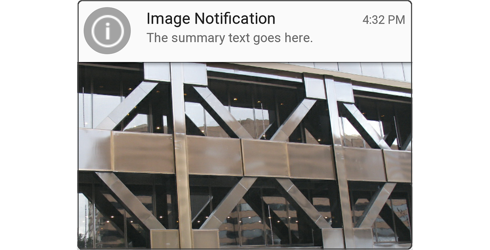

Notice that when the notification is displayed in compact format, it
displays notification text (the text that is passed to the notification
builder's `SetContentText` method, as shown earlier). However, when the
notification is expanded to reveal the image, it displays summary text
above the image.

To create an *Image* notification, you instantiate a
`Notification.Builder` object as before, and then create and insert a
[BigPictureStyle](https://developer.xamarin.com/api/type/Android.App.Notification+BigPictureStyle/)
object into the `Notification.Builder` object. For example:

```csharp
// Instantiate the Image (Big Picture) style:
Notification.BigPictureStyle picStyle = new Notification.BigPictureStyle();

// Convert the image to a bitmap before passing it into the style:
picStyle.BigPicture (BitmapFactory.DecodeResource (Resources, Resource.Drawable.x_bldg));

// Set the summary text that will appear with the image:
picStyle.SetSummaryText ("The summary text goes here.");

// Plug this style into the builder:
builder.SetStyle (picStyle);

// Create the notification and publish it ...
```

Like the `SetLargeIcon` method of `Notification.Builder`, the
[BigPicture](https://developer.xamarin.com/api/member/Android.App.Notification+BigPictureStyle.BigPicture/)
method of `BigPictureStyle` requires a bitmap of the image that you
want to display in the body of the notification. In this example, the
[DecodeResource](https://developer.xamarin.com/api/member/Android.Graphics.BitmapFactory.DecodeResource/(Android.Content.Res.Resources%2cSystem.Int32))
method of `BitmapFactory` reads the image file located at
**Resources/drawable/x_bldg.png** and converts it into a bitmap.

You can also display images that are not packaged as a resource. For
example, the following sample code loads an image from the local SD
card and displays it in an *Image* notification:

```csharp
// Using the Image (Big Picture) style:
Notification.BigPictureStyle picStyle = new Notification.BigPictureStyle();

// Read an image from the SD card, subsample to half size:
BitmapFactory.Options options = new BitmapFactory.Options();
options.InSampleSize = 2;
string imagePath = "/sdcard/Pictures/my-tshirt.jpg";
picStyle.BigPicture (BitmapFactory.DecodeFile (imagePath, options));

// Set the summary text that will appear with the image:
picStyle.SetSummaryText ("Check out my new T-Shirt!");

// Plug this style into the builder:
builder.SetStyle (picStyle);

// Create notification and publish it ...
```

In this example, the image file located at
**/sdcard/Pictures/my-tshirt.jpg** is loaded, resized to half of its
original size, and then converted to a bitmap for use in the
notification:

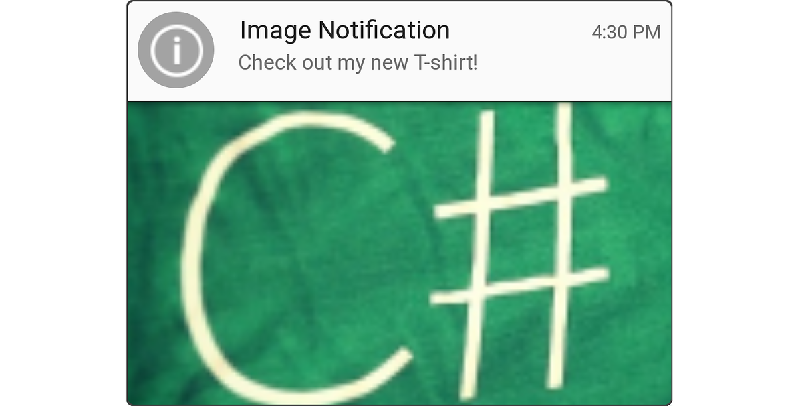

If you don't know the size of the image file in advance, it's a good
idea to wrap the call to
[BitmapFactory.DecodeFile](https://developer.xamarin.com/api/member/Android.Graphics.BitmapFactory.DecodeFile/p/System.String/Android.Graphics.BitmapFactory+Options/)
in an exception handler &ndash; an `OutOfMemoryError` exception might
be thrown if the image is too large for Android to resize.

For more about loading and decoding large bitmap images, see
[Load Large Bitmaps Efficiently](https://developer.xamarin.com/recipes/android/resources/general/load_large_bitmaps_efficiently).


### Inbox Style

The *Inbox* format is an expanded layout template intended for
displaying separate lines of text (such as an email inbox summary) in
the body of the notification. The *Inbox* format notification is first
displayed in a compact format:


When the user drags down on the notification, it expands to reveal an
email summary as seen in the screenshot below:


To create an *Inbox* notification, you instantiate a
`Notification.Builder` object, as before, and add an
[InboxStyle](https://developer.xamarin.com/api/type/Android.App.Notification+InboxStyle/)
object to the `Notification.Builder`. For example:

```csharp
// Instantiate the Inbox style:
Notification.InboxStyle inboxStyle = new Notification.InboxStyle();

// Set the title and text of the notification:
builder.SetContentTitle ("5 new messages");
builder.SetContentText ("chimchim@xamarin.com");

// Generate a message summary for the body of the notification:
inboxStyle.AddLine ("Cheeta: Bananas on sale");
inboxStyle.AddLine ("George: Curious about your blog post");
inboxStyle.AddLine ("Nikko: Need a ride to Evolve?");
inboxStyle.SetSummaryText ("+2 more");

// Plug this style into the builder:
builder.SetStyle (inboxStyle);
```

To add new lines of text to the notification body, call the
[Addline](https://developer.xamarin.com/api/member/Android.App.Notification+InboxStyle.AddLine/p/System.String/)
method of the `InboxStyle` object (the maximum height of the *Inbox*
notification is 256 dp). Note that, unlike *Big Text* style, the
*Inbox* style supports individual lines of text in the notification
body.

You can also use the *Inbox* style for any notification that needs to
display individual lines of text in an expanded format. For example,
the *Inbox* notification style can be used to combine multiple pending
notifications into a summary notification &ndash; you can update a
single *Inbox* style notification with new lines of notification
content (see
[Updating a Notification](#updating-a-notification) above), rather than
generate a continuous stream of new, mostly similar notifications. For
more information about this approach, see
[Summarize your notifications](http://developer.android.com/design/patterns/notifications.html#summarize_your_notifications).


## Configuring Metadata

`Notification.Builder` includes methods that you can call to set
metadata about your notification, such as priority, visibility, and
category. Android uses this information &mdash; along with user
preference settings &mdash; to determine how and when to display
notifications.


### Priority Settings

The priority setting of a notification determines two outcomes when the
notification is published:

-   Where the notification appears in relation to other notifications.
    For example, high priority notifications are presented above lower
    priority notifications in the notifications drawer, regardless of
    when each notification was published.

-   Whether the notification is displayed in the Heads-up notification
    format (Android 5.0 and later). Only *high* and *maximum* priority
    notifications are displayed as Heads-up notifications.

Xamarin.Android defines the following enumerations for setting
notification priority:

-   `NotificationPriority.Max` &ndash; Alerts the user to an urgent or
    critical condition (for example, an incoming call, turn-by-turn
    directions, or an emergency alert). On Android 5.0 and later
    devices, maximum priority notifications are displayed in Heads-up
    format.

-   `NotificationPriority.High` &ndash; Informs the user of important
    events (such as important emails or the arrival of real-time chat
    messages). On Android 5.0 and later devices, high priority
    notifications are displayed in Heads-up format.

-   `NotificationPriority.Default` &ndash; Notifies the user of
    conditions that have a medium level of importance.

-   `NotificationPriority.Low` &ndash; For non-urgent information that
    the user needs to be informed of (for example, software update
    reminders or social network updates).

-   `NotificationPriority.Min` &ndash; For background information that
    the user notices only when viewing notifications (for example,
    location or weather information).

To set the priority of a notification, call the
[SetPriority](https://developer.xamarin.com/api/member/Android.App.Notification+Builder.SetPriority/)
method of the `Notification.Builder` object, passing in the priority
level. For example:

```csharp
builder.SetPriority (NotificationPriority.High);
```

In the following example, the high priority notification, "An
important message!" appears at the top of the notification
drawer:

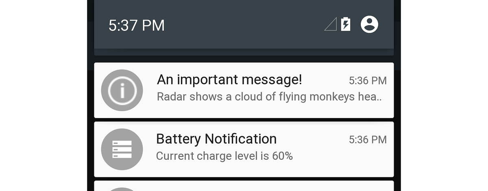

Because this is a high-priority notification, it is also displayed as a
Heads-up notification above the user's current activity screen in
Android 5.0:

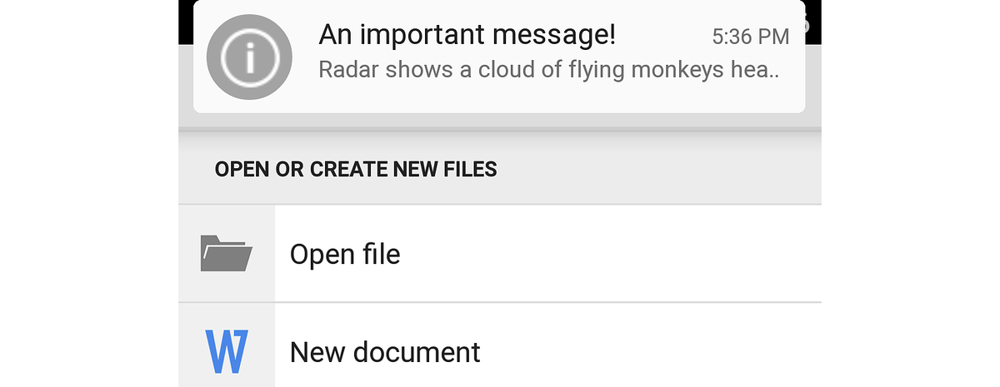

In the next example, the low-priority "Thought for the day"
notification is displayed under a higher-priority battery level
notification:

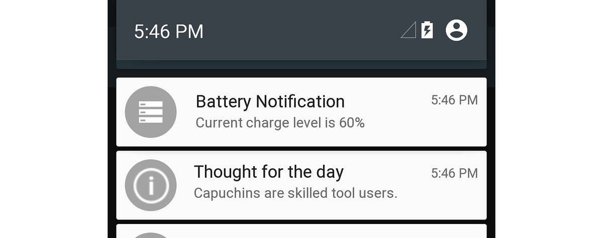

Because the "Thought for the day" notification is a low-priority
notification, Android will not display it in Heads-up format.


### Visibility Settings

Beginning with Android 5.0, the *visibility* setting is available to
control how much notification content appears on the secure lockscreen.
Xamarin.Android defines the following enumerations for setting
notification visibility:

-   `NotificationVisibility.Public` &ndash; The full content of the
    notification is displayed on the secure lockscreen.

-   `NotificationVisibility.Private` &ndash; Only essential information
    is displayed on the secure lockscreen (such as the notification
    icon and the name of the app that posted it), but the rest of the
    notification's details are hidden. All notifications default to
    `NotificationVisibility.Private`.

-   `NotificationVisibility.Secret` &ndash; Nothing is displayed on the
    secure lockscreen, not even the notification icon. The notification
    content is available only after the user unlocks the device.

To set the visibility of a notification, apps call the `SetVisibility`
method of the `Notification.Builder` object, passing in the visibility
setting. For example, this call to `SetVisibility` makes the
notification `Private`:

```csharp
builder.SetVisibility (NotificationVisibility.Private);
```

When a `Private` notification is posted, only the name and icon of the
app is displayed on the secure lockscreen. Instead of the notification
message, the user sees "Unlock your device to see this notification":


In this example, **NotificationsLab** is the name of the originating
app. This redacted version of the notification appears only when the
lockscreen is secure (i.e., secured via PIN, pattern, or password)
&ndash; if the lockscreen is not secure, the full content of the
notification is available on the lockscreen.


### Category Settings

Beginning with Android 5.0, predefined categories are available for
ranking and filtering notifications. Xamarin.Android provides the
following enumerations for these categories:

-   `Notification.CategoryCall` &ndash; Incoming phone call.

-   `Notification.CategoryMessage` &ndash; Incoming text message.

-   `Notification.CategoryAlarm` &ndash; An alarm condition or timer
    expiration.

-   `Notification.CategoryEmail` &ndash; Incoming email message.

-   `Notification.CategoryEvent` &ndash; A calendar event.

-   `Notification.CategoryPromo` &ndash; A promotional message or
    advertisement.

-   `Notification.CategoryProgress` &ndash; The progress of a
    background operation.

-   `Notification.CategorySocial` &ndash; Social networking update.

-   `Notification.CategoryError` &ndash; Failure of a background
    operation or authentication process.

-   `Notification.CategoryTransport` &ndash; Media playback update.

-   `Notification.CategorySystem` &ndash; Reserved for system use
    (system or device status).

-   `Notification.CategoryService` &ndash; Indicates that a background
    service is running.

-   `Notification.CategoryRecommendation` &ndash; A recommendation
    message related to the currently running app.

-   `Notification.CategoryStatus` &ndash; Information about the device.

When notifications are sorted, the notification's priority takes
precedence over its category setting. For example, a high-priority
notification will be displayed as Heads-up even if it belongs to the
`Promo` category. To set the category of a notification, you call the
`SetCategory` method of the `Notification.Builder` object, passing in
the category setting. For example:

```csharp
builder.SetCategory (Notification.CategoryCall);
```

The *Do not disturb* feature (new in Android 5.0) filters notifications
based on categories. For example, the *Do not disturb* screen in
**Settings** allows the user to exempt notifications for phone calls
and messages:

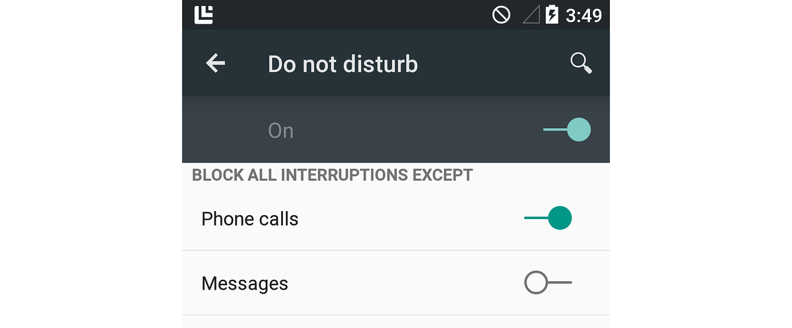

When the user configures *Do not disturb* to block all interrupts
except for phone calls (as illustrated in the above screenshot),
Android allows notifications with a category setting of
`Notification.CategoryCall` to be presented while the device is in *Do
not disturb* mode. Note that `Notification.CategoryAlarm` notifications
are never blocked in *Do not disturb* mode.


<a name="compatibility" />

## Compatibility

If you are creating an app that will also run on earlier versions of
Android (as early as API level 4), you use the
[NotificationCompat.Builder](https://developer.android.com/reference/android/support/v4/app/NotificationCompat.Builder.html)
class instead of `Notification.Builder`. When you create notifications
with `NotificationCompat.Builder`, Android ensures that basic
notification content is displayed properly on older devices. However,
because some advanced notification features are not available on older
versions of Android, your code must explicitly handle compatibility
issues for expanded notification styles, categories, and visibility
levels as explained below.

To use `NotificationCompat.Builder` in your app, you must include the
[Android Support Library v4](https://www.nuget.org/packages/Xamarin.Android.Support.v4/)
NuGet in your project.

The following code sample illustrates how to create a basic
notification using `NotificationCompat.Builder`:

```csharp
// Instantiate the builder and set notification elements:
NotificationCompat.Builder builder = new NotificationCompat.Builder (this)
    .SetContentTitle ("Sample Notification")
    .SetContentText ("Hello World! This is my first notification!")
    .SetSmallIcon (Resource.Drawable.ic_notification);

// Build the notification:
Notification notification = builder.Build();
```

As this example illustrates, method calls for essential notification
options are identical to those of `Notification.Builder`. However, your
code has to handle downward-compatibility issues for more complex
notifications (described in the next section).

The [LocalNotifications](https://developer.xamarin.com/samples/monodroid/LocalNotifications) sample
demonstrates how to use `NotificationCompat.Builder` to launch a second
activity from a notification. This sample code is explained in the
[Using Local Notifications in Xamarin.Android](~/android/app-fundamentals/notifications/local-notifications-walkthrough.md)
walkthrough.


### Notification Styles

To create *Big Text*, *Image*, or *Inbox* style notifications with
`NotificationCompat.Builder`, your app must use the compatibility
versions of these styles. For example, to use the *Big Text* style,
instantiate `NotificationCompat.BigTextstyle`:

```csharp
NotificationCompat.BigTextStyle textStyle = new NotificationCompat.BigTextStyle();

// Plug this style into the builder:
builder.SetStyle (textStyle);
```

Similarly, your app can use `NotificationCompat.InboxStyle` and
`NotificationCompat.BigPictureStyle` for *Inbox* and *Image* styles,
respectively.


### Notification Priority and Category

`NotificationCompat.Builder` supports the `SetPriority` method
(available starting with Android 4.1). However, the `SetCategory`
method is *not* supported by `NotificationCompat.Builder` because
categories are part of the new notification metadata system that was
introduced in Android 5.0.

To support older versions of Android, where `SetCategory` is not
available, your code can check the API level at runtime to
conditionally call `SetCategory` when the API level is equal to or
greater than Android 5.0 (API level 21):

```csharp
if ((int) Android.OS.Build.Version.SdkInt >= 21) {
    builder.SetCategory (Notification.CategoryEmail);
}
```

In this example, the app's **Target Framework** is set to Android 5.0
and the **Minimum Android Version** is set to **Android 4.1 (API Level
16)**. Because `SetCategory` is available in API level 21 and later,
this example code will call `SetCategory` only when it is available
&ndash; it will not call `SetCategory` when the API level is less than
21.


### Lockscreen Visibility

Because Android did not support lockscreen notifications before Android
5.0 (API level 21), `NotificationCompat.Builder` does not support the
`SetVisibility` method. As explained above for `SetCategory`, your code
can check the API level at runtime and call `SetVisiblity` only when it
is available:

```csharp
if ((int) Android.OS.Build.Version.SdkInt >= 21) {
    builder.SetVisibility (Notification.Public);
}
```


## Summary

This article explained how to create local notifications in Android. It
described the anatomy of a notification, it explained how to use
`Notification.Builder` to create notifications, how to style
notifications in large icon, *Big Text*, *Image* and *Inbox* formats,
how to set notification metadata settings such as priority, visibility,
and category, and how to launch an activity from a notification. This
article also described how these notification settings work with the
new Heads-up, lockscreen, and *Do not disturb* features introduced in
Android 5.0. Finally, you learned how to use
`NotificationCompat.Builder` to maintain notification compatibility
with earlier versions of Android.

For guidelines about designing notifications for Android, see
[Notifications](http://developer.android.com/preview/notifications.html).


## Related Links

- [NotificationsLab (sample)](https://developer.xamarin.com/samples/monodroid/android5.0/NotificationsLab/)
- [LocalNotifications (sample)](https://developer.xamarin.com/samples/monodroid/LocalNotifications/)
- [Local Notifications In Android Walkthrough](~/android/app-fundamentals/notifications/local-notifications-walkthrough.md)
- [Notifications](http://developer.android.com/design/patterns/notifications.html)
- [Notifying the User](http://developer.android.com/training/notify-user/index.html)
- [Notification](https://developer.xamarin.com/api/type/Android.App.Notification/)
- [NotificationManager](https://developer.xamarin.com/api/type/Android.App.NotificationManager/)
- [NotificationCompat.Builder](https://developer.android.com/reference/android/support/v4/app/NotificationCompat.Builder.html)
- [PendingIntent](https://developer.xamarin.com/api/type/Android.App.PendingIntent/)
