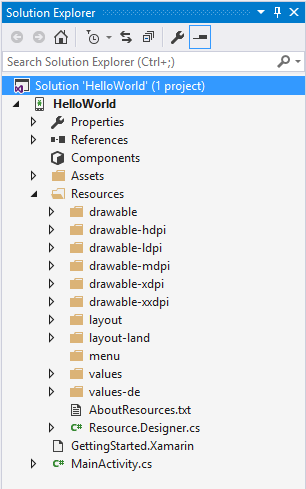
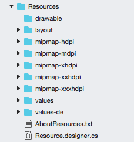
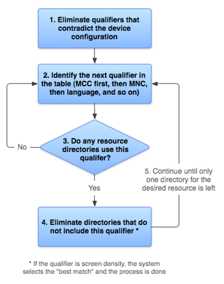

# Alternate Resources

Alternate resources are those resources that target a specific device
or run-time configuration such as the current language, particular
screen size, or pixel density. If Android can match a resource that is
more specific for a particular device or configuration than the default
resource, then that resource will be used instead. If it does not find
an alternate resource that matches the current configuration, then the
default resources will be loaded. How Android decides what resources
will be used by an application will be covered in more detail below, in
the section Resource Location

Alternate resources are organized as a sub-directory inside the
Resources folder according to the resource type, just like default
resources. The name of the alternate resource subdirectory is in the
form: _ResourceType_-_Qualifier_

*Qualifier* is a name that identifies a specific device configuration.
There may be more than one qualifier in a name, each of them separated
by a dash. For example, the screenshot below shows a simple project
that has alternate resources for various configurations such as locale,
screen density, screen size, and orientation:

# [Visual Studio](#tab/vswin)

 
# [Visual Studio for Mac](#tab/vsmac)

 
-----
 

The following rules apply when adding qualifiers to a resource type:

1. There may be more than one qualifier, with each qualifier separated
   by a dash.

2. The qualifiers maybe specified only once.

3. Qualifiers must be in the order they appear in the table below.

The possible qualifiers are listed below for reference:

- **MCC and MNC** &ndash; The
  [mobile country code](http://en.wikipedia.org/wiki/List_of_mobile_country_codes) (MCC)
  and optionally the [mobile network code](http://en.wikipedia.org/wiki/Mobile_Network_Code) (MNC). The
  SIM card will provide the MCC, while the network the device is
  connected to will provide the MNC. Although it is possible to target
  locales using the mobile country code, the recommend approach is to
  use the Language qualifier specified below. For example, to target
  resources to Germany, the qualifier would be `mcc262`. To target
  resources for T-Mobile in the U.S., the qualifier is `mcc310-mnc026`.
  For a complete list of mobile country codes and mobile network codes
  see <http://mcclist.com/>.

- **Language** &ndash; The two-letter
  [ISO 639-1 language code](http://en.wikipedia.org/wiki/ISO_639-1) and
  optionally followed by the two-letter
  [ISO-3166-alpha-2 region code](http://en.wikipedia.org/wiki/ISO_3166-1_alpha-2). 
  If both qualifiers are provided, then they are separated by an
  `-r`. For example, to target French-speaking locales then the
  qualifier of `fr` is used. To target French-Canadian locales, the
  `fr-rCA` would be used. For a complete list of language codes and
  region codes, see
  [Codes for the Representation of Names Of Languages](http://www.loc.gov/standards/iso639-2/php/English_list.php)
  and
  [Country names and code elements](http://www.iso.org/iso/country_codes/iso_3166_code_lists/country_names_and_code_elements.htm).

- **Smallest Width** &ndash; Specifies the smallest screen width the
  application is meant to execute on. Covered in more detail in 
  [Creating Resources for Varying Screens](~/android/app-fundamentals/resources-in-android/resources-for-varying-screens.md). 
  Available in API level 13 (Android 3.2) and above. For example, the qualifier
  `sw320dp` is used to target devices whose height and width is at least
  320dp.

- **Available Width** &ndash; The minimum width of the screen in the
  format w*N*dp, where *N* is the width in density independent pixels.
  This value may change as the user rotates the device. Covered in more
  detail in
  [Creating Resources for Varying Screens](~/android/app-fundamentals/resources-in-android/resources-for-varying-screens.md). 
  Available in in API level 13 (Android 3.2) and above. Example: the
  qualifier w720dp is used to target devices that have a width of least
  720dp.

- **Available Height** &ndash; The minimum height of the screen in the
  format h*N*dp, where *N* is the height in dp. This value may change as
  the user rotates the device. Covered in more detail in 
  [Creating Resources for Varying Screens](~/android/app-fundamentals/resources-in-android/resources-for-varying-screens.md). 
  Available in in API
  level 13 (Android 3.2) and above. For example, the qualifier h720dp
  is used to target devices that have a height of least 720dp

- **Screen Size** &ndash; This qualifier is a generalization of the
  screen size that these resources are for. It is covered in more
  detail in 
  [Creating Resources for Varying Screens](~/android/app-fundamentals/resources-in-android/resources-for-varying-screens.md). 
  Possible values are `small`, `normal`, `large`, and `xlarge`. Added
  in API level 9 (Android 2.3/Android 2.3.1/Android 2.3.2)

- **Screen Aspect** &ndash; This is based on the aspect ratio, not the
  screen orientation. A long screen is wider. Added in API level 4
  (Android 1.6). Possible values are long and notlong.

- **Screen Orientation** &ndash; Portrait or landscape screen
  orientation. This can change during the lifetime of an application.
  Possible values are `port` and `land`.

- **Dock Mode** &ndash; For devices in a car dock or a desk dock. Added
  in API level 8 (Android 2.2.x). Possible values are `car` and `desk`.

- **Night Mode** &ndash; Whether or not the application is running at
  night or in the day. This may change during the lifetime of an
  application and is meant to give developers an opportunity to use
  darker versions of an interface at night. Added in API level 8
  (Android 2.2.x). Possible values are `night` and `notnight`.

- **Screen Pixel Density (dpi)** &ndash; The number of pixels in a
  given area on the physical screen. Typically expressed as dots per
  inch (dpi). Possible values are:

    - `ldpi` &ndash; Low density screens.

    - `mdpi` &ndash; Medium density screens

    - `hdpi` &ndash; High density screens

    - `xhdpi` &ndash; Extra high density screens

    - `nodpi` &ndash; Resources that are not to be scaled

    - `tvdpi` &ndash; Introduced in API level 13 (Android 3.2) for
      screens between mdpi and hdpi.

- **Touchscreen Type** &ndash; Specifies the type of touchscreen a
  device may have. Possible values are `notouch` (no touch screen),
  `stylus` (a resistive touchscreen suitable for a stylus), and
  `finger` (a touchscreen).

- **Keyboard Availability** &ndash; Specifies what kind of keyboard is
  available. This may change during the lifetime of an application
  &ndash; for example when a user opens a hardware keyboard. Possible
  values are:

    - `keysexposed` &ndash; The device has a keyboard available. If
      there is no software keyboard enabled, then this is only used
      when the hardware keyboard is opened.

    - `keyshidden` &ndash; The device does have a hardware keyboard but
      it is hidden and no software keyboard is enabled.

    - `keyssoft` &ndash; the device has a software keyboard enabled.

- **Primary Text Input Method** &ndash; Use to specify what kinds of
  hardware keys are available for input. Possible values are:

    - `nokeys` &ndash; There are no hardware keys for input.

    - `qwerty` &ndash; There is a qwerty keyboard available.

    - `12key` &ndash; There is a 12-key hardware keyboard

- **Navigation Key Availability** &ndash; For when 5-way or d-pad
  (directional-pad) navigation is available. This can change during the
  lifetime of your application. Possible values are:

    - `navexposed` &ndash; the navigational keys are available to the user

    - `navhidden` &ndash; the navigational keys are not available.

-  **Primary Non-Touch Navigation Method** &ndash; The kind of
   navigation available on the device. Possible values are:

    - `nonav` &ndash; the only navigation facility available is the
      touch screen

    - `dpad` &ndash; a d-pad (directional-pad) is available for navigation

    - `trackball` &ndash; the device has a trackball for navigation

    - `wheel` &ndash; the uncommon scenario where there are one or more
      directional wheels available

-  **Platform Version (API level)** &ndash; The API level supported by
   the device in the format v*N*, where *N* is the API level that is
   being targeted. For example, v11 will target an API level 11
   (Android 3.0) device.

For more complete information about resource qualifiers see
[Providing Resources](http://developer.android.com/guide/topics/resources/providing-resources.html)
on the Android Developers website.

## How Android Determines What Resources to Use

It is very possible and likely that an Android application will contain
many resources. It is important to understand how Android will select
the resources for an application when it runs on a device.

Android determines the resources base by iterating over the following
test of rules:

- **Eliminate contradictory qualifiers** &ndash; for example, if the
  device orientation is portrait, then all landscape resource
  directories will be rejected.

- **Ignore qualifiers not supported** &ndash; Not all qualifiers are
  available to all API levels. If a resource directory contains a
  qualifier that is not supported by the device, then that resource
  directory will be ignored.

- **Identify the next highest priority qualifier** &ndash; referring to
  the table above select the next highest priority qualifier (from top
  to bottom).

- **Keep any resource directories for qualifier** &ndash; if there are
  any resource directories that match the qualifier to the table above
  select the next highest priority qualifier (from top to bottom).

These rules are also illustrated in the following flowchart:

When the system is looking for density-specific resources and cannot
find them, it will attempt to locate other density specific resources
and scale them. Android may not necessarily use the default resources.
For example, when looking for a low-density resource and it is not
available, Android may select high-density version of the resource over
the default or medium-density resources. It does this because the
high-density resource can be scaled down by a factor of 0.5, which will
result in fewer visibility issues than scaling down a medium-density
resource which would require a factor of 0.75.

As an example, consider an application that has the following drawable
resource directories:

    drawable
    drawable-en
    drawable-fr-rCA
    drawable-en-port
    drawable-en-notouch-12key
    drawable-en-port-ldpi
    drawable-port-ldpi
    drawable-port-notouch-12key

And now the application is run on a device with the following configuration:

- **Locale** &ndash; en-GB
- **Orientation** &ndash; port
- **Screen density** &ndash; hdpi
- **Touchscreen type** &ndash; notouch
- **Primary input method** &ndash; 12key

To begin with, the French resources are eliminated as they conflict
with the locale of `en-GB`, leaving us with:

    drawable
    drawable-en
    drawable-en-port
    drawable-en-notouch-12key
    drawable-en-port-ldpi
    drawable-port-ldpi
    drawable-port-notouch-12key

Next, the first qualifier is selected from the qualifiers table above:
MCC and MNC. There are no resource directories that contain this
qualifier so the MCC/MNC code is ignored.

The next qualifier is selected, which is Language. There are resources that
match the language code. All resource directories that do not match the language
code of `en` are rejected, so that the list of resources is now:

    drawable-en-port
    drawable-en-notouch-12key
    drawable-en-port-ldpi

The next qualifier that is present is for screen orientation, so all resource
directories that do not match the screen orientation of `port` are eliminated:

    drawable-en-port
    drawable-en-port-ldpi

Next is the qualifier for screen density, `ldpi`, which results in the exclusion of one more resource directory:

    drawable-en-port-ldpi

As a result of this process, Android will use the drawable resources in the
resource directory `drawable-en-port-ldpi` for the device.

> [!NOTE]
> **Note:** The screen size qualifiers provide one exception to
> this selection process. It is possible for Android to select resources that are
> designed for a smaller screen than what the current device provides. For
> example, a large screen device may use the resources provide for a normal sized
> screen. However the reverse of this is not true: the same large screen device
> will not use the resources provided for an xlarge screen. If Android cannot find
> a resource set that matches a given screen size, the application will crash.
