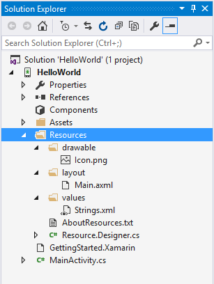
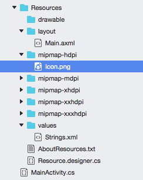
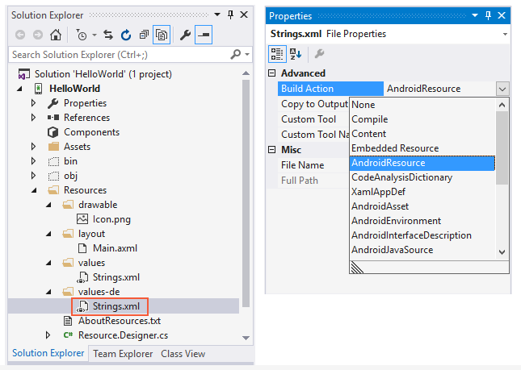
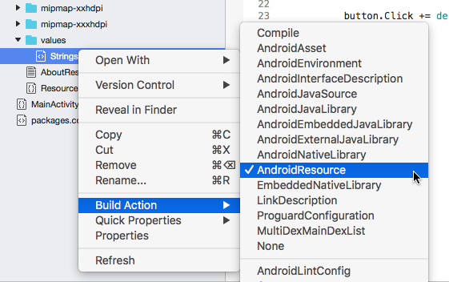

# Android Resource Basics

Almost all Android applications will have some sort of resources in
them; at a minimum they often have the user interface layouts in the
form of XML files. When a Xamarin.Android application is first created,
default resources are setup by the Xamarin.Android project template:

# [Visual Studio](#tab/vswin)


 
# [Visual Studio for Mac](#tab/vsmac)


 
-----

The five files that make up the default resources were created in the
Resources folder:

-  **Icon.png** &ndash; The default icon for the application

-  **Main.axml** &ndash; The default user interface layout file for an
   application. Note that while Android uses the **.xml** file
   extension, Xamarin.Android uses the **.axml** file extension.

-  **Strings.xml** &ndash; A string table to help with localization of
   the application

-  **AboutResources.txt** &ndash; This is not necessary and may safely
   be deleted. It just provides a high level overview of the Resources
   folder and the files in it.

-  **Resource.designer.cs** &ndash; This file is automatically
   generated and maintained by Xamarin.Android and holds the unique
   ID's assigned to each resource. This is very similar and identical
   in purpose to the R.java file that an Android application written in
   Java would have. It is automatically created by the Xamarin.Android
   tools and will be regenerated from time to time.


## Creating and Accessing Resources

Creating resources is as simple as adding files to the directory for
the resource type in question. The screen shot below shows string
resources for German locales were added to a project. When
**Strings.xml** was added to the file, the **Build Action** was
automatically set to **AndroidResource** by the Xamarin.Android tools:

# [Visual Studio](#tab/vswin)


 
# [Visual Studio for Mac](#tab/vsmac)


 
-----
 

This allows the Xamarin.Android tools to properly compile and embed the
resources in to the APK file. If for some reason the **Build Action**
is not set to **Android Resource**, then the files will be excluded
from the APK, and any attempt to load or access the resources will
result in a run-time error and the application will crash.

Also, it's important to note that while Android only supports lowercase
filenames for resource items, Xamarin.Android is a bit more forgiving;
it will support both uppercase and lowercase filenames. The convention
for image names is to use lowercase with underscores as separators (for
example, **my\_image\_name.png**). Note that resource names cannot be
processed if dashes or spaces are used as separators.

Once resources have been added to a project, there are two ways to use
them in an application &ndash; programmatically (inside code) or from
XML files.


## Referencing Resources Programmatically

To access these files programmatically, they are assigned a unique
resource ID. This resource ID is an integer defined in a special class
called `Resource`, which is found in the file **Resource.designer.cs**,
and looks something like this:

```csharp
public partial class Resource
{
    public partial class Attribute
    {
    }
    public partial class Drawable {
        public const int Icon=0x7f020000;
    }
    public partial class Id
    {
        public const int Textview=0x7f050000;
    }
    public partial class Layout
    {
        public const int Main=0x7f030000;
    }
    public partial class String
    {
        public const int App_Name=0x7f040001;
        public const int Hello=0x7f040000;
    }
}
```

Each resource ID is contained inside a nested class that corresponds to
the resource type. For example, when the file **Icon.png** was added to
the project, Xamarin.Android updated the `Resource` class, creating a
nested class called `Drawable` with a constant inside named `Icon`.
This allows the file **Icon.png** to be referred to in code as
`Resource.Drawable.Icon`. The `Resource` class should not be manually
edited, as any changes that are made to it will be overwritten by
Xamarin.Android.

When referencing resources programmatically (in code), they can be
accessed via the Resources class hierarchy which uses the following
syntax:

```xml
@[<PackageName>.]Resource.<ResourceType>.<ResourceName>
```

-  **PackageName** &ndash; The package which is providing the resource
   and is only required when resources from other packages are being
   used.

-  **ResourceType** &ndash; This is the nested resource type that is
   within the Resource class described above.

-  **Resource Name** &ndash; this is the filename of the resource
   (without the extension) or the value of the android:name attribute
   for resources that are in an XML element.


## Referencing Resources from XML

Resources in an XML file are accessed by a following a special syntax:

```xml
@[<PackageName>:]<ResourceType>/<ResourceName>.
```

-  **PackageName** &ndash; the package which is providing the resource
   and is only required when resources from other packages are being
   used.

-  **ResourceType** &ndash; This is the nested resource type that is
   within the Resource class.

-  **Resource Name** &ndash; this is the filename of the resource
   (*without* the file type extension) or the value of the
   `android:name` attribute for resources that are in an XML element.

For example the contents of a layout file, **Main.axml**, are as
follows:

```xml
<?xml version="1.0" encoding="utf-8"?>
<LinearLayout xmlns:android="http://schemas.android.com/apk/res/android"
        android:orientation="vertical"
        android:layout_width="fill_parent"
        android:layout_height="fill_parent">
    <ImageView android:id="@+id/myImage"
        android:layout_width="wrap_content"
        android:layout_height="wrap_content"
        android:src="@drawable/flag" />
</LinearLayout>
```

This example has an
[`ImageView`](https://developer.xamarin.com/recipes/android/controls/imageview) that requires a
drawable resource named **flag**. The `ImageView` has its `src`
attribute set to **@drawable/flag**. When the activity starts, Android
will look inside the directory **Resource/Drawable** for a file named
**flag.png** (the file extension could be another image format, like
**flag.jpg**) and load that file and display it in the `ImageView`.
When this application is run, it would look something like the
following image:


