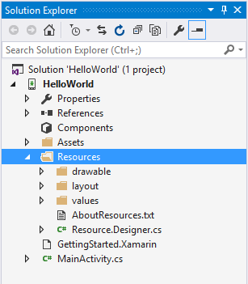
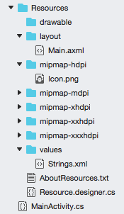
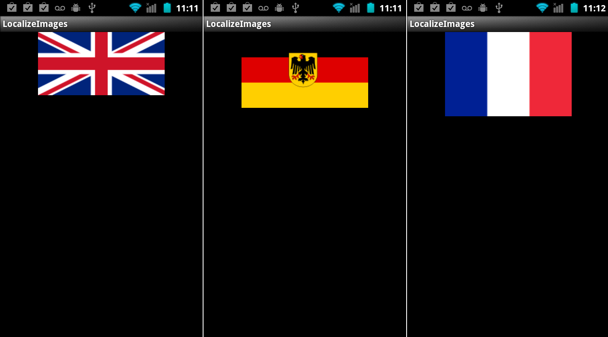

# Android Resources

_This article introduces the concept of Android resources in Xamarin.Android and will document how to use them. It covers how to use resources in your Android application to support application localization, and multiple devices including varying screen sizes and densities._

## Overview

An Android application is seldom just source code. There are often many other
files that make up an application: video, images, fonts, and audio files just to name a
few. Collectively, these non-source code files are referred to as resources and
are compiled (along with the source code) during the build process and packaged
as an APK for distribution and installation onto devices:

Resources offer several advantages to an Android application:

-  **Code-Separation** &ndash; Separates source code from images,
   strings, menus, animations, colors, etc. As such resources can help
   considerably when localizing.

-  **Target multiple devices** &ndash; Provides simpler support of
   different device configurations without code changes.

-  **Compile-time Checking** &ndash; Resources are static and compiled
   into the application. This allows the usage of the resources to be
   checked at compile time, when it will be easy to catch and correct
   the mistakes, as opposed to run-time when it is more difficult to
   locate and costly to correct.

When a new Xamarin.Android project is started, a special directory called
Resources is created, along with some subdirectories:

# [Visual Studio](#tab/windows)

In the image above, the application resources are organized according
to their type into these subdirectories: images will go in the
**drawable** directory; views go in the **layout** subdirectory, etc.
 
# [Visual Studio for Mac](#tab/macos)

In the image above, the application resources are organized according
to their type into these subdirectories: images will go in the
**mipmap** directory; views go in the **layout** subdirectory, etc.
 
-----

There are two ways to access these resources in a Xamarin.Android
application: *programmatically* in code and *declaratively* in 
XML using a special XML syntax.

These resources are called *Default Resources* and are used by all
devices unless a more specific match is specified. Additionally, every
type of resource may optionally have *Alternate Resources* that Android
may use to target specific devices. For example, resources may be
provided to target the user's locale, the screen size, or if the
device is rotated 90 degrees from portrait to landscape, etc. In each
of these cases, Android will load the resources for use by the
application without any extra coding effort by the developer.

Alternate resources are specified by adding a short string, called a
*qualifier*, to the end of the directory holding a given type of
resources.

For example, **resources/drawable-de** will specify the images for devices
that are set to a German locale, while **resources/drawable-fr** would hold
images for devices set to a French locale. An example of providing
alternate resources can be seen in the image below where the same
application is being run with just the locale of the device changing:

This article will take a comprehensive look at using resources and cover the following topics:

-  **Android Resource Basics** &ndash; Using default resources
   programmatically and declaratively, adding resource types such as
   images and fonts to an application.

-  **Device Specific Configurations** &ndash; Supporting the different
   screen resolutions and densities in an application.

-  **Localization** &ndash; Using resources to support the different
   regions an application may be used.

## Related Links

- [Using Android Assets](~/android/app-fundamentals/resources-in-android/android-assets.md)
- [Application Fundamentals](https://developer.android.com/guide/topics/fundamentals.html)
- [Application Resources](https://developer.android.com/guide/topics/resources/index.html)
- [Supporting Multiple Screens](https://developer.android.com/guide/practices/screens_support.html)
