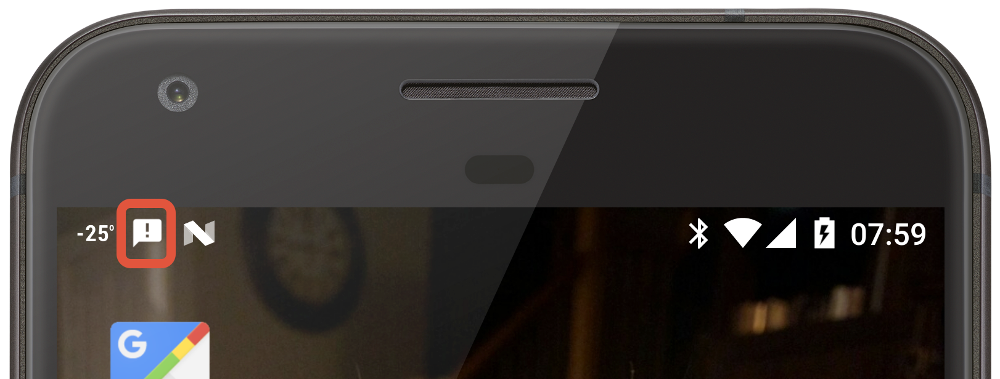
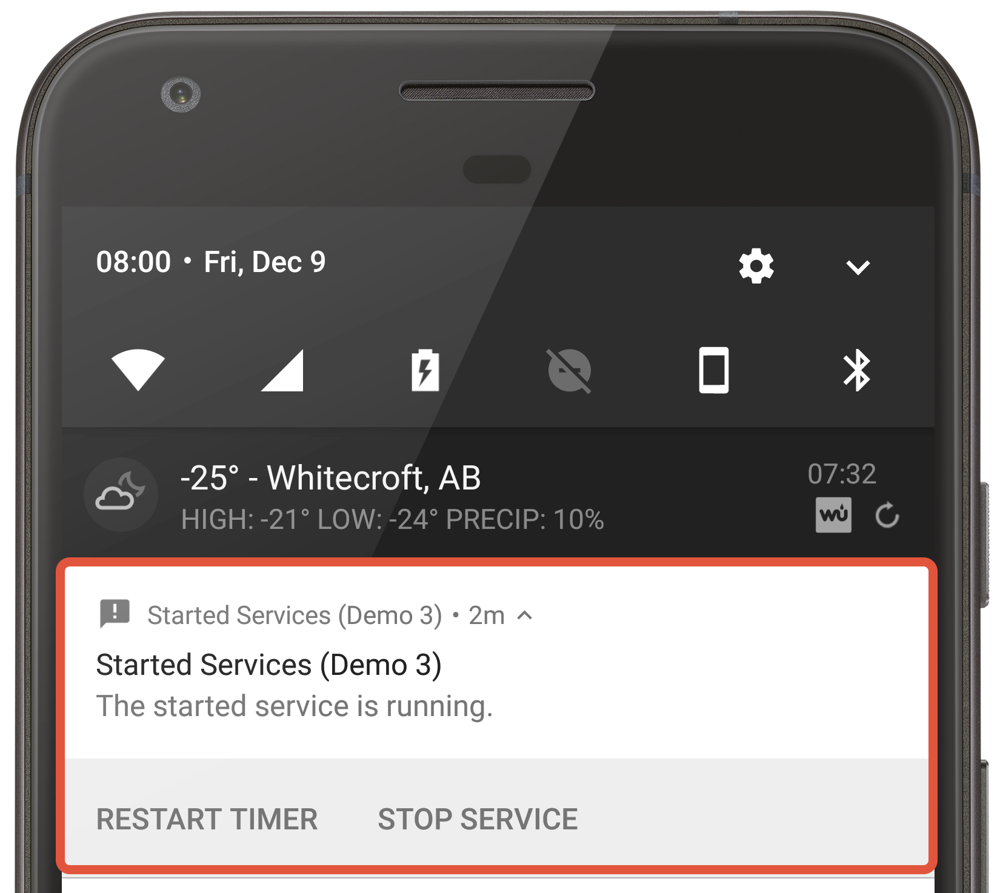

# Foreground Services

A foreground service is a special type of a bound service or a started service. Occasionally services will perform tasks that users must be actively aware of, these services are known as _foreground services_. An example of a foreground service is an app that is providing the user with directions while driving or walking. Even if the app is in the background, it is still important that the service has sufficient resources to work properly and that the user has a quick and handy way to access the app. For an Android app, this means that a foreground service should receive higher priority than a "regular" service and a foreground service must provide a `Notification` that Android will display as long as the service is running.
 
To start a foreground service, the app must dispatch an Intent that tells Android to start the service. Then the service must register itself as a foreground service with Android. Apps that are running on Android 8.0 (or higher) should use the `Context.StartForegroundService` method to start the service, while apps that are running on devices with an older version of Android should use `Context.StartService`

This C# extension method is an example of how to start a foreground service. On Android 8.0 and higher it will use the `StartForegroundService` method, otherwise the older `StartService` method will be used.  

```csharp
public static void StartForegroundServiceComapt<T>(this Context context, Bundle args = null) where T : Service
{
    var intent = new Intent(context, typeof(T));
    if (args != null) 
    {
        intent.PutExtras(args);
    }

    if (Android.OS.Build.VERSION.SdkInt >= Android.OS.BuildVersionCodes.O)
    {
        context.StartForegroundService(intent);
    }
    else
    {
        context.StartService(intent);
    }
}
```

## Registering as a Foreground Service

Once a foreground service has started, it must register itself with Android by invoking the [`StartForeground`](https://developer.xamarin.com/api/member/Android.App.Service.StartForeground/p/System.Int32/Android.App.Notification/). If the service is started with the `Service.StartForegroundService` method but does not register itself, then Android will stop the service and flag the app as non-responsive.

`StartForeground` takes two parameters, both of which are mandatory:
 
* An integer value that is unique within the application to identify the service.
* A `Notification` object that Android will display in the status bar for as long as the service is running.

Android will display the notification in the status bar for as long as the service is running. The notification, at minimum, will provide a visual cue to the user that the service is running. Ideally, the notification should provide the user with a shortcut to the application or possibly some action buttons to control the application. An example of this is a music player &ndash; the notification that is displayed may have buttons to pause/play music, to rewind to the previous song, or to skip to the next song. 

This code snippet is an example of registering a service as a foreground service:   

```csharp
// This is any integer value unique to the application.
public const int SERVICE_RUNNING_NOTIFICATION_ID = 10000;

public override StartCommandResult OnStartCommand(Intent intent, StartCommandFlags flags, int startId)
{
    // Code not directly related to publishing the notification has been omitted for clarity.
    // Normally, this method would hold the code to be run when the service is started.
    
    var notification = new Notification.Builder(this)
        .SetContentTitle(Resources.GetString(Resource.String.app_name))
        .SetContentText(Resources.GetString(Resource.String.notification_text))
        .SetSmallIcon(Resource.Drawable.ic_stat_name)
        .SetContentIntent(BuildIntentToShowMainActivity())
        .SetOngoing(true)
        .AddAction(BuildRestartTimerAction())
        .AddAction(BuildStopServiceAction())
        .Build();

    // Enlist this instance of the service as a foreground service
    StartForeground(SERVICE_RUNNING_NOTIFICATION_ID, notification);
}
```

The previous notification will display a status bar notification that that is similar to the following:



This screenshot shows the expanded notification in the notification tray with two actions that allow the user to control the service:



More information about notifications is available in the [Local Notifications](~/android/app-fundamentals/notifications/local-notifications.md) section of the [Android Notifications](~/android/app-fundamentals/notifications/index.md) guide.

## Unregistering as a Foreground Service

A service can de-list itself as a foreground service by calling the method `StopForeground`. `StopForeground` will not stop the service, but it will remove the notification icon and signals Android that this service can be shut down if necessary.

The status bar notification that is displayed can also be removed by passing `true` to the method: 

```csharp
StopForeground(true);
```

If the service is halted with a call to `StopSelf` or `StopService`, the status bar notification will be removed.

## Related Links

- [Android.App.Service](https://developer.xamarin.com/api/type/Android.App.Service/)
- [Android.App.Service.StartForegrond](https://developer.xamarin.com/api/member/Android.App.Service.StartForeground/p/System.Int32/Android.App.Notification/)
- [Local Notifications](~/android/app-fundamentals/notifications/local-notifications.md)
- [ForegroundServiceDemo (sample)](https://developer.xamarin.com/samples/monodroid/ApplicationFundamentals/ServiceSamples/ForegroundServiceDemo/)
