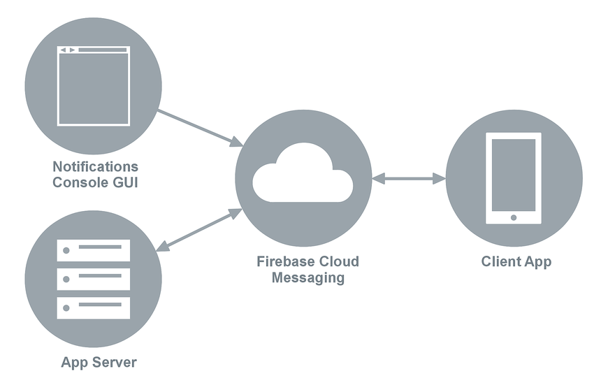
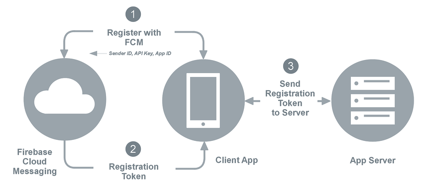
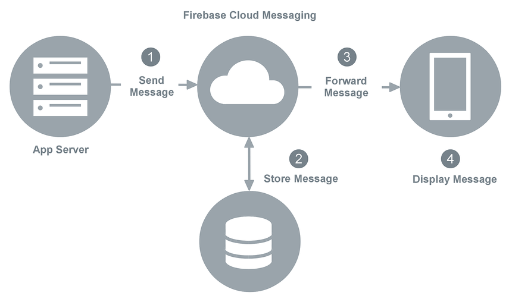
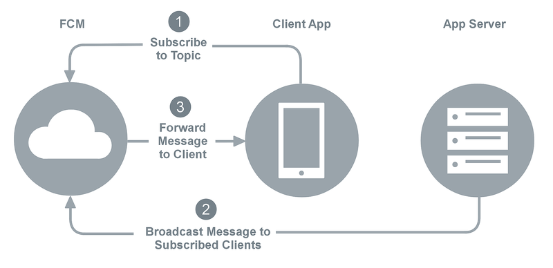
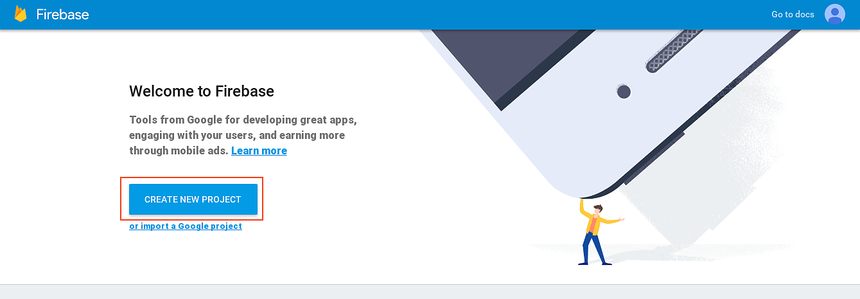
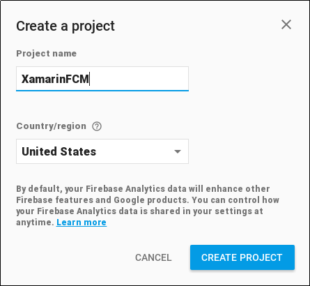
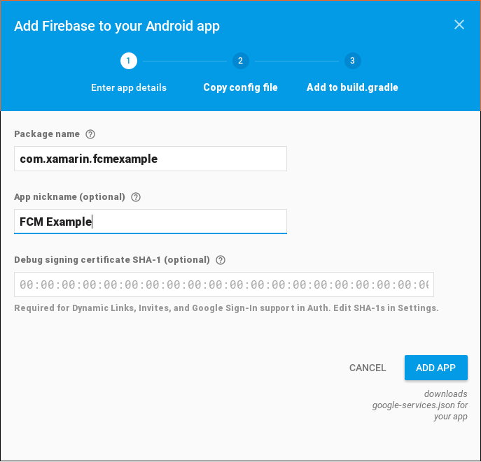
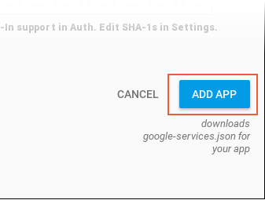

# Firebase Cloud Messaging

_Firebase Cloud Messaging (FCM) is a service that facilitates messaging between mobile apps and server applications. This article provides an overview of how FCM works, and it explains how to configure Google Services so that your app can use FCM._

This topic provides a high-level overview of how Firebase Cloud
Messaging routes messages between your Xamarin.Android app and an app
server, and it provides a step-by-step procedure for acquiring
credentials so that your app can use FCM services.

## Overview

Firebase Cloud Messaging (FCM) is a cross-platform service that handles
the sending, routing, and queueing of messages between server
applications and mobile client apps. FCM is the successor to Google
Cloud Messaging (GCM), and it is built on Google Play Services.

As illustrated in the following diagram, FCM acts as an intermediary
between message senders and clients. A *client app* is an FCM-enabled
app that runs on a device. The *app server* (provided by you or your
company) is the FCM-enabled server that your client app communicates
with through FCM. Unlike GCM, FCM makes it possible for you to send
messages to client apps directly via the Firebase Console Notifications
GUI:

Using FCM, app servers can send messages to a single device, to a group
of devices, or to a number of devices that are subscribed to a topic. A
client app can use FCM to subscribe to downstream messages from an app
server (for example, to receive remote notifications). For more
information about the different types of Firebase messages, see
[About FCM Messages](https://firebase.google.com/docs/cloud-messaging/concept-options).

## Firebase Cloud Messaging in action

When a downstream message is sent to a client app from an app server,
the app server sends the message to an *FCM connection server* provided
by Google; the FCM connection server, in turn, forwards the message to
a device that is running the client app. Messages can be sent over HTTP
or [XMPP](https://developers.google.com/cloud-messaging/ccs) (Extensible
Messaging and Presence Protocol). Because client apps are not always
connected or running, the FCM connection server enqueues and stores
messages, sending them to client apps as they reconnect and become
available. Similarly, FCM will enqueue upstream messages from the
client app to the app server if the app server is unavailable. For more
about FCM connection servers, see
[About Firebase Cloud Messaging Server](https://firebase.google.com/docs/cloud-messaging/server).

FCM uses the following credentials to identify the app server and the
client app, and it uses these credentials to authorize message
transactions through FCM:

-   **Sender ID** &ndash; The *Sender ID* is a unique numerical value
    that is assigned when you create your Firebase project. The sender
    ID is used to identify each app server that can send messages to
    the client app. The sender ID is also your project number; you
    obtain the sender ID from the Firebase Console when you register
    your project. An example of a Sender ID is `496915549731`.

-   **API Key** &ndash; The *API key* gives the app server access to
    Firebase services; FCM uses this key to authenticate the app
    server. This credential is also referred to as the *Server Key* or
    the *Web API Key*. An example of an API Key is
    `AJzbSyCTcpfRT1YRqbz-jIwp1h06YdauvewGDzk`.

-   **App ID** &ndash; The identity of your client app (independent of
    any given device) that registers to receive messages from FCM. An
    example of an App ID is `1:415712510732:android:0e1eb7a661af2460`.

-   **Registration Token** &ndash; The *Registration Token* (also
    referred to as the *Instance ID*) is the FCM identity of your
    client app on a given device. The registration token is generated
    at run time &ndash; your app receives a registration token when it
    first registers with FCM while running on a device. The
    registration token authorizes an instance of your client app
    (running on that particular device) to receive messages from FCM.
    An example of a registration token is
    `fkBQTHxKKhs:AP91bHuEedxM4xFAUn0z ... JKZS` (a very long string).

[Setting Up Firebase Cloud Messaging](#setup_fcm) (later in this guide)
provides detailed instructions for creating a project and generating
these credentials. When you create a new project in the
[Firebase Console](https://console.firebase.google.com/), a credentials
file called **google-services.json** is created &ndash; add this file
to your Xamarin.Android project as explained in
[Remote Notifications with FCM](~/android/data-cloud/google-messaging/remote-notifications-with-fcm.md).

The following sections explain how these credentials are used when
client apps communicate with app servers through FCM.

<a name="registration" />

### Registration with FCM

A client app must first register with FCM before messaging can take
place. The client app must complete the registration steps shown in the
following diagram:

1.  The client app contacts FCM to obtain a registration token, passing
    the sender ID, API Key, and App ID to FCM.

2.  FCM returns a registration token to the client app.

3.  The client app (optionally) forwards the registration token to the
    app server.

The app server caches the registration token for subsequent
communications with the client app. The app server can send an
acknowledgement back to the client app to indicate that the
registration token was received. After this handshake takes place, the
client app can receive messages from (or send messages to) the app
server. The client app may receive a new registration token if the old
token is compromised (see
[Remote Notifications with FCM](~/android/data-cloud/google-messaging/remote-notifications-with-fcm.md)
for an example of how an app receives registration token updates).

When the client app no longer wants to receive messages from the app
server, it can send a request to the app server to delete the
registration token. If the client app is uninstalled from a device, FCM
detects this and automatically notifies the app server to delete the
registration token.

### Downstream messaging

The following diagram illustrates how Firebase Cloud Messaging stores
and forwards downstream messages:

When the app server sends a downstream message to the client app, it
uses the following steps as enumerated in the above diagram:

1.  The app server sends the message to FCM.

2.  If the client device is not available, the FCM server stores the
    message in a queue for later transmission. Messages are retained in
    FCM storage for a maximum of 4 weeks (for more information, see
    [Setting the lifespan of a message](https://firebase.google.com/docs/cloud-messaging/concept-options#ttl)).

3.  When the client device is available, FCM forwards the message to
    the client app on that device.

4.  The client app receives the message from FCM, processes it, and
    displays it to the user. For example, if the message is a remote
    notification, it is presented to the user in the notification area.

In this messaging scenario (where the app server sends a message to a
single client app), messages can be up to 4kB in length.

For detailed information about receiving downstream FCM messages on
Android, see
[Remote Notifications with FCM](~/android/data-cloud/google-messaging/remote-notifications-with-fcm.md).

### Topic messaging

*Topic Messaging* makes it possible for an app server to send a message
to multiple devices that have opted in to a particular topic. You can
also compose and send topic messages via the Firebase Console
Notifications GUI. FCM handles the routing and delivery of topic
messages to subscribed clients. This feature can be used for messages
such as weather alerts, stock quotes, and headline news.

The following steps are used in topic messaging (after the client app
obtains a registration token as explained earlier):

1.  The client app subscribes to a topic by sending a subscribe message
    to FCM.

2.  The app server sends topic messages to FCM for distribution.

3.  FCM forwards topic messages to clients that have subscribed to
    that topic.

For more information about Firebase topic messaging, see Google's
[Topic Messaging on Android](https://firebase.google.com/docs/cloud-messaging/android/topic-messaging).

<a name="setup_fcm" />

## Setting up Firebase Cloud Messaging

Before you can use FCM services in your app, you must create a new
project (or import an existing project) via the
[Firebase Console](https://console.firebase.google.com/). Use the
following steps to create a Firebase Cloud Messaging project for your
app:

1.  Sign into the [Firebase Console](https://console.firebase.google.com/) with
    your Google account (i.e., your Gmail address) and click **CREATE NEW
    PROJECT**:

    

    If you have an existing project, click **import a Google project**.

2.  In the **Create a project** dialog, enter the name of your project
    and click **CREATE PROJECT**. In the following example, a new
    project called **XamarinFCM** is created:

    

3.  In the Firebase Console **Overview**, click **Add Firebase to your
    Android app**:

    

4.  In the next screen, enter the package name of your app. In this
    example, the package name is **com.xamarin.fcmexample**. This value
    must match the package name of your Android app. An app nickname
    can also be entered in the **App nickname** field:

    

5.  If your app uses Dynamic links, Invites, or Google Auth, you must
    also enter your debug signing certificate. For more information
    about locating your signing certificate, see
    [Finding your Keystore's MD5 or SHA1 Signature](~/android/deploy-test/signing/keystore-signature.md).
    In this example, the signing certificate is left blank.

6.  Click **ADD APP**:

    

    A Server API key and a Client ID are automatically generated for
    the app. This information is packaged in a **google-services.json**
    file that is automatically downloaded when you click **ADD APP**.
    Be sure to save this file in a safe place.

For a detailed example of how to add **google-services.json** to an app
project to receive FCM push notification messages on Android, see
[Remote Notifications with FCM](~/android/data-cloud/google-messaging/remote-notifications-with-fcm.md).

## For further reading

-   Google's [Firebase Cloud Messaging](https://firebase.google.com/docs/cloud-messaging/)
    provides an overview of Firebase Cloud Messaging's key
    capabilities, an explanation of how it works, and setup
    instructions.

-   Google's [Build App Server Send Requests](https://firebase.google.com/docs/cloud-messaging/send-message)
    explains how to send messages with your app server.

-   [RFC 6120](https://tools.ietf.org/html/rfc6120) and [RFC 6121](https://tools.ietf.org/html/rfc6121)
    explain and define the Extensible Messaging and Presence Protocol (XMPP).

-   [About FCM Messages](https://firebase.google.com/docs/cloud-messaging/concept-options) describes the different types of messages that can be sent with Firebase Cloud Messaging.

## Summary

This article provided an overview of Firebase Cloud Messaging (FCM). It
explained the various credentials that are used to identify and
authorize messaging between app servers and client apps. It illustrated
the registration and downstream messaging scenarios, and it detailed
the steps for registering your app with FCM to use FCM
services.

## Related Links

- [Firebase Cloud Messaging](https://firebase.google.com/docs/cloud-messaging/)
