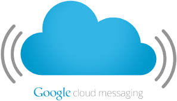
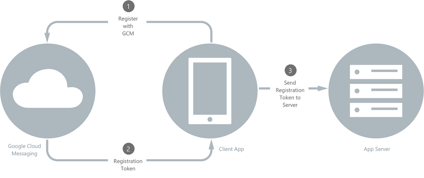
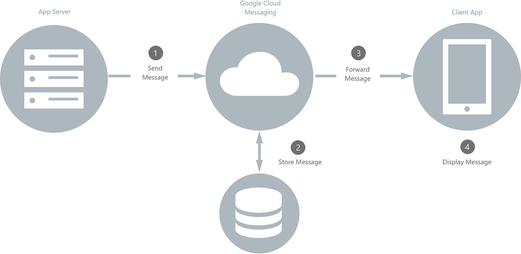
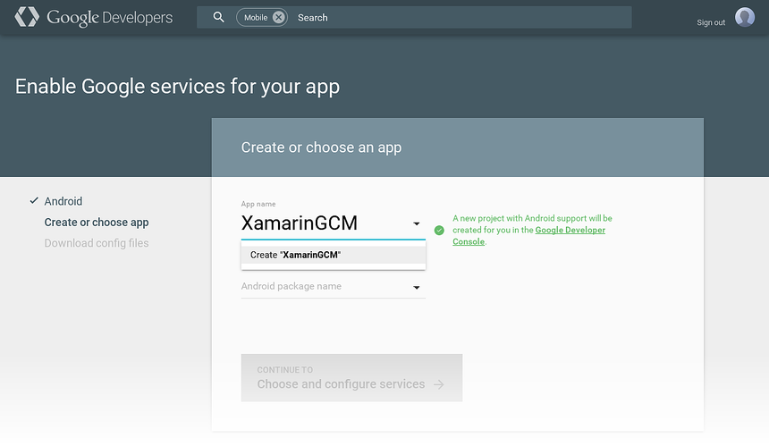
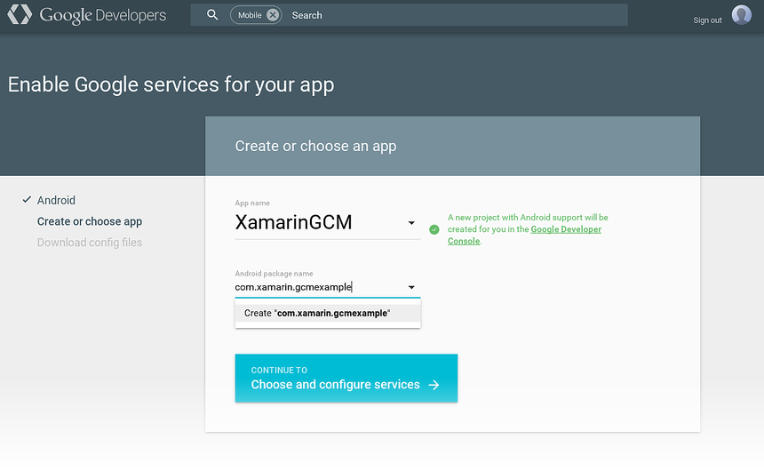
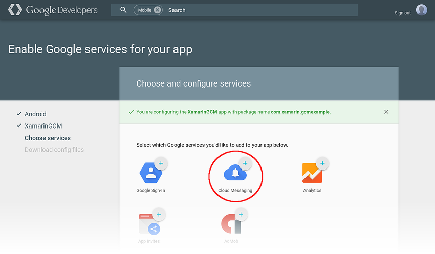
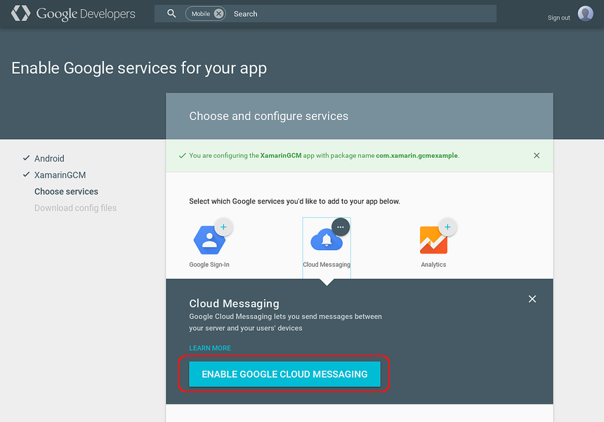
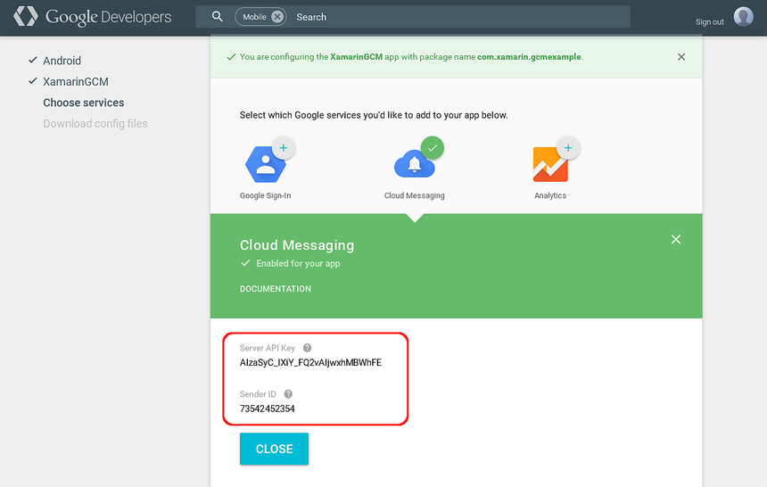
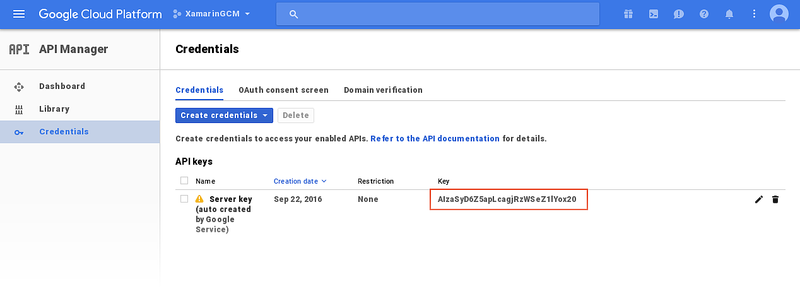

# Google Cloud Messaging

_Google Cloud Messaging (GCM) is a service that facilitates messaging between mobile apps and server applications. This article provides an overview of how GCM works, and it explains how to configure Google Services so your app can use GCM._

This topic provides a high-level overview of how Google Cloud
Messaging routes messages between your app and an app server, and it
provides a step-by-step procedure for acquiring credentials so that
your app can use GCM services.

> [!NOTE]
> GCM has been superceded by [Firebase Cloud Messaging](~/android/data-cloud/google-messaging/firebase-cloud-messaging.md) (FCM).
> GCM server and client APIs [have been deprecated](https://firebase.googleblog.com/2018/04/time-to-upgrade-from-gcm-to-fcm.html)
> and will no longer be available as soon as April 11th, 2019.

## Overview

Google Cloud Messaging (GCM) is a service that handles the sending,
routing, and queueing of messages between server applications and
mobile client apps. A *client app* is a GCM-enabled app that runs on a
device. The *app server* (provided by you or your company) is the
GCM-enabled server that your client app communicates with through GCM:

Using GCM, app servers can send messages to a single device, a group of
devices, or a number of devices that are subscribed to a topic. Your
client app can use GCM to subscribe to downstream messages from an app
server (for example, to receive remote notifications). Also, GCM makes
it possible for client apps to send upstream messages back to the app
server.

For information about implementing an app server for GCM, see
[About GCM Connection Server](https://developers.google.com/cloud-messaging/server).

## Google Cloud Messaging in Action

When downstream messages are sent from an app server to a client app,
the app server sends the message to a *GCM connection server*; the GCM
connection server, in turn, forwards the message to a device that is
running your client app. Messages can be sent over HTTP or
[XMPP](https://developers.google.com/cloud-messaging/ccs) (Extensible
Messaging and Presence Protocol). Because client apps are not always
connected or running, the GCM connection server enqueues and stores
messages, sending them to client apps as they reconnect and become
available. Similarly, GCM will enqueue upstream messages from the
client app to the app server if the app server is unavailable.

GCM uses the following credentials to identify the app server and your
client app, and it uses these credentials to authorize message
transactions through GCM:

-   **API Key** &ndash; The *API key* gives your app server access to
    Google services; GCM uses this key to authenticate your app server.
    Before you can use the GCM service, you must first obtain an API
    key from the
    [Google Developer Console](https://console.developers.google.com/)
    by creating a *project*. The API Key should be kept secure; for
    more information about protecting your API key, see
    [Best practices for securely using API keys](https://support.google.com/cloud/answer/6310037?hl=en).

-   **Sender ID** &ndash; The *Sender ID* authorizes the app server to
    your client app &ndash; it is a unique number that identifies the
    app server that is permitted to send messages to your client app.
    The sender ID is also your project number; you obtain the sender ID
    from the Google Developers Console when you register your project.

-   **Registration Token** &ndash; The *Registration Token* is the GCM
    identity of your client app on a given device. The registration
    token is generated at run time &ndash; your app receives a
    registration token when it first registers with GCM while running
    on a device. The registration token authorizes an instance of your
    client app (running on that particular device) to receive messages
    from GCM.

-   **Application ID** &ndash; The identity of your client app
    (independent of any given device) that registers to receive
    messages from GCM. On Android, the application ID is the package
    name recorded in **AndroidManifest.xml**, such as
    `com.xamarin.gcmexample`.

[Setting Up Google Cloud Messaging](#settingup) (later in this guide)
provides detailed instructions for creating a project and generating
these credentials.

The following sections explain how these credentials are used when
client apps communicate with app servers through GCM.

### Registration with GCM

A client app installed on a device must first register with GCM before
messaging can take place. The client app must complete the registration
steps shown in the following diagram:

1.  The client app contacts GCM to obtain a registration token, passing
    the sender ID to GCM.

2.  GCM returns a registration token to the client app.

3.  The client app forwards the registration token to the app server.

The app server caches the registration token for subsequent
communications with the client app. Optionally, the app server can send
an acknowledgement back to the client app to indicate that the
registration token was received. After this handshake takes place, the
client app can receive messages from (or send messages to) the app
server.

When the client app no longer wants to receive messages from the app
server, it can send a request to the app server to delete the
registration token. If the client app is receiving topic messages
(explained later in this article), it can unsubscribe from the topic.
If the client app is uninstalled from a device, GCM detects this and
automatically notifies the app server to delete the registration token.

Google's [Registering Client Apps](https://developers.google.com/cloud-messaging/registration)
explains the registration process in more detail; it explains
unregistration and unsubscription, and it describes the process of
unregistration when a client app is uninstalled.

### Downstream Messaging

When the app server sends a downstream message to the client app, it
follows the steps illustrated in the following diagram:

1.  The app server sends the message to GCM.

2.  If the client device is not available, the GCM server stores the
    message in a queue for later transmission.

3.  When the client device is available, GCM sends the message to the
    client app on that device.

4.  The client app receives the message from GCM and handles it
    accordingly. For example, if the message is a remote notification,
    it is presented to the user.

In this messaging scenario (where the app server sends a message to a
single client app), messages can be up to 4kB in length.

For detailed information (including code samples) about receiving
downstream GCM messages on Android, see
[Remote Notifications](~/android/data-cloud/google-messaging/remote-notifications-with-gcm.md).

#### Topic Messaging

*Topic Messaging* is a type of downstream messaging where the app
server sends a single message to multiple client app devices that
subscribe to a topic (such as a weather forecast). Topic messages can
be up to 2KB in length, and topic messaging supports up to one million
subscriptions per app. If GCM is being used only for topic messaging,
the client app is not required to send a registration token to the app
server. Google's
[Implementing Topic Messaging](https://developers.google.com/cloud-messaging/topic-messaging)
explains how to send messages from an app server to multiple devices
that subscribe to a particular topic.

#### Group Messaging

*Group Messaging* is a type of downstream messaging where the app
server sends a single message to multiple client app devices that
belong to a group (for example, a group of devices that belong to a
single user). Group messages can be up to 2KB in length for iOS
devices, and up to 4KB in length for Android devices. A group is
limited to a maximum of 20 members. Google's
[Device Group Messaging](https://developers.google.com/cloud-messaging/notifications)
explains how app servers can send a single message to multiple client
app instances running on devices that belong to a group.

### Upstream Messaging

If your client app connects to a server that supports
[XMPP](https://developers.google.com/cloud-messaging/ccs), it can send
messages back to the app server as illustrated in the following
diagram:

1.  The client app sends a message to the GCM XMPP connection server.

2.  If the app server is disconnected, the GCM server stores the
    message in a queue for later forwarding.

3.  When the app server is re-connected, GCM forwards the message to
    the app server.

4.  The app server parses the message to verify the identity of the
    client app, then it sends an "ack" to GCM to acknowledge message
    receipt.

5.  The app server processes the message.

Google's [Upstream Messages](https://developers.google.com/cloud-messaging/ccs#upstream)
explains how to structure JSON-encoded messages and send them to app
servers that run Google's XMPP-based Cloud Connection Server.

<a name="settingup" />

## Setting Up Google Cloud Messaging

Before you can use GCM services in your app, you must first acquire
credentials for access to Google's GCM servers. The following sections
describe the steps required to complete this process:

### Enable Google Services for Your App

1.  Sign into the [Google Developers Console](https://developers.google.com/mobile/add?platform=android)
    with your Google account (i.e, your gmail address) and create a new
    project. If you have an existing project, choose the project that
    you want to become GCM-enabled. In the following example, a new
    project called **XamarinGCM** is created:

    

2.  Next, enter the package name for your app (in this example, 
    the package name is **com.xamarin.gcmexample**) and click **Continue to
    Choose and configure services**:

    

    Note that this package name is also the application ID for your app.

3.  The **Choose and configure services** section lists the Google
    services that you can add to your app. Click **Cloud Messaging**:

    

4.  Next, click **ENABLE GOOGLE CLOUD MESSAGING**:

    

5.  A **Server API key** and a **Sender ID** are generated for your
    app. Record these values and click **CLOSE**:

    

    Protect the API key &ndash; it is not intended for public use. If
    the API key is compromised, unauthorized servers could publish
    messages to client applications.
    [Best practices for securely using API keys](https://support.google.com/cloud/answer/6310037?hl=en)
    provides useful guidelines for protecting your API Key.

### View Your Project Settings

You can view your project settings at any time by signing into the
[Google Cloud Console](https://console.cloud.google.com/) and selecting
your project. For example, you can view the **Sender ID** by selecting
your project in the pull down menu at the top of the page (in this
example, the project is called **XamarinGCM**). The Sender ID is the
Project number as shown in this screenshot (the Sender ID here is
**9349932736**):

To view the **API key**, click **API Manager** and then click **Credentials**:

## For Further Reading

-   Google's [Registering Client Apps](https://developers.google.com/cloud-messaging/registration)
    describes the client registration process in more detail, and it
    provides information about configuring automatic retry and keeping
    the registration state in sync.

-   [RFC 6120](https://tools.ietf.org/html/rfc6120) and
    [RFC 6121](https://tools.ietf.org/html/rfc6121) explain and define
    the Extensible Messaging and Presence Protocol (XMPP).

## Summary

This article provided an overview of Google Cloud Messaging (GCM). It
explained the various credentials that are used to identify and
authorize messaging between app servers and client apps. It illustrated
the most common messaging scenarios, and it detailed the steps for
registering your app with GCM to use GCM services.

## Related Links

- [Cloud Messaging](https://developers.google.com/cloud-messaging/)
