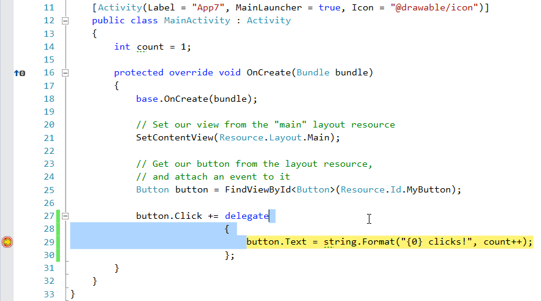
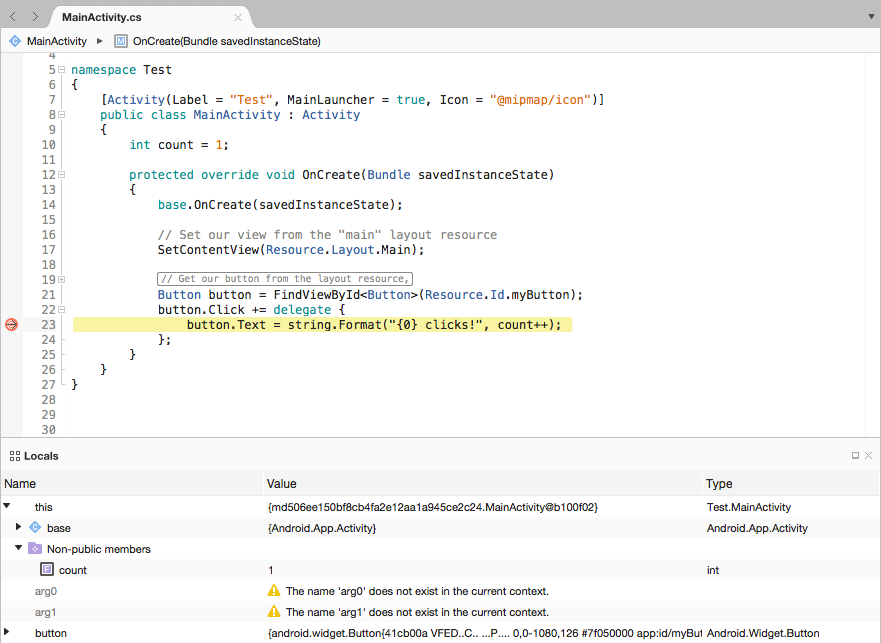

# Debug on Device

_This article explains how to debug a Xamarin.Android application on a physical Android device._

## Debug on Device Overview

It is possible to debug a Xamarin.Android on an Android device using
either Visual Studio for Mac or Visual Studio. Before debugging can
occur on a device, it must be
[setup for development](~/android/get-started/installation/set-up-device-for-development.md)
and connected to your PC or Mac.

<a name="Debug_Application" />

## Debug Application

Once a device is connected to your computer, debugging a 
Xamarin.Android application is done in the same way as any other 
Xamarin product or .NET application. Ensure that the **Debug** 
configuration and the external device is selected in the IDE, this will 
ensure that the necessary debug symbols are available and that the IDE 
can connect to the running application: 

# [Visual Studio](#tab/vswin)

Next, a breakpoint is set in the code:

Once the device has been selected, Xamarin.Android will connect to the 
device, deploy the application, and then run it. When the breakpoint is 
reached, the debugger will stop the application, allowing the 
application to be debugged in a fashion similar to any other C# 
application: 

# [Visual Studio for Mac](#tab/vsmac)

Next, a breakpoint is set in the code:

Once the device has been selected, Xamarin.Android will connect to the 
device, deploy the application, and then run it. When the breakpoint is 
reached, the debugger will stop the application, allowing the 
application to be debugged in a fashion similar to any other C# 
application: 

-----

<a name="Summary" />

## Summary

In this document discussed how to debug a Xamarin.Android
application by setting a breakpoint and selecting the target
device.

## Related Links

- [Set Up Device for Development](~/android/get-started/installation/set-up-device-for-development.md)
- [Setting the Debuggable Attribute](~/android/deploy-test/debuggable-attribute.md)
