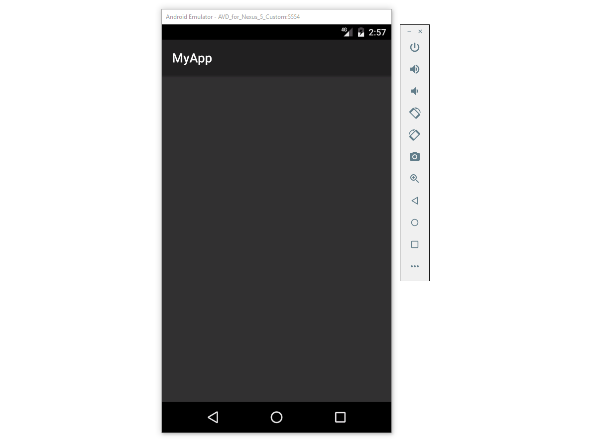
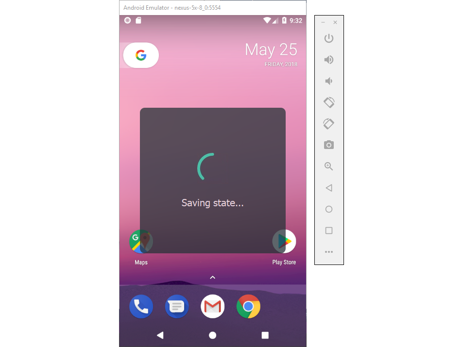
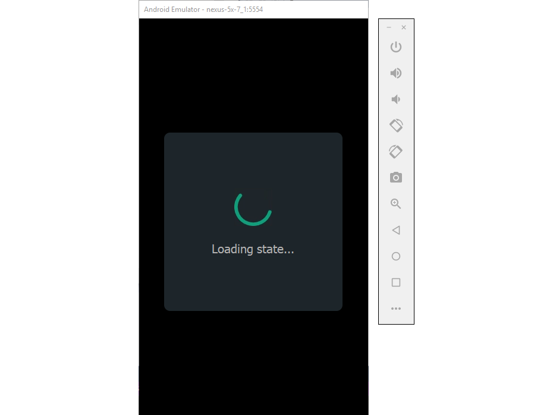

# Debugging on the Android Emulator

_In this guide, you will learn how to launch a virtual device in the
Android Emulator to debug and test your app._

## Overview

The Android Emulator (installed as part of the **Mobile development with
.NET** workload), can be run in a variety of configurations to simulate
different Android devices. Each one of these configurations is created
as a _virtual device_. In this guide, you will learn how to launch the
emulator from Visual Studio and run your app in a virtual device. For
information about configuring the Android Emulator and creating new
virtual devices, see 
[Android Emulator Setup](~/android/get-started/installation/android-emulator/index.md).

## Using a Pre-Configured Virtual Device

# [Visual Studio](#tab/windows)

Visual Studio includes pre-configured virtual devices that appear in
the device drop-down menu. For example, in the following Visual Studio
2017 screenshot, several pre-configured virtual devices are available:

-   **VisualStudio\_android-23\_arm\_phone**

-   **VisualStudio\_android-23\_arm\_tablet**

-   **VisualStudio\_android-23\_x86\_phone** 

-   **VisualStudio\_android-23\_x86\_tablet** 

Typically, you would select the **VisualStudio\_android-23\_x86\_phone**
virtual device to test and debug a phone app. If one of these
pre-configured virtual devices meets your requirements (i.e., matches
your app's target API level), skip to
[Launching the Emulator](#launching) to begin running your app in the
emulator. (If you are not yet familiar with Android API levels, see
[Understanding Android API Levels](~/android/app-fundamentals/android-api-levels.md).)

If your Xamarin.Android project is using a Target Framework level that
is incompatible with the available virtual devices, the drop-down menu
lists the unusable virtual devices under **Unsupported Devices**. For
example, the following project has a Target Framework set to **Android
7.1 Nougat (API 25)**, which is incompatible with the **Android 6.0**
virtual devices that are listed in this example:

You can click **Change Minimum Android Target** to change the project's
Minimum Android Version so that it matches the API level of the
available virtual devices. Alternately, you can use the
[Android Device Manager](~/android/get-started/installation/android-emulator/device-manager.md)
to create new virtual devices that support your target API level.
Before you can configure virtual devices for a new API level, you must
first install the corresponding system images for that API level (see
[Setting up the Android SDK for Xamarin.Android](~/android/get-started/installation/android-sdk.md)).

# [Visual Studio for Mac](#tab/macos)

Visual Studio for Mac includes pre-configured virtual devices that
appear in the device drop-down menu. For example, in the following
screenshot, two pre-configured virtual devices are available:

-   **Android\_Accelerated\_x86**

-   **Android\_ARMv7a**

Typically, you would select the **Android\_Accelerated\_x86**
virtual device to test and debug a phone app. If this
pre-configured virtual device meets your requirements (i.e., matches
your app's target API level), skip to
[Launching the Emulator](#launching) to begin running your app in the
emulator. (If you are not yet familiar with Android API levels, see
[Understanding Android API Levels](~/android/app-fundamentals/android-api-levels.md).)

-----

## Editing Virtual Devices

To modify virtual devices (or to create new ones), you must use the
[Android Device Manager](~/android/get-started/installation/android-emulator/device-manager.md).

<a name="launching" />

## Launching the Emulator

Near the top of Visual Studio, there is a drop-down menu that can be
used to select **Debug** or **Release** mode. Choosing **Debug** causes
the debugger to attach to the application process running inside the
emulator after the app starts. Choosing **Release** mode disables the
debugger (however, you can still run the app and use log statements for
debug). After you have chosen a virtual device from the device
drop-down menu, select either **Debug** or **Release** mode, then click
the Play button to run the application:

# [Visual Studio](#tab/windows)

# [Visual Studio for Mac](#tab/macos)

-----

After the emulator starts, Xamarin.Android will deploy the app to the
emulator. The emulator runs the app with the configured virtual device
image. An example screenshot of the Android Emulator is displayed
below. In this example, the emulator is running a blank app called
**MyApp**:

The emulator may be left running: it is not necessary to shut it down
and wait for it to restart each time the app is launched. The first
time a Xamarin.Android app is run in the emulator, the Xamarin.Android
shared runtime for the targetted API level is installed, followed by
the application. The runtime installation may take a few moments, so
please be patient. Installation of the runtime takes place only when
the first Xamarin.Android app is deployed to the emulator &ndash;
subsequent deployments are faster because only the app is copied to the
emulator.

<a name="quick-boot" />

## Quick Boot

Newer versions of the Android Emulator include a feature called
_Quick Boot_ that launches the emulator in only a few seconds. When you
close the emulator, it takes a snapshot of the virtual device state so
that it can be quickly restored from that state when it is restarted.
To access this feature, you will need the following:

-   Android Emulator version 27.0.2 or later
-   Android SDK Tools version 26.1.1 or later

When the above-listed versions of the emulator and SDK tools are
installed, the Quick Boot feature is enabled by default. 

The first cold boot of the virtual device takes place without a speed
improvement because a snapshot has not yet been created:

When you exit out of the emulator, Quick Boot saves the state of
the emulator in a snapshot:

Subsequent virtual device starts are much faster because the emulator
simply restores the state at which you closed the emulator.

## Troubleshooting

For tips and workarounds for common emulator problems, see
[Android Emulator Troubleshooting](~/android/get-started/installation/android-emulator/troubleshooting.md).

## Summary

This guide explained the process for configuring the Android
Emulator to run and test Xamarin.Android apps. It described the steps
for launching the emulator using pre-configured virtual devices, and it
provided the steps for deploying an application to the emulator from
Visual Studio. 

For more information about using the Android Emulator, see
the following Android Developer topics:

-   [Navigating on the Screen](https://developer.android.com/studio/run/emulator.html#navigate)

-   [Performing Basic Tasks in the Emulator](https://developer.android.com/studio/run/emulator.html#tasks)

-   [Working with Extended Controls, Settings, and Help](https://developer.android.com/studio/run/emulator.html#extended)

-   [Run the emulator with Quick Boot](https://developer.android.com/studio/run/emulator#quickboot)
