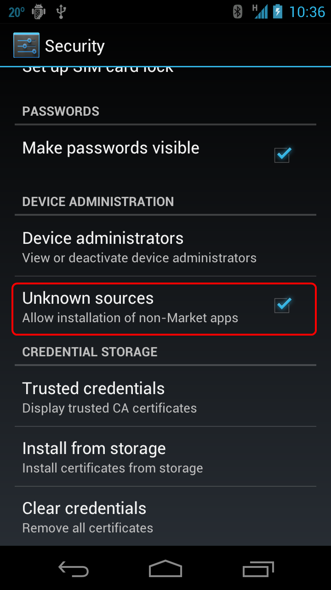
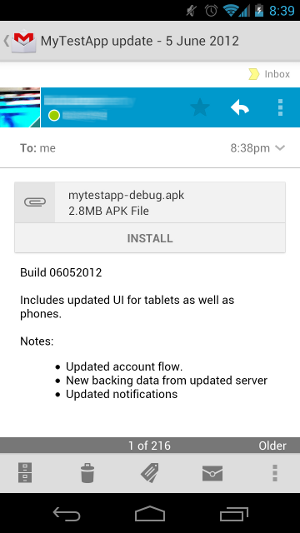

# Publishing Independently

It is possible to publish an application without using any of the
existing Android marketplaces. This section will explain these other
publishing methods and the licensing levels of Xamarin.Android.


## Xamarin Licensing

Four licenses are available for development, deployment, and
distribution of Xamarin.Android apps:

-   **Visual Studio Community** &ndash; For students, small teams, and
    OSS developers who use Windows.

-   **Visual Studio Professional** &ndash; For individual developers or
    small teams (Windows only). This license offers a standard or cloud
    subscription, access to additional Xamarin University content, and
    no usage restrictions.

-   **Visual Studio Enterprise** &ndash; For teams of any size (Windows
    only). This license includes enterprise capabilities, a standard or
    cloud subscription, and a 25% Xamarin Test Cloud discount.

Visit the [visualstudio.com](https://www.visualstudio.com/xamarin/) to download the
Community Edition or to learn more about purchasing the Professional
and Enterprise editions.


## Allow Installation from Unknown Sources

By default, Android prevents users from downloading and installing
applications from locations other than Google Play. To allow
installation from non-marketplace sources, a user must enable the
*Unknown sources* setting on a device before attempting to install an
application. The setting for this may be found under **Settings >
Security**, as shown in the following diagram:

[](publishing-independently-images/settings.png#lightbox)


> [!IMPORTANT]
> Some network providers might prevent the installation of applications from unknown sources, regardless of this setting.


## Publishing by E-Mail

Attaching the release APK to an e-mail is a quick and easy way to
distribute an application to users. When the user opens the e-mail on
an Android-powered device, Android will recognize the APK attachment
and display an **Install** button as shown in the following image:

[](publishing-independently-images/publishing-via-email.png#lightbox)

Although distribution via e-mail is simple, it provides few protections
against piracy or unauthorized distribution. It is best reserved for
situations where the recipients of the application are few, and they
are trusted not to distribute the application.


## Publishing by Web

It is possible to distribute an application by a web server. This is
accomplished by uploading the application to the web server, and then
providing a download link to users. When an Android-powered device
browses to a link and then downloads the application, that application
will automatically be installed once the download is complete.


## Manually Installing an APK

Manual installation is a third option for installing applications. To effect
a manual installation of an application:

1.   **Distribute a copy of the APK to user** &ndash; For example, this copy may be distributed on a CD or USB flash drive.
1.   **(The user) installs the application on an Android device**  &ndash; Use the command-line *Android Debug Bridge* (**adb**) tool. **adb** is a versatile command-line tool that enables communication with either an emulator instance or an Android-powered device. The Android SDK includes **adb**; it can be found in the directory **<sdk>/platform-tools/**.

The Android device must be connected with a USB cable to the computer.
Windows computers might also require additional USB drivers from the
phone vendor to be recognized by **adb**. Installation
instructions for these additional USB drivers is beyond the scope of
this document.

Before issuing any **adb** commands, it is helpful to know which
emulator instances or devices are connected, if any. It is possible to
see a list of what is attached by using the `devices` command, as
demonstrated in the following snippet:

```shell
$ adb devices
List of devices attached
        0149B2EC03012005device
```

After the connected devices have been confirmed, the application can be
installed by issuing the    `install`   command with      **adb**:

```shell
$ adb install <path-to-apk>
```

The following snippet shows an example of installing an application to a
connected device:

```shell
$ adb install helloworld.apk
3772 KB/s (3013594 bytes in 0.780s)
        pkg: /data/local/tmp/helloworld.apk
Success
```

If the application is already installed, the    `adb install`   will be unable to install the APK and will
report a failure, as shown in the following example:

```shell
$ adb install helloworld.apk
4037 KB/s (3013594 bytes in 0.728s)
        pkg: /data/local/tmp/helloworld.apk
Failure [INSTALL_FAILED_ALREADY_EXISTS]
```

It will be necessary to uninstall the application from the device. First,
issue the    `adb uninstall`   command:

```shell
adb uninstall <package_name>
```

The following snippet is an example of uninstalling an application:

```shell
$ adb uninstall mono.samples.helloworld
Success
```
