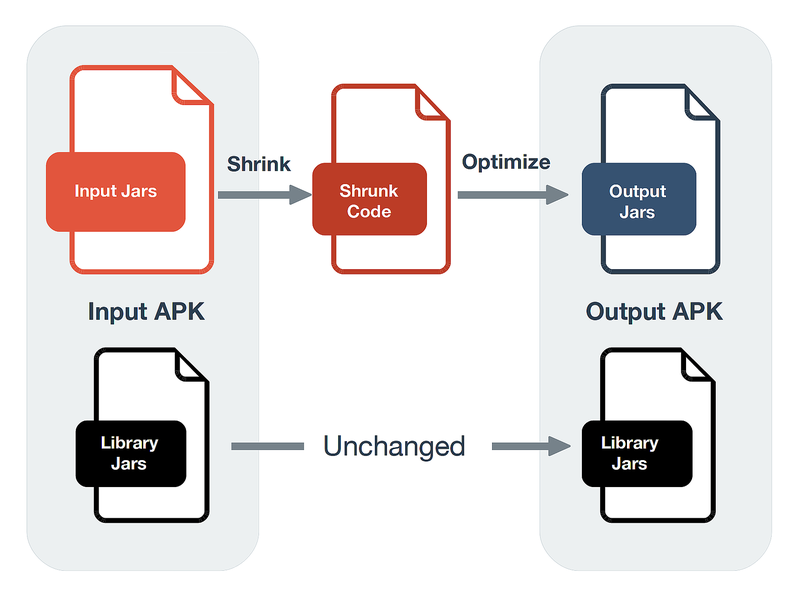
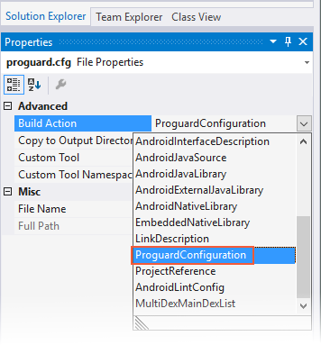

# ProGuard

_ProGuard is a Java class file shrinker, optimizer, obfuscator, and pre-verifier. It detects and removes unused code, analyzes and optimizes bytecode, then obfuscates classes and class members. This guide explains how ProGuard works, how to enable it in your project, and how to configure it. It also provides several examples of ProGuard configurations._


## Overview

ProGuard detects and removes unused classes, fields, methods, and 
attributes from your packaged application. It can even do the same for 
referenced libraries (this can help you avoid the 64k reference limit). 
The ProGuard tool from the Android SDK will also optimize bytecode, 
remove unused code instructions, and obfuscate the remaining classes, 
fields, and methods with shorter names. ProGuard reads **input jars** and 
then shrinks, optimizes, obfuscates, and pre-verifies them; it writes 
the results to one or more **output jars**. 

ProGuard processes input APK's using the following steps: 

1.  **Shrinking step** &ndash; ProGuard recursively determines which 
    classes and class members are used. All other classes and class 
    members are discarded. 

2.  **Optimization step** &ndash; ProGuard further optimizes the code. 
    Among other optimizations, classes and methods that are not entry 
    points can be made private, static, or final, unused parameters can 
    be removed, and some methods may be inlined. 

3.  **Obfuscation step** &ndash; ProGuard renames classes and class 
    members that are not entry points. Retaining entry points ensures 
    that they can still be accessed by their original names. 

4.  **Preverification step** &ndash; Performs checks on Java bytecodes 
    ahead of runtime and annotates class files for the benefit of the 
    Java VM. This is the only step that doesn't have to know the entry 
    points. 

Each of these steps is *optional*. As will be explained in the next 
section, Xamarin.Android ProGuard uses only a subset of these 
steps. 


## ProGuard in Xamarin.Android

The Xamarin.Android ProGuard configuration does not obfuscate the 
APK. In fact, is not possible to enable obfuscation through ProGuard 
(even through the use of custom configuration files). Thus, 
Xamarin.Android's ProGuard performs only the **shrinking** and 
**optimization** steps: 

[](proguard-images/01-xa-chain.png#lightbox)

One important item to know in advance before using ProGuard is how 
it works within the `Xamarin.Android` build process. This process uses 
two separate steps: 

1.  Xamarin Android Linker

2.  ProGuard

Each of these steps is described next.


### Linker Step

The Xamarin.Android linker employs static analysis of your application 
to determine the following: 

-   Which assemblies are actually used.

-   Which types are actually used.

-   Which members are actually used. 

The linker will always run before the ProGuard step. Because of 
this, the linker can strip an assembly/type/member that you might 
expect ProGuard to run on. (For more information about linking
in Xamarin.Android, see 
[Linking on Android](~/android/deploy-test/linker.md).)


### ProGuard Step

After the linker step completes successfully, ProGuard is run to remove 
unused Java bytecode. This is the step that optimizes the APK. 


## Using ProGuard

To use ProGuard in your app project, you must first enable ProGuard. 
Next, you can either let the Xamarin.Android build process use a default 
ProGuard configuration file, or you can create your own custom 
configuration file for ProGuard to use. 


### Enabling ProGuard

Use the following steps to enable ProGuard in your app project:

1.  Ensure that your project is set to the **Release** configuration 
    (this is important because the linker must run in order for 
    ProGuard to run): 

    [](proguard-images/02-set-release.png#lightbox)
   
2.  Enable ProGuard by checking the **Enable ProGuard** option under the 
    **Packaging** tab of **Properties > Android Options**: 

    [](proguard-images/03-enable-proguard.png#lightbox)

For most Xamarin.Android apps, the default ProGuard configuration file 
supplied by Xamarin.Android will be sufficient to remove all (and only)
unused code. To view the default ProGuard configuration, open 
the file at **obj\\Release\\proguard\\proguard_xamarin.cfg**. The next 
section describes how to create a customized ProGuard configuration 
file. 


### Customizing ProGuard

Optionally, you can add a custom ProGuard Configuration file to exert 
more control over the ProGuard tooling. For example, you may want to 
explicitly tell ProGuard which classes to keep. To do this, create a new 
**.cfg** file and apply the `ProGuardConfiguration` build action in the 
**Properties** pane of the **Solution Explorer**: 

[](proguard-images/04-build-action.png#lightbox)

Keep in mind that this configuration file does not replace the 
Xamarin.Android **proguard_xamarin.cfg** file since both are used by 
ProGuard. 

The following example illustrates a typical ProGuard configuration file:
    

    # This is Xamarin-specific (and enhanced) configuration.

    -dontobfuscate

    -keep class mono.MonoRuntimeProvider { *; <init>(...); }
    -keep class mono.MonoPackageManager { *; <init>(...); }
    -keep class mono.MonoPackageManager_Resources { *; <init>(...); }
    -keep class mono.android.** { *; <init>(...); }
    -keep class mono.java.** { *; <init>(...); }
    -keep class mono.javax.** { *; <init>(...); }
    -keep class opentk.platform.android.AndroidGameView { *; <init>(...); }
    -keep class opentk.GameViewBase { *; <init>(...); }
    -keep class opentk_1_0.platform.android.AndroidGameView { *; <init>(...); }
    -keep class opentk_1_0.GameViewBase { *; <init>(...); }

    -keep class android.runtime.** { <init>(***); }
    -keep class assembly_mono_android.android.runtime.** { <init>(***); }
    # hash for android.runtime and assembly_mono_android.android.runtime.
    -keep class md52ce486a14f4bcd95899665e9d932190b.** { *; <init>(...); }
    -keepclassmembers class md52ce486a14f4bcd95899665e9d932190b.** { *; <init>(...); }

    # Android's template misses fluent setters...
    -keepclassmembers class * extends android.view.View {
       *** set*(***);
    }

    # also misses those inflated custom layout stuff from xml...
    -keepclassmembers class * extends android.view.View {
       <init>(android.content.Context,android.util.AttributeSet);
       <init>(android.content.Context,android.util.AttributeSet,int);
    }
    

There might be cases where ProGuard is unable to properly analyze your 
application; it could potentially remove code that your application 
actually needs. If this happens, you can add a `-keep` line to your 
custom ProGuard configuration file: 

    -keep public class MyClass

In this example, `MyClass` is set to the actual name of the class that
you want ProGuard to skip.

You can also register your own names with `[Register]` annotations 
and use these names to customize ProGuard rules. You can register names 
for Adapters, Views, BroadcastReceivers, Services, ContentProviders, 
Activities, and Fragments. For more information about using
the `[Register]` custom attribute, see 
[Working with JNI](~/android/platform/java-integration/working-with-jni.md).


### ProGuard Options

ProGuard offers a number of options that you can configure to provide 
finer control over its operation. The 
[ProGuard Manual](https://stuff.mit.edu/afs/sipb/project/android/sdk/android-sdk-linux/tools/proguard/docs/index.html#manual/introduction.html) 
provides complete reference documentation for the use of ProGuard. 

Xamarin.Android supports the following ProGuard options: 


-    [Input/Output Options](https://stuff.mit.edu/afs/sipb/project/android/sdk/android-sdk-linux/tools/proguard/docs/manual/usage.html#iooptions)

-    [Keep Options](https://stuff.mit.edu/afs/sipb/project/android/sdk/android-sdk-linux/tools/proguard/docs/manual/usage.html#keepoptions)

-    [Shrinking Options](https://stuff.mit.edu/afs/sipb/project/android/sdk/android-sdk-linux/tools/proguard/docs/manual/usage.html#shrinkingoptions)

-    [General Options](https://stuff.mit.edu/afs/sipb/project/android/sdk/android-sdk-linux/tools/proguard/docs/manual/usage.html#generaloptions)

-    [Class Paths](https://stuff.mit.edu/afs/sipb/project/android/sdk/android-sdk-linux/tools/proguard/docs/manual/usage.html#classpath)

-    [File Names](https://stuff.mit.edu/afs/sipb/project/android/sdk/android-sdk-linux/tools/proguard/docs/manual/usage.html#filename)

-    [File Filters](https://stuff.mit.edu/afs/sipb/project/android/sdk/android-sdk-linux/tools/proguard/docs/manual/usage.html#filefilters)

-    [Filters](https://stuff.mit.edu/afs/sipb/project/android/sdk/android-sdk-linux/tools/proguard/docs/manual/usage.html#filters)

-    [Overview of `Keep` Options](https://stuff.mit.edu/afs/sipb/project/android/sdk/android-sdk-linux/tools/proguard/docs/manual/usage.html#keepoverview)

-    [Keep Option Modifiers](https://stuff.mit.edu/afs/sipb/project/android/sdk/android-sdk-linux/tools/proguard/docs/manual/usage.html#keepoptionmodifiers)

-    [Class Specifications](https://stuff.mit.edu/afs/sipb/project/android/sdk/android-sdk-linux/tools/proguard/docs/manual/usage.html#classspecification)

The following options are *ignored* by Xamarin.Android:

-    [Optimization Options](https://stuff.mit.edu/afs/sipb/project/android/sdk/android-sdk-linux/tools/proguard/docs/manual/usage.html#optimizationoptions)

-    [Obfuscation Options](https://stuff.mit.edu/afs/sipb/project/android/sdk/android-sdk-linux/tools/proguard/docs/manual/usage.html#obfuscationoptions) 

-    [Preverification Options](https://stuff.mit.edu/afs/sipb/project/android/sdk/android-sdk-linux/tools/proguard/docs/manual/usage.html#preverificationoptions)


## ProGuard and Android Nougat

If you are trying to use ProGuard against Android 7.0 or later, you 
must download a newer version of ProGuard because the Android SDK 
does not ship a new version that is compatible with JDK 1.8.

You can use this 
[NuGet package](https://www.nuget.org/packages/name.atsushieno.proguard.facebook/5.3.0) 
to install a newer version of `proguard.jar`. 
For more information about updating the default Android SDK `proguard.jar`, see this 
[Stack Overflow](http://stackoverflow.com/questions/39514518/xamarin-android-proguard-unsupported-class-version-number-52-0/39514706#39514706) discussion.

You can find all versions of ProGuard at the 
[SourceForge page](https://sourceforge.net/projects/proguard/files/). 


## Example ProGuard Configurations

Two example ProGuard configuration files are listed below. Please note 
that, in these cases, the Xamarin.Android build process will supply the 
**input**, **output**, and **library** jars. Thus, you can focus on 
other options like `-keep`. 

### A simple Android activity

The following example illustrates the configuration for a simple
Android activity:

    -injars  bin/classes
    -outjars bin/classes-processed.jar
    -libraryjars /usr/local/java/android-sdk/platforms/android-9/android.jar

    -dontpreverify
    -repackageclasses ''
    -allowaccessmodification
    -optimizations !code/simplification/arithmetic

    -keep public class mypackage.MyActivity

### A complete Android application

The following example illustrates the configuration for a complete
Android app:

    -injars  bin/classes
    -injars  libs
    -outjars bin/classes-processed.jar
    -libraryjars /usr/local/java/android-sdk/platforms/android-9/android.jar

    -dontpreverify
    -repackageclasses ''
    -allowaccessmodification
    -optimizations !code/simplification/arithmetic
    -keepattributes *Annotation*

    -keep public class * extends android.app.Activity
    -keep public class * extends android.app.Application
    -keep public class * extends android.app.Service
    -keep public class * extends android.content.BroadcastReceiver
    -keep public class * extends android.content.ContentProvider

    -keep public class * extends android.view.View {
    public <init>(android.content.Context);
    public <init>(android.content.Context, android.util.AttributeSet);
    public <init>(android.content.Context, android.util.AttributeSet, int);
    public void set*(...);
    }

    -keepclasseswithmembers class * {
    public <init>(android.content.Context, android.util.AttributeSet);
    }

    -keepclasseswithmembers class * {
    public <init>(android.content.Context, android.util.AttributeSet, int);
    }

    -keepclassmembers class * implements android.os.Parcelable {
    static android.os.Parcelable$Creator CREATOR;
    }

    -keepclassmembers class **.R$* {
    public static <fields>;
    }


## ProGuard and the Xamarin.Android Build Process

The following sections explain how ProGuard runs during
a Xamarin.Android **Release** build.


### What command is ProGuard running?

ProGuard is simply a `.jar` provided with the Android SDK. Thus, it 
is invoked in a command: 

```shell
java -jar proguard.jar options ...
```

### The ProGuard Task

The ProGuard task is found inside the 
**Xamarin.Android.Build.Tasks.dll** assembly. It is part of the 
`_CompileToDalvikWithDx` target, which is a part of the `_CompileDex` 
target. 

The following listing provides an example of the default parameters 
that are generated after you a create a new project using **File > New 
Project**: 

    ProGuardJarPath = C:\Android\android-sdk\tools\proguard\lib\proguard.jar
    AndroidSdkDirectory = C:\Android\android-sdk\
    JavaToolPath = C:\Program Files (x86)\Java\jdk1.8.0_92\\bin
    ProGuardToolPath = C:\Android\android-sdk\tools\proguard\
    JavaPlatformJarPath = C:\Android\android-sdk\platforms\android-25\android.jar
    ClassesOutputDirectory = obj\Release\android\bin\classes
    AcwMapFile = obj\Release\acw-map.txt
    ProGuardCommonXamarinConfiguration = obj\Release\proguard\proguard_xamarin.cfg
    ProGuardGeneratedReferenceConfiguration = obj\Release\proguard\proguard_project_references.cfg
    ProGuardGeneratedApplicationConfiguration = obj\Release\proguard\proguard_project_primary.cfg
    ProGuardConfigurationFiles

      {sdk.dir}tools\proguard\proguard-android.txt;
      {intermediate.common.xamarin};
      {intermediate.references};
      {intermediate.application};
      ;
     
    JavaLibrariesToEmbed = C:\Program Files (x86)\Reference Assemblies\Microsoft\Framework\MonoAndroid\v7.0\mono.android.jar
    ProGuardJarInput = obj\Release\proguard\__proguard_input__.jar
    ProGuardJarOutput = obj\Release\proguard\__proguard_output__.jar
    DumpOutput = obj\Release\proguard\dump.txt
    PrintSeedsOutput = obj\Release\proguard\seeds.txt
    PrintUsageOutput = obj\Release\proguard\usage.txt
    PrintMappingOutput = obj\Release\proguard\mapping.txt

The next example illustrates a typical ProGuard command that is run 
from the IDE:

```cmd
C:\Program Files (x86)\Java\jdk1.8.0_92\\bin\java.exe -jar C:\Android\android-sdk\tools\proguard\lib\proguard.jar -include obj\Release\proguard\proguard_xamarin.cfg -include obj\Release\proguard\proguard_project_references.cfg -include obj\Release\proguard\proguard_project_primary.cfg "-injars 'obj\Release\proguard\__proguard_input__.jar';'C:\Program Files (x86)\Reference Assemblies\Microsoft\Framework\MonoAndroid\v7.0\mono.android.jar'" "-libraryjars 'C:\Android\android-sdk\platforms\android-25\android.jar'" -outjars "obj\Release\proguard\__proguard_output__.jar" -optimizations !code/allocation/variable
```

## Troubleshooting

### File Issues

The following error message may be displayed when ProGuard reads its 
configuration file: 

    Unknown option '-keep' in line 1 of file 'proguard.cfg'

This issue typically happens on Windows because the `.cfg` file has the 
wrong encoding. ProGuard cannot handle _byte order mark_ (BOM) which 
may be present in text files. If a BOM is present, then ProGuard will 
exit with the above error. 

# [Visual Studio](#tab/vswin)

To prevent this problem, edit the custom configuration file from a text 
editor that will allow the file to be saved without a BOM. To solve 
this problem, ensure that your text editor has its encoding set to 
`UTF-8`. For example, the text editor 
[Notepad++](https://notepad-plus-plus.org/) can save files without the 
BOM by selecting the **Encoding &gt; Encode in UTF-8 Without BOM** when 
saving the file. 

# [Visual Studio for Mac](#tab/vsmac)

To prevent this problem, save your custom configuration file from a 
text editor that allows you to omit the BOM. 

-----


### Other Issues

The ProGuard 
[Troubleshooting](https://stuff.mit.edu/afs/sipb/project/android/sdk/android-sdk-linux/tools/proguard/docs/index.html#manual/troubleshooting.html) 
page discusses common issues you may encounter (and solutions) when using ProGuard.


## Summary

This guide explained how ProGuard works in Xamarin.Android, how to 
enable it in your app project, and how to configure it. It provided 
example ProGuard configurations, and it described solutions to common 
problems. For more information about the ProGuard tool and Android, see 
[Shrink Your Code and Resources](http://developer.android.com/tools/help/proguard.html). 


## Related Links

- [Preparing an Application for Release](~/android/deploy-test/release-prep/index.md)
