# Signing the Android Application Package

In [Preparing an App for Release](~/android/deploy-test/release-prep/index.md)
the **Archive Manager** was used to build the app and place it in an archive for
signing and publishing. This section explains how to create an Android
signing identity, create a new signing certificate for Android
applications, and publish the archived app *ad hoc* to disk. The
resulting APK can be sideloaded into Android devices without going
through an app store.

# [Visual Studio](#tab/windows)

In [Archive for Publishing](~/android/deploy-test/release-prep/index.md#archive),
the **Distribution Channel** dialog presented two choices for
distribution. Select **Ad-Hoc**:

[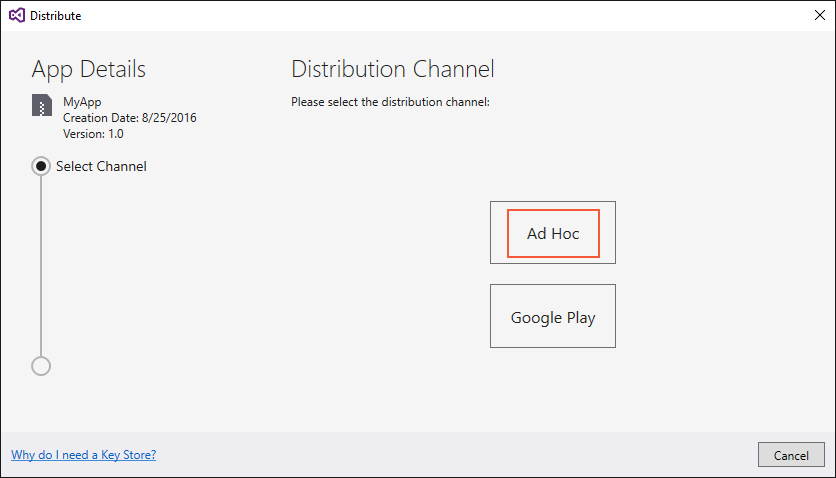](images/vs/01-distribution-channel.png#lightbox)

# [Visual Studio for Mac](#tab/macos)

In [Archive for Publishing](~/android/deploy-test/release-prep/index.md#archive),
the **Sign and Distribute...** dialog presented us with two choices for
distribution. Select **Ad-Hoc** and click **Next**:

[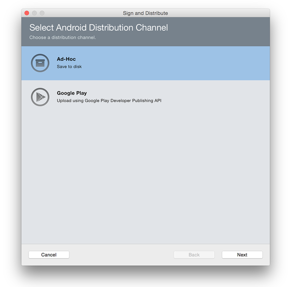](images/xs/01-select-ad-hoc.png#lightbox)

-----

<a name="newcertvs" />
<a name="newcert" />
<a name="newcertxs" />

## Create a New Certificate

# [Visual Studio](#tab/windows)

After **Ad-Hoc** is selected, Visual Studio opens the **Signing
Identity** page of the dialog as shown in the next screenshot. To
publish the .APK,  it must first be signed with a signing key (also
referred to as a certificate).

An existing certificate can be used by clicking the **Import** button and then proceeding to
[Sign the APK](#sign-the-apk). Otherwise, click the click the
**+** button to create a new certificate:

[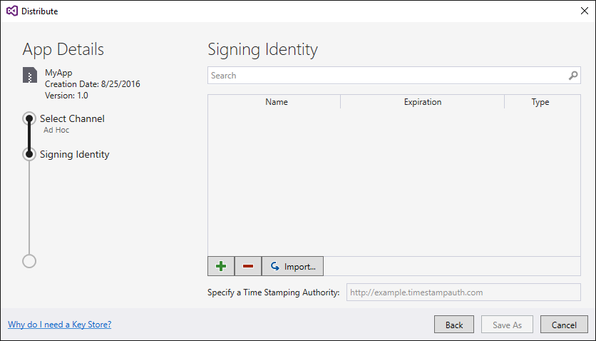](images/vs/02-ad-hoc-signing-identity-vs.png#lightbox)

The **Create Android Key Store** dialog is displayed; use this dialog
to create a new signing certificate that can use for signing
Android applications. Enter the required information (outlined in red)
as shown in this dialog:

[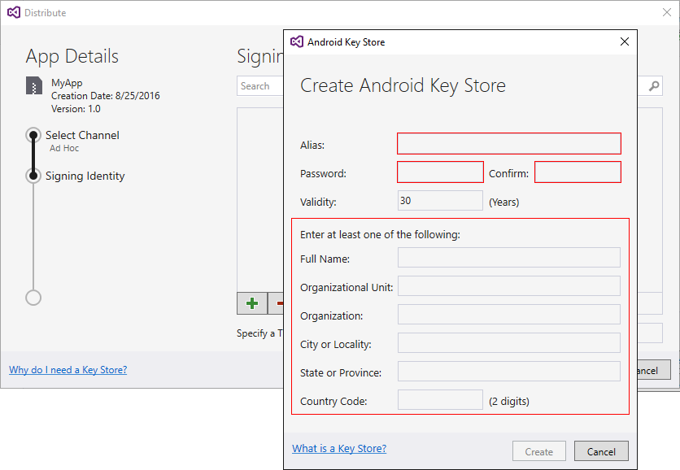](images/vs/03-create-android-key-store-vs.png#lightbox)

The following example illustrates the kind of information that must be provided. Click **Create** to create the new certificate:

[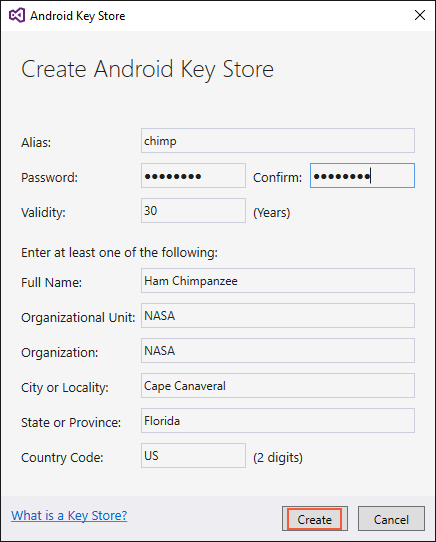](images/vs/04-key-store-example-vs.png#lightbox)

The resulting keystore resides in the following location:

**C:\\Users\\*USERNAME*\\AppData\\Local\\Xamarin\\Mono for Android\\Keystore\\*ALIAS*\\*ALIAS*.keystore**

For example, using **chimp** as the alias, the above steps would create a new signing
key in the following location:

**C:\\Users\\*USERNAME*\\AppData\\Local\\Xamarin\\Mono for Android\\Keystore\\chimp\\chimp.keystore**

> [!NOTE]
> Be sure to back up the resulting keystore file and password in a
> safe place &ndash; it is not included in the Solution. If you lose your
> keystore file (for example, because you moved to another computer or
> reinstalled Windows), you will be unable to
> sign your app with the same certificate as previous versions.

For more information about the keystore, see
[Finding your Keystore's MD5 or SHA1 Signature](~/android/deploy-test/signing/keystore-signature.md).

# [Visual Studio for Mac](#tab/macos)

After clicking **Ad-Hoc**, Visual Studio for Mac opens the **Android Signing
Identity** dialog as shown in the next screenshot. To publish the .APK,
it must first be signed it with a signing key (also referred to as a
certificate). If a certificate already exists, click the **Import an
Existing Key** button to import it and then proceed to
[Sign the APK](#signapkxs) Otherwise, click the **Create a New
Key** button to create a new certificate:

[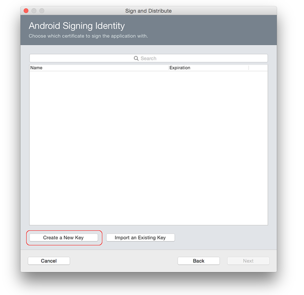](images/xs/02-android-signing-identity.png#lightbox)

The **Create New Certificate** dialog is used to create a new signing
certificate that can be used for signing Android applications. Click
**OK** after entering in the necessary information:

[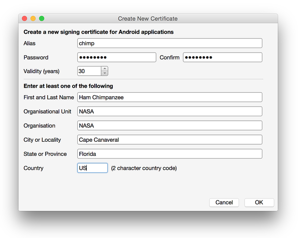](images/xs/03-create-new-certificate.png#lightbox)

The resulting keystore resides in the following location:

**~/Library/Developer/Xamarin/Keystore/alias/alias.keystore**

For example, the above steps might create a new signing
key in the following location:

**~/Library/Developer/Xamarin/Keystore/chimp/chimp.keystore**

> [!NOTE]
> Be sure to back up the resulting keystore file and password in a
> safe place &ndash; it is not included in the Solution. If you lose your
> keystore file (for example, because you moved to another computer or
> reinstalled macOS), you will be unable to
> sign your app with the same certificate as previous versions.

For more information about the keystore, see
[Finding your Keystore's MD5 or SHA1 Signature](~/android/deploy-test/signing/keystore-signature.md).

-----

## Sign the APK

# [Visual Studio](#tab/windows)

When **Create** is clicked, a new key store (containing a new
certificate) will be saved and listed under **Signing Identity** as shown
in the next screenshot. To publish an app on Google Play, click
**Cancel** and go to
[Publishing to Google Play](~/android/deploy-test/publishing/publishing-to-google-play/index.md).
To publish *ad-hoc*, select the signing identity to use for signing and
click **Save As** to publish the app for independent distribution. For
example, the **chimp** signing identity (created earlier) is selected
in this screenshot:

[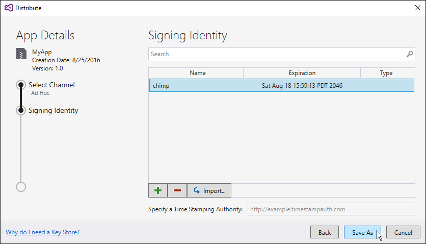](images/vs/05-save-as-vs.png#lightbox)

Next, the **Archive Manager** displays the publishing progress. When
the publishing process completes, the **Save As** dialog opens to ask
for a location where the generated .APK file is to be
stored:

[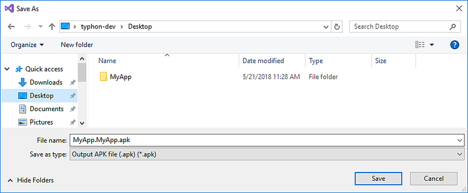](images/vs/06-save-as-dialog-vs.png#lightbox)

Navigate to the desired location and click **Save**. If the key
password is unknown, the **Signing Password** dialog will appear to
prompt for the password for the selected certificate:

[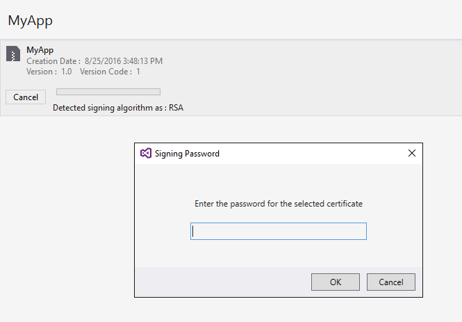](images/vs/07-signing-password-vs.png#lightbox)

After the signing process completes, click **Open Distribution**:

[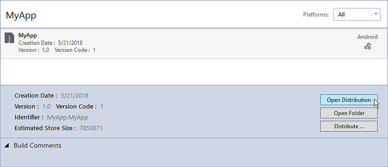](images/vs/08-open-distribution.png#lightbox)

This causes Windows Explorer to open the folder containing the
generated APK file. At this point, Visual Studio has compiled the
Xamarin.Android application into an APK that is ready for distribution.
The following screenshot displays an example of the ready-to-publish
app, **MyApp.MyApp.apk**:

# [Visual Studio for Mac](#tab/macos)

As seen here, a new certificate was added to the key store. To publish
an app on Google Play, click **Cancel** and go to
[Publishing to Google Play](~/android/deploy-test/publishing/publishing-to-google-play/index.md).
Otherwise click **Next** to publish the app *ad-hoc* (for independent
distribution) as shown in this example:

[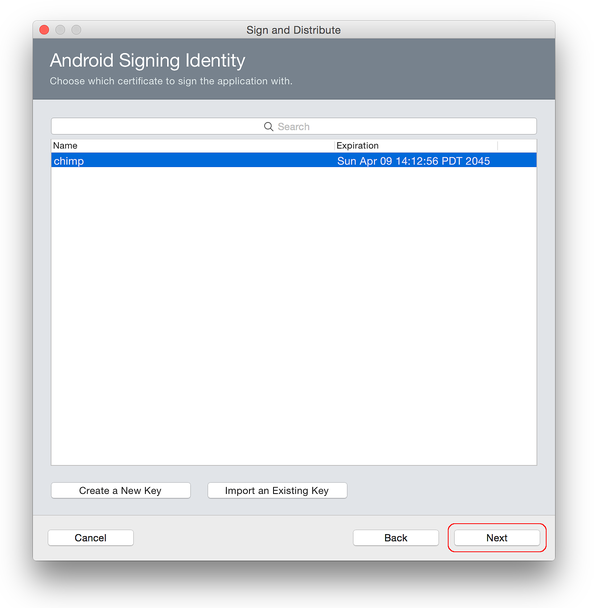](images/xs/04-select-identity.png#lightbox)

The **Publish as Ad Hoc** dialog provides a summary of the signed app
before it is published. If this information is correct, click
**Publish**.

[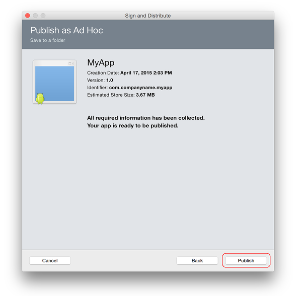](images/xs/05-publish-ad-hoc.png#lightbox)

The **Output APK file** dialog will save the APK to the path specified. Click **Save**.

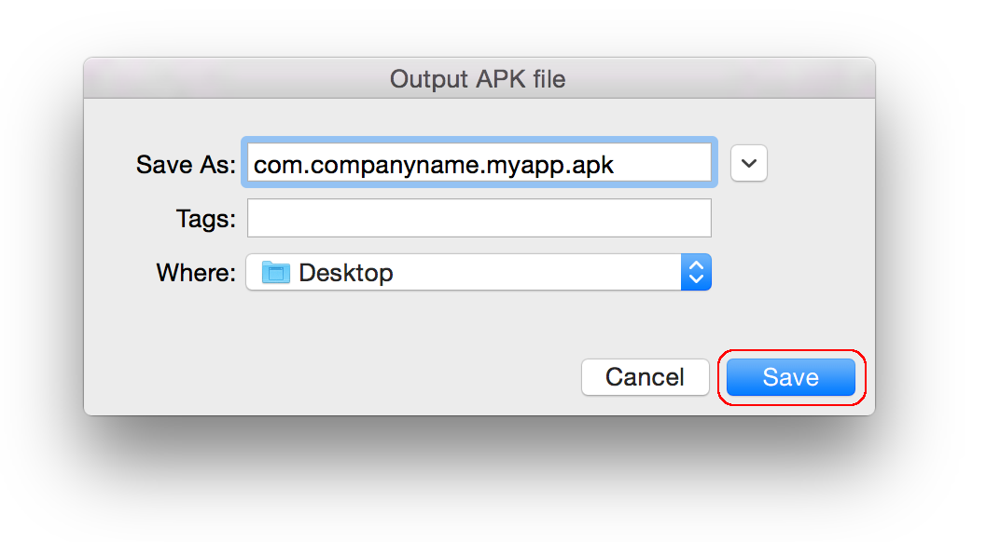

Next, enter the password for the certificate (the password that was
used in the **Create New Certificate** dialog) and click **OK**:

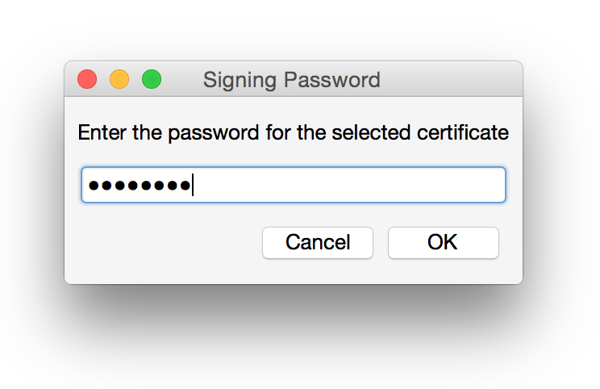

The APK is signed with the certificate and saved to the specified
location. Click **Reveal in Finder**:

[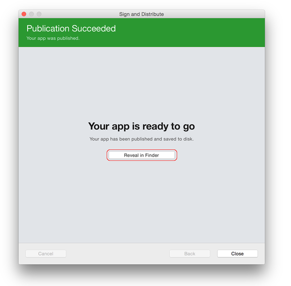](images/xs/08-app-is-ready.png#lightbox)

This opens the finder to the location of the signed APK file:

[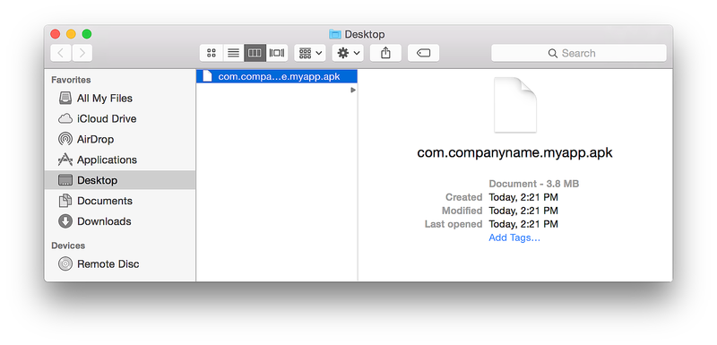](images/xs/09-show-in-finder.png#lightbox)

The APK is ready to copy from the finder and send to its final
destination. It's a good idea to install the APK on an Android device
and try it out before distribution. See
[Publishing Independently](~/android/deploy-test/publishing/publishing-independently.md)
for more information about publishing an *ad-hoc* APK.

-----

## Next Steps

After the application package has been signed for release, it must be
published. The following sections describe several ways to publish
an application.
