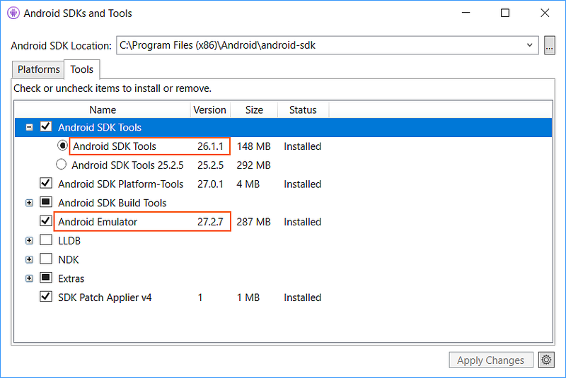
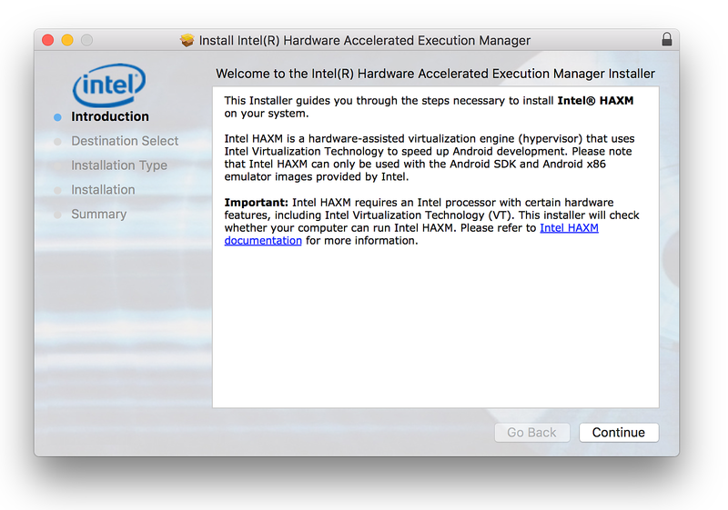

# Hardware Acceleration for Emulator Performance

_This article explains how to use your computer's hardware acceleration
features to maximize Google Android Emulator performance._

## Overview

Visual Studio makes it easier for developers to test and debug their
Xamarin.Android applications by using the Google Android Emulator in
situations where an Android device is unavailable or impractical.
However, the Android emulator runs too slowly if hardware acceleration
is not available on the computer that runs it. You can drastically
improve the performance of the Android emulator by using special
virtual device images that target x86 hardware in conjunction with one
of two virtualization technologies:

1. **Microsoft's Hyper-V and the Hypervisor Platform**. Hyper-V
   is a virtualization feature of Windows that makes it possible to run 
   virtualized computer systems on a physical host computer. This
   is the recommended virtualization technology to use for accelerating
   the Google Android Emulator. To learn more about Hyper-V,
   see [Hyper-V on Windows 10](https://docs.microsoft.com/en-us/virtualization/hyper-v-on-windows/).

2. **Intel's Hardware Accelerated Execution Manager (HAXM)**. 
   HAXM is a virtualization engine for computers running Intel CPUs.
   This is the recommended virtualization engine for computers that
   are unable to run Hyper-V.

The Google Android Emulator will automatically make use of hardware
acceleration if the following criteria are met:

-   Hardware acceleration is available and enabled on the development
    computer.

-   The emulator is running an emulator image specifically created for
    an **x86**-based virtual device.

For information about launching and debugging with the Android
Emulator, see
[Debugging with the Google Android Emulator](~/android/deploy-test/debugging/android-sdk-emulator/index.md).

## Hyper-V

# [Visual Studio](#tab/vswin)


> [!NOTE]
> Hyper-V support is currently in Preview.

Developers who are using Windows 10 (April 2018 Update or later) are
strongly encouraged to use Microsoft's Hyper-V to accelerate the Google
Android Emulator. To use the Google Android Emulator with Hyper-V:

1. **Update to Windows 10 April 2018 Update (build 1803) or later**.
   To verify which version of Windows is running, click in the
   Cortana search bar and type **About**. Select **About your PC** in
   the search results. Scroll down in the **About** dialog to the
   **Windows specifications** section. The **Version** should be at
   least 1803:

    [](hardware-acceleration-images/win/12-about-windows.w10.png#lightbox)

2. **Enable the Windows Hypervisor Platform**.
   In the Cortana Search bar, type **Turn Windows features on or off**.
   Scroll down in the **Windows Features** dialog and ensure that 
   **Windows Hypervisor Platform** is enabled:

    [](hardware-acceleration-images/win/13-windows-features.w10.png#lightbox)

   Enabling **Windows Hypervisor Platform** automatically enables
   Hyper-V. It is a good idea to restart Windows after making this
   change.

3. **Install
   [Visual Studio 15.8 Preview 1 or later](https://www.visualstudio.com/vs/preview/)**.
   This version of Visual Studio provides IDE support for
   running the Google Android Emulator with Hyper-V.
 
4. **Install the Google Android emulator package 27.2.7 or later**. To
   install this package, navigate to **Tools > Android > Android SDK
   Manager** in Visual Studio. Select the **Tools** tab and ensure that
   the Android Emulator version is at least 27.2.7. Also ensure that
   the Android SDK Tools version is 26.1.1 or later:

    [](hardware-acceleration-images/win/14-sdk-manager.w158.png#lightbox)

5. If the emulator version is at least 27.2.7 but less than 27.3.1,
   the following workaround is required to use Hyper-V:

    1.  In the **C:\\Users\\_username_\\.android** folder, create a file called **advancedFeatures.ini** 
        (if it doesn't already exist).

    2.  Add the following line to **advancedFeatures.ini**:
        ```
        WindowsHypervisorPlatform = on
        ```


### Known Issues

-   If you are unable to update to emulator version 27.2.7 or later after
    updating to a Visual Studio preview, you may have to
    directly install the [preview installer](http://aka.ms/hyperv-emulator-dl)
    to enable newer emulator versions.

-   Performance may be reduced when using certain Intel and AMD-based
    processors.

-   Android application may take an abnormal amount of time to load on
    deployment.

-   MMIO access error may intermittently prevent a boot of the Android
    emulator. Restarting the emulator should resolve this.


# [Visual Studio for Mac](#tab/vsmac)

Hyper-V support requires Windows 10. Please see the
[Hyper-V requirements](https://docs.microsoft.com/en-us/virtualization/hyper-v-on-windows/quick-start/enable-hyper-v#check-requirements)
for more details.

-----

## HAXM

HAXM is a hardware-assisted virtualization engine (hypervisor) that
uses Intel Virtualization Technology (VT) to speed up Android app
emulation on a host machine. Using HAXM in conjunction with Android x86
emulator images provided by Intel allows for faster Android emulation
on VT-enabled systems.

If you are developing on a machine with an Intel CPU that has VT
capabilities, you can take advantage of HAXM to greatly speed up the
Google Android Emulator (if you're not sure whether your CPU supports VT,
see [Does My Processor Supports Intel Virtualization Technology?](https://www.intel.com/content/www/us/en/support/processors/000005486.html)).

> [!NOTE]
> You can't run a VM-accelerated emulator inside another VM, such as a VM
> hosted by VirtualBox, VMWare, or Docker. You must run the Google Android emulator
> [directly on your system hardware](https://developer.android.com/studio/run/emulator-acceleration.html#extensions).

Before using the Google Android Emulator for the first time, it's a
good idea to verify that HAXM is installed and available for the Google
Android Emulator to use.

### Verifying HAXM Installation

You can check to see if HAXM is available by viewing the **Starting
Android Emulator** window while the emulator starts. To start the
Google Android Emulator, do the following:

# [Visual Studio](#tab/vswin)

1. Launch the Android Device Manager by clicking **Tools > Android >
   Android Device Manager**:

    [](hardware-acceleration-images/win/01-avd-manager-menu-item.png#lightbox)

2. If you see a **Performance Warning** dialog similar to the following, then HAXM is
   not yet installed or configured properly on your computer:

    

   If a **Performance Warning** dialog like this is shown, see
   [Performance Warnings](~/android/deploy-test/debugging/android-sdk-emulator/troubleshooting.md#perfwarn)
   to identify the cause and resolve the underlying problem.

3. Select an **x86** image (for example, **VisualStudio\_android-23\_x86\_phone**) and
   click **Start**:

    

4. Watch for the **Starting Android Emulator** dialog window while the
   emulator starts up. If HAXM is installed, you will see the message,
   **HAX is working and emulator runs in fast virt mode** as shown in
   this screenshot:

    

   If you do not see this message, then HAXM is probably not installed. For example, here
   is a screenshot of a message you may see if HAXM is not available:

    

   If HAXM is not available on your computer, use the steps in the next
   section to install HAXM.

# [Visual Studio for Mac](#tab/vsmac)

1. Launch the Android Device Manager by clicking **Tools >
   Device Manager**:

    [](hardware-acceleration-images/mac/01-avd-manager-menu-item.png#lightbox)

2. If you see a **Performance Warning** dialog similar to the following, then HAXM is
   not yet installed or configured properly on your computer:

    

   If a **Performance Warning** dialog like this is shown, see
   [Performance Warnings](~/android/deploy-test/debugging/android-sdk-emulator/troubleshooting.md#perfwarn)
   to identify the cause and resolve the underlying problem.

3. Select the **x86** image (for example,
   **Android\_Accelerated\_x86**) and click **Play**:

    [](hardware-acceleration-images/mac/02-start-default-avd.png#lightbox)

3. Watch for the **Starting Android Emulator** dialog window while the
   emulator starts up. If HAXM is installed, you will see the message,
   **HAX is working and emulator runs in fast virt mode** as shown in
   this screenshot:

    

   If HAXM is not available on your computer (for example, if you see an
   error message like _Please ensure Intel HAXM is propertly installed and
   usable_), use the steps in the next section to install HAXM.


-----

<a name="install-haxm" />

### Installing HAXM

If the emulator does not start, HAXM may have to be installed
manually. HAXM install packages for both Windows and macOS are
available from the
[Intel Hardware Accelerated Execution Manager](https://software.intel.com/en-us/android/articles/intel-hardware-accelerated-execution-manager)
page. Use the following steps to download and install HAXM manually:

# [Visual Studio](#tab/vswin)

1. From the Intel website, download the latest
   [HAXM virtualization engine](https://software.intel.com/en-us/android/articles/intel-hardware-accelerated-execution-manager/)
   installer for Windows. The advantage of downloading the HAXM
   installer directly from the Intel website is that you can be assured
   of using the latest version.

   Alternately, you can use the SDK Manager to download the HAXM
   installer (In the SDK Manager, click **Tools > Extras > Intel x86
   Emulator Accelerator (HAXM installer)**). The Android SDK
   normally downloads the HAXM installer to the following location:

   **C:\\Program Files (x86)\\Android\\android-sdk\\extras\\intel\\Hardware\_Accelerated\_Execution\_Manager**

   Note that the SDK Manager does not install HAXM, it merely downloads the
   HAXM installer to the above location; you still have to launch it manually.

2. Run **intelhaxm-android.exe** to start the HAXM installer. Accept
   the default values in the installer dialogs:

   

## Hardware Acceleration and AMD CPUs

Because Google's Android emulator currently supports AMD hardware acceleration
[only on Linux](https://developer.android.com/studio/run/emulator-acceleration.html#dependencies), hardware
acceleration is not available for AMD-based computers running Windows.


# [Visual Studio for Mac](#tab/vsmac)

1. From the Intel website, download the latest
   [HAXM virtualization engine](https://software.intel.com/en-us/android/articles/intel-hardware-accelerated-execution-manager/)
   installer for macOS.

2. Run the HAXM installer. Accept the default values in the installer dialogs:

   [](hardware-acceleration-images/win/05-haxm-installer.png#lightbox)

-----


## Related Links

* [Run Apps on the Android Emulator](https://developer.android.com/studio/run/emulator)
