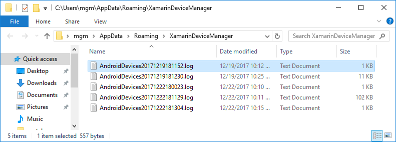
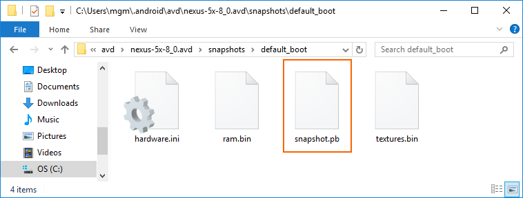
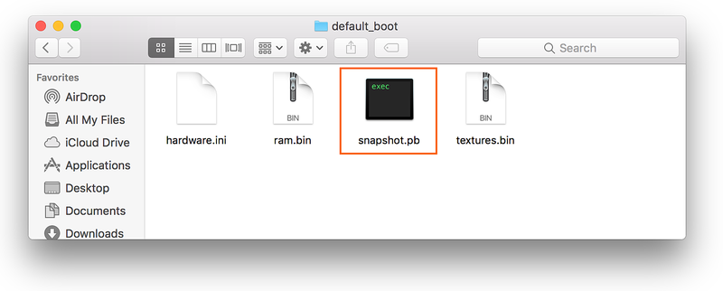

# Troubleshooting Emulator Setup Problems

_This article explains how to diagnose and work around problems that
may occur when using the Android Device Manager to configure the
Android Emulator. For information about troubleshooting problems while
running the Android Emulator, see 
[Google Android Emulator Troubleshooting](~/android/deploy-test/debugging/android-sdk-emulator/troubleshooting.md)._

# [Visual Studio](#tab/vswin)

## Android SDK in Non-Standard Location

Typically, the Android SDK is installed at the following location:

**C:\\Program Files (x86)\\Android\\android-sdk**

If the SDK is not installed at this location, you may get this error when you launch
the Android Device Manager:


To work around this problem, do the following:

1. From the Windows desktop, navigate to **C:\\Users\\*username*\\AppData\\Roaming\\XamarinDeviceManager**:

    

2. Double-click to open one of the log files and locate the **Config
   file path**. For example:

    [](troubleshooting-images/win/03-config-file-path.png#lightbox)

3. Navigate to this location and double-click **user.config** to open it. 

4. In **user.config**, locate the **&lt;UserSettings&gt;** element and add an **AndroidSdkPath** attribute to 
   it. Set this attribute to the path where the Android SDK is installed on
   your computer and save the file. For example, **&lt;UserSettings&gt;** would look like the following if the
   Android SDK was installed at **C:\\Programs\\Android\\SDK**:
        
    ```xml
    <UserSettings SdkLibLastWriteTimeUtcTicks="636409365200000000" AndroidSdkPath="C:\Programs\Android\SDK" />
    ```

After making this change to **user.config**, you should be able to
launch the Android Device Manager.

## Snapshot disables WiFi on Android Oreo

If you have an AVD configured for Android Oreo with simulated Wi-Fi access,
restarting the AVD after a snapshot may cause Wi-Fi access to become disabled.

To work around this problem,

1. Select the AVD in the Android Device Manager.

2. From the additional options menu, click **Reveal in Explorer**.

3. Navigate to **snapshots > default_boot**.

4. Delete the **snapshot.pb** file:

    

5. Restart the AVD. 

After these changes are made, the AVD will restart in a state that
allows Wi-Fi to work again.

# [Visual Studio for Mac](#tab/vsmac)

## Snapshot disables WiFi on Android Oreo

If you have an AVD configured for Android Oreo with simulated Wi-Fi access,
restarting the AVD after a snapshot may cause Wi-Fi access to become disabled.

To work around this problem,

1. Select the AVD in the Android Device Manager.

2. From the additional options menu, click **Reveal in Finder**.

3. Navigate to **snapshots > default_boot**.

4. Delete the **snapshot.pb** file:

    [](troubleshooting-images/mac/02-delete-snapshot.png#lightbox)

5. Restart the AVD. 

After these changes are made, the AVD will restart in a state that
allows Wi-Fi to work again.


-----

## Generating a Bug Report

# [Visual Studio](#tab/vswin)

If you find a problem with the Android Device Manager that
cannot be resolved using the above troubleshooting tips, please file a
bug report by right-clicking the title bar and selecting **Generate Bug
Report**:

[](troubleshooting-images/win/04-bug-report.png#lightbox)


# [Visual Studio for Mac](#tab/vsmac)

If you find a problem with the Android Device Manager that
cannot be resolved using the above troubleshooting tips, please file a
bug report by clicking **Help > Generate Bug Report**:

[](troubleshooting-images/mac/01-bug-report.png#lightbox)

-----
