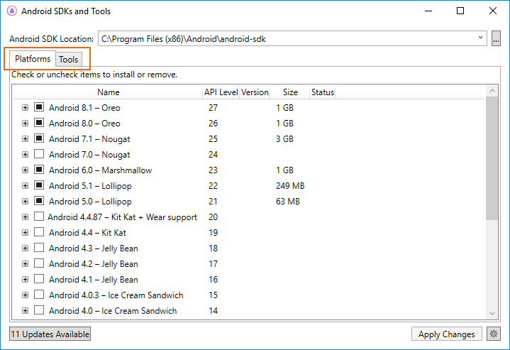
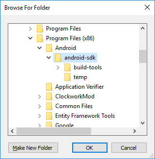
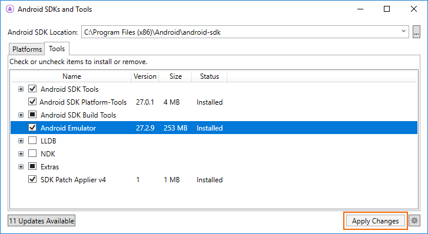
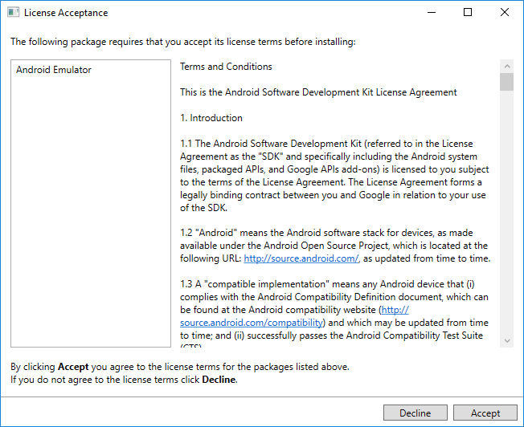
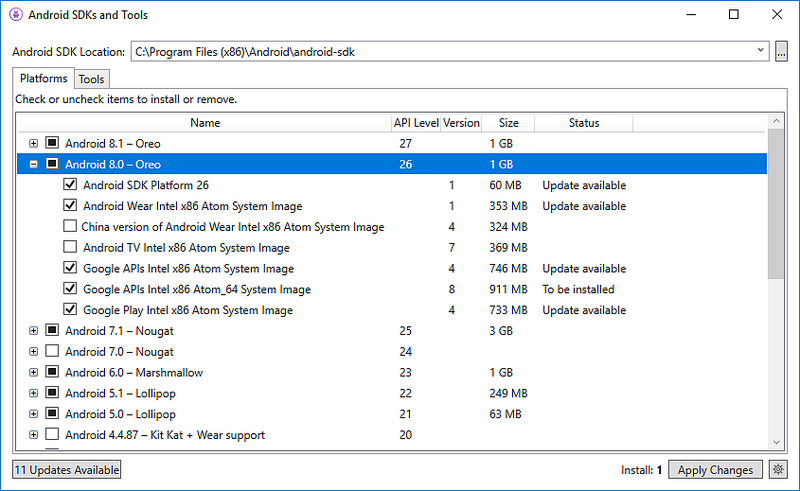
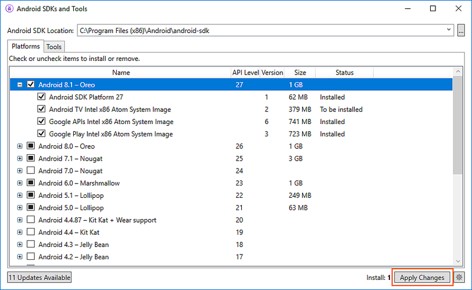
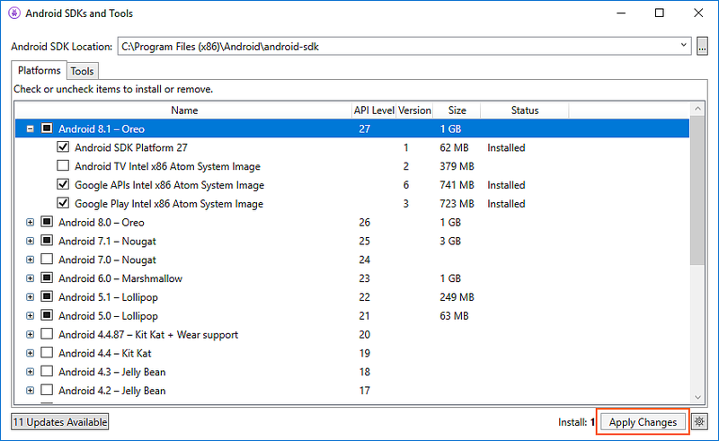

# Android SDK Setup

_Visual Studio includes an Android SDK Manager that replaces Google's standalone SDK Manager. This guide explains how to use the SDK Manager to download Android SDK tools, platforms, and other components that you need for developing Xamarin.Android apps._

## Overview

# [Visual Studio](#tab/vswin)

This guide explains how to install and use the Xamarin Android SDK
Manager for Visual Studio on Windows (or
[for Mac](?tabs=vsmac)).

# [Visual Studio for Mac](#tab/vsmac)

This guide explains how to install and use the Xamarin Android SDK
Manager for Visual Studio for Mac (or
[for Windows](?tabs=vswin)).

> [!NOTE]
> This guide applies only to Visual Studio 2017 and Visual Studio for Mac.  

-----

The Xamarin Android SDK Manager helps you download the latest Android
components that you need for developing your Xamarin.Android app.
It replaces Google's standalone SDK Manager, which has been deprecated.

Why would you want to use the Xamarin Android SDK Manager instead of
SDK Manager that is included with the Android SDK? In version 25.2.3 of
the Android SDK Tools package, Google introduced a new 
tool to maintain the Android SDK. This new tool, 
**[sdkmanager](https://developer.android.com/studio/command-line/sdkmanager.html)**,
is a command line utility that replaces the standalone UI manager for
the Android SDK. Therefore, if you update to SDK Tools version 26.0.1
(required for Android 8.0) or later and you want to continue
to manage the Android SDK via a UI interface, you must use the Xamarin
Android SDK Manager.

## Requirements

# [Visual Studio](#tab/vswin)

To use the Xamarin Android SDK Manager, you will need the following:

- Visual Studio 2017 community edition or higher. Visual Studio 2017
  version 15.5 or later is required.

- Xamarin for Visual Studio version 4.5.0 or later. 

The Xamarin Android SDK Manager is not compatible with Visual Studio
2015. Users of Visual Studio 2015 should use the SDK Manager tools
provided by Google in the Android SDK.

# [Visual Studio for Mac](#tab/vsmac)

-   Visual Studio for Mac 7.0.0.3146 (or later).

-----

The Xamarin Android SDK Manager also requires the Java Development Kit
(which is automatically installed with Xamarin.Android).
Xamarin.Android uses
[JDK 8](http://www.oracle.com/technetwork/java/javase/downloads/jdk8-downloads-2133151.html),
which is required if you are developing for API level 24 or greater
(JDK 8 also supports API levels earlier than 24). You can continue to
use
[JDK 7](http://www.oracle.com/technetwork/java/javase/downloads/jdk7-downloads-1880260.html)
if you are developing specifically for API level 23 or earlier.

> [!IMPORTANT]
> Xamarin.Android does not support JDK 9.

# [Visual Studio](#tab/vswin)

## Installation

The Xamarin SDK Manager can be added to Visual Studio 2017 at
installation time. When you install Visual Studio, click **Individual
Components** and scroll down to the **Development activities** section.
Enable **Xamarin SDK Manager** if it is not already checked:

If you have already installed Visual Studio 2017, see
[Modify Visual Studio 2017](https://docs.microsoft.com/en-us/visualstudio/install/modify-visual-studio)
for instructions on how to modify Visual Studio, then follow the above
procedure to enable the Xamarin SDK Manager. If you see a prompt to
update the SDK Manager, you can use this same procedure to install the
Xamarin SDK Manager.

When you click **Tools > Android > Android SDK Manager** (as explained
next), the Xamarin Android SDK Manager will be launched instead of the
Google Android SDK Manager. If you are using an earlier version of the
Android SDK that supports Google's standalone Android SDK Manager,
installing the Xamarin Android SDK Manager will not create a conflict
&ndash; you can still launch the standalone Google SDK Manager from
outside of Visual Studio to manage the Android SDK.

# [Visual Studio for Mac](#tab/vsmac)
 
-----

 
## SDK Manager 

# [Visual Studio](#tab/vswin)

To start the SDK Manager in Visual Studio, click **Tools > Android >
Android SDK Manager**:

The **Xamarin Android SDK Manager** opens in the **Android SDKs and
Tools** screen. This screen has two tabs &ndash; **Platforms** and
**Tools**:

The **Android SDKs and Tools** screen is described in more detail in
the following sections.

# [Visual Studio for Mac](#tab/vsmac)

To start the SDK Manager in Visual Studio for Mac, click **Tools > SDK Manager**:
 

The **Android SDK Manager** opens in the **Preferences window**, which
contains three tabs, **Platforms**, **Tools**, and **Locations**:

The tabs of the Xamarin Android SDK Manager are described in the
following sections.

-----

# [Visual Studio](#tab/vswin)

### Android SDK Location

The Android SDK location is configured at the top of the **Android SDKs
and Tools** screen, as seen in the previous image. This location must
be configured correctly before the **Platforms** and **Tools** tabs
will function properly. You may need to set the location of the Android
SDK for one or more of the following reasons:

1. The Xamarin SDK Manager was unable to locate the Android SDK. 

2. You have installed the Android SDK in a alternate (non-default) location. 

To set the location of the Android SDK, click the &hellip; button to
the far right of **Android SDK Location**. This opens the **Browse For
Folder** dialog to use for navigating to the location of the Android
SDK. In the following screenshot, the Android SDK under **Program Files
(x86)\\Android** is being selected:

When you click **OK**, the Xamarin Android SDK Manager will manage
the Android SDK that is installed at the selected location.

# [Visual Studio for Mac](#tab/vsmac)

### Locations Tab

The **Locations** tab has three settings for configuring the locations
of the Android SDK, Android NDK, and the Java SDK (JDK). These
locations must be configured correctly before the **Platforms** and
**Tools** tabs will function properly.

When the SDK Manager starts, it automatically determines the path for
each installed package and indicates that it was **Found** by placing a
green checkmark icon next to the path:

Click the **Reset to Defaults** button to cause the SDK Manager to look
for the SDK, NDK, and JDK at their default locations. 

Typically, you use the **Locations** tab to modify the location of the
Android SDK and/or the Java JDK. You do not need to install the NDK to
develop Xamarin.Android apps &ndash; the NDK is used only when you need
to develop parts of your app using native-code languages such as C and
C++.

-----

### Tools Tab

The **Tools** tab displays a list of _tools_ and _extras_. Use this tab
to install the Android SDK tools, platform tools, and build tools.
Also, you can install the Android Emulator, the low-level debugger
(LLDB), the NDK, HAXM acceleration, and Google Play libraries.

# [Visual Studio](#tab/vswin)

For example, to download the Google Android Emulator package, click the
check mark next to **Android Emulator** and click the **Apply Changes**
button:

# [Visual Studio for Mac](#tab/vsmac)

For example, to download the Google Android Emulator package, click the
check mark next to **Android Emulator** and click the **Install Updates**
button:

-----

A dialog may be shown with the message, _Some components can be
updated. Do you want to update them now?_ Click **Yes**. Next, a
License acceptance dialog is shown:

# [Visual Studio](#tab/vswin)

# [Visual Studio for Mac](#tab/vsmac)

-----

Click **Accept** if you accept the Terms and Conditions. At the bottom
of the window, a progress bar indicates download and installation
progress. After the installation completes, the **Tools** tab will show
that the selected tools and extras were installed.

### Platforms Tab

The **Platforms** tab displays a list of platform SDK versions along
with other resources (like system images) for each platform.

# [Visual Studio](#tab/vswin)

# [Visual Studio for Mac](#tab/vsmac)

-----

This screen lists the Android version (such as **Android 7.0**), the
code name (**Nougat**), the API level (such as **24**), and the status
(**Installed** if the platform is installed). You use the **Platforms**
tab to install components for the Android API level that you want to
target (for more information about Android versions and API levels, see
[Understanding Android API Levels](~/android/app-fundamentals/android-api-levels.md)).

If all components of a platform are installed, a checkmark appears next
to the platform name. If not all components of a platform are
installed, the box for that platform is filled. 

# [Visual Studio](#tab/vswin)

You can expand a platform to see its components (and which components
are installed) by clicking the **+** box to the left of the platform.
Click **-** to unexpand the component listing for a platform.

# [Visual Studio for Mac](#tab/vsmac)

You can expand a platform to see its components (and which components
are installed) by clicking the **arrow** to the left of the platform.
Click **down arrow** to unexpand the component listing for a platform.

-----

To add another platform to the SDK, click the box next to the platform
until the checkmark appears to install all of its components, then
click **Apply Changes**:

# [Visual Studio](#tab/vswin)

# [Visual Studio for Mac](#tab/vsmac)

-----

To install only the SDK click the box next to the platform once. You can then select any individual components
that you need:

# [Visual Studio](#tab/vswin)

# [Visual Studio for Mac](#tab/vsmac)

-----

# [Visual Studio](#tab/vswin)

Notice that the number of components to install appears next to the
**Apply Changes** button. In the above example, six components are
ready to install. After you click the **Apply Changes** button, you
will see the **License Acceptance** screen:

# [Visual Studio for Mac](#tab/vsmac)

Notice that the number of components to install appears next to the
**Apply Changes** button. After you click the **Apply Changes** button,
you will see the **License Acceptance** screen:

-----

# [Visual Studio](#tab/vswin)

# [Visual Studio for Mac](#tab/vsmac)

-----

Click **Accept** if you accept the Terms and Conditions. You may see
this dialog more than one time when there are multiple components to
install. At the bottom of the window, a progress bar will indicate
download and installation progress. When the download and installation
process completes (this can take many minutes, depending on how many
components need to be downloaded), the added components are marked with
a checkmark and listed as **Installed**.

Now you're ready to develop your app for the latest, greatest Android
API level!

 
## Summary

# [Visual Studio](#tab/vswin)

This guide explained how to install and use the Xamarin Android SDK
Manager tool in Visual Studio.

# [Visual Studio for Mac](#tab/vsmac)

This guide explained how to use the Xamarin Android SDK Manager tool
in Visual Studio for Mac.

-----

## Related Links

- [Changes to the Android SDK Tooling](~/android/troubleshooting/sdk-cli-tooling-changes.md)
- [Understanding Android API levels](~/android/app-fundamentals/android-api-levels.md)
- [SDK Tools Release Notes (Google)](https://developer.android.com/studiohttps://developer.xamarin.com/releases/sdk-tools.html)
- [sdkmanager](https://developer.android.com/studio/command-line/sdkmanager.html)
- [avdmanager](https://developer.android.com/studio/command-line/avdmanager.html)
