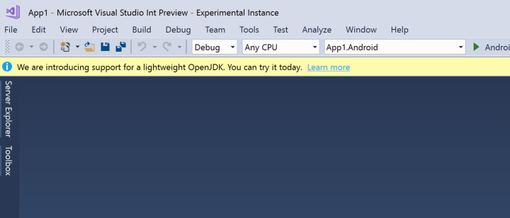
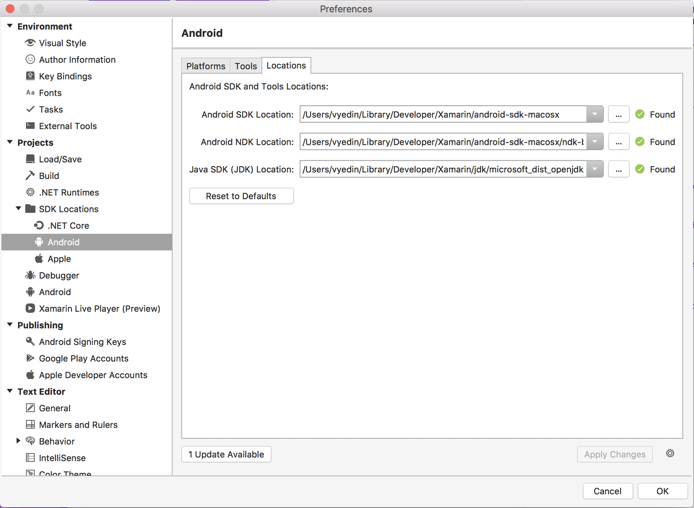

# Preview with Microsoft's OpenJDK Distribution

_This guide describes the steps for switching to the preview release of Microsoft's distribution of OpenJDK._

## Overview

Beginning with Visual Studio 15.9 and Visual Studio for Mac 7.7, we are moving from Oracle’s JDK to a lightweight version of the OpenJDK that is intended solely for Android development:

The benefits of this move are:

- You will always have an OpenJDK version that works for Android development

- Downloading JDK 9 or 10 won’t affect the development experience

- Significantly reduced download size and footprint

- No more issues with 3rd party servers and installers

If you’d like to move to the improved experience sooner, builds of our OpenJDK distribution are available for you to test on both Windows and Mac today. The setup is simple, and it is easy to revert back to the Oracle JDK at any time.

## Download

To get started, download the correct build for your system:

> [!IMPORTANT]
> TODO: set public links before publishing

- **Mac** &ndash; http://xamarin-jenkins/view/OpenJDK/job/openjdk-mac/20/Azure/processDownloadRequest/20/microsoft_dist_openjdk_1.8.0.7.zip
- **Windows x86** &ndash; http://xamarin-jenkins/view/OpenJDK/job/openjdk-win32/47/Azure/processDownloadRequest/47/microsoft_dist_openjdk_1.8.0.7.zip
- **Windows x64** &ndash; http://xamarin-jenkins/view/OpenJDK/job/openjdk-win64/21/Azure/processDownloadRequest/21/microsoft_dist_openjdk_1.8.0.7.zip

## Configure

Unzip to the correct location:

- **Mac** &ndash; **$HOME/Library/Developer/Xamarin/jdk/microsoft_dist_openjdk_1.8.0.8**
- **Windows** &ndash; **C:\\Program Files\\Android\\jdk\\microsoft_dist_openjdk_1.8.0.8**

> [!IMPORTANT]
> This example uses build 1.8.0.8; however, the version you download may be newer.

Point the IDE to the new JDK:

- **Mac** &ndash; Click **Tools > SDK Manager > Locations** and change the **Java SDK (JDK) location** to the full path of the OpenJDK installation. In the following example, this path is set to  **$HOME/Library/Developer/Xamarin/jdk/microsoft_dist_openjdk_1.8.0.8**.

- **Windows** &ndash; In `Tools > Options > Xamarin > Android Settings`, change the **Java Development Kit Location** to the full path of the OpenJDK installation. In the following example, this path is set to **C:\\Program Files\\Android\\jdk\\microsoft_dist_openjdk_1.8.0.8**:

## Revert

To revert to the Oracle JDK, change the Java SDK location to the previously-used Oracle JDK path and rebuild the solution. On Mac, this can be accomplished by clicking **Reset to Defaults**.

If you encounter any issues with this distribution of OpenJDK, please report issues by using the feedback tool in your IDE so we can track and address it quickly.

## Known Issues & Planned Fix Dates

the `JAVA_HOME` environment variable may not be correctly exported to the SDK and the Device manager. As a workaround, you can set this environment variable to the location of the OpenJDK on your computer. This is fixed in the 15.9 Previews.

## Summary

In this article, you learned how to configure your IDE to use the preview release of Microsoft's OpenJDK distribution, which is slated for stable release in the fall of 2018. 

