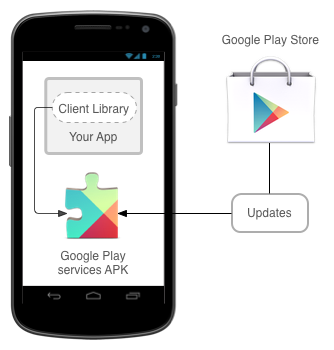
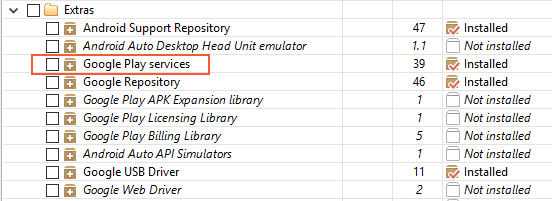
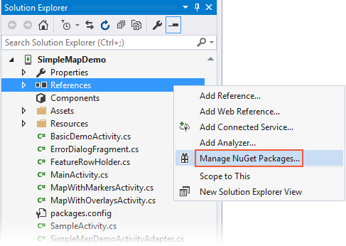
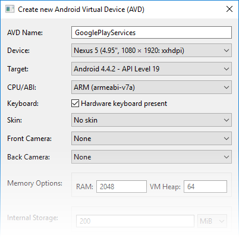
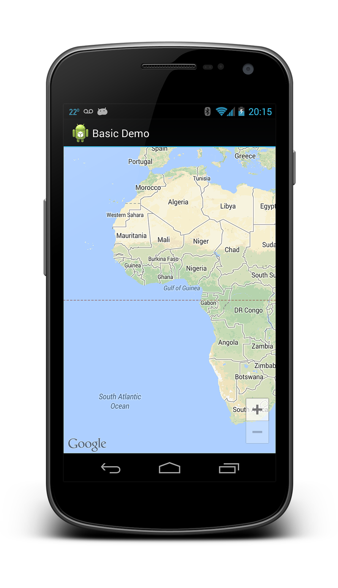
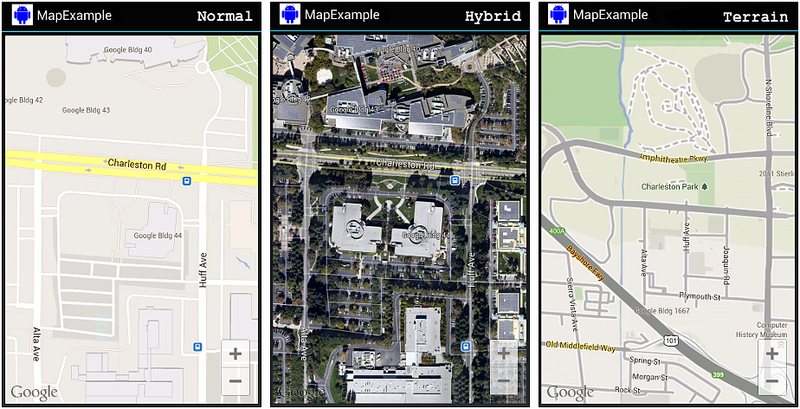
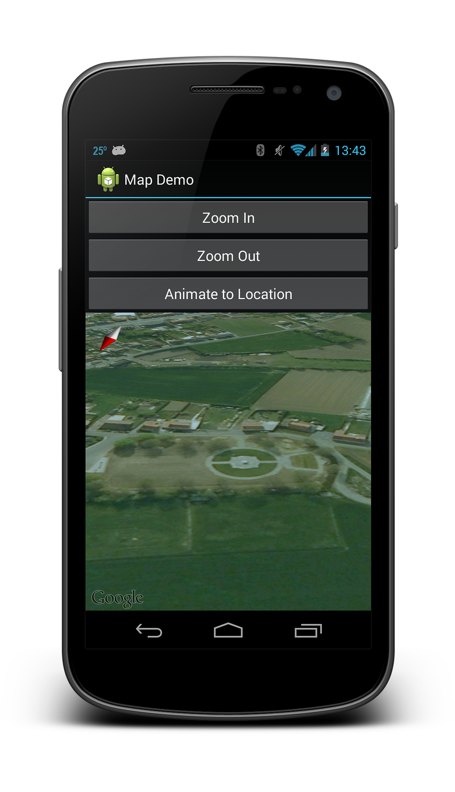
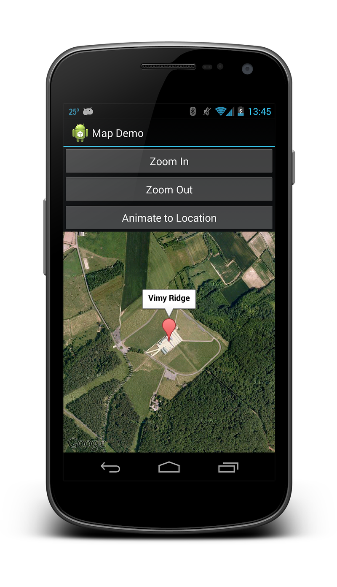
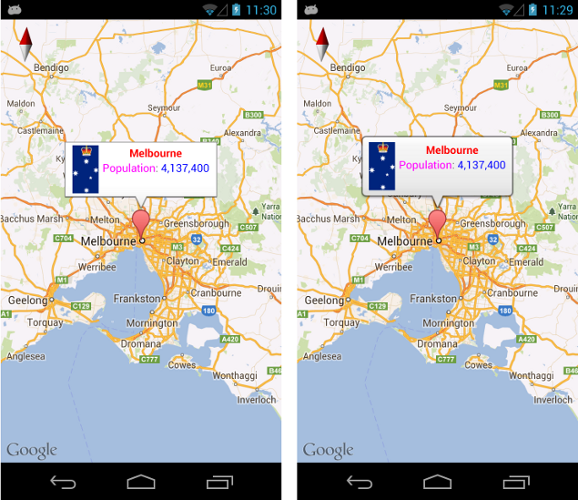
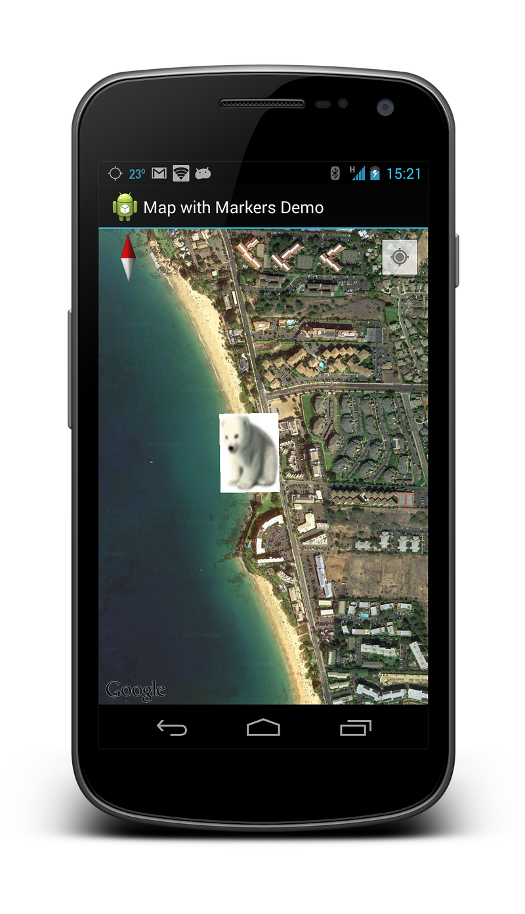

# Using the Google Maps API in your application

Using the Maps application is great, but sometimes you want to include
maps directly in your application. In addition to the built-in maps
application, Google also offers a
[native mapping API for Android](https://developers.google.com/maps/documentation/android/).
The Maps API is suitable for cases where you want to maintain more
control over the mapping experience. Things that are possible with the
Maps API include:

-  Programmatically changing the viewpoint of the map.
-  Adding and customizing markers.
-  Annotating a map with overlays.

Unlike the now-deprecated Google Maps Android API v1, Google Maps
Android API v2 is part of
[Google Play Services](http://developer.android.com/google/play-services/index.html).
Therefore, it is necessary to meet some mandatory prerequisites before
it is possible to use the Google Maps Android API in a Xamarin.Android
application.


## Google Maps API Prerequisites

Several items need to be configured before you can use the Maps API, including:

-  Install the Google Play Services SDK
-  Create an emulator with the Google APIs
-  Obtain a Maps API key
-  Specify the required permissions


### Install the Google Play Services SDK

Google Play Services is a technology from Google that allows Android
applications to take advantage of various Google features such as
Google+, In-App Billing, and Maps. These features are accessible on
Android devices as background services which are contained in the
[Google Play Services APK](https://play.google.com/store/apps/details?id=com.google.android.gms&hl=en).

Android applications interact with Google Play Services through the
Google Play Services client library. This library contains the
interfaces and classes for the individual services such as Maps. The
following diagram shows the relationship between an Android application
and Google Play Services:



The Android Maps API is provided as a part of Google Play Services.
Before a Xamarin.Android application can use the Maps API, the Google
Play Services SDK must be installed and bound. The Google Play Services
SDK is installed through the Android SDK Manager. The following
screenshot shows where in the Android SDK Manager the Google Play
services client can be found:



> [!NOTE]
> The Google Play services APK is a licensed product
> that may not be present on all devices. If it is not installed, then
> Google Maps will not work on the device.


#### Binding Google Play Services

Once the Google Play Services client library is installed, it must be
bound by a Xamarin.Android Java binding library. There are two ways to
accomplish this:

-  **Use the Google Play Services Maps NuGet package** - This is the
   simplest approach (available only in Xamarin.Android 4.8 or higher).
   Install the
   [Xamarin Google Play Services Maps NuGet](https://www.nuget.org/packages/Xamarin.GooglePlayServices.Maps);
   this will also install any Google Play Services dependency packages.
   The remainder of this guide focuses on this approach.

-  **Manually bind the Google Play Services client library** - This is
   a more complex approach and is the only way for Xamarin.Android 4.4
   or Xamarin.Android 4.6 to bind the Google Play Services SDK.
   Manually binding the Google Play Services client library is beyond
   the scope of this document, but an example of how to do so may be
   found in the
   [Maps and Location Demo v3 sample](https://github.com/xamarin/monodroid-samples/tree/master/MapsAndLocationDemo_v3)
   on Github.


#### Adding the Google Play Services Map Package

To add the Google Play Services Map package, right click the
**References** folder of your project in the Solution Explorer and
click **Manage NuGet Packages...**:



This opens the **NuGet Package Manager**. Click **Browse** and enter
**Xamarin Google Play Services Maps** in the search field. Select
**Xamarin.GooglePlayServices.Maps** and click **Install**. (If 
this package had been installed previously, click **Update**.):

[](maps-api-images/image03.png#lightbox)

Notice that the following dependency packages are also installed:

-   **Xamarin.GooglePlayServices.Base**
-   **Xamarin.GooglePlayServices.Basement**
-   **Xamarin.GooglePlayServices.Tasks**


### Create an Emulator with Google APIs

Although it is not recommended, it is possible to setup the emulator to
support the Android Maps API. The emulator must be configured to target
the Google API Level 17 (Android 4.2.2) or higher. In the following
screenshot, an emulator image is configured for API Level 19: 




### Obtain a Google Maps API Key

The final step is to get a Google Maps API key (note that you cannot
reuse an API key from legacy Google Maps v1). For information about
how to obtain and use the API key with Xamarin.Android, see 
[Obtaining A Google Maps API Key](~/android/platform/maps-and-location/maps/obtaining-a-google-maps-api-key.md).
 


### Specify the Required Permissions

The following permissions must be specified in the
**AndroidManifest.XML** for the Google Maps Android API:

-  **Access to the Network State** &ndash; The Maps API must be able to check
   if it can download the map tiles.

-  **Internet Access** &ndash; Internet access is necessary to download the
   map tiles and communicate with the Google Play Servers for API
   access.

-  **OpenGL ES v2** &ndash; The application must declare the requirement for
   OpenGL ES v2.

-  **Google Maps API Key** &ndash; The API key is used to confirm that the
   application is registered and authorized to use Google Play
   Services. See
   [Obtaining a Google Maps API Key](~/android/platform/maps-and-location/maps/obtaining-a-google-maps-api-key.md)
   for details about this key.

-  **Write to External Storage** &ndash; The Google Maps Android API will
   cache downloaded tiles to external storage.

-  **Access to the Google Web-based Services** &ndash; The application needs
   permissions to access Google's web services that back the Android
   Maps API.

-  **Permissions for Google Play Services Notifications** &ndash; The
   application must be granted permission to receive remote
   notifications from Google Play Services.

-  **Access to Location Providers** &ndash; These are optional permissions.
   They will allow the `GoogleMap` class to display the location of the
   device on the map.


The following snippet is an example of the settings that must be added
to **AndroidManifest.XML**:

```xml
<?xml version="1.0" encoding="utf-8"?>
<manifest xmlns:android="http://schemas.android.com/apk/res/android" android:versionName="4.5" package="com.xamarin.docs.android.mapsandlocationdemo2" android:versionCode="6">
    <uses-sdk android:minSdkVersion="14" android:targetSdkVersion="17" />

    <!-- Google Maps for Android v2 requires OpenGL ES v2 -->
    <uses-feature android:glEsVersion="0x00020000" android:required="true" />

    <!-- We need to be able to download map tiles and access Google Play Services-->
    <uses-permission android:name="android.permission.INTERNET" />

    <!-- Allow the application to access Google web-based services. -->
    <uses-permission android:name="com.google.android.providers.gsf.permission.READ_GSERVICES" />

    <!-- Google Maps for Android v2 will cache map tiles on external storage -->
    <uses-permission android:name="android.permission.WRITE_EXTERNAL_STORAGE" />

    <!-- Google Maps for Android v2 needs this permission so that it may check the connection state as it must download data -->
    <uses-permission android:name="android.permission.ACCESS_NETWORK_STATE" />

    <!-- Permission to receive remote notifications from Google Play Services -->
    <!-- Notice here that we have the package name of our application as a prefix on the permissions. -->
    <uses-permission android:name="<PACKAGE NAME>.permission.MAPS_RECEIVE" />
    <permission android:name="<PACKAGE NAME>.permission.MAPS_RECEIVE" android:protectionLevel="signature" />

    <!-- These are optional, but recommended. They will allow Maps to use the My Location provider. -->
    <uses-permission android:name="android.permission.ACCESS_COARSE_LOCATION" />
    <uses-permission android:name="android.permission.ACCESS_FINE_LOCATION" />


    <application android:label="@string/app_name">
        <!-- Put your Google Maps V2 API Key here. -->
        <meta-data android:name="com.google.android.maps.v2.API_KEY" android:value="YOUR_API_KEY" />
        <meta-data android:name="com.google.android.gms.version" android:value="@integer/google_play_services_version" />
    </application>
</manifest>
```


## The GoogleMap Class

Once the prerequisites are taken care of, it is time to start
developing the application and use Android Maps API. The
[GoogleMap](https://developers.google.com/maps/documentation/android/reference/com/google/android/gms/maps/GoogleMap)
class is the main API that a Xamarin.Android application will use to
display and interact with a Google Maps for Android. This class has the
following responsibilities:

-  Interacting with Google Play services to authorize the application
   with the Google web service.

-  Downloading, caching, and displaying the map tiles.

-  Displaying UI controls such as pan and zoom to the user.

-  Drawing markers and geometric shapes on maps.

The `GoogleMap` is added to an Activity in one of two ways:

-  **MapFragment** - The
   [MapFragment](http://developer.android.com/reference/com/google/android/gms/maps/MapFragment.html)
   is a specialized Fragment that acts as host for the `GoogleMap`
   object. The `MapFragment` requires Android API level 12 or higher.
   Older versions of Android can use the
   [SupportMapFragment](http://developer.android.com/reference/com/google/android/gms/maps/SupportMapFragment.html).

-  **MapView** - The
   [MapView](https://developer.xamarin.com/api/type/Android.GoogleMaps.MapView/)
   is a specialized View subclass which can act as a host for a
   `GoogleMap` object. Users of this class must forward all of the
   Activity lifecycle methods to the `MapView` class.

Each of these containers expose a `Map` property that returns an
instance of `GoogleMap`. Preference should be given to the
[MapFragment](http://developer.android.com/reference/com/google/android/gms/maps/MapFragment.html)
class as it is a simpler API that reduces the amount boilerplate code
that a developer must manually implement.


### Adding a MapFragment to an Activity

The following screenshot is an example of a very simple `MapFragment`:

[](maps-api-images/image05.png#lightbox)

Similar to other Fragment classes, there are two ways to add this
`MapFragment` to an Activity:

-   **Declaratively** - The `MapFragment` can be added via the XML
    layout file for the Activity. The following XML snippet shows an
    example of how to use the `fragment` element:

    ```xml
    <?xml version="1.0" encoding="utf-8"?>
    <fragment xmlns:android="http://schemas.android.com/apk/res/android"
              android:id="@+id/map"
              android:layout_width="match_parent"
              android:layout_height="match_parent"
              class="com.google.android.gms.maps.MapFragment" />
    ```

-   **Programatically** - The `MapFragment` can be added programmatically 
    as described next.

To programmatically add a `MapFragment`, your Activity must implement
the `IOnMapReadyCallback` interface. Because the initialization of a
`GoogleMap` object can take some time to complete as the API communicates
with Google Play, you must provide a callback that notifies your app
when the `GoogleMap` is ready.

First, add `IOnMapReadyCallback` to the `Activity` class declaration.
For example:

```csharp
public class MapWithMarkersActivity : Activity, IOnMapReadyCallback
```

Next, in the `OnCreate` method, add the `MapFragment` as shown in the
following code example (the `GoogleMapOptions` class is explained later
in this guide):

```csharp
_mapFragment = FragmentManager.FindFragmentByTag("map") as MapFragment;
if (_mapFragment == null)
{
    GoogleMapOptions mapOptions = new GoogleMapOptions()
        .InvokeMapType(GoogleMap.MapTypeSatellite)
        .InvokeZoomControlsEnabled(false)
        .InvokeCompassEnabled(true);

    FragmentTransaction fragTx = FragmentManager.BeginTransaction();
    _mapFragment = MapFragment.NewInstance(mapOptions);
    fragTx.Add(Resource.Id.map, _mapFragment, "map");
    fragTx.Commit();
}
_mapFragment.GetMapAsync(this);
```

A `GoogleMap` must be acquired using `GetMapAsync`, as shown at the end
of the preceding code example &ndash; this automatically initializes
the Maps system and the view. (Note that this method does not use
`await`/`async` semantics &ndash; the `Async` behavior is implemented by
Android.) When the `GoogleMap` object is ready, Android calls your
app's `OnMapReady` method (which you must implement as part of the
`IOnMapReadyCallback` interface). For example:

```csharp
public void OnMapReady (GoogleMap map)
{
    _map = map;
}
```

In the above code example, the `OnMapReady` callback initializes the
`_map` variable to the created `GoogleMap` object.

As an example of how to use this result, when `OnResume` is called, it
can check to see if `_map` is non-null. If `_map` is set to a
`GoogleMap` object, `OnResume` can call methods on it to add markers
and move its camera to a specified longitude and latitude. For a
complete code example, see
[SimpleMapDemo](https://github.com/xamarin/monodroid-samples/tree/master/MapsAndLocationDemo_v3/SimpleMapDemo).


### Map Types

There are five different types of maps available from the Google Maps
API:

-  **Normal** - This is the default map type. It shows roads and
   important natural features along with some man-made points of
   interest (such as buildings and bridges).

-  **Satellite** - This map shows satellite photography.

-  **Hybrid** - This map shows satellite photography and road maps.

-  **Terrain** - This primarily shows topographical features with some
   roads.

-  **None** - This map does not load any tiles, it is rendered as an
   empty grid.


The image below shows three of the different types of of maps, from
left-to-right (normal, hybrid, terrain):

[](maps-api-images/map-types.png#lightbox)

The `GoogleMap.MapType` property is used to set or change which type of
map is displayed. The following code snippet shows how to display a
satellite map.

```csharp
MapFragment mapFrag = (MapFragment) FragmentManager.FindFragmentById(Resource.Id.my_mapfragment_container);
mapFrag.GetMapAsync(this);
...
if (_map != null) {
    _map.MapType = GoogleMap.MapTypeSatellite;
}
```


### GoogleMap Properties

`GoogleMap` defines several properties that can control the functionality
and the appearance of the map. One way to configure the initial state
of a `GoogleMap` is to pass a
[GoogleMapOptions](http://developer.android.com/reference/com/google/android/gms/maps/GoogleMapOptions.html)
object when creating a `MapFragment`. The following code snippet is one
example of using a `GoogleMapOptions` object when creating a `MapFragment`:

```csharp
GoogleMapOptions mapOptions = new GoogleMapOptions()
    .InvokeMapType(GoogleMap.MapTypeSatellite)
    .InvokeZoomControlsEnabled(false)
    .InvokeCompassEnabled(true);

FragmentTransaction fragTx = FragmentManager.BeginTransaction();
_mapFragment = MapFragment.NewInstance(mapOptions);
fragTx.Add(Resource.Id.map, _mapFragment, "map");
fragTx.Commit();
```

The other way to configure a `GoogleMap` object is by setting values the
[UiSettings](http://developer.android.com/reference/com/google/android/gms/maps/UiSettings.html)
property of the map object. The next code sample shows how to configure a
`GoogleMap` to display the zoom controls and a compass:

```csharp
MapFragment mapFrag = (MapFragment) FragmentManager.FindFragmentById(Resource.Id.my_mapfragment_container);
mapFrag.GetMapAsync(this);
...
if (_map != null) {
    _map.UiSettings.ZoomControlsEnabled = true;
    _map.UiSettings.CompassEnabled = true;
}
```


## Interacting with the Map

The Android Maps API provides API's that allow an Activity to change
the viewpoint, add markers, place custom overlays, or draw geometric
shapes. This section will discuss how to accomplish some of these tasks
in Xamarin.Android.

### Changing the Viewpoint

Maps are modelled as a flat plane on the screen, based on the Mercator
projection. The map view is that of a *camera* looking straight down on
this plane. The position of the camera can be controlled by changing
the location, zoom, tilt, and bearing. The
[CameraUpdate](https://developers.google.com/maps/documentation/android/reference/com/google/android/gms/maps/CameraUpdate)
class is used to move the camera location. `CameraUpdate` objects are not
directly instantiated, instead the Maps API provides the
[CameraUpdateFactory](http://developer.android.com/reference/com/google/android/gms/maps/CameraUpdateFactory.html)
class.

Once a `CameraUpdate` object has been created, it is passed as a
parameter to either the
[GoogleMap.MoveCamera](https://developers.google.com/maps/documentation/android/reference/com/google/android/gms/maps/GoogleMap.html#moveCamera%28com.google.maps.CameraUpdate%29)
or
[GoogleMap.AnimateCamera](https://developers.google.com/maps/documentation/android/reference/com/google/android/gms/maps/GoogleMap.html#animateCamera%28com.google.maps.CameraUpdate%29)
methods. The `MoveCamera` method updates the map instantly while the
`AnimateCamera` method provides a smooth, animated transition.

This code snippet is a simple example of how to use the
`CameraUpdateFactory` to create a `CameraUpdate` that will increment
the zoom level of the map by one:

```csharp
MapFragment mapFrag = (MapFragment) FragmentManager.FindFragmentById(Resource.Id.my_mapfragment_container);
mapFrag.GetMapAsync(this);
...
if (_map != null) {
    _map.MoveCamera(CameraUpdateFactory.ZoomIn());
}
```

The Maps API provides a
[CameraPosition](http://developer.android.com/reference/com/google/android/gms/maps/model/CameraPosition.html)
which will aggregate all of the possible values for the camera
position. An instance of this class can be provided to the
[CameraUpdateFactory.NewCameraPosition](https://developers.google.com/maps/documentation/android/reference/com/google/android/gms/maps/CameraUpdateFactory#newCameraPosition%28com.google.android.gms.maps.model.CameraPosition%29)
method which will return a `CameraUpdate` object. The Maps API also
includes the
[CameraPosition.Builder](http://developer.android.com/reference/com/google/android/gms/maps/model/CameraPosition.Builder.html)
class that provides a fluent API for creating `CameraPosition` objects.
The following code snippet shows an example of creating a `CameraUpdate`
from a `CameraPosition` and using that to change the camera position on a
`GoogleMap`:

```csharp
LatLng location = new LatLng(50.897778, 3.013333);
CameraPosition.Builder builder = CameraPosition.InvokeBuilder();
builder.Target(location);
builder.Zoom(18);
builder.Bearing(155);
builder.Tilt(65);
CameraPosition cameraPosition = builder.Build();
CameraUpdate cameraUpdate = CameraUpdateFactory.NewCameraPosition(cameraPosition);

MapFragment mapFrag = (MapFragment) FragmentManager.FindFragmentById(Resource.Id.my_mapfragment_container);
mapFrag.GetMapAsync(this);
...
if (_map != null) {
    _map.MoveCamera(cameraUpdate);
}
```

In the previous code snippet, a specific location on the map is
represented by the a
[LatLng](https://developers.google.com/maps/documentation/android/reference/com/google/android/gms/maps/model/LatLng)
class. The zoom level is set to 18. The bearing is the compass
measurement clockwise from North. The Tilt property controls the
viewing angle and is specifies an angle of 25 degrees from the
vertical. The following screenshot shows the `GoogleMap` after executing
the preceding code:

[](maps-api-images/image06.png#lightbox)


### Drawing on the Map

The Android Maps API provides API's for drawing the following items on a map:

-  **Markers** - These are special icons that are used to identify a single location on a map.

-  **Overlays** - This is a image that can be used to identify a collection of locations or area on the map.

-  **Lines, Polygons, and Circles** - These are APIs that allow Activities to add shapes to a map.


#### Markers

The Maps API provides a
[Marker](https://developers.google.com/maps/documentation/android/reference/com/google/android/gms/maps/model/Marker)
class which encapsulates all of the data about a single location on a
map. By default they use a standard icon provided by Google Maps. It is
possible to customize the appearance of a marker and to respond to user
clicks.


##### Adding a Marker

To add a marker to a map, it is necessary create a new
[MarkerOptions](https://developers.google.com/android/reference/com/google/android/gms/maps/model/MarkerOptions) object and then call the
[AddMarker](http://developer.android.com/reference/com/google/android/gms/maps/GoogleMap.html#addMarker%28com.google.android.gms.maps.model.MarkerOptions%29)
method on a `GoogleMap` instance. This method will return a
[Marker](https://developers.google.com/maps/documentation/android/reference/com/google/android/gms/maps/model/Marker)
object.

```csharp
MapFragment mapFrag = (MapFragment) FragmentManager.FindFragmentById(Resource.Id.my_mapfragment_container);
mapFrag.GetMapAsync(this);
...
if (_map != null) {
    MarkerOptions markerOpt1 = new MarkerOptions();
    markerOpt1.SetPosition(new LatLng(50.379444, 2.773611));
    markerOpt1.SetTitle("Vimy Ridge");
    _map.AddMarker(markerOpt1);
}
```

The title of the marker will be displayed in an *info window* when the
user taps on the marker. The following screenshot shows what this
marker looks like:

[](maps-api-images/image07.png#lightbox)


##### Customizing A Marker

It is possible to customize the icon used by the marker by calling the
`MarkerOptions.InvokeIcon` method when adding the marker to the map.
This method takes a
[BitmapDescriptor](http://developer.android.com/reference/com/google/android/gms/maps/model/BitmapDescriptor.html)
object containing the data necessary to render the icon. The
[BitmapDescriptorFactory](https://developer.android.com/reference/com/google/android/gms/maps/model/BitmapDescriptorFactory.html)
class provides some helper methods to simplify the creation of a
`BitmapDescriptor`. The following list introduces some of these methods:

-   `DefaultMarker(float colour)` &ndash; Use the default Google Maps
    marker, but change the colour.

-   `FromAsset(string assetName)` &ndash; Use a custom icon from the
    specified file in the Assets folder.

-   `FromBitmap(Bitmap image)` &ndash; Use the specified bitmap as the
    icon.

-   `FromFile(string fileName)` &ndash; Create the custom icon from the
    file at the specified path.

-   `FromResource(int resourceId)` &ndash; Create a custom icon from
    the specified resource.

The following code snippet shows an example of creating a cyan coloured
default marker:

```csharp
mapFrag.GetMapAsync(this);
...
if (_map != null)
{
    MarkerOptions markerOpt1 = new MarkerOptions();
    markerOpt1.SetPosition(new LatLng(50.379444, 2.773611));
    markerOpt1.SetTitle("Vimy Ridge");
    markerOpt1.InvokeIcon(BitmapDescriptorFactory.DefaultMarker (BitmapDescriptorFactory.HueCyan));
    _map.AddMarker(markerOpt1);
}
```


#### Info Windows

*Info windows* are special windows that popup to display information to
the user when they tap a specific marker. By default the info window
will display the contents of the marker's title. If the title has not
been assigned, then no info window will appear. Only one info window
may be shown at a time.

It is possible to customize the info window by implementing the
[GoogleMap.IInfoWindowAdapter](https://developers.google.com/maps/documentation/android/reference/com/google/android/gms/maps/GoogleMap.InfoWindowAdapter)
interface. There are two important methods on this interface:

-  `public View GetInfoWindow(Marker marker)` &ndash; This method is called
   to get a custom info window for a marker. If it returns `null` ,
   then the default window rendering will be used. If this method
   returns a View, then that View will be placed inside the info window
   frame.

-  `public View GetInfoContents(Marker marker)` &ndash; This method will
   only be called if GetInfoWindow returns `null` . This method can
   return a `null` value if the default rendering of the info window
   contents is to be used. Otherwise, this method should return a View
   with the contents of the info window.

An info window is not a live view - instead Android will convert the
View to a static bitmap and display that on the image. This means that
an info window cannot respond to any touch events or gestures, nor will
it automatically update itself. To update an info window, it is
necessary to call the
[GoogleMap.ShowInfoWindow](http://developer.android.com/reference/com/google/android/gms/maps/model/Marker.html#showInfoWindow())
method.

The following image shows some examples of some customized info
windows. The image on the left has it's contents customized, while the
image on the right has it's window and contents customized:




#### Ground Overlays

Unlike markers, which identify a specific location on a map, a
[GroundOverlay](http://developer.android.com/reference/com/google/android/gms/maps/model/GroundOverlay.html)
is an image that used to identify a collection of locations or an area
on the map.


##### Adding a GroundOverlay

Adding a ground overlay to a map is very similar to adding a marker to
a map. First, a
[GroundOverlayOptions](http://developer.android.com/reference/com/google/android/gms/maps/model/GroundOverlayOptions.html)
object is created. This object is then passed as a parameter to the
`GoogleMap.AddGroundOverlay` method, which will return a
`GroundOverlay` object. This code snippet is an example of adding a
ground overlay to a map:

```csharp
BitmapDescriptor image = BitmapDescriptorFactory.FromResource(Resource.Drawable.polarbear);
GroundOverlayOptions groundOverlayOptions = new GroundOverlayOptions()
    .Position(position, 150, 200)
    .InvokeImage(image);
GroundOverlay myOverlay = _map.AddGroundOverlay(groundOverlayOptions);
```

The following screenshot shows this overlay on a map:

[](maps-api-images/image09.png#lightbox)


#### Lines, Circles, and Polygons

There are three simple types of geometric figures that can be added to a map:

-  **Polyline** - This is a series of connected line segments. It can
   mark a path on a map or form any shape required.

-  **Polygon** - This is an closed shape for marking areas on a map.

-  **Circle** - This will draw a circle on the map.


##### Polylines

A [Polyline](https://developers.google.com/maps/documentation/android/reference/com/google/android/gms/maps/model/Polyline)
is a list of consecutive `LatLng` objects which specify the vertices of
each line segment. A polyline is created by first creating a
`PolylineOptions` object and adding the points to it. The
`PolylineOption` object is then passed to a `GoogleMap` object by calling
the `AddPolyline` method.

```csharp
PolylineOption rectOptions = new PolylineOption();
rectOptions.Add(new LatLng(37.35, -122.0));
rectOptions.Add(new LatLng(37.45, -122.0));
rectOptions.Add(new LatLng(37.45, -122.2));
rectOptions.Add(new LatLng(37.35, -122.2));
rectOptions.Add(new LatLng(37.35, -122.0)); // close the polyline - this makes a rectangle.
myMap.AddPolyline(rectOptions);
```


##### Polygons

`Polygon`s are very similar to `Polyline`s, however they are not open
ended. `Polygon`s are a closed loop and have their interior filled in.
`Polygon`s are created in the exact same manner as a `Polyline`, except the
[GoogleMap.AddPolygon](http://developer.android.com/reference/com/google/android/gms/maps/GoogleMap.html#addPolygon(com.google.android.gms.maps.model.PolygonOptions))
method invoked.

Unlike a `Polyline`, a `Polygon` is self-closing. When `AddPolygon` is
called, the method will automatically close off the polygon by drawing
a line which connects the first and last points. The following code
snippet will create a solid rectangle over the same area as the
previous code snippet in the `Polyline` example.

```csharp
PolygonOptions rectOptions = new PolygonOptions();
rectOptions.Add(new LatLng(37.35, -122.0));
rectOptions.Add(new LatLng(37.45, -122.0));
rectOptions.Add(new LatLng(37.45, -122.2));
rectOptions.Add(new LatLng(37.35, -122.2));
// notice we don't need to close off the polygon
myMap.AddPolygon(rectOptions);
```


##### Circles

Circles are created by first instantiating a
[CircleOption](https://developers.google.com/maps/documentation/android/reference/com/google/android/gms/maps/model/CircleOptions)
object which will specify the center and the radius of the circle in
metres. The circle is drawn on the map by calling
[GoogleMap.AddCircle](https://developers.google.com/maps/documentation/android/reference/com/google/android/gms/maps/GoogleMap#addCircle(com.google.android.gms.maps.model.CircleOptions)).
The following code snippet shows how to draw a circle:

```csharp
CircleOptions circleOptions = new CircleOptions ();
circleOptions.InvokeCenter (new LatLng(37.4, -122.1));
circleOptions.InvokeRadius (1000);
_map.AddCircle (circleOptions);
```


## Responding To Events

There are three types of interactions a user may have with a map:

-  **Marker Click** - The user clicks on a marker.

-  **Marker Drag** - The user has long-clicked on a mparger

-  **Info Window Click** - The user has clicked on an info window.

Each of these events will be discussed in more detail below.


### Marker Click Events

When the user clicks on a marker the `MarkerClick` event will be
raised, and a `GoogleMap.MarkerClickEventArgs` passed in. This class
contains two properties:

-  `GoogleMap.MarkerClickEventArgs.Handled` &ndash; This property should be
   set to `true` to indicate that the event handler has consumed the
   event. If this is set to `false` then the default behaviour will
   occur in addition to the custom behaviour of the event handler.

-  `P0` &ndash; This poorly name parameter is a reference to the marker
   that raised the `MarkerClick` event.


This code snippet shows an example of a `MarkerClick` that will change
the camera position to a new location on the map:

```csharp
private void MapOnMarkerClick(object sender, GoogleMap.MarkerClickEventArgs markerClickEventArgs)
{
    markerClickEventArgs.Handled = true;
    Marker marker = markerClickEventArgs.P0;
    if (marker.Id.Equals(MyMarkerId)) // The ID of a specific marker the user clicked on.
    {
        _map.AnimateCamera(CameraUpdateFactory.NewLatLngZoom(new LatLng(20.72110, -156.44776), 13));
    }
    else
    {
        Toast.MakeText(this, String.Format("You clicked on Marker ID {0}", marker.Id), ToastLength.Short).Show();
    }
}
```


### Marker Drag Events

This event is raised when the user wishes to drag the marker. By
default, markers are not draggable. A marker can be set as draggable by
setting the `Marker.Draggable` property to `true` or by invoking the
`MarkerOptions.Draggable` method with `true` as a parameter.

To first drag the marker, the user must long-click on it and keep their
finger on the map. When they drag their finger around the screen, the
marker will move. When the user's finger lifts off the screen, the
marker will remain in place.

The following list describes the various events that will be raised
for a draggable marker:

-   `GoogleMap.MarkerDragStart(object sender, GoogleMap.MarkerDragStartEventArgs e)` &ndash; 
    This event is raised when the user first drags the marker.

-   `GoogleMap.MarkerDrag(object sender, GoogleMap.MarkerDragEventArgs e)` &ndash; 
    This event is raised as the marker is being dragged.

-   `GoogleMap.MarkerDragEnd(object sender, GoogleMap.MarkerDragEndEventArgs e)` &ndash; 
    This event is raised when the when the user is finished dragging the marker.

Each of the `EventArgs` contains a single property called `P0` that is a
reference to the `Marker` object being dragged.


### Info Window Click Events

Only one info window can be displayed at a time. When the user clicks
on an info window in a map, the map object will raise an
`InfoWindowClick` event. The following code snippet shows how to wire
up a handler to the event:

```csharp
private bool SetupMapIfNeeded()
{
    if (_map == null)
    {
        _map = _mapFragment.Map;
        if (_map != null)
        {
            _map.InfoWindowClick += MapOnInfoWindowClick;
            return true;
        }
        return false;
    }
    return true;
}

private void MapOnInfoWindowClick (object sender, GoogleMap.InfoWindowClickEventArgs e)
{
    Marker myMarker = e.P0;
    // Do something with marker.
}
```

Recall that an info window is a static `View` which is rendered as an
image on the map. Any widgets such as buttons, check boxes, or text
views that are placed inside the info window will be inert and cannot
respond to any of their integral user events.


## Related Links

- [Google Play Services](http://developer.android.com/google/play-services/index.html)
- [Google Maps Android API v2](https://developers.google.com/maps/documentation/android/)
- [Google Play Services APK](https://play.google.com/store/apps/details?id=com.google.android.gms&hl=en)
- [Obtaining a Google Maps API key](~/android/platform/maps-and-location/maps/obtaining-a-google-maps-api-key.md)
