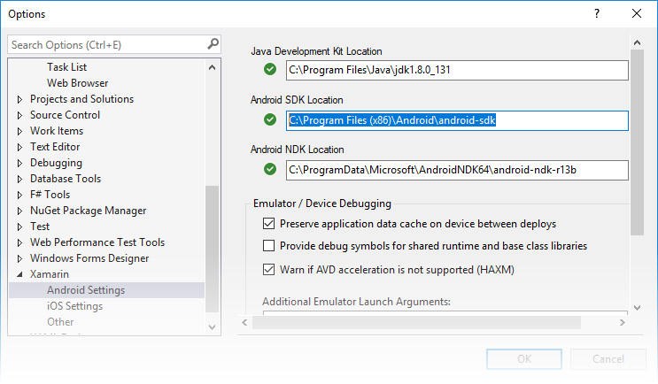
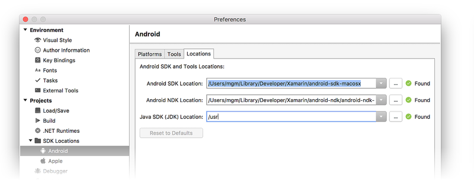

# Where can I set my Android SDK locations?

# [Visual Studio](#tab/vswin)

In Visual Studio, navigate to **Tools > Options > Xamarin > Android
Settings** to view and set the Android SDK location:

The default location for each path is as follows:

- Java Development Kit Location: 

    **C:\\Program Files\\Java\\jdk1.8.0_131**

- Android SDK Location: 

    **C:\\Program Files (x86)\\Android\\android-sdk**

- Android NDK Location: 

    **C:\\ProgramData\\Microsoft\\AndroidNDK64\\android-ndk-r13b**

Note that the version number of the NDK may vary. For example, instead
of **android-ndk-r13b**, it could be an earlier version such as
**android-ndk-r10e**.

To set the Android SDK location, enter the full path of the Android SDK
directory into the **Android SDK Location** box. You can navigate to
the Android SDK location in File Explorer, copy the path from the
address bar, and paste this path into the **Android SDK Location** box.
For example, if your Android SDK location is at
**C:\\Users\\username\\AppData\\Local\\Android\\Sdk**, clear the old
path in the **Android SDK Location** box, paste in this path, and click
**OK**.

# [Visual Studio for Mac](#tab/vsmac)

In Visual Studio for Mac, navigate to **Preferences > Projects > SDK
Locations > Android**. In the **Android** page, click the **Locations**
tab to view and set the SDK location:

The default location for each path is as follows:

- Android SDK Location: 

    **~/Library/Developer/Xamarin/android-sdk-macosx**

- Android NDK Location: 

    **~/Library/Developer/Xamarin/android-ndk/android-ndk-r14b**

- Java SDK (JDK) Location: 

    **/usr**

Note that the version number of the NDK may vary. For example, instead
of **android-ndk-r14b**, it could be an earlier version such as
**android-ndk-r10e**.

To set the Android SDK location, enter the full path of the Android
SDK directory into the **Android SDK Location** box. You can select the
Android SDK folder in the Finder, press **CTRL+&#8984;+I** to view
folder info, click and drag the path to the right of **Where:**, copy,
then paste it to the **Android SDK Location** box in the
**Locations** tab. For example, if your Android SDK location is at
**~/Library/Developer/Android/Sdk**, clear the old path in
the **Android SDK Location** box, paste in this path, and click **OK**.

-----
