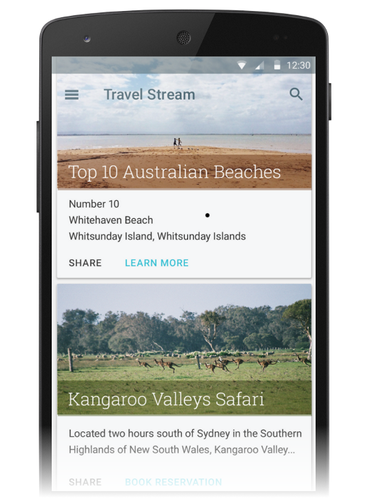
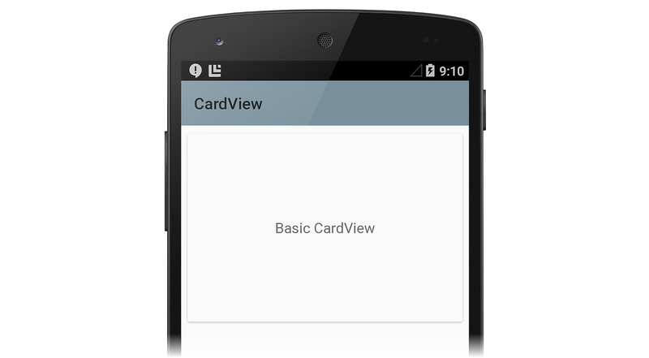
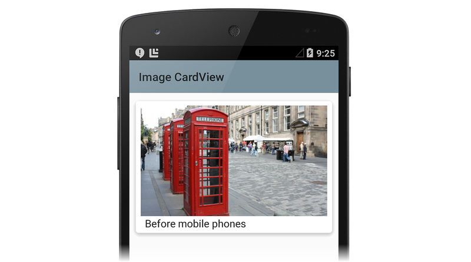
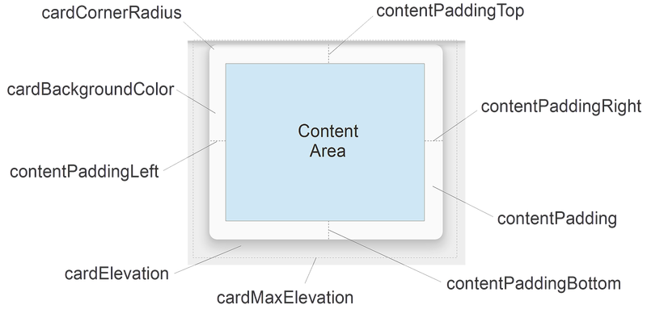
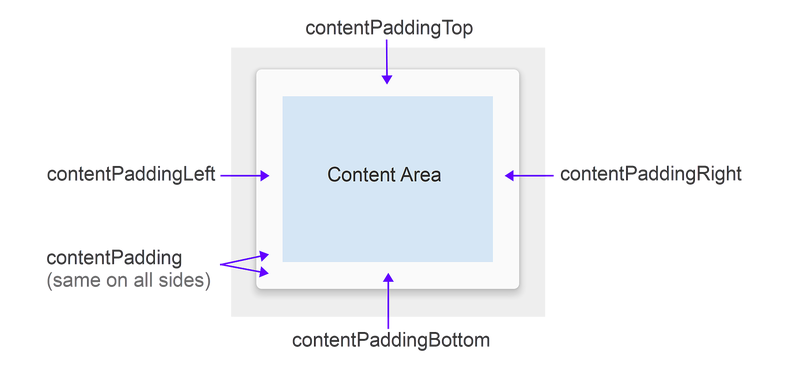
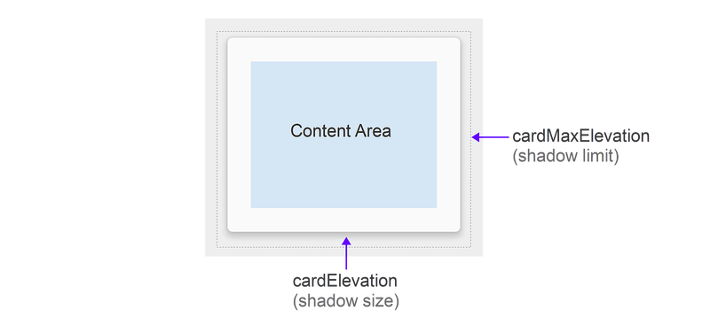
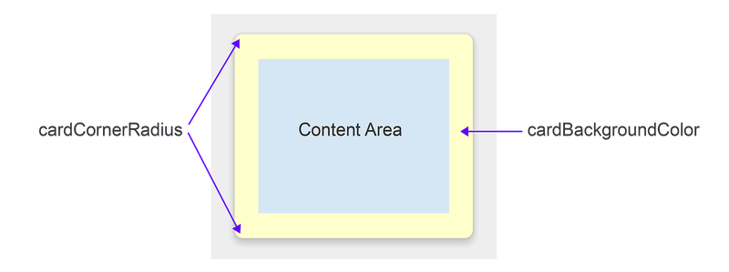

# CardView

_The Cardview widget is a UI component that presents text and image content in views that resemble cards. This guide explains how to use and customize CardView in Xamarin.Android applications while maintaining backward compatibility with earlier versions of Android._


## Overview

The `Cardview` widget, introduced in Android 5.0 (Lollipop), is a UI
component that presents text and image content in views that resemble
cards. `CardView` is implemented as a `FrameLayout` widget with rounded
corners and a shadow. Typically, a `CardView` is used to present a
single row item in a `ListView` or `GridView` view group. For example,
the following screen shot is an example of a travel reservation app
that implements `CardView`-based travel destination cards in a
scrollable `ListView`:



This guide explains how to add the `CardView` package to your
Xamarin.Android project, how to add `CardView` to your layout, and how
to customize the appearance of `CardView` in your app. In addition,
this guide provides a detailed list of `CardView` attributes that you
can change, including attributes to help you use `CardView` on versions
of Android earlier than Android 5.0 Lollipop.

<a name="requirements" />

## Requirements

The following is required to use new Android 5.0 and later features
(including `CardView`) in Xamarin-based apps:

-  **Xamarin.Android** &ndash; Xamarin.Android 4.20 or later must be
   installed and configured with either Visual Studio or Visual Studio for Mac.

-  **Android SDK** &ndash; Android 5.0 (API 21) or later must be
   installed via the Android SDK Manager.

-  **Java JDK 1.8** &ndash; JDK 1.7 can be used if you are specifically
    targetting API level 23 and earlier. JDK 1.8 is available from
   [Oracle](https://www.oracle.com/technetwork/java/javase/downloads/jdk8-downloads-2133151.html).

Your app must also include the `Xamarin.Android.Support.v7.CardView`
package. To add the `Xamarin.Android.Support.v7.CardView` package in
Visual Studio for Mac:

1. Open your project, right-click **Packages** and select **Add
   Packages**.

2. In the **Add Packages** dialog, search for **CardView**.

3. Select **Xamarin Support Library v7 CardView**, then click **Add
   Package**.

To add the `Xamarin.Android.Support.v7.CardView` package in Visual
Studio:

1. Open your project, right-click the **References** node (in the
   **Solution Explorer** pane) and select **Manage NuGet Packages...**.

2. When the **Manage NuGet Packages** dialog is displayed, enter
   **CardView** in the search box.

3. When **Xamarin Support Library v7 CardView** appears, click
   **Install**.

To learn how to configure an Android 5.0 app project,
see [Setting Up an Android 5.0 Project](~/android/platform/lollipop.md).
For more information about installing NuGet packages, see
[Walkthrough: Including a NuGet in your project](https://docs.microsoft.com/visualstudio/mac/nuget-walkthrough).


## Introducing CardView

The default `CardView` resembles a white card with minimally rounded
corners and a slight shadow. The following example **Main.axml** layout
displays a single `CardView` widget that contains a `TextView`:

```xml
<?xml version="1.0" encoding="utf-8"?>
<LinearLayout xmlns:android="http://schemas.android.com/apk/res/android"
    android:orientation="vertical"
    android:layout_width="fill_parent"
    android:layout_height="fill_parent"
    android:gravity="center_horizontal"
    android:padding="5dp">
    <android.support.v7.widget.CardView
        android:layout_width="fill_parent"
        android:layout_height="245dp"
        android:layout_gravity="center_horizontal">
        <TextView
            android:text="Basic CardView"
            android:layout_marginTop="0dp"
            android:layout_width="match_parent"
            android:layout_height="match_parent"
            android:gravity="center"
            android:layout_centerVertical="true"
            android:layout_alignParentRight="true"
            android:layout_alignParentEnd="true" />
    </android.support.v7.widget.CardView>
</LinearLayout>
```

If you use this XML to replace the existing contents of **Main.axml**,
be sure to comment out any code in **MainActivity.cs** that refers to
resources in the previous XML.

This layout example creates a default `CardView` with a single line of
text as shown in the following screen shot:

[](card-view-images/02-basic-cardview.png#lightbox)

In this example, the app style is set to the light Material Theme
(`Theme.Material.Light`) so that the `CardView` shadows and edges are
easier to see. For more information about theming Android 5.0 apps, see
[Material Theme](~/android/user-interface/material-theme.md). In
the next section, we'll learn how to customize `CardView` for an
application.


## Customizing CardView

You can modify the basic `CardView` attributes to customize the
appearance of the `CardView` in your app. For example, the elevation of
the `CardView` can be increased to cast a larger shadow (which makes
the card seem to float higher above the background). Also, the corner
radius can be increased to make the corners of the card more rounded.

In the next layout example, a customized `CardView` is used to create a
simulation of a print photograph (a "snapshot"). An `ImageView` is
added to the `CardView` for displaying the image, and a `TextView` is
positioned below the `ImageView` for displaying the title of the image.
In this example layout, the `CardView` has the following
customizations:

-  The `cardElevation` is increased to 4dp to cast a larger shadow.
-  The `cardCornerRadius` is increased to 5dp to make the
   corners appear more rounded.

Because `CardView` is provided by the Android v7 support library, its
attributes are not available from the `android:` namespace. Therefore,
you must define your own XML namespace and use that namespace as the
`CardView` attribute prefix. In the layout example below, we will use
this line to define a namespace called `cardview`:

```xml
    xmlns:cardview="http://schemas.android.com/apk/res-auto"
```

You can call this namespace `card_view` or even `myapp` if you
choose (it's accessible only within the scope of this file). Whatever
you choose to call this namespace, you must use it to prefix the
`CardView` attribute that you want to modify. In this layout example,
the `cardview` namespace is the prefix for `cardElevation` and
`cardCornerRadius`:

```xml
<?xml version="1.0" encoding="utf-8"?>
<LinearLayout xmlns:android="http://schemas.android.com/apk/res/android"
    xmlns:cardview="http://schemas.android.com/apk/res-auto"
    android:orientation="vertical"
    android:layout_width="fill_parent"
    android:layout_height="fill_parent"
    android:gravity="center_horizontal"
    android:padding="5dp">
    <android.support.v7.widget.CardView
        android:layout_width="fill_parent"
        android:layout_height="245dp"
        android:layout_gravity="center_horizontal"
        cardview:cardElevation="4dp"
        cardview:cardCornerRadius="5dp">
        <LinearLayout
            android:layout_width="fill_parent"
            android:layout_height="240dp"
            android:orientation="vertical"
            android:padding="8dp">
            <ImageView
                android:layout_width="fill_parent"
                android:layout_height="190dp"
                android:id="@+id/imageView"
                android:scaleType="centerCrop" />
            <TextView
                android:layout_width="fill_parent"
                android:layout_height="wrap_content"
                android:textAppearance="?android:attr/textAppearanceMedium"
                android:textColor="#333333"
                android:text="Photo Title"
                android:id="@+id/textView"
                android:layout_gravity="center_horizontal"
                android:layout_marginLeft="5dp" />
        </LinearLayout>
    </android.support.v7.widget.CardView>
</LinearLayout>
```

When this layout example is used to display an image in a photo viewing
app, the `CardView` has the appearance of a photo snapshot, as depicted
in the following screenshot:

[](card-view-images/03-photo-cardview.png#lightbox)

This screenshot is taken from the
[RecyclerViewer](https://developer.xamarin.com/samples/monodroid/android5.0/RecyclerViewer)
sample app, which uses a `RecyclerView` widget to present a scrolling
list of `CardView` images for viewing photos. For more information
about `RecyclerView`, see the
[RecyclerView](~/android/user-interface/layouts/recycler-view/index.md)
guide.

Notice that a `CardView` can display more than one child view in its
content area. For example, in the above photo viewing app example,
the content area is comprised of a `ListView` that contains an
`ImageView` and a `TextView`. Although `CardView` instances are often
arranged vertically, you can also arrange them horizontally (see
[Creating a Custom View Style](~/android/user-interface/material-theme.md#customview)
for an example screenshot).


### CardView Layout Options

`CardView` layouts can be customized by setting one or more attributes
that affect its padding, elevation, corner radius, and background color:

[](card-view-images/04-attributes.png#lightbox)

Each attribute can also be changed dynamically by calling a
counterpart `CardView` method (for more information on `CardView`
methods, see the
[CardView class reference](https://developer.android.com/reference/android/support/v7/widget/CardView.html)).
Note that these attributes (except for background
color) accept a dimension value, which is a decimal number followed by
the unit. For example, `11.5dp` specifies 11.5 density-independent
pixels.


#### Padding
`
CardView` offers five padding attributes to position content within the
card. You can set them in your layout XML or you can call
analogous methods in your code:

[](card-view-images/05-padding.png#lightbox)

The padding attributes are explained as follows:

-  `contentPadding` &ndash; Inner padding between the child views of
    the `CardView` and all edges of the card.

-  `contentPaddingBottom` &ndash; Inner padding between the child views of
    the `CardView` and the bottom edge of the card.

-  `contentPaddingLeft` &ndash; Inner padding between the child views of
    the `CardView` and the left edge of the card.

-  `contentPaddingRight` &ndash; Inner padding between the child views of
    the `CardView` and the right edge of the card.

-  `contentPaddingTop` &ndash; Inner padding between the child views of
    the `CardView` and the top edge of the card.

Content padding attributes are relative to the boundary of the content
area rather than to any given widget located within the content area.
For example, if `contentPadding` were sufficiently increased in the photo
viewing app, the `CardView` would crop both the image and the text shown
on the card.


#### Elevation

`CardView` offers two elevation attributes to control its elevation and,
as a result, the size of its shadow:

[](card-view-images/06-elevation.png#lightbox)

The elevation attributes are explained as follows:

-  `cardElevation` &ndash; The elevation of the `CardView` (represents its Z axis).

-  `cardMaxElevation` &ndash; The maximum value of the `CardView`'s elevation.

Larger values of `cardElevation` increase the shadow size to make
`CardView` seem to float higher above the background. The
`cardElevation` attribute also determines the drawing order of
overlapping views; that is, the `CardView` will be drawn under
another overlapping view with a higher elevation setting and above
any overlapping views with a lower elevation setting.
The `cardMaxElevation` setting is useful for when your app changes
elevation dynamically &ndash; it prevents the shadow from extending
past the limit that you define with this setting.


#### Corner Radius and Background Color

`CardView` offers attributes that you can use to control its
corner radius and its background color. These two properties allow
you change the overall style of the `CardView`:

[](card-view-images/07-radius-bgcolor.png#lightbox)

These attributes are explained as follows:

-  `cardCornerRadius` &ndash; The corner radius of all corners of the `CardView`.

-  `cardBackgroundColor` &ndash; The background color of the `CardView`.

In this diagram, `cardCornerRadius` is set to a more rounded 10dp and
`cardBackgroundColor` is set to `"#FFFFCC"` (light yellow).


## Compatibility

You can use `CardView` on versions of Android earlier than Android 5.0
Lollipop. Because `CardView` is part of the Android v7 support library,
you can use `CardView` with Android 2.1 (API level 7) and higher.
However, you must install the `Xamarin.Android.Support.v7.CardView` package 
as described in [Requirements](#requirements), above.

`CardView` exhibits slightly different behavior on devices before
Lollipop (API level 21):

-  `CardView` uses a programmatic shadow implementation that adds
   additional padding.

-  `CardView` does not clip child views that intersect with the
   `CardView`'s rounded corners.

To help in managing these compatibility differences, `CardView`
provides several additional attributes that you can configure in your
layout:

-   `cardPreventCornerOverlap` &ndash; Set this attribute to `true` to
    add padding when your app is running on earlier Android versions (API
    level 20 and earlier). This setting prevents `CardView` content from
    intersecting with the `CardView`'s rounded corners.

-   `cardUseCompatPadding` &ndash; Set this attribute to `true` to add
    padding when your app is running in versions of Android at or
    greater than API level 21. If you want to use `CardView` on
    pre-Lollipop devices and have it look the same on Lollipop (or
    later), set this attribute to `true`. When this attribute is
    enabled, `CardView` adds additional padding to draw shadows when it
    runs on pre-Lollipop devices. This helps to overcome the
    differences in padding that are introduced when pre-Lollipop
    programmatic shadow implementations are in effect.

For more information about maintaining compatibility with earlier versions of Android, see
[Maintaining Compatibility](https://developer.android.com/training/material/compatibility.html).


## Summary

This guide introduced the new `CardView` widget included in Android
5.0 (Lollipop). It demonstrated the default `CardView` appearance and
explained how to customize `CardView` by changing its elevation,
corner roundness, content padding, and background color. It listed the
`CardView` layout attributes (with reference diagrams), and explained
how to use `CardView` on Android devices earlier than Android 5.0
Lollipop. For more information about `CardView`, see the
[CardView class reference](https://developer.android.com/reference/android/support/v7/widget/CardView.html).


## Related Links

- [RecyclerView (sample)](https://developer.xamarin.com/samples/monodroid/android5.0/RecyclerViewer)
- [Introduction to Lollipop](~/android/platform/lollipop.md)
- [CardView class reference](https://developer.android.com/reference/android/support/v7/widget/CardView.html)
