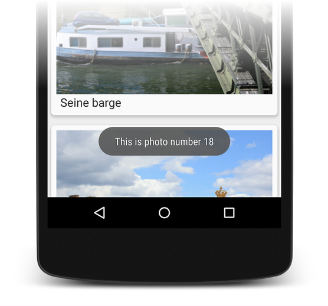
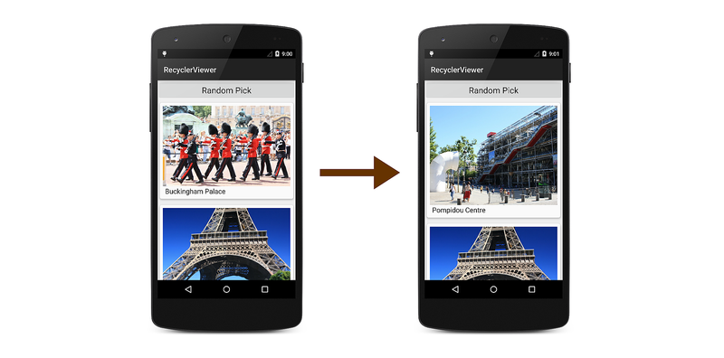

# Extending the RecyclerView Example


The basic app described in
[A Basic RecyclerView Example](~/android/user-interface/layouts/recycler-view/recyclerview-example.md)
actually doesn't do much &ndash; it simply scrolls and displays a fixed
list of photograph items to facilitate browsing. In real-world
applications, users expect to be able to interact with the app by
tapping items in the display. Also, the underlying data source can
change (or be changed by the app), and the contents of the display
must remain consistent with these changes. In the following sections,
you'll learn how to handle item-click events and update `RecyclerView`
when the underlying data source changes.


### Handling Item-Click Events

When a user touches an item in the `RecyclerView`, an item-click
event is generated to notify the app as to which item was touched. This
event is not generated by `RecyclerView` &ndash; instead, the item
view (which is wrapped in the view holder) detects touches and reports
these touches as click events.

To illustrate how to handle item-click events, the following steps
explain how the basic photo-viewing app is modified to report which
photograph had been touched by the user. When an item-click event
occurs in the sample app, the following sequence takes place:

1.  The photograph's `CardView` detects the item-click event and
    notifies the adapter.

2.  The adapter forwards the event (with item position information)
    to the activity's item-click handler.

3.  The activity's item-click handler responds to the item-click event.

First, an event handler member called `ItemClick` is added to the 
`PhotoAlbumAdapter` class definition:

```csharp
public event EventHandler<int> ItemClick;
```

Next, an item-click event handler method is added to `MainActivity`.
This handler briefly displays a toast that indicates which photograph
item was touched:

```csharp
void OnItemClick (object sender, int position)
{
    int photoNum = position + 1;
    Toast.MakeText(this, "This is photo number " + photoNum, ToastLength.Short).Show();
}

```

Next, a line of code is needed to register the `OnItemClick` handler
with `PhotoAlbumAdapter`. A good place to do this is immediately after
`PhotoAlbumAdapter` is created (in the main activity's `OnCreate` method):

```csharp
mAdapter = new PhotoAlbumAdapter (mPhotoAlbum);
mAdapter.ItemClick += OnItemClick;

```

`PhotoAlbumAdapter` will now call `OnItemClick` when it receives an item-click
event. The next step is to create a handler in the adapter that raises this
`ItemClick` event. The following method, `OnClick`, is added
immediately after the adapter's `ItemCount` method:

```csharp
void OnClick (int position)
{
    if (ItemClick != null)
        ItemClick (this, position);
}
```

This `OnClick` method is the adapter's *listener* for item-click events
from item views. Before this listener can be registered with an item
view (via the item view's view holder), the `PhotoViewHolder`
constructor must be modified to accept this method as an additional
argument, and register `OnClick` with the item view `Click` event.
Here's the modified `PhotoViewHolder` constructor:

```csharp
public PhotoViewHolder (View itemView, Action<int> listener)
    : base (itemView)
{
    Image = itemView.FindViewById<ImageView> (Resource.Id.imageView);
    Caption = itemView.FindViewById<TextView> (Resource.Id.textView);

    itemView.Click += (sender, e) => listener (base.LayoutPosition);
}

```

The `itemView` parameter contains a reference to the `CardView` that
was touched by the user. Note that the view holder base class knows the
layout position of the item (`CardView`) that it represents (via the
`LayoutPosition` property), and this position is passed to the
adapter's `OnClick` method when an item-click event takes place. The
adapter's `OnCreateViewHolder` method is modified to pass the adapter's
`OnClick` method to the view-holder's constructor:

```csharp
PhotoViewHolder vh = new PhotoViewHolder (itemView, OnClick);
```

Now when you build and run the sample photo-viewing app, tapping a photo
in the display will cause a toast to appear that reports which
photograph was touched:

[ ](extending-the-example-images/01-photo-selected.png)

This example demonstrates just one approach for implementing event
handlers with `RecyclerView`. Another approach that could be used
here is to place events on the view holder and have the adapter
subscribe to these events. If the sample photo app provided a photo
editing capability, separate events would be required for the
`ImageView` and the `TextView` within each `CardView`: touches on the
`TextView` would launch an `EditView` dialog that lets the user edit
the caption, and touches on the `ImageView` would launch a photo
touchup tool that lets the user crop or rotate the photo. Depending on
the needs of your app, you must design the best approach for handling
and responding to touch events.

To demonstrate how `RecyclerView` can be updated when the data set
changes, the sample photo-viewing app can be modified to randomly pick
a photo in the data source and swap it with the first photo. First,
a **Random Pick** button is added to the example photo app's
**Main.axml** layout:

```xml
<?xml version="1.0" encoding="utf-8"?>
<LinearLayout xmlns:android="http://schemas.android.com/apk/res/android"
    android:orientation="vertical"
    android:layout_width="fill_parent"
    android:layout_height="fill_parent">
    <Button
        android:id="@+id/randPickButton"
        android:layout_width="fill_parent"
        android:layout_height="wrap_content"
        android:gravity="center_horizontal"
        android:textAppearance="?android:attr/textAppearanceLarge"
        android:text="Random Pick" />
    <android.support.v7.widget.RecyclerView
        android:id="@+id/recyclerView"
        android:scrollbars="vertical"
        android:layout_width="fill_parent"
        android:layout_height="fill_parent" />
</LinearLayout>
```

Next, code is added at the end of the main activity's `OnCreate`
method to locate the `Random Pick` button in the layout and attach a
handler to it:

```csharp
Button randomPickBtn = FindViewById<Button>(Resource.Id.randPickButton);

randomPickBtn.Click += delegate
{
    if (mPhotoAlbum != null)
    {
        // Randomly swap a photo with the first photo:
        int idx = mPhotoAlbum.RandomSwap();
    }
};

```

This handler calls the photo album's `RandomSwap` method when the
**Random Pick** button is tapped. The `RandomSwap` method randomly
swaps a photo with the first photo in the data source, then returns the
index of the randomly-swapped photo. When you compile and run the sample
app with this code, tapping the **Random Pick** button does not result
in a display change because the `RecyclerView` is not aware of the
change to the data source.

To keep `RecyclerView` updated after the data source changes, 
the **Random Pick** click handler must be modified to
call the adapter's `NotifyItemChanged` method for each item in the
collection that has changed (in this case, two items have changed: the
first photo and the swapped photo). This causes `RecyclerView` to
update its display so that it is consistent with the new state of the
data source:

```csharp
Button randomPickBtn = FindViewById<Button>(Resource.Id.randPickButton);

randomPickBtn.Click += delegate
{
    if (mPhotoAlbum != null)
    {
        int idx = mPhotoAlbum.RandomSwap();

        // First photo has changed:
        mAdapter.NotifyItemChanged(0);

        // Swapped photo has changed:
        mAdapter.NotifyItemChanged(idx);
    }
};

```

Now, when the **Random Pick** button is tapped, `RecyclerView` updates
the display to show that a photo further down in the collection has
been swapped with the first photo in the collection:

[ ](extending-the-example-images/02-random-pick.png)

Of course, `NotifyDataSetChanged` could have been called instead of
making the two calls to `NotifyItemChanged`, but doing so would force
`RecyclerView` to refresh the entire collection even though only two
items in the collection had changed. Calling `NotifyItemChanged` is
significantly more efficient than calling `NotifyDataSetChanged`.


## Related Links

- [RecyclerViewer (sample)](https://developer.xamarin.com/samples/monodroid/android5.0/RecyclerViewer)
- [RecyclerView](~/android/user-interface/layouts/recycler-view/index.md)
- [RecyclerView Parts and Functionality](~/android/user-interface/layouts/recycler-view/parts-and-functionality.md)
- [A Basic RecyclerView Example](~/android/user-interface/layouts/recycler-view/recyclerview-example.md)
- [RecyclerView](https://developer.android.com/reference/android/support/v7/widget/RecyclerView.html)
