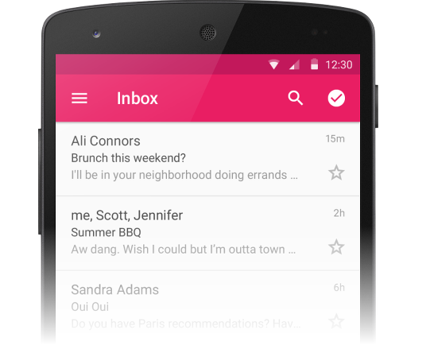

# RecyclerView

_RecyclerView is a view group for displaying collections; it is designed to be a more flexible replacement for older view groups such as ListView and GridView.  This guide explains how to use and customize RecyclerView in Xamarin.Android applications._

## RecyclerView

Many apps need to display collections of the same type (such as
messages, contacts, images, or songs); often, this collection is too
large to fit on the screen, so the collection is presented in a small
window that can smoothly scroll through all items in the collection.
`RecyclerView` is an Android widget that displays a collection of
items in a list or a grid, enabling the user to scroll through the
collection. The following is a screenshot of an example app that uses
`RecyclerView` to display email inbox contents in a vertical
scrolling list:

`RecyclerView` offers two compelling features:

-  It has a flexible architecture that lets you modify its behavior
   by plugging in your preferred components.

-  It is efficient with large collections because it reuses item views
   and requires the use of *view holders* to cache view references.

This guide explains how to use `RecyclerView` in Xamarin.Android
applications; it explains how to add the `RecyclerView` package to
your Xamarin.Android project, and it describes how `RecyclerView`
functions in a typical application. Real code examples are provided to
show you how to integrate `RecyclerView` into your application, how
to implement item-view click, and how to refresh `RecyclerView` when
its underlying data changes. This guide assumes that you are familiar
with Xamarin.Android development.

### Requirements

Although `RecyclerView` is often associated with Android 5.0
Lollipop, it is offered as a support library &ndash; `RecyclerView`
works with apps that target API level 7 (Android 2.1) and later. The
following is required to use `RecyclerView` in Xamarin-based
applications:

-  **Xamarin.Android** &ndash; Xamarin.Android 4.20 or later must be
   installed and configured with either Visual Studio or Visual Studio for Mac.

-  Your app project must include the **Xamarin.Android.Support.v7.RecyclerView**
   package. For more information about installing NuGet packages, see
   [Walkthrough: Including a NuGet in your project](https://docs.microsoft.com/visualstudio/mac/nuget-walkthrough).

### Overview

`RecyclerView` can be thought of as a replacement for the
`ListView` and `GridView` widgets in Android. Like its
predecessors, `RecyclerView` is designed to display a large data set
in a small window, but `RecyclerView` offers more layout options and
is better optimized for displaying large collections. If you are
familiar with `ListView`, there are several important differences
between `ListView` and `RecyclerView`:

-   `RecyclerView` is slightly more complex to use: you have to write
    more code to use `RecyclerView` compared to `ListView`.

-   `RecyclerView` does not provide a predefined adapter; you must
    implement the adapter code that accesses your data source. However,
    Android includes several predefined adapters that work with
    `ListView` and `GridView`.

-   `RecyclerView` does not offer an item-click event when a user
    taps an item; instead, item-click events are handled by helper
    classes. By contrast, `ListView` offers an item-click event.

-   `RecyclerView` enhances performance by recycling views and by
    enforcing the view-holder pattern, which eliminates unnecessary
    layout resource lookups. Use of the view-holder pattern is optional
    in `ListView`.

-   `RecyclerView` is based on a modular design that makes it
    easier to customize. For example, you can plug in a different
    layout policy without significant code changes to your app.
    By contrast, `ListView` is relatively monolithic in structure.

-   `RecyclerView` includes built-in animations for item add and
    remove. `ListView` animations require some additional effort
    on the part of the app developer.

### Sections

#### [RecyclerView Parts and Functionality](~/android/user-interface/layouts/recycler-view/parts-and-functionality.md)

This topic explains how the `Adapter`, `LayoutManager`, and
`ViewHolder` work together as helper classes to support `RecyclerView`.
It provides a high-level overview of each of these helper classes and
explains how you use them in your app.

#### [A Basic RecyclerView Example](~/android/user-interface/layouts/recycler-view/recyclerview-example.md)

This topic builds on the information provided in
[RecyclerView Parts and Functionality](~/android/user-interface/layouts/recycler-view/parts-and-functionality.md)
by providing real code examples of how the various `RecyclerView` elements are
implemented to build a real-world photo-browsing app.

#### [Extending the RecyclerView Example](~/android/user-interface/layouts/recycler-view/extending-the-example.md)

This topic adds additional code to the example app presented in
[A Basic RecyclerView Example](~/android/user-interface/layouts/recycler-view/recyclerview-example.md)
to demonstrate how to handle item-click events and update `RecyclerView` when the
underlying data source changes.

### Summary

This guide introduced the Android `RecyclerView` widget; it explained
how to add the `RecyclerView` support library to Xamarin.Android
projects, how `RecyclerView` recycles views, how it enforces the
view-holder pattern for efficiency, and how the various helper classes
that make up `RecyclerView` collaborate to display collections. It
provided example code to demonstrate how `RecyclerView` is integrated
into an application, it explained how to tailor `RecyclerView`'s
layout policy by plugging in different layout managers, and it
described how to handle item click events and notify `RecyclerView`
of data source changes.

For more information about `RecyclerView`, see the
[RecyclerView class reference](https://developer.android.com/reference/android/support/v7/widget/RecyclerView.html).

## Related Links

- [RecyclerViewer (sample)](https://developer.xamarin.com/samples/monodroid/android5.0/RecyclerViewer)
- [Introduction to Lollipop](~/android/platform/lollipop.md)
- [RecyclerView](https://developer.android.com/reference/android/support/v7/widget/RecyclerView.html)
