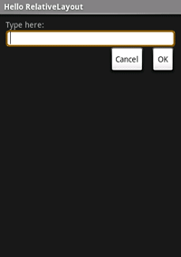

# RelativeLayout

[`RelativeLayout`](https://developer.xamarin.com/api/type/Android.Widget.RelativeLayout/)
is a
[`ViewGroup`](https://developer.xamarin.com/api/type/Android.Views.ViewGroup/) that displays child
[`View`](https://developer.xamarin.com/api/type/Android.Views.View/)
elements in relative positions. The position of a
[`View`](https://developer.xamarin.com/api/type/Android.Views.View/) can
be specified as relative to sibling elements (such as to the left-of or
below a given element) or in positions relative to the
[`RelativeLayout`](https://developer.xamarin.com/api/type/Android.Widget.RelativeLayout/)
area (such as aligned to the bottom, left of center).

A [`RelativeLayout`](https://developer.xamarin.com/api/type/Android.Widget.RelativeLayout/)
is a very powerful utility for designing a user interface because it
can eliminate nested
[`ViewGroup`](https://developer.xamarin.com/api/type/Android.Views.ViewGroup/)s. If you find
yourself using several nested
[`LinearLayout`](https://developer.xamarin.com/api/type/Android.Widget.LinearLayout/)
groups, you may be able to replace them with a single
[`RelativeLayout`](https://developer.xamarin.com/api/type/Android.Widget.RelativeLayout/).

Start a new project named **HelloRelativeLayout**.

Open the **Resources/Layout/Main.axml** file and insert the following:

```xml
<?xml version="1.0" encoding="utf-8"?>
<RelativeLayout xmlns:android="http://schemas.android.com/apk/res/android"
    android:layout_width="fill_parent"
    android:layout_height="fill_parent">
    <TextView
        android:id="@+id/label"
        android:layout_width="fill_parent"
        android:layout_height="wrap_content"
        android:text="Type here:"/>
    <EditText
        android:id="@+id/entry"
        android:layout_width="fill_parent"
        android:layout_height="wrap_content"
        android:background="@android:drawable/editbox_background"
        android:layout_below="@id/label"/>
    <Button
        android:id="@+id/ok"
        android:layout_width="wrap_content"
        android:layout_height="wrap_content"
        android:layout_below="@id/entry"
        android:layout_alignParentRight="true"
        android:layout_marginLeft="10dip"
        android:text="OK" />
    <Button
        android:layout_width="wrap_content"
        android:layout_height="wrap_content"
        android:layout_toLeftOf="@id/ok"
        android:layout_alignTop="@id/ok"
        android:text="Cancel" />
</RelativeLayout>
```

Notice each of the `android:layout_*` attributes, such as
`layout_below`, `layout_alignParentRight`, and `layout_toLeftOf`.
When using a
[`RelativeLayout`](https://developer.xamarin.com/api/type/Android.Widget.RelativeLayout/), you can
use these attributes to describe how you want to position each
[`View`](https://developer.xamarin.com/api/type/Android.Views.View/). Each one of these attributes
define a different kind of relative position. Some attributes use the
resource ID of a sibling
[`View`](https://developer.xamarin.com/api/type/Android.Views.View/) to define its own relative
position. For example, the last
[`Button`](https://developer.xamarin.com/api/type/Android.Widget.Button/) is defined to lie to the
left-of and aligned-with-the-top-of the
[`View`](https://developer.xamarin.com/api/type/Android.Views.View/) identified by the ID `ok`
(which is the previous
[`Button`](https://developer.xamarin.com/api/type/Android.Widget.Button/)).

All of the available layout attributes are defined in
[`RelativeLayout.LayoutParams`](https://developer.xamarin.com/api/type/Android.Widget.RelativeLayout+LayoutParams/).

Make sure you load this layout in the
[`OnCreate()`](https://developer.xamarin.com/api/member/Android.App.Activity.OnCreate/p/Android.OS.Bundle/)
method:

```csharp
protected override void OnCreate (Bundle savedInstanceState)
{
    base.OnCreate (savedInstanceState);
    SetContentView (Resource.Layout.Main);
}
```

The [`SetContentView(int)`](https://developer.xamarin.com/api/member/Android.App.Activity.SetContentView/p/System.Int32/)
method loads the layout file for the
[`Activity`](https://developer.xamarin.com/api/type/Android.App.Activity/), specified by the
resource ID &mdash; `Resource.Layout.Main` refers to the
**Resources/Layout/Main.axml** layout file.

Run the application. You should see the following layout:

[](relative-layout-images/helloviews2.png#lightbox)


## Resources

-   [`RelativeLayout`](https://developer.xamarin.com/api/type/Android.Widget.RelativeLayout/)
-   [`RelativeLayout.LayoutParams`](https://developer.xamarin.com/api/type/Android.Widget.RelativeLayout+LayoutParams/)
-   [`TextView`](https://developer.xamarin.com/api/type/Android.Widget.TextView/)
-   [`EditText`](https://developer.xamarin.com/api/type/Android.Widget.EditText/)
-   [`Button`](https://developer.xamarin.com/api/type/Android.Widget.Button/)


*Portions of this page are modifications based on work created and shared by the
Android Open Source Project and used according to terms described in the*
[*Creative Commons 2.5 Attribution License*](http://creativecommons.org/licenses/by/2.5/).
