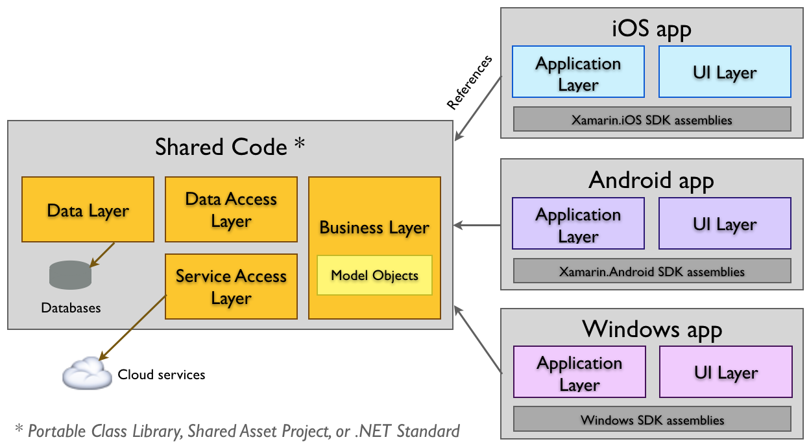
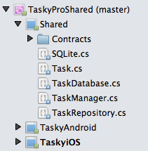
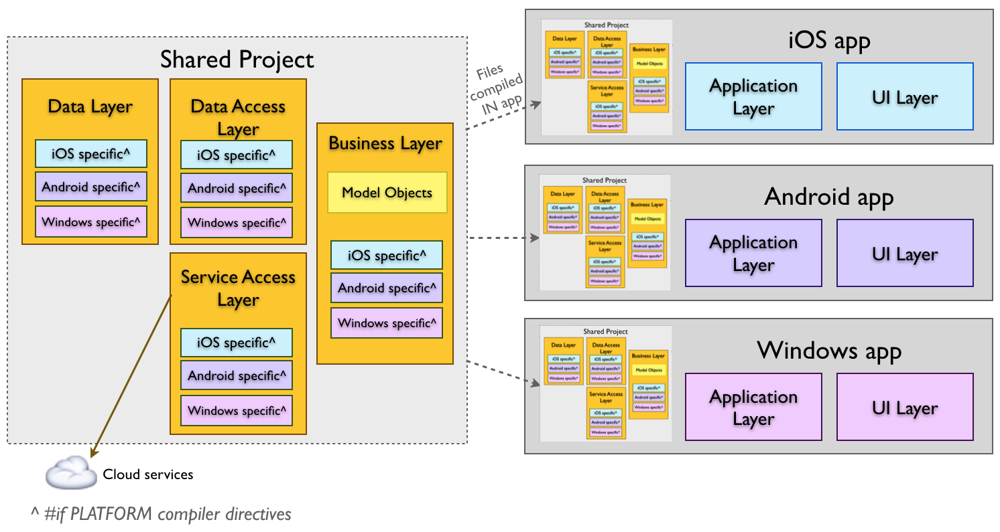
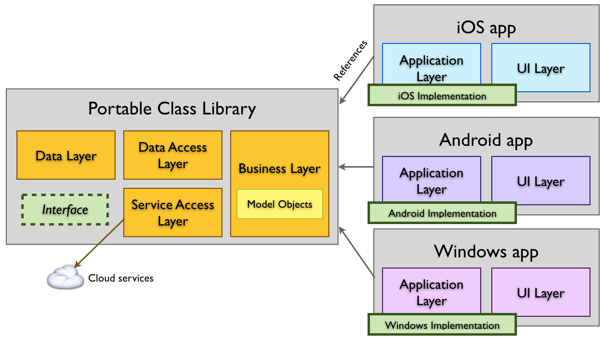

# Sharing Code Options

_This document compares the different methods of sharing code between cross-platform projects: Shared Projects, Portable Class Libraries, and .NET Standard, including the benefits and disadvantages of each._

There are three alternative methods for sharing code between cross-platform applications:

-   [**Shared Projects**](#Shared_Projects) – Use the Shared Asset Project type to organize your source code, and use #if compiler directives as required to manage platform-specific requirements.
-   [**Portable Class Libraries**](#Portable_Class_Libraries) – Create a Portable Class Library (PCL) targetting the platforms you wish to support, and use Interfaces to provide platform-specific functionality.
-   [**.NET Standard Libraries**](#Net_Standard) – .NET Standard projects work similarly to PCLs, requiring the use of Interfaces to inject platform-specific functionality.

The goal of a code-sharing strategy is to support the architecture shown in this diagram, where a single codebase can be utilized by multiple platforms.

 

This article compares the three methods to help you choose the right project type for your applications.

<a name="Shared_Projects" />

## Shared Projects

The simplest approach to sharing code files is to use a [Shared Project](~/cross-platform/app-fundamentals/shared-projects.md).

This screenshot shows a solution file containing three application projects
(for Android, iOS and Windows Phone), with a **Shared** project that
contains common C# source code files:

 

The conceptual architecture is shown in the following diagram, where each
project includes all the shared source files:

 

### Example

A cross platform application that supports iOS, Android and Windows Phone
would require an application project for each platform. The common code lives in
the Shared Project.

An example solution would contain the following folders and projects (project
names have been chosen for expressiveness, your projects do not have to follow
these naming guidelines):

-   **Shared** – Shared Project containing the code common to all projects.
-   **AppAndroid** – Xamarin.Android application project.
-   **AppiOS** – Xamarin.iOS application project.
-   **AppWinPhone** – Windows Phone application project.

In this way the three application projects are sharing the same
source code (the C# files in Shared). Any edits to the shared code will be
shared across all three projects.

### Benefits

-  Allows you to share code across multiple projects.
-  Shared code can be branched based on the platform using compiler directives (eg. using  `#if __ANDROID__` , as discussed in the  [Building Cross Platform Applications](~/cross-platform/app-fundamentals/building-cross-platform-applications/index.md) document).
-  Application projects can include platform-specific references that the shared code can utilize (such as using  `Community.CsharpSqlite.WP7` in the Tasky sample for Windows Phone).

### Disadvantages

-  Unlike most other project types, a Shared Project has no 'output' assembly. During compilation, the files are treated as part of the referencing project and compiled into that assembly. If you wish to share your code as a assembly then Portable Class Libraries or .NET Standard are a better solution.
-  Refactorings that affect code inside 'inactive' compiler directives will not update the code.

 <a name="Shared_Remarks" />

### Remarks

A good solution for application developers writing code that is only intended for sharing in their app (and not distributing to other developers).

 <a name="Portable_Class_Libraries" />

## Portable Class Libraries

Portable Class Libraries are [discussed in detail here](~/cross-platform/app-fundamentals/pcl.md).

 

### Benefits

-  Allows you to share code across multiple projects.
-  Refactoring operations always update all affected references.

### Disadvantages

-  Cannot use compiler directives.
-  Only a subset of the .NET framework is available to use, determined by the profile selected (see the  [Introduction to PCL](~/cross-platform/app-fundamentals/pcl.md) for more info).

### Remarks

A good solution if you plan to share the resulting assembly with other developers.

<a name="Net_Standard" />

## .NET Standard Libraries

.NET Standard is [discussed in detail here](~/cross-platform/app-fundamentals/net-standard.md).

### Benefits

-  Allows you to share code across multiple projects.
-  Refactoring operations always update all affected references.
-  A larger surface area of the .NET Base Class Library (BCL) is available than PCL profiles.

### Disadvantages

 -  Cannot use compiler directives.

### Remarks

.NET Standard is similar to PCL, but with a simpler model for platform support and
a greater number of classes from the BCL.

## Summary

The code sharing strategy you choose will be driven by the platforms you are
targeting. Choose a method that works best for your project.

PCL or .NET Standard are good choices for building sharable code libraries (especially publishing on NuGet). Shared Projects work well for application developers planning to use lots of plaform-specific functionality in their cross-platform apps.

## Related Links

- [Building Cross Platform Applications (main document)](~/cross-platform/app-fundamentals/building-cross-platform-applications/index.md)
- [Portable Class Libraries](~/cross-platform/app-fundamentals/pcl.md)
- [Shared Projects](~/cross-platform/app-fundamentals/shared-projects.md)
- [.NET Standard](~/cross-platform/app-fundamentals/net-standard.md)
- [Case Study: Tasky](~/cross-platform/app-fundamentals/building-cross-platform-applications/case-study-tasky.md)
- [Tasky Sample (github)](https://github.com/xamarin/mobile-samples/tree/master/Tasky)
- [Tasky Sample using PCL (github)](https://github.com/xamarin/mobile-samples/tree/master/TaskyPortable)
