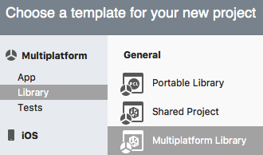
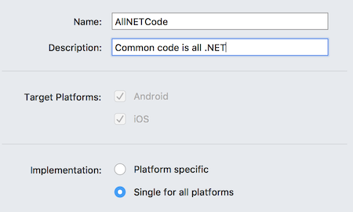
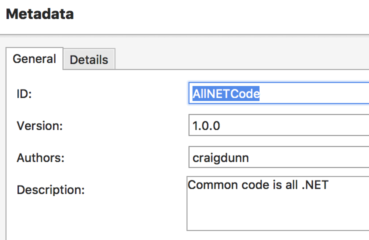
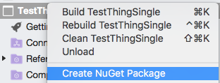
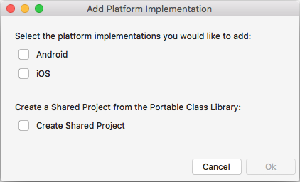

# Creating a New Multiplatform Library for NuGet

Creating a Multiplatform Library project that uses PCL or .NET Standard means that
the resulting NuGet can be added to any .NET project that supports the target profile,
including ASP.NET projects, or desktop apps using WinForms, WPF, or UWP.

The library can only contain code supported by the selected PCL or .NET Standard profile,
as well as any other NuGets that are added.
This is suited to business logic and algorithms that can be expressed entirely in the .NET base class library.

A single assembly is created and built into a NuGet package.

If you later need platform-specific functionality, [platform-specific projects can be added](#add-platforms).

## Steps to Create a Multiplatform Library NuGet

1. Select **File > New Solution** (or right click an existing solution and choose **Add > New Project**).

2. Choose **Multiplatform Library** from the **Multiplatform > Library** section:

   

3. Enter a **Name** and **Description**, and choose **Single for all platforms**:

   

4. Complete the wizard. A single library project is created in the solution.

5. Right-click on the new library project and then select **Options**. The **Build > General** section
   allows the **Target Framework** to be set – choose a .NET Portable PCL profile or a .NET Standard version:

   

6. Also in the **Project Options** window, open the **NuGet Package > Metadata** section and enter the [required metadata](~/cross-platform/app-fundamentals/nuget-multiplatform-libraries/metadata.md)
   (as well as any optional metadata):

   

7. Right-click on the library project and choose **Create NuGet Package** (or build or deploy the solution) and
   the **.nupkg** NuGet package file will be saved in the **/bin/** folder (either Debug or Release, depending on configuration):

   

## Verifying the Output

NuGet packages are also ZIP files, so it's possible to inspect the internal structure of the generated package.

This screenshot shows the contents of a PCL-based NuGet – only a single PCL assembly is included:

<a name="add-platforms" />

## Adding Platform-Specific Code

PCL-based projects and .NET Standard-based projects cannot contain platform-specific
references (such as iOS or Android functionality).

If an existing PCL project or .NET Standard project needs to be expanded to include platform-specific
code, this can be done by right-clicking on the project and selecting **Add > Add Platform Implementation...**:

One or more platform projects can be added to the solution, and the existing PCL or .NET Standard
library can optionally be converted to a Shared Project:

After converting to a Shared Project, visit the **Project Options > NuGet Package > Reference Assemblies**
[section](~/cross-platform/app-fundamentals/nuget-multiplatform-libraries/platform-specific.md)
and ensure that any required profiles are selected (so that the NuGet continues to be compatible
with projects it was previously used in).

## Related Links

- [Metadata Guide](~/cross-platform/app-fundamentals/nuget-multiplatform-libraries/metadata.md)
