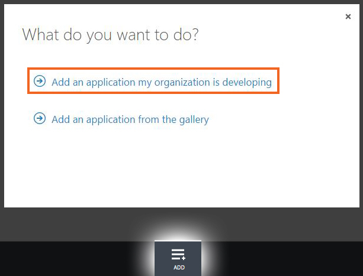
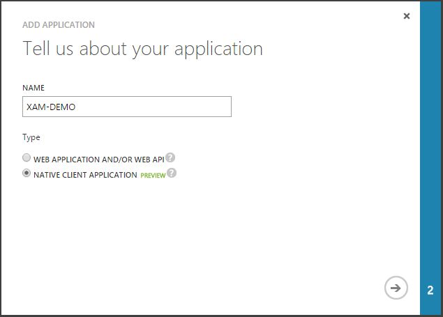
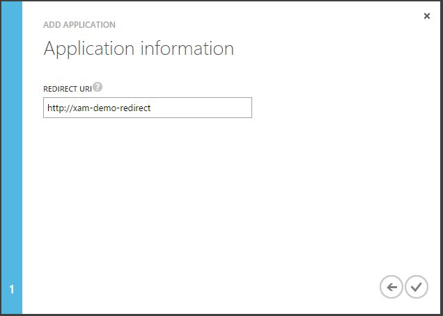
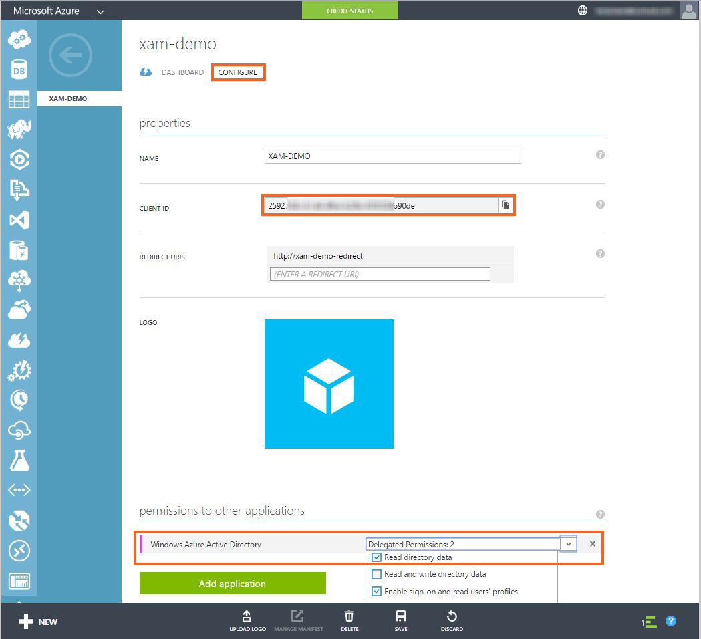

# Step 1. Register an app to use Azure Active Directory

1. Navigate to [windowsazure.com](https://manage.windowsazure.com)
  and log in with your Microsoft Account or Organization Account
  in the Azure Portal. If you don’t have an Azure
  subscription, you can get a trial from
  [azure.com](http://www.azure.com)

2. After signing in, go to the **Active Directory** (1)
  section and choose the directory where you want
  to register the application (2)

  

3. Click **Add** to create new application, then
  select **Add an application my organization is developing**

  

4. On the next screen, give your app a name (eg. XAM-DEMO).
  Make sure you select **Native Client Application** as the type of application.

  

5. On the final screen, provide a **Redirect URI* that is unique
  to your application as it will return to this URI when
  authentication is complete.

  

6. Once the app is created, navigate to the **Configure** tab.
  Write down the **Client ID** which we’ll use in our application
  later. Also, on this screen you can give your mobile application
  access to Active Directory or add another application like
  Web API or Office365, which can be used by mobile application once
  authentication is complete.

	

## Related Links

- [Microsoft NativeClient sample](https://github.com/AzureADSamples/NativeClient-MultiTarget-DotNet)
