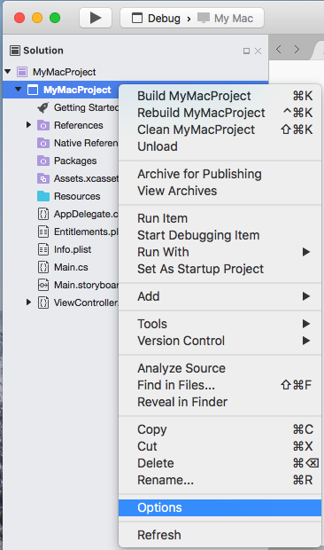
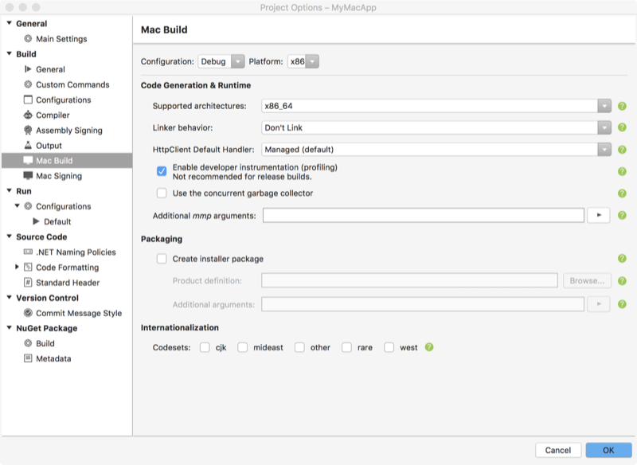

# Updating Xamarin.Mac Unified applications to 64-bit

As of January 2018, Apple requires that new 
[Mac App Store submissions target 64-bit](https://developer.apple.com/news/?id=06282017a). 
Apps already available on the Mac App Store must be updated to target 64-bit by
June 2018.

The **File** > **New** Xamarin.Mac project template creates 64-bit 
applications by default, so any recently created apps are already 64-bit 
compatible and will not require any changes.

## Targeting 64-bit

1. Open the **Project Options** window for your your Xamarin.Mac app:

   

2. Select **Mac Build** and set **Supported architectures** to **x86\_64**:

   [](mac-64-bit-images/2-project_options-vsmac-large.png#lightbox)

3. If your app has any external dependencies such as native references or
   binding projects, update them to target 64-bit.

### Errors

The first time you build or run your application with 64-bit support,
you may encounter link errors from clang or runtime issues. These errors
can occur if third-party dependencies — for example, native references in
your Xamarin.Mac or bindings projects, or manually-loaded system-wide
frameworks — have not been updated to 64-bit.

> [!TIP]
> Converting your project to 64-bit is a major change and may indirectly
> uncover various programming errors. In particular it may change the size and
> alignment of data structures, which would affect p/invoke signatures and
> native code linked in your project. Consider reviewing any build warnings
> given and test your application throughly afterwards to catch potential
> issues.

#### Example error resulting from a dynamically-linked third-party dependency that does not target 64-bit:

```console
ld : warning : ignoring file PATH/ThirdPartyLibrary.framework/ThirdPartyLibrary, 
file was built for i386 which is not the architecture being linked (x86_64): 
PATH/ThirdPartyLibrary.framework/ThirdPartyLibrary 
```

This error could be followed at runtime by `dlopen` returning `IntPtr.Zero` 
instead of an expected handle.

#### Example error resulting from a statically-linked third-party dependency that does not target 64-bit:

```console
Undefined symbols for architecture x86_64:
  "_LibraryFunction", referenced from:
     -u command line option
ld: symbol(s) not found for architecture x86_64 
```

To build and run successfully, update these dependencies to 64-bit and 
recompile your app.

