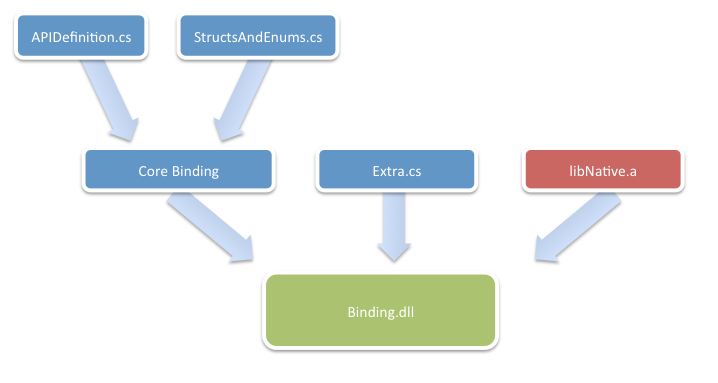

# ApiDefinitions & StructsAndEnums Files

When Objective Sharpie has run successfully, it generates
`Binding/ApiDefinitions.cs` and `Binding/StructsAndEnums.cs` files.
These two files are added to a binding project in Visual Studio for Mac
or passed directly to the `btouch` or `bmac` tools to produce the final binding.

In *some* cases these generated files might be all you need, however more often
the developer will need to manually modify these generated files
to fix any issues that could not be automatically handled by the tool
(such as those flagged with a [`Verify` attribute](~/cross-platform/macios/binding/objective-sharpie/platform/verify.md)).

Some of the next steps include:

- **Adjusting Names**: Sometimes you will want to adjust the names of methods and classes to match the .NET Framework Design Guidelines.
- **Methods or Properties**: The heuristics used by Objective Sharpie sometimes will pick a method to be turned into a property. At this point, you could decide whether this is the intended behavior or not.
- **Hook up Events**: You could link your classes with your delegate classes and automatically generate events for those.
- **Hook up Notifications**: It is not possible to extract the API contract of notifications from the pure header files, this will require a trip to the API documentation. If you want strongly typed notifications, you will need to update the result.
- **API Curation**: At this point, you might choose to provide extra constructors, add methods (to allow for C# initialize-on-construction syntax), operator overloading and implement your own interfaces on the extra definitions file.

See the [binding an API](~/cross-platform/macios/binding/objective-c-libraries.md)
description to see how these files fit into the binding process, as shown in the diagram below:

Refer to the [binding Types reference](~/cross-platform/macios/binding/binding-types-reference.md)
for more information on the contents of these files.

