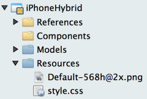
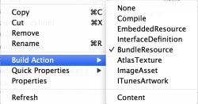
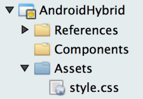
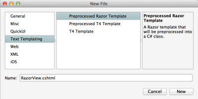
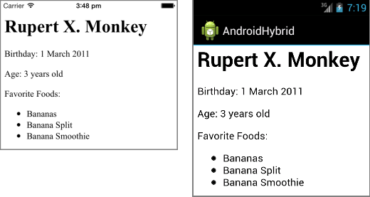
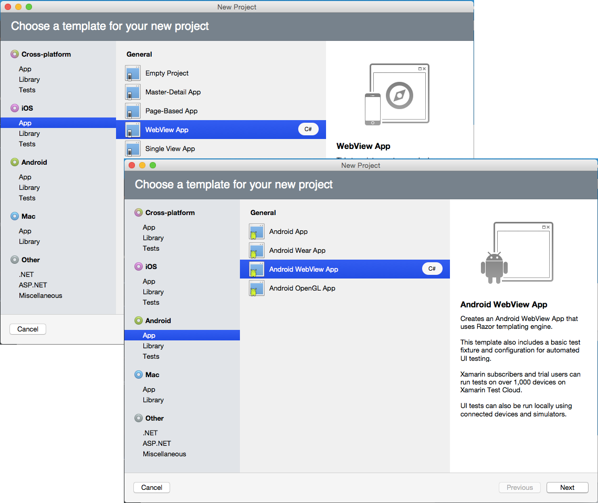
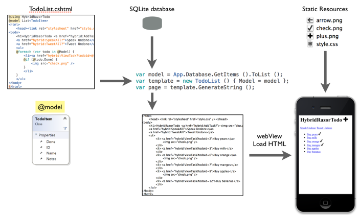
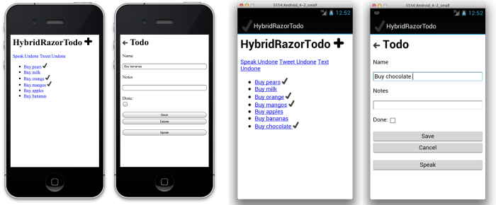
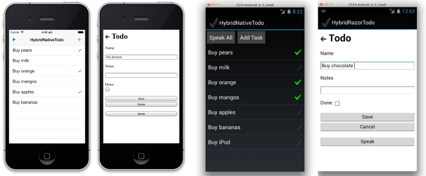

# Building HTML views using Razor Templates

In the mobile development world the term “hybrid app” typically refers to an application that presents some (or all) of its screens as HTML pages inside a hosted web viewer control.

There are some development environments that let you build your mobile app entirely in HTML and Javascript, however those apps can suffer from performance problems when trying to accomplish complex processing or UI effects and are also limited in the platform features they can access.

Xamarin offers the best of both worlds, especially when utilizing the Razor HTML templating engine. With Xamarin you have the flexibility to build cross-platform templated HTML views that use Javascript and CSS, but also have complete access to the underlying platform APIs and fast processing using C#.

This document explains how to use the Razor templating engine build HTML+Javascript+CSS views that can be used across mobile platforms using Xamarin.

## Using Web Views Programmatically

Before we learn about Razor this section covers how to use web views to display HTML content directly – specifically HTML content that is generated within an app.

Xamarin provides complete access to the underlying platform APIs on both iOS and Android, so it is easy to create and display HTML using C#. The basic syntax for each platform is shown below.

### iOS

Displaying HTML in a UIWebView control in Xamarin.iOS also takes just a few lines of code:

```csharp
var webView = new UIWebView (View.Bounds);
View.AddSubview(webView);
string contentDirectoryPath = Path.Combine (NSBundle.MainBundle.BundlePath, "Content/");
var html = "<html><h1>Hello</h1><p>World</p></html>";
webView.LoadHtmlString(html, NSBundle.MainBundle.BundleUrl);
```

See the [iOS UIWebView](http://docs.xamarin.com/recipes/ios/content_controls/web_view/) recipes for more details on using the UIWebView control.

### Android

Displaying HTML in a WebView control using Xamarin.Android is accomplished in just a few lines of code:

```csharp
// webView is declared in an AXML layout file
var webView = FindViewById<WebView> (Resource.Id.webView);
var html = "<html><h1>Hello</h1><p>World</p></html>";
webView.LoadDataWithBaseURL("file:///android_asset/", html, "text/html", "UTF-8", null);
```

See the [Android WebView](http://docs.xamarin.com/recipes/android/controls/webview/) recipes for more details on using the WebView control.

### Specifying the Base Directory

On both platforms there is a parameter that specifies the base directory for the HTML page. This is the location on the device’s file system that is used to resolve relative references to resources like images and CSS files. For example, tags like

```html
<link rel="stylesheet" href="style.css" />

<script type="text/javascript" src="jscript.js">
```

refer to these files: **style.css**, **monkey.jpg** and **jscript.js**. The base directory setting tells the web view where these files are located so they can be loaded into the page.

#### iOS

The template output is rendered in iOS with the following C# code:

```csharp
webView.LoadHtmlString (page, NSBundle.MainBundle.BundleUrl);
```

The base directory is specified as `NSBundle.MainBundle.BundleUrl` which refers to the directory that the application is installed in. All the files in the **Resources** folder are copied to this location, such as the **style.css** file shown here:

 

The Build Action for all static content files should be **BundleResource**:

 

#### Android

Android also requires a base directory to be passed as a parameter when html strings are displayed in a web view.

```csharp
webView.LoadDataWithBaseURL("file:///android_asset/", page, "text/html", "UTF-8", null);
```

The special string **file:///android_asset/** refers to the Android Assets folder in your app, shown here containing the **style.css** file.

 

The Build Action for all static content files should be **AndroidAsset**.

 

### Calling C# from HTML and Javascript

When an html page is loaded into a web view, it treats the links and forms as it would if the page was loaded from a server. This means that if the user clicks a link or submits a form the web view will attempt to navigate to the specified target.

If the link is to an external server (such as google.com) then the web view will attempt to load the external website (assuming there is an internet connection).

```html
<a href="http://google.com/">Google</a>
```

If the link is relative then the web view will attempt to load that content from the base directory. Obviously no network connection is required for this to work, as the content is stored in the app on the device.

```html
<a href="somepage.html">Local content</a>
```

Form actions follow the same rule.

```html
<form method="get" action="http://google.com/"></form>
<form method="get" action="somepage.html"></form>
```

You’re not going to host a web server on the client; however, you can use the same server communication techniques employed in today’s responsive design patterns to call services over HTTP GET, and handle responses asynchronously by emitting Javascript (or calling Javascript already hosted in the web view). This enables you to easily pass data from the HTML back into C# code for processing then display the results back on the HTML page.

Both iOS and Android provide a mechanism for application code to intercept these navigation events so that app code can respond (if required). This feature is crucial to building hybrid apps because it lets native code interact with the web view.

#### iOS

The ShouldStartLoad event on the web view in iOS can be overridden to allow application code to handle a navigation request (such as a link click). The method parameters supply all the information

```csharp
bool HandleShouldStartLoad (UIWebView webView, NSUrlRequest request, UIWebViewNavigationType navigationType) {
    // return true if handled in code
    // return false to let the web view follow the link
}
```

and then assign the event handler:

```csharp
webView.ShouldStartLoad += HandleShouldStartLoad;
```

#### Android

On Android simply subclass WebViewClient and then implement code to respond to the navigation request.

```csharp
class HybridWebViewClient : WebViewClient {
    public override bool ShouldOverrideUrlLoading (WebView webView, IWebResourceRequest request) {
        // return true if handled in code
        // return false to let the web view follow the link
    }
}
```

and then set the client on the web view:

```csharp
webView.SetWebViewClient (new HybridWebViewClient ());
```

### Calling Javascript from C#

In addition to telling a web view to load a new HTML page, C# code can also run Javascript within the currently displayed page. Entire Javascript code blocks can be created using C# strings and executed, or you can craft method calls to Javascript already available on the page via `script` tags.

#### Android

Create the Javascript code to be executed and then prefix it with “javascript:” and instruct the web view to load that string:

```csharp
var js = "alert('test');";
webView.LoadUrl ("javascript:" + js);
```

#### iOS

iOS web views provide a method specifically to call Javascript:

```csharp
var js = "alert('test');";
webView.EvaluateJavascript (js);
```

### Summary

This section has introduced the features of the web view controls on both Android and iOS that let us build hybrid applications with Xamarin, including:

-  The ability to load HTML from strings generated in code,
-  The ability to reference local files (CSS, Javascript, Images or other HTML files),
-  The ability to intercept navigation requests in C# code,
-  The ability to call Javascript from C# code.


The next section introduces Razor, which makes it easy to create the HTML to use in hybrid apps.

## What is Razor?

Razor is a templating engine that was introduced with ASP.NET MVC, originally to run on the server and generate HTML to be served to web browsers.

The Razor templating engine extends standard HTML syntax with C# so that you can express the layout and incorporate CSS stylesheets and Javascript easily. The template can reference a Model class, which can be any custom type and whose properties can be accessed directly from the template. One of its main advantages is the ability to mix HTML and C# syntax easily.

Razor templates are not limited to server-side use, they can also be included in Xamarin apps. Using Razor templates along with the ability to work with web views programmatically enables sophisticated cross-platform hybrid applications to be built with Xamarin.

### Razor Template Basics

Razor template files have a **.cshtml** file extension. They can be added to a Xamarin project from the Text Templating section in the **New File** dialog:

 

A simple Razor template ( **RazorView.cshtml**) is shown below.

```html
@model string
<html>
    <body>
    <h1>@Model</h1>
    </body>
</html>
```

Notice the following differences from a regular HTML file:

-  The `@` symbol has special meaning in Razor templates – it indicates that the following expression is C# to be evaluated.
- `@model` directive always appears as the first line of a Razor template file.
-  The `@model` directive should be followed by a Type. In this example a simple string is being passed to the template, but this could be any custom class.
-  When `@Model` is referenced throughout the template, it provides a reference to the object passed to the template when it is generated (in this example it will be a string).
-  The IDE will automatically generate partial class for templates (files with the **.cshtml** extension). You can view this code but it should not be edited.
 
 The partial class is named RazorView to match the .cshtml template file name. It is this name that is used to refer to the template in C# code.
- `@using` statements can also be included at the top of a Razor template to include additional namespaces.


The final HTML output can then be generated with the following C# code. Note that we specify the Model to be a string “Hello World” which will be incorporated into the rendered template output.

```csharp
var template = new RazorView () { Model = "Hello World" };
var page = template.GenerateString ();
```

Here is the output shown in a web view on the iOS Simulator and Android Emulator:

 

### More Razor Syntax

In this section we’re going to introduce some basic Razor syntax to help you get started using it. The examples in this section populate the following class with data and display it using Razor:

```csharp
public class Monkey {
    public string Name { get; set; }
    public DateTime Birthday { get; set; }
    public List<string> FavoriteFoods { get; set; }
}
```

All examples use the following data initialization code

```csharp
var animal = new Monkey {
    Name = "Rupert",
    Birthday=new DateTime(2011, 04, 01),
    FavoriteFoods = new List<string>
        {"Bananas", "Banana Split", "Banana Smoothie"}
};
```

#### Displaying Model Properties

When the model is a class with properties, they are easily referenced in the Razor template as shown in this example template:

```html
@model Monkey
<html>
    <body>
    <h1>@Model.Name</h1>
    <p>Birthday: @(Model.Birthday.ToString("d MMMM yyyy"))</p>
    </body>
</html>
```

This can be rendered to a string using the following code:

```csharp
var template = new RazorView () { Model = animal };
var page = template.GenerateString ();
```

The final output is shown here in a web view on the iOS Simulator and Android Emulator:

 

#### C# statements

More complex C# can be included in the template, such as the Model property updates and the Age calculation in this example:

```html
@model Monkey
<html>
    <body>
    @{
        Model.Name = "Rupert X. Monkey";
        Model.Birthday = new DateTime(2011,3,1);
    }
    <h1>@Model.Name</h1>
    <p>Birthday: @Model.Birthday.ToString("d MMMM yyyy")</p>
    <p>Age: @(Math.Floor(DateTime.Now.Date.Subtract (Model.Birthday.Date).TotalDays/365)) years old</p>
    </body>
</html>
```

You can write complex single-line C# expressions (like formatting the age) by surrounding the code with `@()`.

Multiple C# statements can be written by surrounding them with `@{}`.

#### If-else statements

Code branches can be expressed with `@if` as shown in this template example.

```html
@model Monkey
<html>
    <body>
    <h1>@Model.Name</h1>
    <p>Birthday: @(Model.Birthday.ToString("d MMMM yyyy"))</p>
    <p>Age: @(Math.Floor(DateTime.Now.Date.Subtract (Model.Birthday.Date).TotalDays/365)) years old</p>
    <p>Favorite Foods:</p>
    @if (Model.FavoriteFoods.Count == 0) {
        <p>No favorites</p>
    } else {
        <p>@Model.FavoriteFoods.Count favorites</p>
    }
    </body>
</html>
```

#### Loops

Looping constructs like `foreach` can also be added. The `@` prefix can be used on the loop variable ( `@food` in this case) to render it in HTML.

```html
@model Monkey
<html>
    <body>
    <h1>@Model.Name</h1>
    <p>Birthday: @Model.Birthday.ToString("d MMMM yyyy")</p>
    <p>Age: @(Math.Floor(DateTime.Now.Date.Subtract (Model.Birthday.Date).TotalDays/365)) years old</p>
    <p>Favorite Foods:</p>
    @if (Model.FavoriteFoods.Count == 0) {
        <p>No favorites</p>
    } else {
        <ul>
            @foreach (var food in @Model.FavoriteFoods) {
                <li>@food</li>
            }
        </ul>
    }
    </body>
</html>
```

The output of the above template is shown running on the iOS Simulator and Android Emulator:

 

This section has covered the basics of using Razor templates to render simple read-only views. The next section explains how to build more complete apps using Razor that can accept user-input and interoperate between Javascript in the HTML view and C#.

## Using Razor Templates with Xamarin

This section explains how to use build your own hybrid application using the solution templates in Visual Studio for Mac. There are three templates available from the **File > New > Solution...** window:

- **Android > App > Android WebView Application**
- **iOS > App > WebView Application**
- **ASP.NET MVC Project**


The **New Solution** window looks like this for iPhone and Android projects - the solution description on the right highlights support for the Razor templating engine.

 

Note that you can easily add a **.cshtml** Razor template to *any* existing Xamarin project, it is not necessary to use these solution templates. iOS projects do not require a Storyboard to use Razor either; simply add a UIWebView control to any view programmatically and you can render Razor templates entire in C# code.

The default template solution contents for iPhone and Android projects are shown below:

 

The templates give you ready-to-go application infrastructure to load a Razor template with a data model object, process user input and communicate back to the user via Javascript.

The important parts of the solution are:

-  Static content such as the  **style.css** file.
-  Razor .cshtml template files like  **RazorView.cshtml** .
-  Model classes that are referenced in the Razor templates such as  **ExampleModel.cs** .
-  The platform-specific class that creates the web view and renders the template, such as the  `MainActivity` on Android and the  `iPhoneHybridViewController` on iOS.


The following section explains how the projects work.

### Static Content

Static content includes CSS stylesheets, images, Javascript files or other content that can be linked from or referenced by an HTML file being displayed in a web view.

The template projects include a minimal style sheet to demonstrate how to include static content in your hybrid app. The CSS stylesheet is referenced in the template like this:

```html
<link rel="stylesheet" href="style.css" />
```

You can add whatever stylesheet and Javascript files you need, including frameworks like JQuery.

### Razor cshtml Templates

The template includes a Razor **.cshtml** file that has pre-written code to help communicate data between the HTML/Javascript and C#. This will let you build sophisticated hybrid apps that don’t just display read-only data from the Model, but also accept user-input in the HTML and pass it back to C# code for processing or storage.

#### Rendering the template

Calling the `GenerateString` on a template renders HTML ready for display in a web view. If the template uses a model then it should be supplied prior to rendering. This diagram illustrates how rendering works – not that the static resources are resolved by the web view at runtime, using the supplied base directory to find the specified files.

 

#### Calling C# code from the template

Communication from a rendered web view calling back to C# is done by setting the URL for the web view, and then intercepting the request in C# to handle the native request without reloading the web view.

An example can be seen in how RazorView’s button is handled. The button has the following HTML:

```html
<input type="button" name="UpdateLabel" value="Click" onclick="InvokeCSharpWithFormValues(this)" />
```

The `InvokeCSharpWithFormValues` Javascript function reads all of the values from the HTML Form and sets the `location.href` for the web view:

```javascript
location.href = "hybrid:" + elm.name + "?" + qs;
```

This attempts to navigate the web view to a URL with a custom scheme (eg. `hybrid:`)

```
hybrid:UpdateLabel?textbox=SomeValue&UpdateLabel=Click
```

When the native web view processes this navigation request, we have the opportunity to intercept it. In iOS, this is done by handling the UIWebView’s HandleShouldStartLoad event. In Android, we simply subclass the WebViewClient used in the form, and override ShouldOverrideUrlLoading.

The internals of these two navigation interceptors is essentially the same.

First, check the URL that web view is attempting to load, and if it doesn’t start with the custom scheme (`hybrid:`), allow the navigation to occur as normal.

For the custom URL scheme, everything in the URL between the scheme and the “?” is the method name to be handled (in this case, “UpdateLabel”). Everything in the query string will be treated as the parameters to the method call:

```csharp
var resources = url.Substring(scheme.Length).Split('?');
var method = resources [0];
var parameters = System.Web.HttpUtility.ParseQueryString(resources[1]);
```

`UpdateLabel` in this sample does a minimal amount of string manipulation on the textbox parameter (prepending “C# says” to the string), and then calls back to the web view.

After handling the URL, the method aborts the navigation so that the web view does not attempt to finish navigating to the custom URL.

#### Manipulating the template from C#

Communication to a rendered HTML web view from C# is done by calling Javascript in the web view. On iOS, this is done by calling `EvaluateJavascript` on the UIWebView:

```csharp
webView.EvaluateJavascript (js);
```

On Android, Javascript can be invoked in the web view by loading the Javascript as a URL using the `"javascript:"` URL scheme:

```csharp
webView.LoadUrl ("javascript:" + js);
```

## Making an app truly hybrid

These templates do not make use of native controls on each platform – the entire screen is filled with a single web view.

HTML can be great for prototyping, and displaying the kinds of things the web is best at such as rich text and responsive layout. However not all tasks are suited to HTML and Javascript – scrolling through long lists of data, for example, performs better using native UI controls (such as UITableView on iOS or ListView on Android).

The web views in the template can easily be augmented with platform-specific controls – simply edit the **MainStoryboard.storyboard** in the iOS designer or the **Resources/layout/Main.axml** on Android.

### RazorTodo Sample

The [RazorTodo](https://github.com/xamarin/mobile-samples/tree/master/RazorTodo) repository contains two separate solutions to show the differences between a completely HTML-driven app and an app that combines HTML with native controls:

-  **RazorTodo** - Completely HTML-driven app using Razor templates.
-  **RazorNativeTodo** - Uses native list view controls for iOS and Android but displays the edit screen with HTML and Razor.


These Xamarin apps run on both iOS and Android, utilizing Portable Class Libraries (PCLs) to share common code such as the database and model classes. Razor **.cshtml** templates can also be included in the PCL so they’re easily shared across platforms.

Both sample apps incorporate Twitter sharing and text-to-speech APIs from the native platform, demonstrating that hybrid applications with Xamarin still have access to all the underlying functionality from HTML Razor template-driven views.

The **RazorTodo** app uses HTML Razor templates for the list and edit views. This means we can build the app almost completely in a shared Portable Class Library (including the database and **.cshtml** Razor templates). The screenshots below show the iOS and Android apps.

 

The **RazorNativeTodo** app uses an HTML Razor template for the edit view, but implements a native scrolling list on each platform. This provides a number of benefits including:

-  Performance - the native scrolling controls use virtualization to ensure fast, smooth scrolling even with very long lists of data.
-  Native experience - platform-specific UI elements are easily enabled, such as the fast-scrolling index support in iOS and Android.


A key benefit of building hybrid apps with Xamarin is that you can start with a completely HTML-driven user interface (like the first sample) and then add platform-specific functionality when required (as the second sample shows). The native list screens and HTML Razor edit screens on both iOS and Android are shown below.

 

## Summary

This article has explained the features of the web view controls available on iOS and Android that facilitate building hybrid applications.

It then discussed the Razor templating engine and the syntax that can be used to generate HTML easily in Xamarin apps using .**cshtml** Razor template files. It also described the Visual Studio for Mac solution templates that let you quickly get started building hybrid applications with Xamarin.

Finally it introduced the RazorTodo samples which demonstrate how to combine web views with native user interfaces and APIs.

### Related Links

- [RazorTodo Sample](https://github.com/xamarin/mobile-samples/tree/master/RazorTodo)
- [MVC 3 - Razor View Engine (Microsoft)](http://www.asp.net/mvc/videos/mvc-3/mvc-3-razor-view-engine)
- [Introduction to ASP.NET Web Programming Using the Razor Syntax (Microsoft)](http://www.asp.net/web-pages/tutorials/basics/2-introduction-to-asp-net-web-programming-using-the-razor-syntax)
