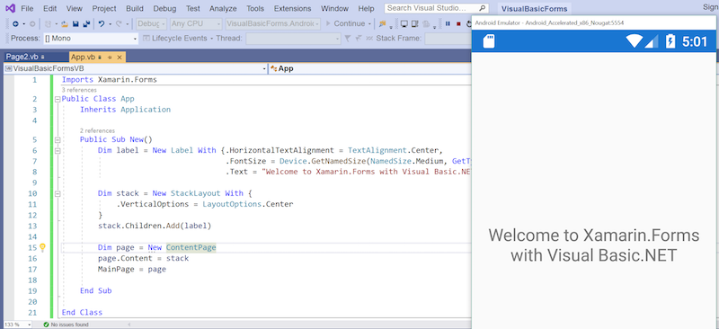

# Xamarin.Forms using Visual Basic.NET

Xamarin does not support Visual Basic directly - follow the instructions on
this page to create a C# Xamarin.Forms PCL solution and then replace the
common code PCL project with Visual Basic.

[](xamarin-forms-images/hero.png#lightbox)

> ℹ️ **NOTE:** You must use Visual Studio on Windows to program with Visual Basic.

## Xamarin.Forms with Visual Basic Walkthrough

Follow these steps to create a simple Xamarin.Forms project that uses Visual Basic:

1. Create a new *Xamarin.Forms C#* solution that uses Portable Class Libraries (PCL).
Go to **File > New Project** and in the **New Project** window navigate to
**Installed > Templates > Visual C# > Cross Platform** then choose **Cross Platform App (Xamarin.Forms or Native) > Xamarin.Forms**.

2. Right-click on the solution and **Add > New Project**.

3. Choose the **Visual Basic > Class Library (Portable)** project type:

   [](xamarin-forms-images/add-vb-2.png#lightbox)

4. Select the platforms as shown to configure the correct PCL Profile (be sure to
  include Xamarin.iOS and Xamarin.Android):

   

5. Right-click on the Visual Basic project and choose **Properties**, then
  change the **Default namespace** to match the existing C# projects:

   

6. Right-click on the new Visual Basic project and choose **Manage Nuget Packages**,
then install **Xamarin.Forms** and close the package manager window.

   [](xamarin-forms-images/add-vb-4.png#lightbox)

7. Rename the default **Class1** file *and* class to `App`:

   [](xamarin-forms-images/add-vb-5.png#lightbox)

8. Paste the following code into the **App.vb** file, which will become the starting
point of your Xamarin.Forms app. Remember to include `Imports Xamarin.Forms` and add
`Inherits Application` to the class:

    ```vb 
    Imports Xamarin.Forms

    Public Class App
        Inherits Application

        Public Sub New()
            Dim label = New Label With {.HoriztonalTextAlignment = TextAlignment.Center,
                                        .FontSize = Device.GetNamedSize(NamedSize.Medium, GetType(Label)),
                                        .Text = "Welcome to Xamarin.Forms with Visual Basic.NET"}

            Dim stack = New StackLayout With {
                .VerticalOptions = LayoutOptions.Center
            }
            stack.Children.Add(label)

            Dim page = New ContentPage
            page.Content = stack
            MainPage = page

        End Sub

    End Class
    ```

9. Now we need to point the iOS and Android projects at the new Visual Basic project.
Right-click on the **References** node in the iOS and Android projects to open the
**Reference Manager**. Un-tick the the C# portable library and tick the VB portable library
(don't forget, do this for both the iOS and Android projects).

   [](xamarin-forms-images/add-vb-8.png#lightbox)

10. Delete the C# portable project. Add new **.vb** files to build out your
Xamarin.Forms application. A template for new `ContentPage`s in Visual Basic
is shown below:

    ```vb
    Imports Xamarin.Forms

    Public Class Page2
    Inherits ContentPage

        Public Sub New()
            Dim label = New Label With {.HoriztonalTextAlignment = TextAlignment.Center,
                                        .FontSize = Device.GetNamedSize(NamedSize.Medium, GetType(Label)),
                                        .Text = "Visual Basic ContentPage"}

            Dim stack = New StackLayout With {
                .VerticalOptions = LayoutOptions.Center
            }
            stack.Children.Add(label)

            Content = stack
        End Sub
    End Class
    ```

## Limitations of Visual Basic in Xamarin.Forms

As stated on the [Portable Visual Basic.NET page](/guides/cross-platform/application_fundamentals/pcl/portable_visual_basic_net/),
Xamarin does not support the Visual Basic language. This means there are some limitations
on where you can use Visual Basic:

 - Custom Renderers cannot be written in Visual Basic, they must be written in C# in the native platform projects.

 - Dependency Service implementations cannot be written in Visual Basic, they must be written in C# in the native platform projects.

 - XAML pages cannot be included in the Visual Basic project - the code-behind generator can only build C#. It is possible to include XAML in a separate, referenced, C# portable class library and use databinding to populate the XAML files via Visual Basic models (an example of this is included in the [sample](https://github.com/xamarin/mobile-samples/tree/master/VisualBasic/XamarinFormsVB/XamlPages)).

 - Xamarin does not support the Visual Basic.NET language.

## Related Links

- [XamarinFormsVB (sample)](https://github.com/xamarin/mobile-samples/tree/master/VisualBasic/XamarinFormsVB)
- [Cross-Platform Development with the .NET Framework (Microsoft)](http://msdn.microsoft.com/en-us/library/gg597391(v=vs.110).aspx)
