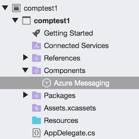
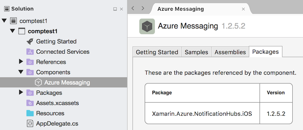
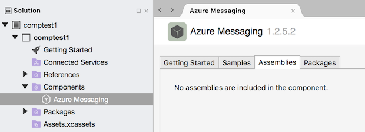
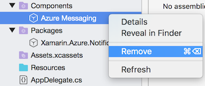
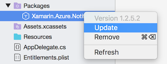
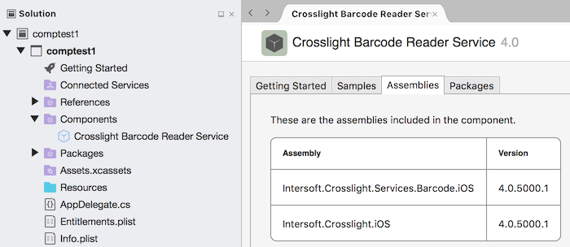
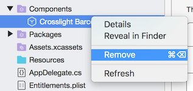
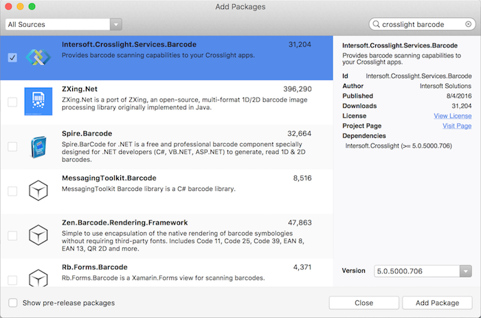

# Updating Component References to NuGet

_Replace your Component references with NuGet packages to future-proof your apps._

This guide explains how to update existing Xamarin solutions
to change Component references to NuGet packages.

- [Components that contain NuGet packages](#contain)
- [Components with NuGet replacements](#replace)

Most components fall into one of the above categories.
If you are using a component that does not appear to have an
equivalent NuGet package, read the
[components without a NuGet migration path](#require-update) section below.

Refer to these pages for more detailed instructions for adding NuGet packages
on [Windows](https://docs.microsoft.com/nuget/quickstart/use-a-package)
or [Mac](https://docs.microsoft.com/visualstudio/mac/nuget-walkthrough).

<a name="contain" />

## Components that contain NuGet packages

Many components already contain NuGet packages, and the migration path
is simply to delete the component reference.

You can determine whether the component already includes a NuGet package
by double-clicking on the component in the solution:

The **Packages** tab will list any NuGet packages included in the component:

Note that the **Assemblies** tab will be empty:

### Updating the Solution

To update your solution, delete the **Component** entry from the solution:

The NuGet package will remain listed in the **Packages** node and your
app will compile and run as usual. In future, updates to this package
will be performed via the **Nuget** update feature:

<a name="replace" />

## Components with NuGet replacements

If the component info page **Assemblies** tab contains entries as shown below,
you will need to find the equivalent NuGet package manually.

Note that the **Packages** tab will probably be empty:

_It may contain NuGet dependencies, but these can be ignored._

To confirm a replacement NuGet package exists, search on [NuGet.org](https://www.nuget.org/packages),
using the component name, or alternatively by author.

As an example, you can find the popular **sqlite-net-pcl** package by
searching for:

- [`sqlite-net-pcl`](https://www.nuget.org/packages?q=sqlite-net-pcl) – the product name.
- [`praeclarum`](https://www.nuget.org/packages?q=praeclarum) – the author's profile.

### Updating the Solution

Once you have confirmed the component is available in NuGet, follow these steps:

#### Delete the component

Right click on the component in the solution and choose **Remove**:

This will delete the component and any references. This will break your build,
until you add the equivalent NuGet package to replace it.

#### Add the NuGet package

1. Right-click on the **Packages** node and choose **Add Packages...**.
2. Search for the NuGet replacement by name or author:

  

3. Press **Add Package**.

The NuGet package will be added to your project, along with any dependencies.
This should fix the build. If the build continues to fail, investigate each
error to see if there were API differences between the component and the NuGet package.

<a name="require-update" />

## Components without a NuGet migration path

Don't be concerned if you don't immediately find a replacement for
components used in your application. Existing components will continue to work
in Visual Studio 15.5, and the **Components** node will appear in your solution
as usual.

Future Visual Studio releases, however, will _not_ restore or update components.
This means if you open the solution on a new computer, the component will
not be downloaded and installed; and the author will not be able to provide you
with updates. You should plan to:

* Extract the assemblies from the component and reference them directly in your project.
* Contact the component author and ask about plans to migrate to NuGet.
* Investigate alternative NuGet packages, or seek the source code if the component is open-source.

Many component vendors are still working on migrating to NuGet, and others
(including commercially available products) may be investigating
alternative delivery options.

## Related Links

- [Install and use a NuGet package (Windows)](https://docs.microsoft.com/nuget/quickstart/use-a-package)
- [Including a NuGet package (Mac)](https://docs.microsoft.com/visualstudio/mac/nuget-walkthrough)
