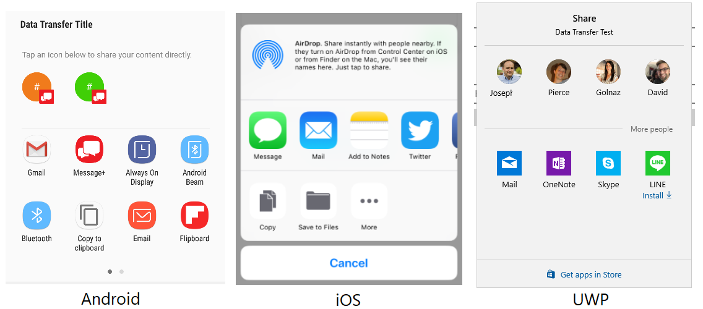

# Xamarin.Essentials Data Transfer


The **DataTransfer** class enables an application to share data such as text and web links to other applications on the device.

## Using Data Transfer

Add a reference to Xamarin.Essentials in your class:

```csharp
using Xamarin.Essentials;
```

The Data Transfer functionality works by calling the `RequestAsync` method with a data request payload that includes information to share to other applications. Text and Uri can be mixed and each platform will handle filtering based on content.

```csharp

public class DataTransferTest
{
    public async Task ShareText(string text)
    {
        await DataTransfer.RequestAsync(new ShareTextRequest
            {
                Text = text,
                Title = "Share Text"
            });
    }

    public async Task ShareUri(string uri)
    {
        await DataTransfer.RequestAsync(new ShareTextRequest
            {
                Uri = uri,
                Title = "Share Web Link"
            });
    }
}
```

User interface to share to external application that appears when request is made:



## Platform Differences

| Platform | Difference |
| --- | --- |
| Android | Subject property is used for desired subject of a message. |
| iOS | Subject not used. |
| iOS | Title not used. |
| UWP | Title will default to Application Name if not set. |
| UWP | Subject not used. |

## API

- [Data Transfer source code](https://github.com/xamarin/Essentials/tree/master/Xamarin.Essentials/DataTransfer)
- [Data Transfer API documentation](xref:Xamarin.Essentials.DataTransfer)
