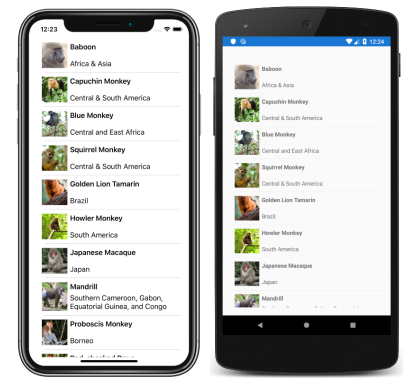

Previously, the [`ListView`](xref:Xamarin.Forms.ListView) was populated with data using data binding. However, despite data binding to a collection, where each object in the collection defined multiple items of data, only a single item of data was displayed per object (the `Name` property of the `Monkey` object).

In this exercise, you will modify the **ListViewTutorial** project so that the [`ListView`](xref:Xamarin.Forms.ListView) displays multiple items of data in each row.

# [Visual Studio](#tab/vswin)

1. In **MainPage.xaml**, modify the [`ListView`](xref:Xamarin.Forms.Image) declaration to customize the appearance of each row:

    ```xaml
    <ListView ItemsSource="{Binding Monkeys}"
              HasUnevenRows="true"
              ItemSelected="OnListViewItemSelected"
              ItemTapped="OnListViewItemTapped">
        <ListView.ItemTemplate>
            <DataTemplate>
                <ViewCell>
                    <Grid Padding="10">
                        <Grid.RowDefinitions>
                            <RowDefinition Height="Auto" />
                            <RowDefinition Height="*" />
                        </Grid.RowDefinitions>
                        <Grid.ColumnDefinitions>
                            <ColumnDefinition Width="Auto" />
                            <ColumnDefinition Width="*" />
                        </Grid.ColumnDefinitions>
                        <Image Grid.RowSpan="2"
                               Source="{Binding ImageUrl}"
                               Aspect="AspectFill"
                               HeightRequest="60"
                               WidthRequest="60" />
                        <Label Grid.Column="1"
                               Text="{Binding Name}"
                               FontAttributes="Bold" />
                        <Label Grid.Row="1"
                               Grid.Column="1"
                               Text="{Binding Location}"
                               VerticalOptions="End" />
                    </Grid>
                </ViewCell>
            </DataTemplate>
        </ListView.ItemTemplate>
    </ListView>
    ```

    This code sets the [`ListView.ItemTemplate`](xref:Xamarin.Forms.ItemsView`1.ItemTemplate) property to a [`DataTemplate`](xref:Xamarin.Forms.DataTemplate), which defines the appearance of each row in the [`ListView`](xref:Xamarin.Forms.ListView). The child of the `DataTemplate` must be of, or derive from, type [`Cell`](xref:Xamarin.Forms.Cell). This code uses a [`ViewCell`](xref:Xamarin.Forms.ViewCell), which derives from `Cell`, to create a custom layout for each `ListView` row. Layout inside the `ViewCell` is managed here by a [`Grid`](xref:Xamarin.Forms.Grid), which contains an [`Image`](xref:Xamarin.Forms.Image) object and two [`Label`](xref:Xamarin.Forms.Label) objects. The `Image` object data binds its [`Source`](xref:Xamarin.Forms.Image.Source) property to the `ImageUrl` property of each `Monkey` object, while the `Label` objects bind their [`Text`](xref:Xamarin.Forms.Label.Text) properties to the `Name` and `Location` properties of each `Monkey` object.

    By default, all rows in a [`ListView`](xref:Xamarin.Forms.ListView) have the same height. However, this code sets the [`ListView.HasUnevenRows`](xref:Xamarin.Forms.ListView.HasUnevenRows) property to `true` so that row height can be sized to its content. This accommodates the `Name` and `Location` properties of each `Monkey` object having variable length strings.

    For more information about [`ListView`](xref:Xamarin.Forms.ListView) cell appearance, see [Customizing ListView Cell Appearance](~/xamarin-forms/user-interface/listview/customizing-cell-appearance.md). For more information about data templates, see [Xamarin.Forms Data Templates](~/xamarin-forms/app-fundamentals/templates/data-templates/index.md).

1. In the Visual Studio toolbar, press the **Start** button (the triangular button that resembles a Play button) to launch the application inside your chosen remote iOS simulator or Android emulator:

    [](../images/customize-cell-appearance-large.png#lightbox "ListView displaying templated data")

# [Visual Studio for Mac](#tab/vsmac)

1. In **MainPage.xaml**, modify the [`ListView`](xref:Xamarin.Forms.Image) declaration to customize the appearance of each row:

    ```xaml
    <ListView ItemsSource="{Binding Monkeys}"
              HasUnevenRows="true"
              ItemSelected="OnListViewItemSelected"
              ItemTapped="OnListViewItemTapped">
        <ListView.ItemTemplate>
            <DataTemplate>
                <ViewCell>
                    <Grid Padding="10">
                        <Grid.RowDefinitions>
                            <RowDefinition Height="Auto" />
                            <RowDefinition Height="*" />
                        </Grid.RowDefinitions>
                        <Grid.ColumnDefinitions>
                            <ColumnDefinition Width="Auto" />
                            <ColumnDefinition Width="*" />
                        </Grid.ColumnDefinitions>
                        <Image Grid.RowSpan="2"
                               Source="{Binding ImageUrl}"
                               Aspect="AspectFill"
                               HeightRequest="60"
                               WidthRequest="60" />
                        <Label Grid.Column="1"
                               Text="{Binding Name}"
                               FontAttributes="Bold" />
                        <Label Grid.Row="1"
                               Grid.Column="1"
                               Text="{Binding Location}"
                               VerticalOptions="End" />
                    </Grid>
                </ViewCell>
            </DataTemplate>
        </ListView.ItemTemplate>
    </ListView>
    ```

    This code sets the [`ListView.ItemTemplate`](xref:Xamarin.Forms.ItemsView`1.ItemTemplate) property to a [`DataTemplate`](xref:Xamarin.Forms.DataTemplate), which defines the appearance of each row in the [`ListView`](xref:Xamarin.Forms.ListView). The child of the `DataTemplate` must be of, or derive from, type [`Cell`](xref:Xamarin.Forms.Cell). This code uses a [`ViewCell`](xref:Xamarin.Forms.ViewCell), which derives from `Cell`, to create a custom layout for each `ListView` row. Layout inside the `ViewCell` is managed here by a [`Grid`](xref:Xamarin.Forms.Grid), which contains an [`Image`](xref:Xamarin.Forms.Image) object and two [`Label`](xref:Xamarin.Forms.Label) objects. The `Image` object data binds its [`Source`](xref:Xamarin.Forms.Image.Source) property to the `ImageUrl` property of each `Monkey` object, while the `Label` objects bind their [`Text`](xref:Xamarin.Forms.Label.Text) properties to the `Name` and `Location` properties of each `Monkey` object.

    By default, all rows in a [`ListView`](xref:Xamarin.Forms.ListView) have the same height. However, this code sets the [`ListView.HasUnevenRows`](xref:Xamarin.Forms.ListView.HasUnevenRows) property to `true` so that row height can be sized to its content. This accommodates the `Name` and `Location` properties of each `Monkey` object having variable length strings.

    For more information about [`ListView`](xref:Xamarin.Forms.ListView) cell appearance, see [Customizing ListView Cell Appearance](~/xamarin-forms/user-interface/listview/customizing-cell-appearance.md). For more information about data templates, see [Xamarin.Forms Data Templates](~/xamarin-forms/app-fundamentals/templates/data-templates/index.md).

1. In the Visual Studio for Mac toolbar, press the **Start** button (the triangular button that resembles a Play button) to launch the application inside your chosen iOS simulator or Android emulator:

    [](../images/customize-cell-appearance-large.png#lightbox "ListView displaying templated data")
