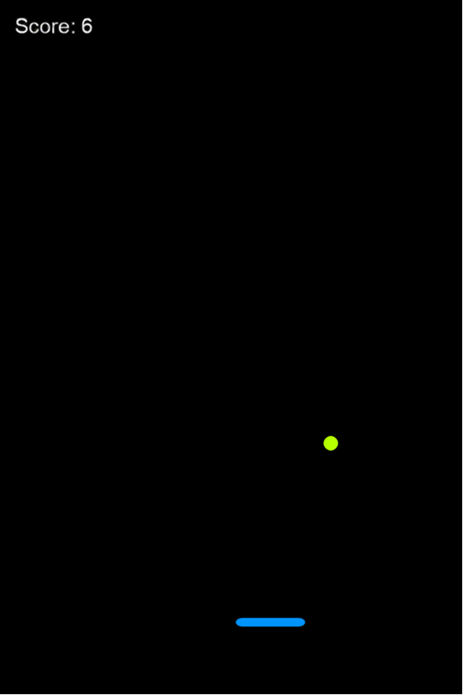

# Introduction to Game Development with CocosSharp

_This multi-part walkthrough shows how to create a simple 2D game using CocosSharp. It covers common game programming concepts such as graphics, input, and physics._

The CocosSharp 2D game engine provides technology for making cross-platform games. For a full list of supported platforms see the [CocosSharp wiki on GitHub](https://github.com/mono/CocosSharp/wiki). This tutorial will use C# for code samples, although CocosSharp is fully functional with F# as well.

The core of CocosSharp is provided by the [MonoGame framework](http://www.monogame.net/), which is itself a cross-platform, hardware accelerated API providing graphics, audio, game state management, input, and a content pipeline for importing assets. CocosSharp is an efficient abstraction layer well suited for 2D games. Furthermore, larger games can perform their own optimizations outside of their core libraries as games grows in complexity. In other words, CocosSharp provides a mix of ease of use and performance, enabling developers to get started quickly without limiting game size or complexity.

The first section of this walkthrough focus on setting up an empty project.  The second part covers writing all of our game logic. 

By the end of this walkthrough we will have created a simple game where the player’s goal is to slide a paddle horizontally to attempt to keep a ball from falling off of the screen. Each bounce will increase the player’s score by one point.

# Walkthrough Parts

* [Part 1 – Creating a CocosSharp Project](~/graphics-games/cocossharp/first-game/part1.md)
* [Part 2 – Implementing the BouncingGame](~/graphics-games/cocossharp/first-game/part2.md)

## Related Links

- [Game Content (sample)](https://github.com/xamarin/mobile-samples/blob/master/BouncingGame/Resources/Content.zip?raw=true)
- [Completed project (sample)](https://developer.xamarin.com/samples/mobile/BouncingGame/)
- [CocosSharp PCL on NuGet](http://www.nuget.org/packages/CocosSharp.PCL.Shared/)
- [CocosSharp API Documentation](https://developer.xamarin.com/api/namespace/CocosSharp/)
