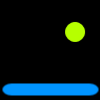

# CocosSharp

CocosSharp is an easy to use library for 2D games using C# and F#. It is a .NET port of the popular Cocos2D engine.

## Introduction to CocosSharp

###  Developing Cross-platform 2D Games in C# and CocosSharp Video

This hands-on video shows how to create a simple cross-platform CocosSharp game.

<iframe src="//channel9.msdn.com/Shows/Visual-Studio-Toolbox/Developing-Cross-platform-2D-Games-in-C-and-CocosSharp/player" width="800" height="450" allowFullScreen frameBorder="0"></iframe>

###  [Introduction to Game Development with CocosSharp](~/graphics-games/cocossharp/first-game/index.md)

This multi-part walkthrough shows how to create a simple 2D game using CocosSharp. It covers common game programming concepts such as graphics, input, and physics.

##  [Fruity Falls Game Details](~/graphics-games/cocossharp/fruity-falls.md)

This guide reviews the Fruity Falls game, covering common CocosSharp and game development concepts such as physics, content management, game state, and game design.  

## [Coin Time](~/graphics-games/cocossharp/cointime.md)

Coin Time is a full platformer game for iOS and Android. The goal of the game is to collect all of the coins in a level and then reach the exit door while avoiding enemies and obstacles.

## [Drawing Geometry with CCDrawNode](~/graphics-games/cocossharp/ccdrawnode.md)

CCDrawNode provides methods for drawing primitive objects such as lines, circles, and triangles.

## [Animating with CCAction](~/graphics-games/cocossharp/ccaction.md)

`CCAction` is a base class which can be used to animate CocosSharp objects. This guide covers built-in `CCAction` implementations for common tasks such as positioning, scaling, and rotating. It also looks at how to create custom implementations by inheriting from `CCAction`.

## [Using Tiled with CocosSharp](~/graphics-games/cocossharp/tiled.md)

Tiled is a powerful, flexible, and mature application for creating orthogonal and isometric tile maps for games. CocosSharp provides built-in integration for Tiled’s native file format.

##  [Entities in CocosSharp](~/graphics-games/cocossharp/entities.md)

The entity pattern is a powerful way to organize game code. It improves readability, makes code easier to maintain, and leverages built-in parent/child functionality.

##  [Handling Multiple Resolutions in CocosSharp](~/graphics-games/cocossharp/resolutions.md)

This guide shows how to work with CocosSharp to develop games that display properly on devices of varying resolutions.

##  [CocosSharp Content Pipeline](~/graphics-games/cocossharp/content-pipeline/index.md)

Content Pipelines are often used in game development to optimize content and format it such that it can be loaded on certain hardware or with certain game development frameworks.

## [Improving Framerate with CCSpriteSheet](~/graphics-games/cocossharp/ccspritesheet.md)

`CCSpriteSheet` provides functionality for combining and using many image files in one texture. Reducing texture count can improve a game’s load times and framerate.

## [Texture Caching using CCTextureCache](~/graphics-games/cocossharp/texture-cache.md)

CocosSharp’s CCTextureCache class provides a standard way to organize, cache, and unload content. 

## [2D Math with CocosSharp](~/graphics-games/cocossharp/math.md)

This guide covers 2D mathematics for game development. It uses CocosSharp to show how to perform common game development tasks and explains the math behind these tasks.

## [Performance and Visual Effects with CCRenderTexture](~/graphics-games/cocossharp/ccrendertexture.md)

The `CCRenderTexture` class provides functionality for rendering multiple CocosSharp objects to a single texture. Once created, `CCRenderTexture` instances can be used to render graphics efficiently and to implement visual effects.

 
