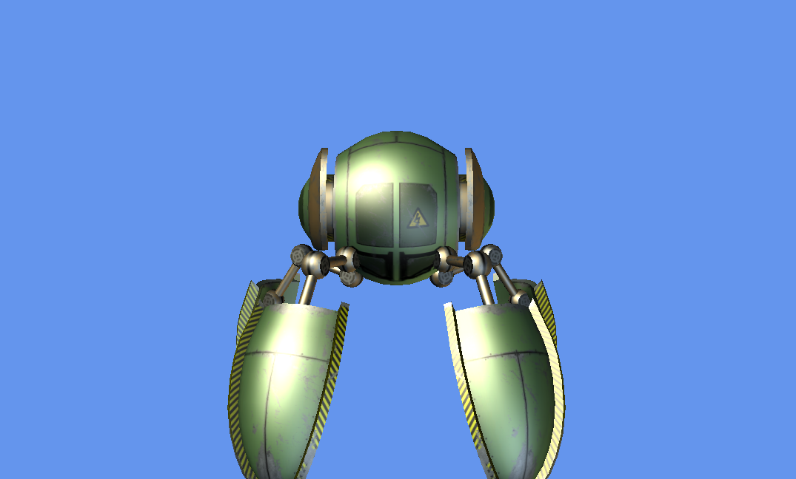
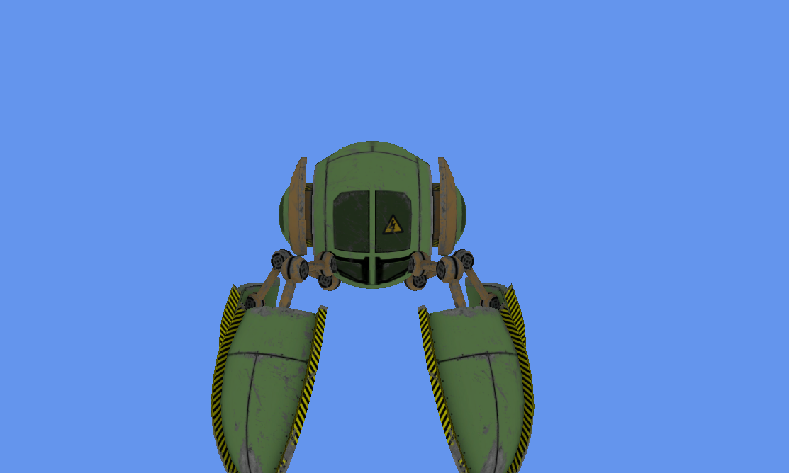
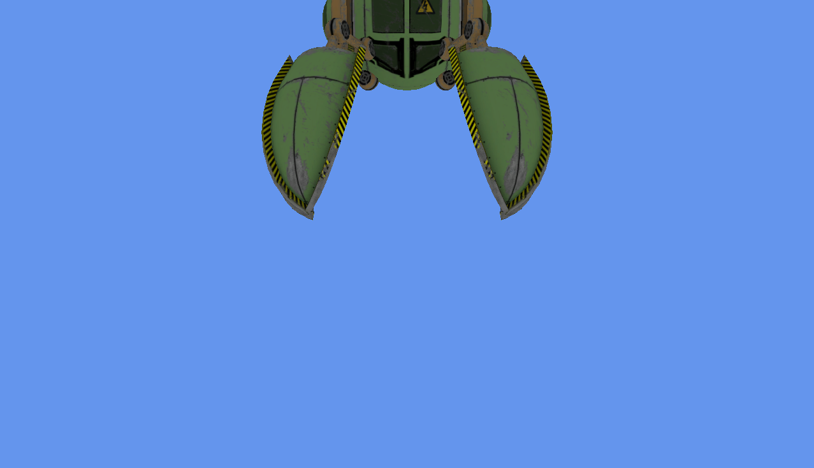
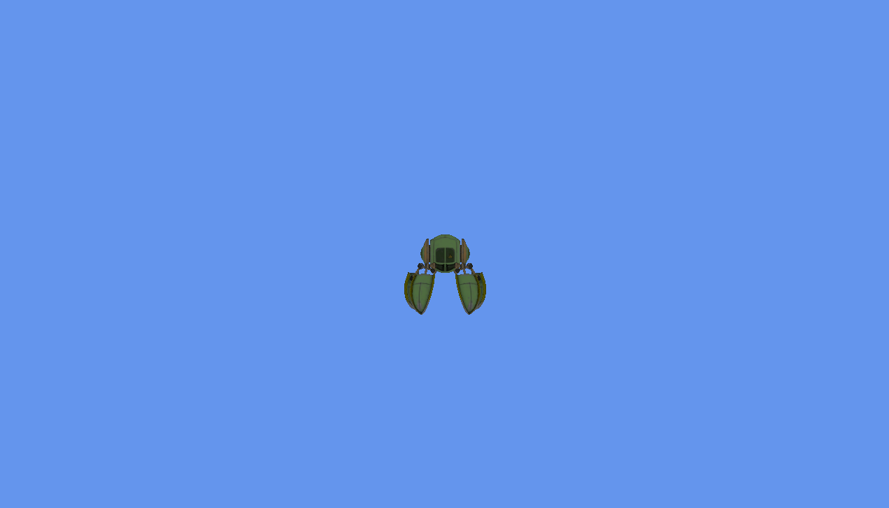

# Using the Model Class

_The Model class greatly simplifies rendering complex 3D objects when compared to the traditional method of rendering 3D graphics. Model objects are created from content files, allowing for easy integration of content with no custom code._

The MonoGame API includes a `Model` class which can be used to store data loaded from a content file and to perform rendering. Model files may be very simple (such as a solid colored triangle) or may include information for complex rendering, including texturing and lighting.

This walkthrough uses [a 3D model of a robot](https://github.com/xamarin/mobile-samples/blob/master/ModelRenderingMG/Resources/Content.zip?raw=true) and covers the following:

 - Starting a new game project
 - Creating XNBs for the model and its texture
 - Including the XNBs in the game project
 - Drawing a 3D Model
 - Drawing multiple Models

When finished, our project will appear as follows:


# Creating an Empty Game Project

We’ll need to set up a game project first called MonoGame3D. For information on creating a new MonoGame project, see [this walkthrough on creating a Cross Platform Monogame Project](~/graphics-games/monogame/introduction/part1.md).

Before moving on we should verify that the project opens and deploys correctly. Once deployed we should see an empty blue screen:


# Including the XNBs in the Game Project

The .xnb file format is a standard extension for built content (content which has been created by the [MonoGame Pipeline Tool](http://www.monogame.net/documentation/?page=Pipeline)). All built content has a source file (which is an .fbx file in the case of our model) and a destination file (an .xnb file). The .fbx format is a common 3D model format which can be created by applications such as [Maya](http://www.autodesk.com/products/maya/overview) and [Blender](http://www.blender.org/). 

The `Model` class can be constructed by loading an .xnb file from a disk that contains 3D geometry data.   This .xnb file is created through a content project. Monogame templates automatically include a content project (with the extension .mgcp) in our Content folder. For a detailed discussion on the MonoGame Pipeline tool, see the [Content Pipeline guide](~/graphics-games/cocossharp/content-pipeline/index.md).

For this guide we'll skip over using the MonoGame Pipeline tool and will use the .XNB files included here. Note that the .XNB files differ per platform, so be sure to use the correct set of XNB files for whichever platform you are working with.

We'll unzip the [Content.zip file](https://github.com/xamarin/mobile-samples/blob/master/ModelRenderingMG/Resources/Content.zip?raw=true) so that we can use the contained .xnb files in our game. If working on an Android project, right-click on the **Assets** folder in the **WalkingGame.Android** project. If working on an iOS project, right-click on the **WalkingGame.iOS** project. Select **Add->Add Files...** and select both .xnb files in the folder for the platform you are working on.

The two files should be part of our project now:


Visual Studio for Mac may not automatically set the build action for newly-added XNBs. 
For iOS, right-click on each of the files and select **Build Action->BundleResource**. For Android, right-click on each of the files and select **Build Action->AndroidAsset**.

# Rendering a 3D Model

The last step necessary to see the model on-screen is to add the loading and drawing code. Specifically, we’ll be doing the following:

 - Defining a `Model` instance in our `Game1` class
 - Loading the `Model` instance in `Game1.LoadContent`
 - Drawing the `Model` instance in `Game1.Draw`

Replace the `Game1.cs` code file (which is located in the **WalkingGame** PCL) with the following:


```csharp
public class Game1 : Game
{
    GraphicsDeviceManager graphics;

    // This is the model instance that we'll load
    // our XNB into:
    Model model;

    public Game1()
    {
        graphics = new GraphicsDeviceManager(this);
        graphics.IsFullScreen = true;
                    
        Content.RootDirectory = "Content";
    }
    protected override void LoadContent()
    {
        // Notice that loading a model is very similar
        // to loading any other XNB (like a Texture2D).
        // The only difference is the generic type.
        model = Content.Load<Model> ("robot");
    }

    protected override void Update(GameTime gameTime)
    {
        base.Update(gameTime);
    }

    protected override void Draw(GameTime gameTime)
    {
        GraphicsDevice.Clear(Color.CornflowerBlue);

        // A model is composed of "Meshes" which are
        // parts of the model which can be positioned
        // independently, which can use different textures,
        // and which can have different rendering states
        // such as lighting applied.
        foreach (var mesh in model.Meshes)
        {
            // "Effect" refers to a shader. Each mesh may
            // have multiple shaders applied to it for more
            // advanced visuals. 
            foreach (BasicEffect effect in mesh.Effects)
            {
                // We could set up custom lights, but this
                // is the quickest way to get somethign on screen:
                effect.EnableDefaultLighting ();
                // This makes lighting look more realistic on
                // round surfaces, but at a slight performance cost:
                effect.PreferPerPixelLighting = true;

                // The world matrix can be used to position, rotate
                // or resize (scale) the model. Identity means that
                // the model is unrotated, drawn at the origin, and
                // its size is unchanged from the loaded content file.
                effect.World = Matrix.Identity;

                // Move the camera 8 units away from the origin:
                var cameraPosition = new Vector3 (0, 8, 0);
                // Tell the camera to look at the origin:
                var cameraLookAtVector = Vector3.Zero;
                // Tell the camera that positive Z is up
                var cameraUpVector = Vector3.UnitZ;

                effect.View = Matrix.CreateLookAt (
                    cameraPosition, cameraLookAtVector, cameraUpVector);

                // We want the aspect ratio of our display to match
                // the entire screen's aspect ratio:
                float aspectRatio = 
                    graphics.PreferredBackBufferWidth / (float)graphics.PreferredBackBufferHeight;
                // Field of view measures how wide of a view our camera has.
                // Increasing this value means it has a wider view, making everything
                // on screen smaller. This is conceptually the same as "zooming out".
                // It also 
                float fieldOfView = Microsoft.Xna.Framework.MathHelper.PiOver4;
                // Anything closer than this will not be drawn (will be clipped)
                float nearClipPlane = 1;
                // Anything further than this will not be drawn (will be clipped)
                float farClipPlane = 200;

                effect.Projection = Matrix.CreatePerspectiveFieldOfView(
                    fieldOfView, aspectRatio, nearClipPlane, farClipPlane);

            }

            // Now that we've assigned our properties on the effects we can
            // draw the entire mesh
            mesh.Draw ();
        }
        base.Draw(gameTime);
    }
}
                                                                                                                 
```

If we run this code we’ll see the model on-screen:



Let’s look at some of the more important parts of the code above.


## Model class

The `Model` class is the core class for performing 3D rendering from content files (such as .fbx files). It contains all of the information necessary for rendering, including the 3D geometry, the texture references, and `BasicEffect` instances which control positioning, lighting, and camera values.

The `Model` class itself does not directly have variables for positioning since a single model instance can be rendered in multiple locations, as we’ll show later in this guide.

Each `Model` is composed of one or more `ModelMesh` instances, which are exposed through the `Meshes` property. Although we may consider a `Model` as a single game object (such as a robot or a car), each `ModelMesh` can be drawn with different `BasicEffect` values. For example, individual mesh parts may represent the legs of a robot or the wheels on a car, and we may assign the `BasicEffect` values to make the wheels spin or the legs move. 


## BasicEffect Class

The `BasicEffect` class provides properties for controlling rendering options. The first modification we make to the `BasicEffect` is to call the `EnableDefaultLighting` method. As the name implies, this enables default lighting, which is very handy for verifying that a `Model` appears in-game as expected. If we comment out the `EnableDefaultLighting` call, then we’ll see the model rendered with just its texture, but with no shading or specular glow:


```csharp
//effect.EnableDefaultLighting (); 
```



The `World` property can be used to adjust the position, rotation, and scale of the model. The code above uses the `Matrix.Identity` value, which means that the `Model` will render in-game exactly as specified in the .fbx file. We’ll be covering matrices and 3D coordinates in more detail in [part 3](~/graphics-games/monogame/3d/part3.md), but as an example we can change the position of the `Model` by changing the `World` property as follows:


```csharp
// Z is up, so changing Z to 3 moves the object up 3 units:
var modelPosition = new Vector3 (0, 0, 3);
effect.World = Matrix.CreateTranslation (modelPosition); 
```

This code results in the object being moved up by 3 world units:



The final two properties assigned on the `BasicEffect` are `View` and `Projection`. We’ll be covering 3D cameras in [part 3](~/graphics-games/monogame/3d/part3.md), but as an example, we can modify the position of the camera by changing the local `cameraPosition` variable:


```csharp
// The 8 has been changed to a 30 to move the Camera further back
var cameraPosition = new Vector3 (0, 30, 0);
```

We can see the camera has moved further back, resulting in the `Model` appearing smaller due to perspective:




# Rendering Multiple Models

As mentioned above, a single `Model` can be drawn multiple times. To make this easier we will be moving the `Model` drawing code into its own method that takes the desired `Model` position as a parameter. Once finished, our `Draw` and `DrawModel` methods will look like:


```csharp
protected override void Draw(GameTime gameTime)
{
	GraphicsDevice.Clear(Color.CornflowerBlue);
	DrawModel (new Vector3 (-4, 0, 0));
	DrawModel (new Vector3 ( 0, 0, 0));
	DrawModel (new Vector3 ( 4, 0, 0));
	DrawModel (new Vector3 (-4, 0, 3));
	DrawModel (new Vector3 ( 0, 0, 3));
	DrawModel (new Vector3 ( 4, 0, 3));
	base.Draw(gameTime);
}
void DrawModel(Vector3 modelPosition)
{
	foreach (var mesh in model.Meshes)
	{
		foreach (BasicEffect effect in mesh.Effects)
		{
			effect.EnableDefaultLighting ();
			effect.PreferPerPixelLighting = true;
			effect.World = Matrix.CreateTranslation (modelPosition);
			var cameraPosition = new Vector3 (0, 10, 0);
			var cameraLookAtVector = Vector3.Zero;
			var cameraUpVector = Vector3.UnitZ;
			effect.View = Matrix.CreateLookAt (
				cameraPosition, cameraLookAtVector, cameraUpVector);
			float aspectRatio = 
				graphics.PreferredBackBufferWidth / (float)graphics.PreferredBackBufferHeight;
			float fieldOfView = Microsoft.Xna.Framework.MathHelper.PiOver4;
			float nearClipPlane = 1;
			float farClipPlane = 200;
			effect.Projection = Matrix.CreatePerspectiveFieldOfView(
				fieldOfView, aspectRatio, nearClipPlane, farClipPlane);
		}
		// Now that we've assigned our properties on the effects we can
		// draw the entire mesh
		mesh.Draw ();
	}
}
```

This results in the robot Model being drawn six times:


# Summary

This walkthrough introduced MonoGame’s `Model` class. It covers converting an .fbx file into an .xnb, which can in-turn be loaded into a `Model` class. It also shows how modifications to a `BasicEffect` instance can impact `Model` drawing.

## Related Links

- [MonoGame Model Reference](http://www.monogame.net/documentation/?page=T_Microsoft_Xna_Framework_Graphics_Model)
- [Content.zip](https://github.com/xamarin/mobile-samples/blob/master/ModelRenderingMG/Resources/Content.zip?raw=true)
- [Completed project (sample)](https://developer.xamarin.com/samples/mobile/ModelRenderingMG/)
