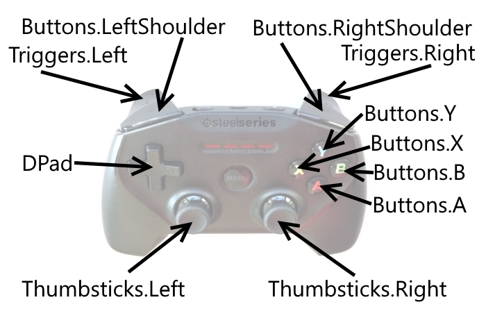
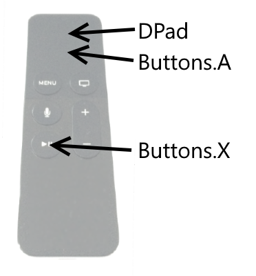

# MonoGame GamePad Reference

_GamePad is a standard, cross-platform class for accessing input devices in MonoGame._

`GamePad` can be used to read input from input devices on multiple MonoGame platforms. This guide shows how to work with the GamePad class. Since each input device differs in layout and the number of buttons it provides, this guide includes diagrams that show the various device mappings.


# GamePad as a Replacement for Xbox360GamePad

The original XNA API provided the `Xbox360GamePad` class for reading input from a game controller on the Xbox 360 or PC. MonoGame has replaced this with a `GamePad` class since Xbox 360 controllers cannot be used on most MonoGame platforms (such as iOS or Xbox One). Despite the name change, the usage of the `GamePad` class is similar to the `Xbox360GamePad` class.


# Reading Input from GamePad

The `GameController` class provides a standardized way of reading input on any MonoGame platform. It provides information through two methods:

 - `GetState` – returns the current state of the controller’s buttons, analog sticks, and d-pad.
 - `GetCapabilities` – returns information about the capabilities of hardware, such as whether the controller has certain buttons or supports vibration.


## Example: Moving a Character

The following code shows how the left thumb stick can be used to move a character by setting its `XVelocity` and `YVelocity` properties. This code assumes that `characterInstance` is an instance of an object which has `XVelocity` and `YVelocity` properties:


```csharp
// In Update, or some code called every frame:
var gamePadState = GamePad.GetState(PlayerIndex.One);
// Use gamePadState to move the character
characterInstance.XVelocity = gamePadState.ThumbSticks.Left.X * characterInstance.MaxSpeed;
characterInstance.YVelocity = gamePadState.ThumbSticks.Left.Y * characterInstance.MaxSpeed;
```


## Example: Detecting Pushes

`GamePadState` provides information about the current state of the controller, such as whether a certain button is pressed. Certain actions, such as making a character jump, require checking if the button was pushed (was not down last frame, but is down this frame) or released (was down last frame, but not down this frame). 

To perform this type of logic, local variables that store the previous frame’s `GamePadState` and the current frame’s `GamePadState` must be created. The following example shows how to store and use the previous frame’s `GamePadState` to implement jumping:


```csharp
// At class scope:
// Store the last frame's and this frame's GamePadStates.
// "new" them so that code doesn't have to perform null checks:
GamePadState lastFrameGamePadState = new GamePadState();
GamePadState currentGamePadState = new GamePadState();
protected override void Update(GameTime gameTime)
{
    // store off the last state before reading the new one:
    lastFrameGamePadState = currentGamePadState;
    currentGamePadState = GamePad.GetState(PlayerIndex.One);
    bool wasAButtonPushed = 
currentGamePadState.Buttons.A == ButtonState.Pressed
        && lastFrameGamePadState.Buttons.A == ButtonState.Released;
    if(wasAButtonPushed)
    {
        MakeCharacterJump();
    }
...
}
```


## Example: Checking for Buttons

`GetCapabilities` can be used to check if a controller has certain hardware, such as a particular button or analog stick. The following code shows how to check for the B and Y buttons on a controller in a game which requires the presence of both buttons:


```csharp
var capabilities = GamePad.GetCapabilities(PlayerIndex.One);
bool hasBButton = capabilities.HasBButton;
bool hasXButton = capabilities.HasXButton;
if(!hasBButton || !hasXButton)
{
    NotifyUserOfMissingButtons();
}
```


# iOS

iOS apps support wireless game controller input.

> [!IMPORTANT]
> The NuGet packages for MonoGame 3.5 do not include support for wireless game controllers. Using the GamePad class on iOS requires building MonoGame 3.5 from source or using the MonoGame 3.6 NuGet binaries. 


## iOS Game Controller

The `GamePad` class returns properties read from wireless controllers. The properties in the `GamePad` provide good coverage for the standard iOS controller hardware, as shown in the following diagram:




# Apple TV

Apple TV games can use the Siri Remote or wireless game controllers for input.


## Siri Remote

*Siri Remote* is the native input device for Apple TV. Although values from the Siri Remote can be read through events (as shown in the [Siri Remote and Bluetooth Controllers guide](~/ios/tvos/platform/remote-bluetooth.md)), the `GamePad` class can return values from the Siri Remote.

Notice that `GamePad` can only read input from the play button and touch surface: 



Since the touch surface movement is read through the `DPad` property, movement values are reported using the `ButtonState` class. In other words, values are only available as `ButtonState.Pressed` or `ButtonState.Released`, as opposed to numerical values or gestures.


## Apple TV Game Controller

Game controllers for Apple TV behave identically to game controllers for iOS apps. For more information, see the [iOS Game Controller section](#iOS_Game_Controller). 


# Xbox One

The Xbox One console supports reading input from an Xbox One game controller.


## Xbox One Game Controller

The Xbox One game controller is the most common input device for the Xbox One. The `GamePad` class provides input values from the game controller hardware.


# Summary

This guide provided an overview of MonoGame’s `GamePad` class, how to implement input-reading logic, and diagrams of common `GamePad` implementations.

## Related Links

- [MonoGame GamePad](http://www.monogame.net/documentation/?page=T_Microsoft_Xna_Framework_Input_GamePad)
