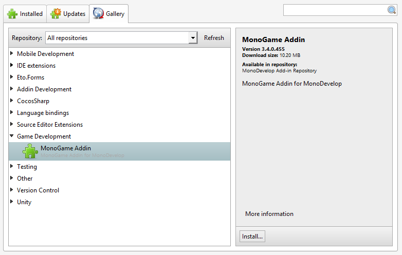
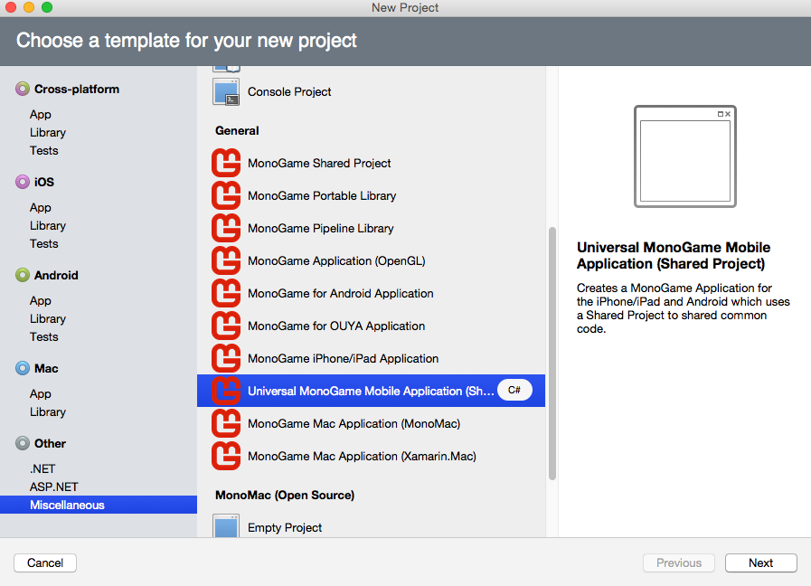
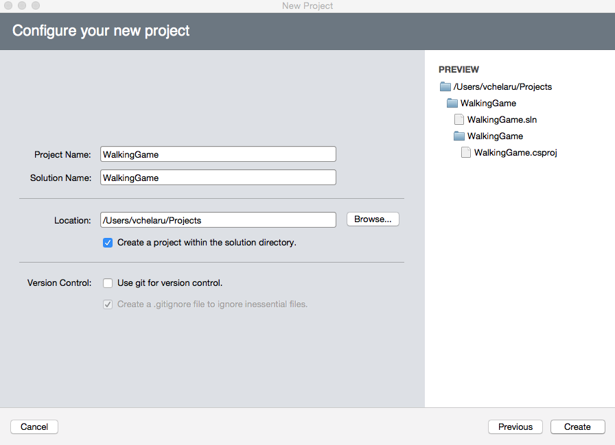
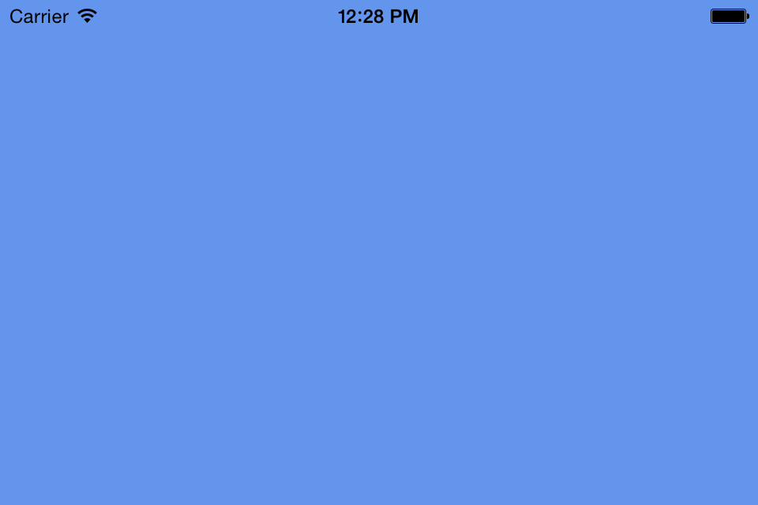

# Part 1 – Creating a Cross Platform MonoGame

_This walkthrough shows how to create a new project for iOS and Android using MonoGame. The result is a Visual Studio for Mac solution with a cross-platform shared code project as well as one project for each platform. This project will display an empty blue screen when executed._

MonoGame enables the development of cross-platform games with large portion of code reuse. This walkthrough will focus on setting up a solution which contains projects for iOS and Android, as well as a shared code project for cross-platform code.

When we’re done, we'll have a project that has the proper structure for performing game update logic and game drawing logic at 30 frames per second. It can be used as the base project for any MonoGame project. Our project will look like this when executed:


# Adding MonoGame to Visual Studio for Mac

MonoGame can be added as an add-in to Visual Studio for Mac. On Mac, select **Visual Studio for Mac** > **Add-in Manager...** . On Windows, select** Tools **> **Add-in Manager...** . Select the **Gallery** tab, expand the **Game Development** category and select **MonoGame Addin**, then click **Install**:



> [!IMPORTANT]
> **Note**: If the **Game Development** section does not appear in the Add-in Manager, you can manually download and install the latest version from here: http://www.monogame.net/downloads/. You may need to restart Visual Studio for Mac for the templates to appear.


Once installed, MonoGame templates will appear in Visual Studio for Mac, as we will see in the next section.


# Creating a new solution

In Visual Studio for Mac select **File > New Solution**. In the **New Project** dialog, click on **Miscellaneous**, scroll to the **General** section, select the **Universal MonoGame Mobile application **option, and click Next.



Name the project WalkingGame and click Create:



Now our project will execute just like any other iOS or Android project. The project should run displaying a cornflower blue background:




# Fixing Android Compile Errors

The current version of MonoGame’s templates includes a few syntax errors in the Android’s `Activity1.cs` file. To fix these problems, replace the `OnCreate` function with the following:


```csharp
protected override void OnCreate (Bundle bundle)
{
    base.OnCreate (bundle);

    var g = new Game1();
    SetContentView((View)g.Services.GetService(typeof(View)));
    g.Run();
}
```


# Summary

This walkthrough covered how to create a cross-platform MonoGame project using Visual Studio for Mac. The result of this is an empty blue screen. This project can be used as the starting point for any iOS and Android game.

## Related Links

- [MonoGame Android NuGet](https://www.nuget.org/packages/MonoGame.Framework.Android/)
- [MonoGame iOS NuGet](https://www.nuget.org/packages/MonoGame.Framework.iOS/)
- [MonoGame API Documentation](http://www.monogame.net/documentation/?page=main)
