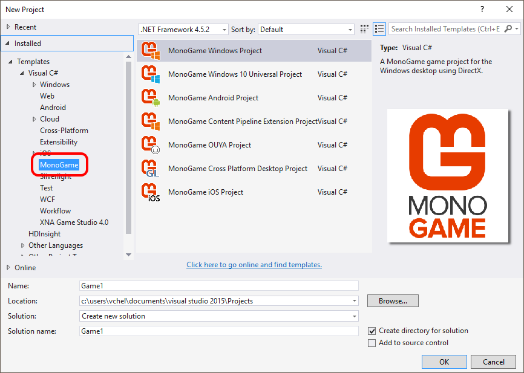
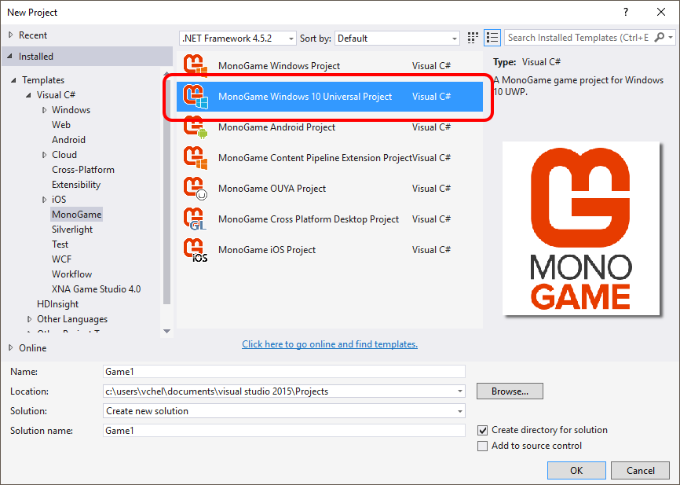
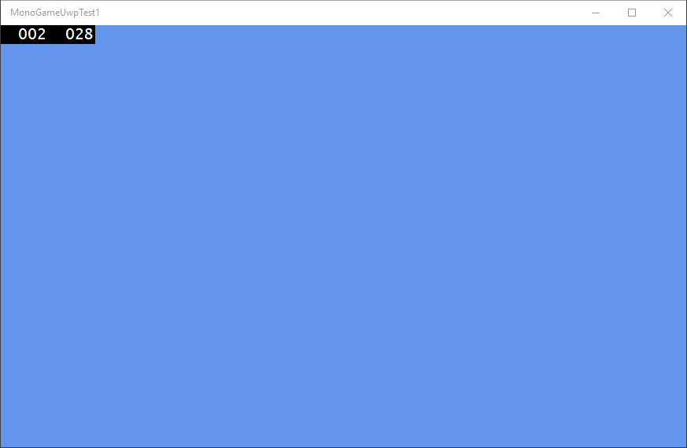
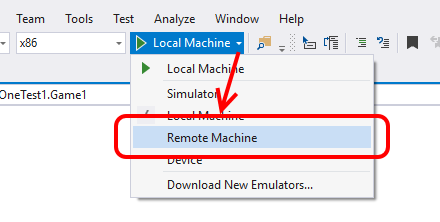
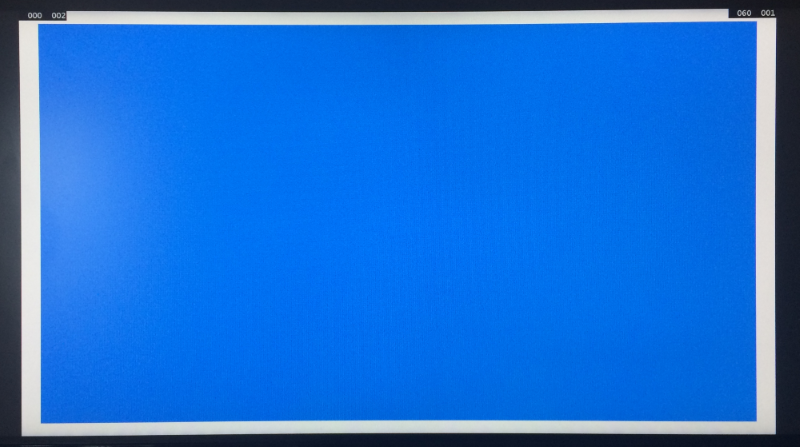
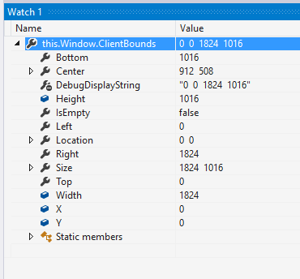

# Creating a MonoGame UWP project

_MonoGame can be used to create games and apps for Universal Windows Platform, targeting multiple devices with one codebase and one set of content._

This walkthrough covers MonoGame Universal Windows Platform (UWP) project creation and content loading. UWP apps can run on all Windows 10 devices, including desktops, tablets, Windows Phones, and Xbox One.

This walkthrough creates an empty project which displays a *cornflower blue* background (the traditional background color of XNA apps).

## Requirements

Developing MonoGame UWP apps requires:

- Windows 10 operating system
- Any version of Visual Studio 2015
- Windows 10 developer tools
- Setting device to developer mode
- [MonoGame 3.5 for Visual Studio](http://www.monogame.net/2016/03/17/monogame-3-5/) or newer

For more information, see this [page on setting up for Windows 10 UWP development](https://msdn.microsoft.com/windows/uwp/get-started/get-set-up).

Xbox One games can be developed on retail Xbox One hardware. Additional software is required on both the developing PC and the Xbox One. For information on configuring an Xbox One for game development, see this page on [setting up an Xbox One](https://msdn.microsoft.com/windows/uwp/xbox-apps/index).

## Creating an Empty Template

Once all required resources have been installed and developer mode has been enabled on the Windows 10 machine, we can create a new MonoGame project using Visual Studio by following these steps:

1. Select **File** > **New** > **Project...**
1. Select the **Installed** > **Templates** > **Visual C#** > **MonoGame** category: 

    

1. Select the **MonoGame Windows 10 Universal Project** option: 

    

1. Enter a name for the new project and click **OK**.
If Visual Studio displays any errors after clicking OK, verify that Windows 10 tools are installed and that the device is in developer mode.

Once Visual Studio finishes creating the template, we can run it to see the empty project running:



The numbers in the corners provide diagnostic information. This information can be removed  by deleting the code in `App.xaml.cs` in the `DEBUG` block in the `OnLaunched` method:


```csharp
protected override void OnLaunched(LaunchActivatedEventArgs e)
{
#if DEBUG
    if (System.Diagnostics.Debugger.IsAttached)
    {
        this.DebugSettings.EnableFrameRateCounter = true;
    }
#endif
    ...
```

## Running on Xbox One

UWP projects can deploy to any Windows 10 device from the same project. After setting up the Windows 10 development machine and the Xbox One, UWP apps can be deployed by switching the target to Remote Machine and entering the Xbox One's IP address:



On Xbox One, the white border represents the non-safe area for TVs. For more information, see the [safe area section](#Safe_Area_on_Xbox_One).



### Safe Area on Xbox One

Developing games for consoles requires considering the safe area, which is an area in the center of the screen which should contain all critical visuals (such as UI or HUD). The area outside of the safe area is not guaranteed to be visible on all televisions, so visuals placed in this area may be partly or fully invisible on some displays.

The MonoGame template for Xbox One considers the safe area and renders it as a white border. This area is also reflected at runtime in the game's `Window.ClientBounds` property as shown in this image of the watch window in Visual Studio. Notice that the height of the client bounds is 1016, despite 1920x1080 display resolution:



## Referencing Content in UWP Projects

Content in MonoGame projects can be referenced directly from file or through the [MonoGame Content Pipeline](~/graphics-games/cocossharp/content-pipeline/index.md). Small game projects may benefit from the simplicity of loading from file. Larger projects will benefit from using the content pipeline to optimize content to reduce size and load times. Unlike XNA on the Xbox 360, the `System.IO.File` class is available on Xbox One UWP apps.

For more information on loading content using the content pipeline, see the [Content Pipeline Guide](~/graphics-games/cocossharp/content-pipeline/index.md). 

### Loading Content From File

Unlike iOS and Android, UWP projects can reference files relative to the executable. Simple games can use this technique load content without needing to modify and build the content pipeline project.

To load a `Texture2D` from file:

1. Add a .png file to the Content folder in the UWP project. Adding content to the Content folder is a convention in XNA and MonoGame.
1. Right-click on the newly-added PNG and select Properties.
1. Change the **Copy to Output Directory** to **Copy if Newer**.
1. Add the following code to your game’s Initialize method to load a `Texture2D`:

	```csharp
	Texture2D texture;
	using (var stream = System.IO.File.OpenRead("Content/YourPngName.png"))
	{
	    texture = Texture2D.FromStream(graphics.GraphicsDevice, stream);
	}
	```

For more information on using a `Texture2D`, see the [Intro to MonoGame guide](~/graphics-games/monogame/introduction/index.md).

## Summary

This guide covers how to create a new UWP project and UWP-specific considerations when loading files. Developers who are interested in creating full UWP games can read more about MonoGame in the [Introduction to MonoGame Guide](~/graphics-games/monogame/introduction/index.md).