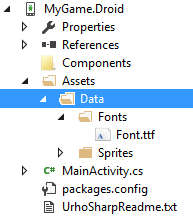

# UrhoSharp Android Support

_Android Specific Setup and Features_

While Urho is a portable class library, and allows the same API to be
used across the various platform for your game logic, you still need
to initialize Urho in your platform specific driver, and in some
cases, you will want to take advantage of platform specific features.

In the pages below, assume that `MyGame` is a subclass of the
`Application` class.

## Architectures

**Supported architectures**: x86, armeabi, armeabi-v7a

## Create a Project

Create an Android project, and add the UrhoSharp NuGet package.

Add Data containing your assets to the **Assets** directory and make sure all files have **AndroidAsset** as the **Build Action**.



## Configure and Launching Urho

Add using statements for the `Urho` and `Urho.Android` namespaces, and
then add this code for initializing Urho, as well as launching your
application.

The simplest way to run a game, as implemented in the MyGame class is
to call

```csharp
UrhoSurface.RunInActivity<MyGame>();
```

This will open a fullscreen activity with the game as a content.

## Custom Embedding of Urho

You can alternatively to having Urho take over the entire application
screen, and to use it as a component of your application, you can
create a `SurfaceView` via:

```csharp
var surface = UrhoSurface.CreateSurface<MyGame>(activity)
```

You will also need to forward a few events from you
activity to UrhoSharp, e.g:

```csharp
protected override void OnPause()
{
	UrhoSurface.OnPause();
	base.OnPause();
}
```

You must do the same for: `OnResume`, `OnPause`, `OnLowMemory`, `OnDestroy`,
`DispatchKeyEvent` and `OnWindowFocusChanged`.

This shows a typical Activity that launches the game:

```csharp
[Activity(Label = "MyUrhoApp", MainLauncher = true,
    Icon = "@drawable/icon", Theme = "@android:style/Theme.NoTitleBar.Fullscreen",
    ConfigurationChanges = ConfigChanges.KeyboardHidden | ConfigChanges.Orientation,
    ScreenOrientation = ScreenOrientation.Portrait)]
public class MainActivity : Activity
{
    protected override void OnCreate(Bundle bundle)
    {
        base.OnCreate(bundle);
        var mLayout = new AbsoluteLayout(this);
        var surface = UrhoSurface.CreateSurface<MyUrhoApp>(this);
        mLayout.AddView(surface);
        SetContentView(mLayout);
    }

    protected override void OnResume()
    {
        UrhoSurface.OnResume();
        base.OnResume();
    }

    protected override void OnPause()
    {
        UrhoSurface.OnPause();
        base.OnPause();
    }

    public override void OnLowMemory()
    {
        UrhoSurface.OnLowMemory();
        base.OnLowMemory();
    }

    protected override void OnDestroy()
    {
        UrhoSurface.OnDestroy();
        base.OnDestroy();
    }

    public override bool DispatchKeyEvent(KeyEvent e)
    {
        if (!UrhoSurface.DispatchKeyEvent(e))
            return false;
        return base.DispatchKeyEvent(e);
    }

    public override void OnWindowFocusChanged(bool hasFocus)
    {
        UrhoSurface.OnWindowFocusChanged(hasFocus);
        base.OnWindowFocusChanged(hasFocus);
    }
}
```

