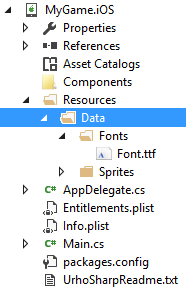

# UrhoSharp iOS and tvOS Support

_iOS and tvOS Specific Setup and Features_

While Urho is a portable class library, and allows the same API to be
used across the various platform for your game logic, you still need
to initialize Urho in your platform specific driver, and in some
cases, you will want to take advantage of platform specific features.

In the pages below, assume that `MyGame` is a sublcass of the
`Application` class.

## iOS and tvOS

**Supported architectures:** armv7, arm64, i386

## Creating a Project

Create an iOS project, and then add Data to the Resources directory and make sure all files have **BundleResource** as the **Build Action**.



## Configuring and Launching Urho

Add using statements for the `Urho` and `Urho.iOS` namespaces, and then
add this code for initializing Urho, as well as launching your
application:

```csharp
new MyGame().Run();
```

Notice that since iOS expects `FinishedLaunching` to complete, you should queue
the call to `Run()` to run after the method completes, this is a common idiom:

```csharp
public override bool FinishedLaunching(UIApplication app, NSDictionary options)
{
    LaunchGame();
    return true;
}

async void LaunchGame()
{
    await Task.Yield();
    new SamplyGame().Run();
}
```

It is important that you disable PNG optimizations because the default
iOS PNG optimizer will generate images that Urho can not currently
properly consume

## Custom Embedding of Urho

You can alternatively to having Urho take over the entire application
screen, and to use it as a component of your application, you can
create a `UrhoSurface` which is a `UIView` that you can embed in your
existing application.

This is what you would need to do:

```csharp
var view = new UrhoSurface () {
    Frame = new CGRect (100,100,200,200),
    BackgroundColor = UIColor.Red
}
window.AddSubview (view);
```

This will host your Urho class, so then you would do:

```csharp
new MyGame().Run ();
```

