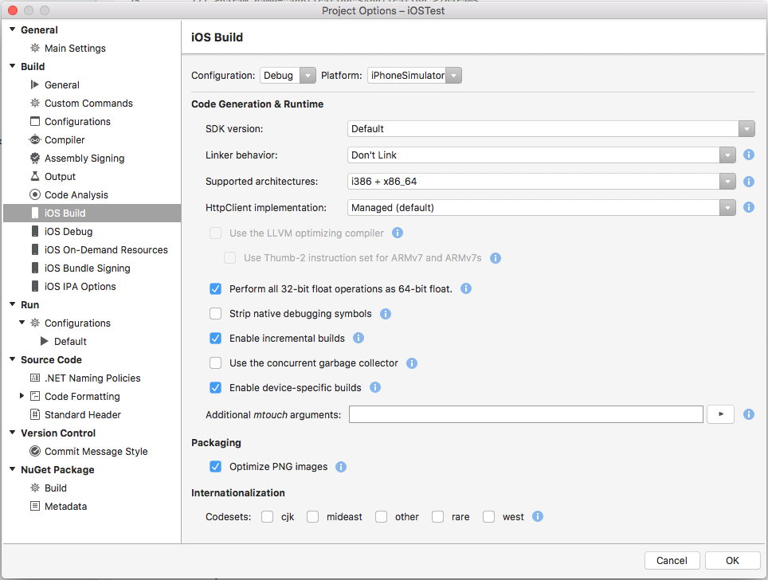
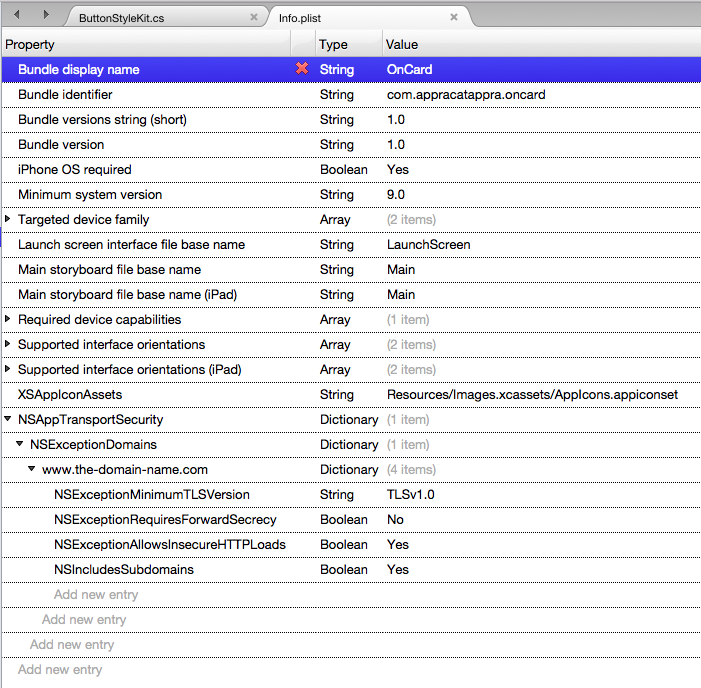
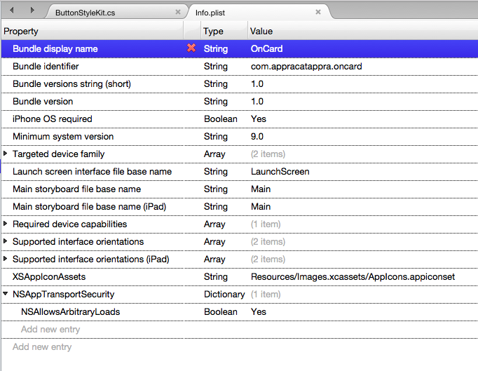

# App Transport Security

_App Transport Security (ATS) enforces secure connections between internet resources (such as the app's back-end server) and your app._

This article will introduce the security changes that App Transport Security enforces
on an iOS 9 app and [what this means for your Xamarin.iOS projects](#xamarinsupport), it will cover
the [ATS configuration options](#config) and it will cover how to [opt-out of ATS](#optout)
ATS if required. Because ATS is enabled by default, any non-secure internet connections
will raise an exception in iOS 9 apps (unless you've explicitly allowed it).


## About App Transport Security

As stated above, ATS ensures that all internet communications in iOS 9 and OS X El Capitan conform to secure connection best practices, thereby preventing accidental disclosure of sensitive information either directly through your app or a library that it is consuming.

For existing apps, implement the `HTTPS` protocol whenever possible. For new Xamarin.iOS apps, you should use `HTTPS` exclusively when communicating with internet resources. Additionally, high-level API communication must be encrypted using TLS version 1.2 with forward secrecy.

Any connection made with [NSUrlConnection](https://developer.xamarin.com/api/type/Foundation.NSUrlConnection/), [CFUrl](https://developer.xamarin.com/api/type/CoreFoundation.CFUrl/) or [NSUrlSession](https://developer.xamarin.com/api/type/Foundation.NSUrlSession/) will use ATS by default in apps built for iOS 9 and OS X 10.11 (El Capitan).

## Default ATS Behavior

Since ATS is enabled by default in apps built for iOS 9 and OS X 10.11 (El Capitan), all connections using [NSUrlConnection](https://developer.xamarin.com/api/type/Foundation.NSUrlConnection/), [CFUrl](https://developer.xamarin.com/api/type/CoreFoundation.CFUrl/) or [NSUrlSession](https://developer.xamarin.com/api/type/Foundation.NSUrlSession/) will be subject to ATS security requirements. If your connections do not meet these requirement, they will fail with an exception.

### ATS Connection Requirements

ATS will enforce the following requirements for all internet connections:

- All connection ciphers must be using forward secrecy. See the list of accepted ciphers below.
- The Transport Layer Security (TLS) protocol must be version 1.2 or greater.
- At least a SHA256 fingerprint with either a 2048 bit or greater RSA key, or a 256 bit or greater Elliptic-Curve (ECC) key must be used for all certificates.

Again, since ATS is enabled by default in iOS 9, any attempt to make a connection that doesn't meet these requirements will result in an exception being thrown. 

<a name="ATS-Compatible-Ciphers" />

### ATS Compatible Ciphers

The following forward secrecy cipher type are accepted by ATS secured internet communications:

- `TLS_ECDHE_ECDSA_WITH_AES_256_GCM_SHA384`
- `TLS_ECDHE_ECDSA_WITH_AES_128_GCM_SHA256`
- `TLS_ECDHE_ECDSA_WITH_AES_256_CBC_SHA384`
- `TLS_ECDHE_ECDSA_WITH_AES_256_CBC_SHA`
- `TLS_ECDHE_ECDSA_WITH_AES_128_CBC_SHA256`
- `TLS_ECDHE_ECDSA_WITH_AES_128_CBC_SHA`
- `TLS_ECDHE_RSA_WITH_AES_256_GCM_SHA384`
- `TLS_ECDHE_RSA_WITH_AES_128_GCM_SHA256`
- `TLS_ECDHE_RSA_WITH_AES_256_CBC_SHA384`
- `TLS_ECDHE_RSA_WITH_AES_128_CBC_SHA256`
- `TLS_ECDHE_RSA_WITH_AES_128_CBC_SHA`

For more information about working with iOS internet communication classes, please see Apple's [NSURLConnection Class Reference](https://developer.apple.com/library/prerelease/ios/documentation/Cocoa/Reference/Foundation/Classes/NSURLConnection_Class/index.html#//apple_ref/doc/uid/TP40003755), [CFURL Reference](https://developer.apple.com/library/prerelease/ios/documentation/CoreFoundation/Reference/CFURLRef/index.html#//apple_ref/doc/uid/20001206) or [NSURLSession Class Reference](https://developer.apple.com/library/prerelease/ios/documentation/Foundation/Reference/NSURLSession_class/index.html#//apple_ref/doc/uid/TP40013435).

<a name="xamarinsupport" />

## Supporting ATS in Xamarin.iOS

Because ATS is enabled by default in iOS 9 and OS X El Capitan, if your Xamarin.iOS app or any library or service it is using makes connection to the internet, you'll need to take some action or your connections will result in an exception being thrown.

For an existing app, Apple suggests you support the `HTTPS` protocol as soon as possible. If you either can't because you are connecting to a 3rd party web service that doesn't support `HTTPS` or if supporting `HTTPS` would be impractical, you can opt-out of ATS. See the [Opting-Out of ATS](#optout) section below for more details.

For a new Xamarin.iOS app, you should use `HTTPS` exclusively when communicating with internet resources. Again, there might be situations (like using a 3rd party web service) where this isn't possible and you'll need to opt-out of ATS.

Additionally, ATS enforces high-level API communication to be encrypted using TLS version 1.2 with forward secrecy. See the [ATS Connection Requirements](#ATS-Connection-Requirements) and [ATS Compatible Ciphers](#ATS-Compatible-Ciphers) sections above for more details.

While you might not be familiar with TLS ([Transport Layer Security](https://en.wikipedia.org/wiki/Transport_Layer_Security)) it is the successor to SSL ([Secure Socket Layer](https://en.wikipedia.org/wiki/Transport_Layer_Security)) and provides a collection of cryptographic protocols to enforce security over network connections.

The TLS level is controlled by the web service that you are consuming and is therefore outside of the app's control. Both the `HttpClient` and the `ModernHttpClient` should automatically use the highest level of TLS encryption supported by the server.

Depending on the server that you are talking to (especially if it is a 3rd party service), you might need to disable forward secrecy or select a lower TLS level. See the [Configuring ATS Options](#Configuring-ATS-Options) section below for more details.

> [!IMPORTANT]
> App Transport Security does not apply to Xamarin apps using **Managed HTTPClient implementations**. It applies to connections using CFNetwork **HTTPClient implementations** or **NSURLSession HTTPClient implementations** only.

### Setting the HTTPClient Implementation

To set the HTTPClient Implementation used by an iOS app, double-click the **Project** in the **Solution Explorer** to open the **Project Options**. Navigate to **iOS Build** and select the desired client type under the **HttpClient implementation** dropdown:




#### Managed Handler

The Managed handler is the fully managed HttpClient handler that has been shipped with previous versions of Xamarin.iOS and is the default handler.

Pros:

- It is the most compatible with Microsoft .NET and older version of Xamarin.

Cons:

- It is not fully integrated with iOS (e.g it is limited to TLS 1.0).
- It is usually much slower than the native APIs.
- It requires more managed code and creates larger apps.

#### CFNetwork Handler

The CFNetwork based handler is based on the native `CFNetwork` framework.

Pros:

- Uses native API for better performance and smaller executable sizes.
- Adds support for newer standards such as TLS 1.2.

Cons:

- Requires iOS 6 or later.
- Not available of watchOS.
- Some HttpClient features and options are not available.

#### NSUrlSession Handler

The NSUrlSession based handler is based on the native `NSUrlSession` API.

Pros:

- Uses native API for better performance and smaller executable sizes.
- Adds support for newer standards such as TLS 1.2.

Cons:

- Requires iOS 7 or later.
- Some HttpClient features and options are not available. 

## Diagnosing ATS Issues

When attempting to connect to the internet, either directly or from a web view in iOS 9, you might get an error in the form:

> App Transport Security has blocked a cleartext HTTP (http://www.-the-blocked-domain.com) resource load since it is insecure. Temporary exceptions can be configured via your app's Info.plist file.

In iOS9, App Transport Security (ATS) enforces secure connections between internet resources (such as the app's back-end server) and your app. Additionally, ATS requires communication using the `HTTPS` protocol and high-level API communication to be encrypted using TLS version 1.2 with forward secrecy.

Since ATS is enabled by default in apps built for iOS 9 and OS X 10.11 (El Capitan), all connections using `NSURLConnection`, `CFURL` or `NSURLSession` will be subject to ATS security requirements. If your connections do not meet these requirement, they will fail with an exception.

Apple also provides the [TLSTool Sample App](https://developer.apple.com/library/mac/samplecode/sc1236/Introduction/Intro.html#//apple_ref/doc/uid/DTS40014927-Intro-DontLinkElementID_2) that can be compiled (or optionally transcoded to Xamarin and C#) and used to diagnose ATS/TLS issues. Please see the [Opting-Out of ATS](#optout) section below for information on how to solve this issue.


<a name="config" />

## Configuring ATS Options

You can configure several of the features of ATS by setting values for specific
keys in your app's **Info.plist** file. The following keys are available for
controlling ATS (_indented to show how they are nested_):

```csharp
NSAppTransportSecurity
	NSAllowsArbitraryLoads
	NSAllowsArbitraryLoadsInWebContent
	NSExceptionDomains
	<domain-name-for-exception-as-string>
		NSExceptionMinimumTLSVersion
		NSExceptionRequiresForwardSecrecy
		NSExceptionAllowsInsecureHTTPLoads
		NSRequiresCertificateTransparency
		NSIncludesSubdomains
		NSThirdPartyExceptionMinimumTLSVersion
		NSThirdPartyExceptionRequiresForwardSecrecy
		NSThirdPartyExceptionAllowsInsecureHTTPLoads
```

Each key has the following type and meaning:

- **NSAppTransportSecurity** (`Dictionary`) - Contains all of the setting keys and values for ATS.
- **NSAllowsArbitraryLoads** (`Boolean`) - If `YES` ATS will be disabled for any domain **not** listed in `NSExceptionDomains`. For listed domains, the security settings specified will be used.
- **NSAllowsArbitraryLoadsInWebContent** (`Boolean`) - If `YES` will allow web pages to load correctly while Apple Transport Security (ATS) protection is still enabled for the rest of the app.
- **NSExceptionDomains** (`Dictionary`) -  A collection of domains that and the security settings that ATS should use for a given domain.
- **<domain-name-for-exception-as-string>** (`Dictionary`) - A collection of exceptions for a given domain (eg. `www.xamarin.com`).
- **NSExceptionMinimumTLSVersion** (`String`) - The minimal TLS version as either `TLSv1.0`, `TLSv1.1` or `TLSv1.2` (which is the default).
- **NSExceptionRequiresForwardSecrecy** (`Boolean`) - If `NO` the domain does not have to use a cipher with forward security. The default value is `YES`.
- **NSExceptionAllowsInsecureHTTPLoads** (`Boolean`) - If `NO` (the default) all communications with this domain must be in the `HTTPS` protocol.
- **NSRequiresCertificateTransparency** (`Boolean`) - If `YES` the domain’s Secure Sockets Layer (SSL) must include valid transparency data. The default value is `NO`.
- **NSIncludesSubdomains** (`Boolean`) - If `YES` these settings override all subdomains of this domain. The default value is `NO`.
- **NSThirdPartyExceptionMinimumTLSVersion** (`String`) - The TLS version used when the domain is a 3rd party service outside of the developer's control.
- **NSThirdPartyExceptionRequiresForwardSecrecy** (`Boolean`) - If `YES` a 3rd party domain requires forward secrecy.
- **NSThirdPartyExceptionAllowsInsecureHTTPLoads** (`Boolean`) - If `YES` the ATS will allow non-secure communication with 3rd party domains.

<a name="optout" />

### Opting-Out of ATS

While Apple highly suggests using the `HTTPS` protocol and secure communication to internet based information, there might be times that this isn't always possible. For example, if you are communicating with a 3rd party web service or using internet delivered ads in your app.

If your Xamarin.iOS app must make a request to an insecure domain, the following changes to your app's **Info.plist** file will disable the security defaults that ATS enforces for a given domain:

```xml
<key>NSAppTransportSecurity</key>
<dict>
	<key>NSExceptionDomains</key>
	<dict>
		<key>www.the-domain-name.com</key>
		<dict>
			<key>NSExceptionMinimumTLSVersion</key>
			<string>TLSv1.0</string>
			<key>NSExceptionRequiresForwardSecrecy</key>
			<false/>
			<key>NSExceptionAllowsInsecureHTTPLoads</key>
			<true/>
			<key>NSIncludesSubdomains</key>
			<true/>
		</dict>
	</dict>
</dict>
```

Inside Visual Studio for Mac, double-click the `Info.plist` file in the **Solution Explorer**, switch to the **Source** view and add the above keys:

[](ats-images/ats01.png#lightbox)


If your app needs to load and display web content from non-secure sites, add the following to your app's **Info.plist** file to allow web pages to load correctly while Apple Transport Security (ATS) protection is still enabled for the rest of the app:

```xml
<key>NSAppTransportSecurity</key>
<dict>
	<key> NSAllowsArbitraryLoadsInWebContent</key>
	<true/>
</dict>
```

Optionally, you can make the following changes to your app's **Info.plist** file to completely disable ATS for all domains and internet communication:

```xml
<key>NSAppTransportSecurity</key>
<dict>
	<key>NSAllowsArbitraryLoads</key>
	<true/>
</dict>
```

Inside Visual Studio for Mac, double-click the `Info.plist` file in the **Solution Explorer**, switch to the **Source** view and add the above keys:

[](ats-images/ats02.png#lightbox)

> [!IMPORTANT]
> If your application requires a connection to an insecure website, you should **always** enter the domain as an exception using `NSExceptionDomains` instead of turning ATS off completely using `NSAllowsArbitraryLoads`. `NSAllowsArbitraryLoads` should only be used in extreme emergency situations.


Again, disabling ATS should _only_ be used as a last resort, if switching to secure connections is either unavailable or impractical.

<a name="Summary" />

## Summary

This article has introduced App Transport Security (ATS) and described the way it enforces secure communications with the internet. First, we covered the changes ATS requires for a Xamarin.iOS app running on iOS 9. Then we covered controlling ATS features and options. Finally, we covered opting out of ATS in your Xamarin.iOS app.


## Related Links

- [iOS 9 Samples](https://developer.xamarin.com/samples/ios/iOS9/)
- [iOS 9 for Developers](https://developer.apple.com/ios/pre-release/)
- [iOS 9.0](https://developer.apple.com/library/prerelease/ios/releasenotes/General/WhatsNewIniOS/Articles/iOS9.html)
