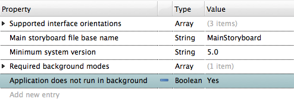

# Registering Applications to Run in the Background

Registering individual tasks for background privileges works for some applications, but what happens if an application is constantly called upon to perform important, long-running tasks, such as getting directions for the user via GPS? Applications such as these should instead be registered as known background-necessary applications.

Registering an app signals to iOS that the application should be given special privileges necessary to perform tasks in the background.

## Application Registration Categories

Registered apps can fall into several categories:

-  **Audio** - Music players and other applications that work with audio content may be registered to continue playing audio even when the app is no longer in the foreground. If an app in this category attempts to do anything other than play audio or download while in the background, iOS will terminate it.
-  **VoIP** - Voice Over Internet Protocol (VoIP) applications get of the same privileges granted to audio applications to keep processing audio in the background. They are also allowed to respond as needed to the VoIP services that power them, to keep their connections alive.
-  **External Accessories and Bluetooth** - Reserved for applications that need to communicate with Bluetooth devices and other external hardware accessories, registration under these categories allows the app to stay connected to the hardware.
-  **Newsstand** - A Newsstand application can continue to sync content in the background.
-  **Location** - Applications that make use of GPS or network location data can send and receive location updates in the background.
-  **Fetch (iOS 7+)** - An application registered for background fetch privileges can check a provider for new content at regular intervals, presenting the user with updated content when they return to the application.
-  **Remote Notifications (iOS 7+)** - Applications can register to receive notifications from a provider, and use the notification to kick off an update before the user opens the application. Notifications can come in the form of push notifications, or opt to wake the application silently.

Applications can be registered by setting the **Required Background Modes** property in the application's *Info.plist*. An application can register in as many categories as it requires:

 

For a step-by-step guide to registering an application for background location updates, see the [Background Location Walkthrough](~/ios/app-fundamentals/backgrounding/ios-backgrounding-walkthroughs/location-walkthrough.md).

## Application Does Not Run in Background Property

Another property that can be set in *Info.plist* is the *Application does not run in background*, or `UIApplicationExitsOnSuspend` property:

 

This has the exact same effect as setting the Background App Refresh setting to off in iOS 7+, except it can only be changed on the developer side, and is available for iOS 4 and above. The application will be suspended immediately after entering the background, and will not be able to do any processing.

Use this property if your application is not designed to handle background processing, as it helps avoid unexpected behavior.

## Background Fetch and Remote Notifications

Background fetch and remote notifications are special registration categories introduced in iOS 7. These categories allow applications to receive new content from a provider, and update in the background. The next section explores fetch and remote notifications in greater detail, and also introduces location awareness as means for updating an application in the background on iOS 6.
