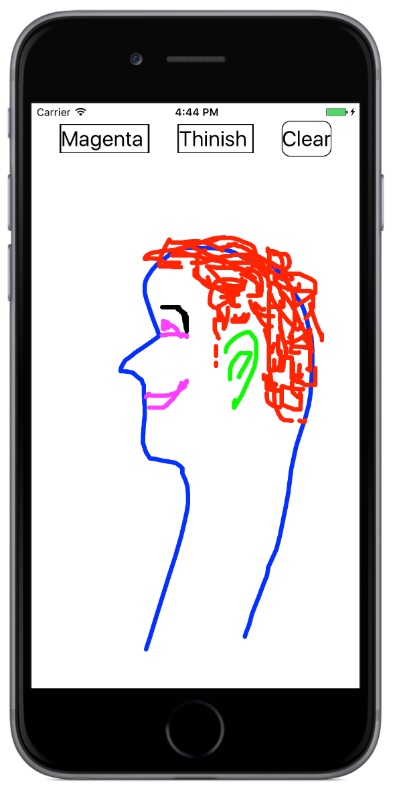

# Multi-Touch Finger Tracking in Xamarin.iOS

_This document demonstrates how to track touch events from multiple fingers_

There are times when a multi-touch application needs to track individual fingers as they move simultaneously on the screen. One typical application is a finger-paint program. You want the user to be able to draw with a single finger, but also to draw with multiple fingers at once. As your program processes multiple touch events, it needs to distinguish between these fingers.

When a finger first touches the screen, iOS creates a [`UITouch`](https://developer.xamarin.com/api/type/UIKit.UITouch/) object for that finger. This object remains the same as the finger moves on the screen and then lifts from the screen, at which point the object is disposed. To keep track of fingers, a program should avoid storing this `UITouch` object directly. Instead, it can use the [`Handle`](https://developer.xamarin.com/api/property/Foundation.NSObject.Handle/) property of type `IntPtr` to uniquely identify these `UITouch` objects.

Almost always, a program that tracks individual fingers maintains a dictionary for touch tracking. For an iOS program, the dictionary key is the `Handle` value that identifies a particular finger. The dictionary value depends on the application. In the [FingerPaint](https://developer.xamarin.com/samples/monotouch/ApplicationFundamentals/FingerPaint) program, each finger stroke (from touch to release) is associated with an object that contains all the information necessary to render the line drawn with that finger. The program defines a small `FingerPaintPolyline` class for this purpose:

```csharp
class FingerPaintPolyline
{
    public FingerPaintPolyline()
    {
        Path = new CGPath();
    }

    public CGColor Color { set; get; }

    public float StrokeWidth { set; get; }

    public CGPath Path { private set; get; }
}
```

Each polyline has a color, a stroke width, and an iOS graphics [`CGPath`](https://developer.xamarin.com/api/type/CoreGraphics.CGPath/) object to accumulate and render multiple points of the line as it's being drawn.


All the rest of the code shown below is contained in a `UIView` derivative named `FingerPaintCanvasView`. That class maintains a dictionary of objects of type `FingerPaintPolyline` during the time that they are actively being drawn by one or more fingers:

```csharp
Dictionary<IntPtr, FingerPaintPolyline> inProgressPolylines = new Dictionary<IntPtr, FingerPaintPolyline>();
```

This dictionary allows the view to quickly obtain the `FingerPaintPolyline` information associated with each finger based on the `Handle` property of the `UITouch` object.

The `FingerPaintCanvasView` class also maintains a `List` object for the polylines that have been completed:

```csharp
List<FingerPaintPolyline> completedPolylines = new List<FingerPaintPolyline>();
```

The objects in this `List` are in the same order that they were drawn.

`FingerPaintCanvasView` overrides five methods defined by `View`:

- [`TouchesBegan`](https://developer.xamarin.com/api/member/UIKit.UIResponder.TouchesBegan/p/Foundation.NSSet/UIKit.UIEvent/)
- [`TouchesMoved`](https://developer.xamarin.com/api/member/UIKit.UIResponder.TouchesMoved/p/Foundation.NSSet/UIKit.UIEvent/)
- [`TouchesEnded`](https://developer.xamarin.com/api/member/UIKit.UIResponder.TouchesEnded/p/Foundation.NSSet/UIKit.UIEvent/)
- [`TouchesCancelled`](https://developer.xamarin.com/api/member/UIKit.UIResponder.TouchesCancelled/p/Foundation.NSSet/UIKit.UIEvent/)
- [`Draw`](https://developer.xamarin.com/api/member/UIKit.UIView.Draw/p/CoreGraphics.CGRect/)

The various `Touches` overrides accumulate the points that make up the polylines.

The [`Draw`] override draws the completed polylines and then the in-progress polylines:

```csharp
public override void Draw(CGRect rect)
{
    base.Draw(rect);

    using (CGContext context = UIGraphics.GetCurrentContext())
    {
        // Stroke settings
        context.SetLineCap(CGLineCap.Round);
        context.SetLineJoin(CGLineJoin.Round);

        // Draw the completed polylines
        foreach (FingerPaintPolyline polyline in completedPolylines)
        {
            context.SetStrokeColor(polyline.Color);
            context.SetLineWidth(polyline.StrokeWidth);
            context.AddPath(polyline.Path);
            context.DrawPath(CGPathDrawingMode.Stroke);
        }

        // Draw the in-progress polylines
        foreach (FingerPaintPolyline polyline in inProgressPolylines.Values)
        {
            context.SetStrokeColor(polyline.Color);
            context.SetLineWidth(polyline.StrokeWidth);
            context.AddPath(polyline.Path);
            context.DrawPath(CGPathDrawingMode.Stroke);
        }
    }
}
```

Each of the `Touches` overrides potentially reports the actions of multiple fingers, indicated by one or more `UITouch` objects stored in the `touches` argument to the method. The `TouchesBegan` overrides loop through these objects. For each `UITouch` object, the method creates and initializes a new `FingerPaintPolyline` object, including storing the initial location of the finger obtained from the `LocationInView` method. This `FingerPaintPolyline` object is added to the `InProgressPolylines` dictionary using the `Handle` property of the `UITouch` object as a dictionary key:

```csharp
public override void TouchesBegan(NSSet touches, UIEvent evt)
{
    base.TouchesBegan(touches, evt);

    foreach (UITouch touch in touches.Cast<UITouch>())
    {
        // Create a FingerPaintPolyline, set the initial point, and store it
        FingerPaintPolyline polyline = new FingerPaintPolyline
        {
            Color = StrokeColor,
            StrokeWidth = StrokeWidth,
        };

        polyline.Path.MoveToPoint(touch.LocationInView(this));
        inProgressPolylines.Add(touch.Handle, polyline);
    }
    SetNeedsDisplay();
}
```

The method concludes by calling `SetNeedsDisplay` to generate a call to the `Draw` override and to update the screen.

As the finger or fingers move on the screen, the `View` gets multiple calls to its `TouchesMoved` override. This override similarly loops through the `UITouch` objects stored in the `touches` argument and adds the current location of the finger to the graphics path:

```csharp
public override void TouchesMoved(NSSet touches, UIEvent evt)
{
    base.TouchesMoved(touches, evt);

    foreach (UITouch touch in touches.Cast<UITouch>())
    {
        // Add point to path
        inProgressPolylines[touch.Handle].Path.AddLineToPoint(touch.LocationInView(this));
    }
    SetNeedsDisplay();
}
```

The `touches` collection contains only those `UITouch` objects for the fingers that have moved since the last call to `TouchesBegan` or `TouchesMoved`. If you ever need `UITouch` objects corresponding to *all* the fingers currently in contact with the screen, that information is available through the `AllTouches` property of the `UIEvent` argument to the method.

The `TouchesEnded` override has two jobs. It must add the last point to the graphics path, and transfer the `FingerPaintPolyline` object from the `inProgressPolylines` dictionary to the `completedPolylines` list:

```csharp
public override void TouchesEnded(NSSet touches, UIEvent evt)
{
    base.TouchesEnded(touches, evt);

    foreach (UITouch touch in touches.Cast<UITouch>())
    {
        // Get polyline from dictionary and remove it from dictionary
        FingerPaintPolyline polyline = inProgressPolylines[touch.Handle];
        inProgressPolylines.Remove(touch.Handle);

        // Add final point to path and save with completed polylines
        polyline.Path.AddLineToPoint(touch.LocationInView(this));
        completedPolylines.Add(polyline);
    }
    SetNeedsDisplay();
}
```

The `TouchesCancelled` override is handled by simply abandoning the `FingerPaintPolyline` object in the dictionary:

```csharp
public override void TouchesCancelled(NSSet touches, UIEvent evt)
{
    base.TouchesCancelled(touches, evt);

    foreach (UITouch touch in touches.Cast<UITouch>())
    {
        inProgressPolylines.Remove(touch.Handle);
    }
    SetNeedsDisplay();
}
```

Altogether, this processing allows the [FingerPaint](https://developer.xamarin.com/samples/monotouch/ApplicationFundamentals/FingerPaint) program to track individual fingers and draw the results on the screen:

[](touch-tracking-images/image01.png#lightbox)

You've now seen how you can track individual fingers on the screen and distinguish among them.


## Related Links

- [Equivalent Xamarin Android guide](~/android/app-fundamentals/touch/touch-tracking.md)
- [FingerPaint (sample)](https://developer.xamarin.com/samples/monotouch/ApplicationFundamentals/FingerPaint)
