# Configuring an App in iTunes Connect

_This article covers the steps required to setup and maintain a Xamarin.iOS application in iTunes Connect so that it can be released for distribution on the App Store._

iTunes Connect is a suite of web-based tools for, among other things, managing  iOS applications on the App Store. A Xamarin.iOS application will need to be properly set up and configured in iTunes Connect before it can be submitted to Apple for review and ultimately released for sale or as a free app in the App Store.

iTunes Connect can be used for the following:

- Set the application's name (as displayed in the App Store).
- Provide screenshots or video of the application in action on the iOS devices it supports.
- Provide a clear, succinct description of the application including it's features and benefit to the end user.
- Provide Categories and Sub-Categories to help the user find the app in the App Store.
- Provide any keyword that can further help a user find the app.
- Provide Contact and Support URLs to your website (required by Apple).
- Set the application's Rating, which is used to inform parental controls on the App Store.
- Select a sale price or specify that the application will be released for free.
- Configure optional App Store technologies such as Game Center and In-App Purchase.

In addition, the app should also have attractive, high-resolution artwork available in case Apple decides to feature it in the App Store. For more information, please see Apple's [iTunes Connect Developer Guide](https://developer.apple.com/support/itunes-connect/).

## Managing Agreements, Tax and Banking

The **Agreements, Tax, and Banking** section of iTunes Connect is used to provide required financial information relating to iTunes developer payments and tax withholdings and to track the status of any agreements you have in place with Apple. Before you can release an iOS application on the App Store (either for free or for sale), you'll need to have the proper agreements in place and have agreed to any modifications to existing agreements.

[ 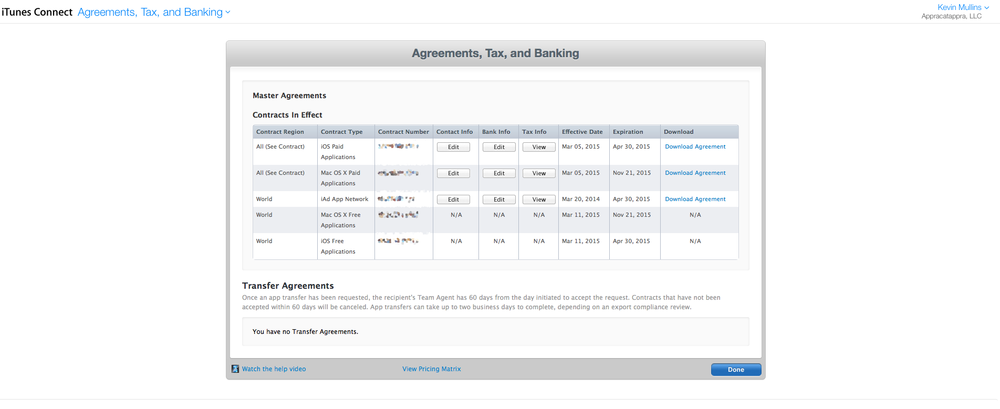](itunesconnect-images/agreement01.png)

From here you can:

- Provide a **Team Agent** and define other user roles for your iTunes Connect account such as **Admin** or **Finance**.
- Enroll in and maintain **Contracts** that allow an organization to distribute applications in the App Store.
- Specify the **Legal Entity** name (Seller Name in the App Store) used to match contracts, banking information, and tax information that are associated with your organization.
- Provide **Banking** and **Tax** information if you are going to sell applications through the App Store.

Again, this information _must_ be properly set up, in place, and up-to-date before an iOS application can be submitted to iTunes Connect for review and release. For more information, please see Apple's [Managing Agreements, Tax and Banking](https://developer.apple.com/library/ios/documentation/LanguagesUtilities/Conceptual/iTunesConnect_Guide/Chapters/ManagingContractsandBanking.html#//apple_ref/doc/uid/TP40011225-CH21-SW1) documentation.

<a name="creating" />

## Creating an iTunes Connect Record

Before a Xamarin.iOS application can be uploaded to iTunes Connect for distribution through the App Store, you will need to create a record for the application in iTunes Connect. This record includes all the information about the application as it will appear in the App Store (in as many languages as required) and all of the information needed to manage the app through the distribution process. Additionally, it will be used to configure App Store technologies such as the iAd App Network or Game Center.

To add an iOS application to iTunes Connect you will need to be the **Team Agent** or a user with an **Admin** or **Technical** role.

Do the following in [iTunes Connect](https://itunesconnect.apple.com/WebObjects/iTunesConnect.woa):

1. Click on **My Apps**:

	[ 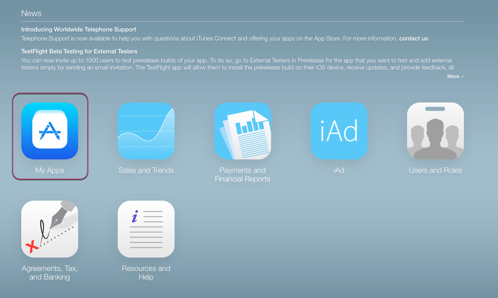](itunesconnect-images/add01.png)
2. Click the **+** in the upper left hand corner and select **New iOS App**:

	[ 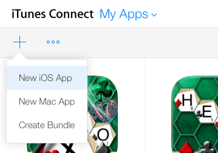](itunesconnect-images/add02.png)
3. iTunes Connect will display the **New iOS App** dialog:

	[ 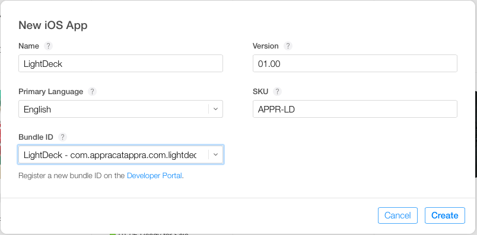](itunesconnect-images/add03.png)
4. Enter a **Name** and **Version Number** for the application as they should be displayed in the App Store.
5. Select the **Primary Language**.
6. Enter a **SKU** number, this is a unique, constant, identifier that will be used the track the application. It will not be displayed to the end user and it _cannot_ be changed once the app has been created.
7. Select the **Bundle ID** for the application that you created in the developer center when you provisioned the application. This same Bundle ID will need to be used when signing the distribution bundle in Visual Studio for Mac or Visual Studio. For more information, please see our [Creating a Distribution Profile](~/ios/get-started/installation/device-provisioning/manual-provisioning.md#provisioningprofile) and [Selecting a Distribution Profile in a Xamarin.iOS Project](~/ios/get-started/installation/device-provisioning/index.md) documentation.
8. Click the **Create** button to build the new iTunes Connect Record for the application.

The new application will be created in iTunes Connect and will be ready for you to fill in the required information such as Description, Pricing, Categories, Ratings, etc.:

<a name="managing" />

## Managing App Videos and Screenshots

One of the most important elements to successfully marketing your iOS application in the App Store is a great set of screenshots and, optionally, video previews. Use actual views of your application running that highlight user interaction and showcase its unique features. Use application preview videos to give users an idea of what it is like to use the application.

Apple suggests the following when taking screenshots:

- Optimize your screenshot for best presentation on the iOS devices supported by your application and make sure the content is legible.
- Don't frame the screenshot in an iOS device image.
- Show the actual view of your application, using the full screen, without graphics or borders around the screenshot.
- Always remove the status bar from screenshots, iTunes Connect expects screenshots of dimensions that exclude that area.
- When possible, take screenshots on real, high-resolution Retina iOS hardware (not in iOS Simulator).
- The first screenshot appears as a search result in the App Store on iPhone and iPad if no app preview video is available, so place the best screenshot first.
- Use all five screenshots to tell the story of the application while highlighting moments that make it compelling.

Apple requires screenshots and videos be provided at every screen size and resolution that your application supports. Additionally, portrait and landscape versions should be provided, based on the orientations supported.

The following screen sizes and resolutions are currently required:

[!include]

### Editing Screenshots in iTunes Connect

Do the following in [iTunes Connect](https://itunesconnect.apple.com/WebObjects/iTunesConnect.woa):

1. Click on **My Apps**.
2. Click on your application's **Icon**.
3. Select the **Versions** tab.
4. Scroll to the **Screenshots** section.
5. Select the **Image Size** and drag in the required images (up to 5 per screen size):

	
6. Repeat for all required screen sizes.
7. Click the **Save** button at the top of the screen to save your changes.

> [!NOTE]
> Note: Apple will reject your submission if the screenshots or App Preview Video do not match the current functionality in your application.

<a name="metadata" />

## Managing Name, Description, What's New, Keywords and URLs

This section of the iTunes Connect Application Record provides localized information about the application, what it does, any modifications to new versions, keywords used in search and iAd support and any supporting URLs.

### App Name

Choose a descriptive application name that reflects what your application does. Try to keep it as short and concise as possible. Your application's name plays a critical role in how users search for and discover it, so keep the name simple and easy to remember. Pay particular attention to how the name appears when viewed on an iOS device (iPad, iPhone, and iPod touch).

Apple suggests the following guidelines when choosing an application's name:

- Keep it short, simple, and easy to remember.
- Make sure it doesn't violate the copyright or trademarks of a 3rd party.
- Make it match the functionality of the application.
- Provide localized names for foreign markets where appropriate.

### Description

Write a clear, concise, and informative description of the application and its features. The first few lines are the most important and give you a chance to make a great first impression and to draw the user in. Describe what makes your application special and separates it from other, similar apps.

Apple suggests the following for writing an application's description:

- Include a brief opening paragraph or two and a short bulleted list of main features.
- Provide localized descriptions for foreign markets where appropriate.
- Include user reviews, accolades, or testimonials only at the end, if at all.
- Use line breaks and bullets to enhance legibility.
- Be aware of how the app description displays in the App Store on each device type, to make sure the most important sentences in your description are readily visible.

### What's New

When uploading a new version of your application, a **What’s New in this Version** field will be available that should be completed thoroughly and thoughtfully.

Apple suggests the following guidelines when filling in the What's New information:

- Add messaging to encourage users to update.
- List items in order of importance and pinpoint changes and bug fixes.
- Present the changes in plain and authentic language rather than technical jargon.

### Keywords

Thoughtful and strategic keywords pertaining to the functionality of your application help users locate your application easily when searching on the App Store. In addition, if your application serves up iAd ads, the iAd App Network uses the keywords when choosing the ads to target in your app.

Apple suggests the following when choosing keywords:

- Don’t use competing app names, company or product names, or trademarked names.
- Don't use generic words or terms.
- Avoid inappropriate or objectionable terms or irrelevant words such as celebrity names.
- Localize keywords for foreign markets when appropriate.

### URLs

Apple requires that the developer provide a link to their website to support any issue or questions that a user might have about the application. They also require a link to the application's Privacy Policy (which, again, must be hosted on your website).

Optionally, you can provide a link to marketing information hosted on your website that can be used to provide more information about the application than is provided in the App Store.

### Editing Name, Description, What's New, Keywords, and URLs in iTunes Connect

Do the following in [iTunes Connect](https://itunesconnect.apple.com/WebObjects/iTunesConnect.woa):

1. Click on **My Apps**.
2. Click on your application's **Icon**.
3. Select the **Versions** tab.
4. Scroll to the **Name** section.
5. Fill in all the required information:

	
6. Click the **Save** button at the top of the screen to save your changes.

> [!IMPORTANT]
> Note: Apple will reject your submission if the Name, Description, What's New, Keywords or URLs do not match the current functionality in your application.

<a name="general" />

## Maintaining General App Information

This section of the iTunes Connect Application Record provides the unique ID of the application (as assigned by Apple), the categories the application belongs in, rating, copyright and information about the company releasing the application.

### App Icon

> [!IMPORTANT]
>  **Note**: App Icons are no longer submitted through iTunes Connect. They must be submitted through the **AppIcon** image set in your project's **Assets.xcassets** file. For more information, see the [App Store Icon](~/ios/app-fundamentals/images-icons/app-store-icon.md) guide.

The App Icon is the face of your application to your users, so it must be memorable and display well at a small size. Memorable icons are clean, simple, and immediately recognizable.

Apple suggests the following guidelines when designing your applications icon:

- Make the icon appropriate for your application.
- Create a simple icon that is consistent with the design of your application.
- Avoid using words in your icon.
- Think globally: A single app icon is used in all store territories.

A 1024 x 1024 pixel image is required for the App Icon that will be displayed in the App Store.

For more information, see Apple's [iOS Human Interface Guidelines](https://developer.apple.com/library/ios/documentation/UserExperience/Conceptual/MobileHIG/index.html#//apple_ref/doc/uid/TP40006556) and the description of Large App Icon section in [General App Information](https://developer.apple.com/library/ios/documentation/LanguagesUtilities/Conceptual/iTunesConnect_Guide/Appendices/Properties.html#//apple_ref/doc/uid/TP40011225-CH26-SW7) Documentation

### App ID

This is a unique identification number assigned to your application by Apple when the iTunes Connect Record is created. You can use this number when calling several web-based interfaces that Apple provides, including App Store information in your website.

### Version Number

This is the current, active version of your application as displayed to the user in the App Store.

### Category and Sub Category

One important aspect of discoverability for your application is the category it appears in on the App Store. Categories allow users to browse through a collection of apps and find the ones that they are interested in. iTunes Connect lets you assign up to two different categories when defining your application. Make sure to carefully choose categories that best describe the main function of your application.

### Ratings

All applications are required to have a rating in the App Store. This rating is used to inform parental control and limit access to children based on the applications's type and content. When defining your application, iTunes Connect provides a list of content descriptions for which you identify how frequently the content appears in your application. These selections are converted into the rating that is displayed in the App Store.

When creating applications for children, the App Store has a special category for children aged 11 and under. Even if your application isn’t specifically targeted at kids, you help your customers make good choices by providing appropriate content ratings.

> [!IMPORTANT]
> Note: Apple will reject any application submission that it finds obscene, pornographic, offensive, or defamatory.

### Copyright and Company Information

Apple allow you to provide copyright information for your application and requires information about the company releasing the application such as its address and contact information (which is required for applications released to the Korean App Store). This information will be displayed in the App Store as required.

### Editing General App Information in iTunes Connect

Do the following in [iTunes Connect](https://itunesconnect.apple.com/WebObjects/iTunesConnect.woa):

1. Click on **My Apps**.
2. Click on your application's **Icon**.
3. Select the **Versions** tab.
4. Scroll to the **General App Information** section.
5. Fill in all the required information:

	[ 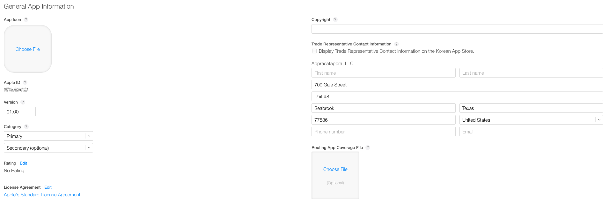](itunesconnect-images/general01.png)
6. Click on the **Edit** button by the **Rating** to set the rating information:

	[ 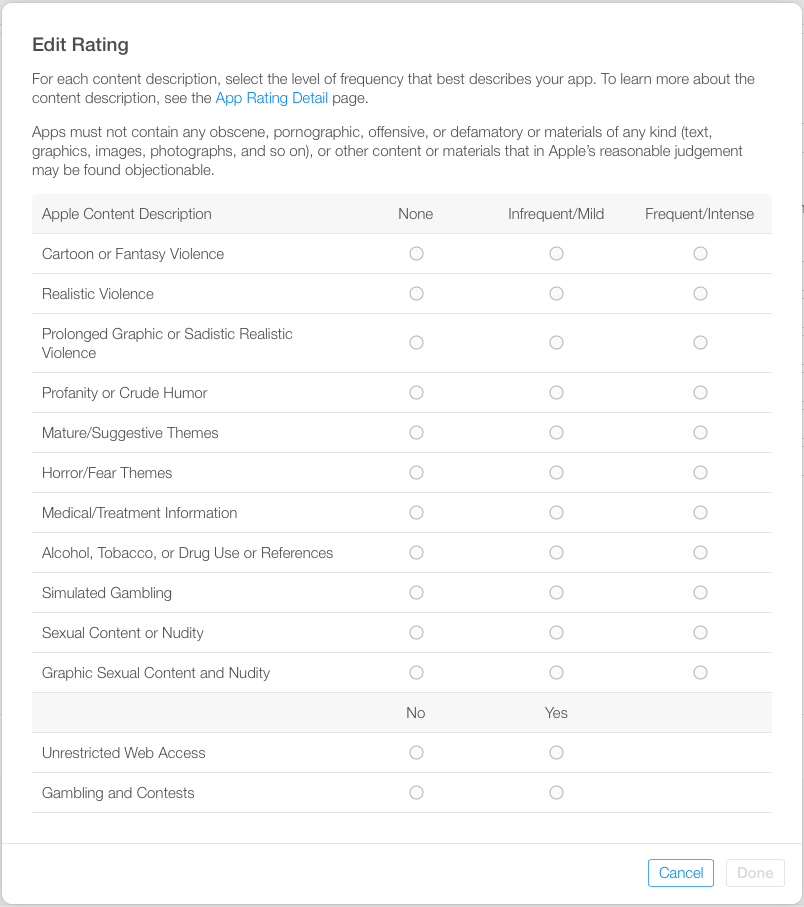](itunesconnect-images/general02.png)
6. Click the **Save** button at the top of the screen to save your changes.

> [!NOTE]
> Note: Apple will reject your submission if the Categories or Ratings do not match the current functionality in your application.

<a name="game-center" />

## Maintaining Game Center Information

For iOS game applications that support Apple's Game Center, you can provide information such as the leader boards and in-game achievements that are available to the user and if the application is multiplayer-compatible across a network connection.

### Editing Game Center Information in iTunes Connect

Do the following in [iTunes Connect](https://itunesconnect.apple.com/WebObjects/iTunesConnect.woa):

1. Click on **My Apps**.
2. Click on your application's **Icon**.
3. Select the **Versions** tab.
4. Scroll to the **Game Center** section.
5. Flip the switch by the **Game Center** section to the **On** position.
5. Fill in all the required information:

	[ 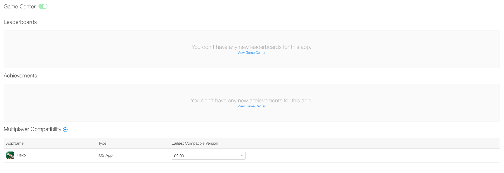](itunesconnect-images/gamecenter01.png)
6. Click the **Save** button at the top of the screen to save your changes.

Use the **Game Center** tab to activate Game Center and maintain any available **Leaderboards** or **Achievements** for this application:

[ 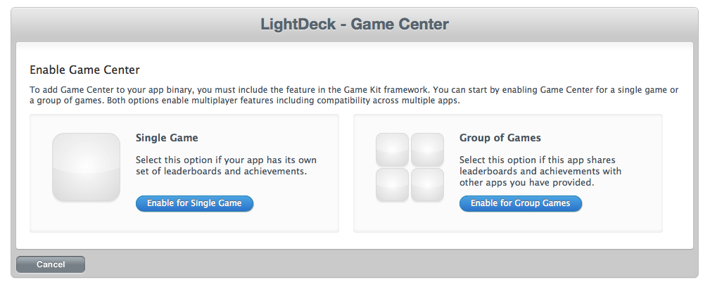](itunesconnect-images/gamecenter02.png)

[ 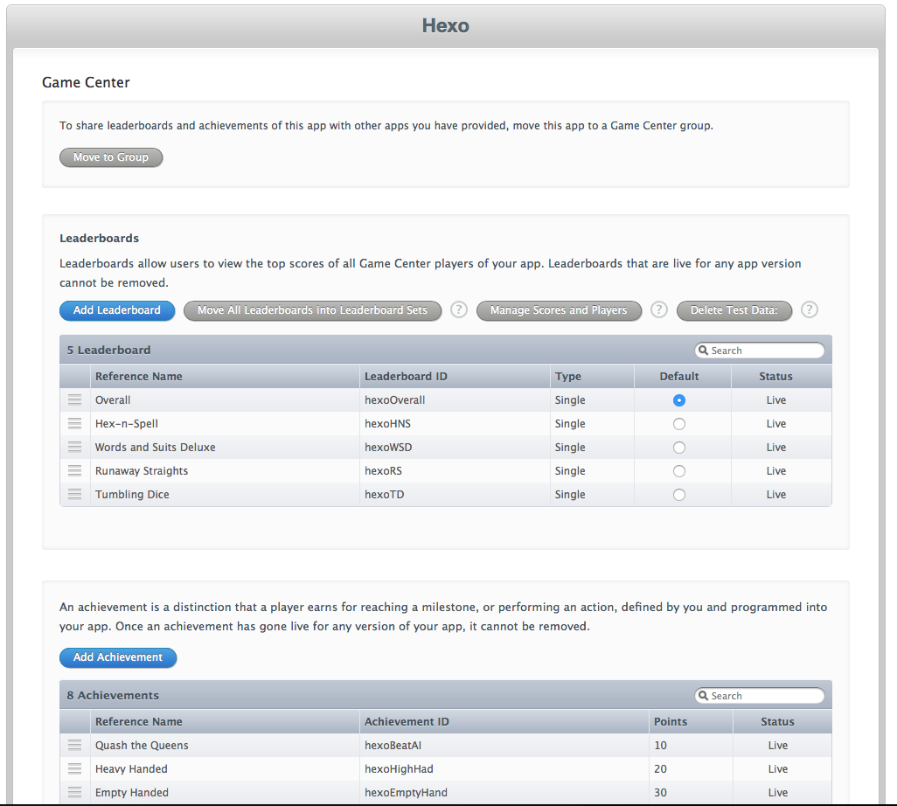](itunesconnect-images/gamecenter03.png)

## Maintaining App Review Information

Use this section to provide required information to the Apple personnel that will be reviewing your application such as the contact information (if the tech has any questions), any demo accounts that might be required, and any notes that can help the tester successfully review your app.

### Editing App Review Information in iTunes Connect

Do the following in [iTunes Connect](https://itunesconnect.apple.com/WebObjects/iTunesConnect.woa):

1. Click on **My Apps**.
2. Click on your application's **Icon**.
3. Select the **Versions** tab.
4. Scroll to the **App Review Information** section.
5. Fill in all the required information:

	
6. Select how you wish the application to be released to the App Store after it has been successfully reviewed:

	
6. Click the **Save** button at the top of the screen to save your changes.

## Maintaining Pricing Information

If you plan on releasing your application for sale, you'll need to set the sales price by selecting one of Apple's available pricing tiers and the date that the given pricing goes into effect. For example, as of the time of this writing, the **Tier 1** pricing looks like the following:

[ 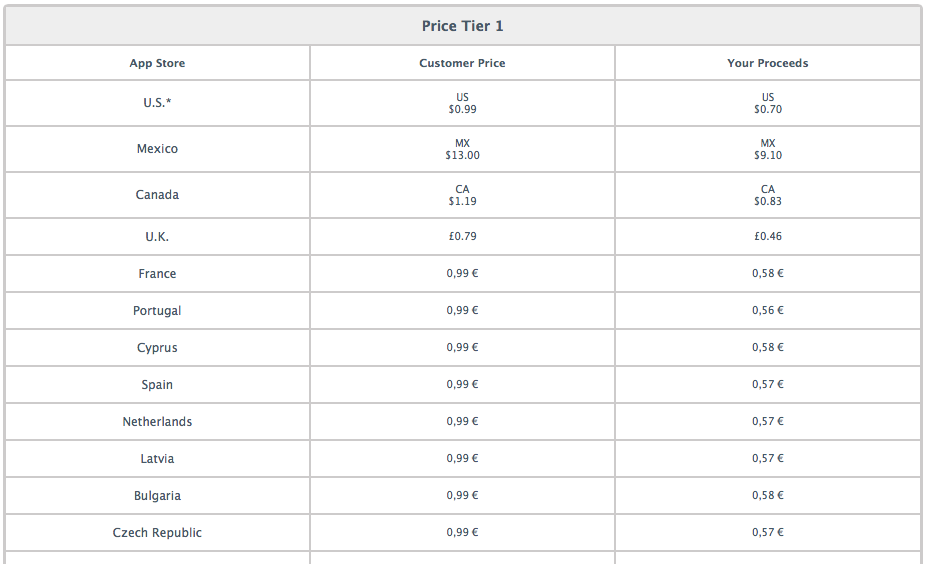](itunesconnect-images/price01.png)

### Educational Discount

Check this box if you want your application to be offered at a discount to educational institutions when they purchase multiple copies at once. The details of the discount are found in the latest **Paid Application Agreement**, which you must sign before this application will be available to education customers.

### Custom Business to Business Application

An application that is set up as a **Custom Business to Business Application** will only be available to the **Volume Purchase Program** customers that you specify in iTunes Connect, and it will only be available in the applicable territories (for example, U.S. Volume Purchase Program customers must use the U.S. App Store Volume Purchase Program for Business).

Custom Business to Business applications will not be available to educational institutions or general App Store customers. To learn more about the *App Store Volume Purchase Program for Business*, visit Apple's [Frequently Asked Questions](http://vpp.itunes.apple.com/faq) page. To learn more about how your customers can sign up for the **Volume Purchase Program**, visit Apple's [Deployment Programs](http://enroll.vpp.itunes.apple.com) page.

### Editing Pricing Information in iTunes Connect

Do the following in [iTunes Connect](https://itunesconnect.apple.com/WebObjects/iTunesConnect.woa):

1. Click on **My Apps**.
2. Click on your application's **Icon**.
3. Select the **Pricing** tab:

	[ 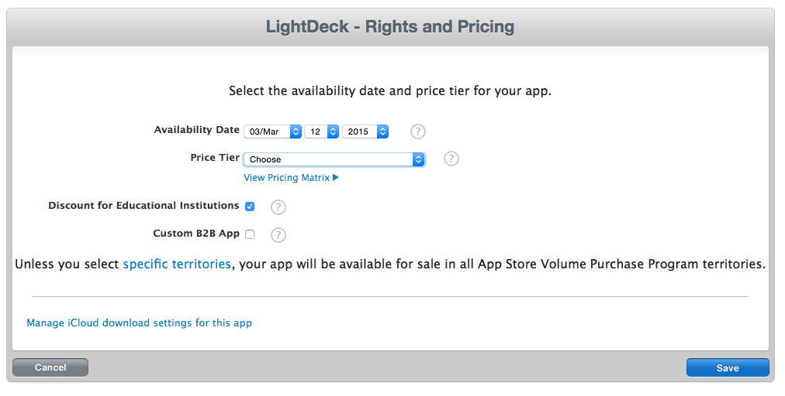](itunesconnect-images/price02.png)
4. Select an **Availability Date**.
5. Select the desired price from the **Price Tier** dropdown list.
5. Optionally enable **Educational Discounts**.
6. Optionally define the application as a **Custom Business to Business Application**.
6. Click the **Save** button to save your changes.

<a name="iap" />

## Maintaining In-App Purchase Information

If you plan on selling virtual, In-App products from your application (such as new game levels or application features) you will use this section to create and maintain those purchase items.

[ 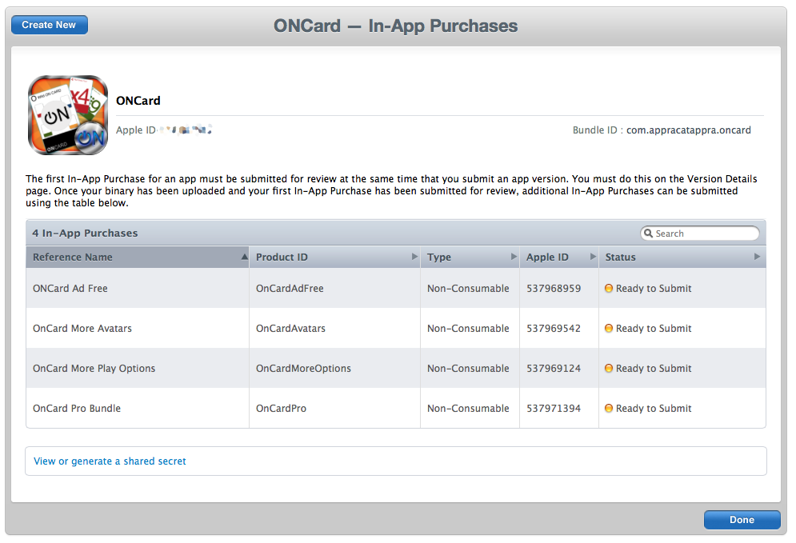](itunesconnect-images/inapp01.png)

For more information about working with In-App Purchases in a Xamarin.iOS application, please see our [In-App Purchasing](~/ios/platform/in-app-purchasing/index.md) documentation.

## Viewing Application Reviews

Once your application has been released to the App Store, users who purchase or download the application for free can write reviews of the app and leave star ratings. Use this section to see those reviews. For example:

[ 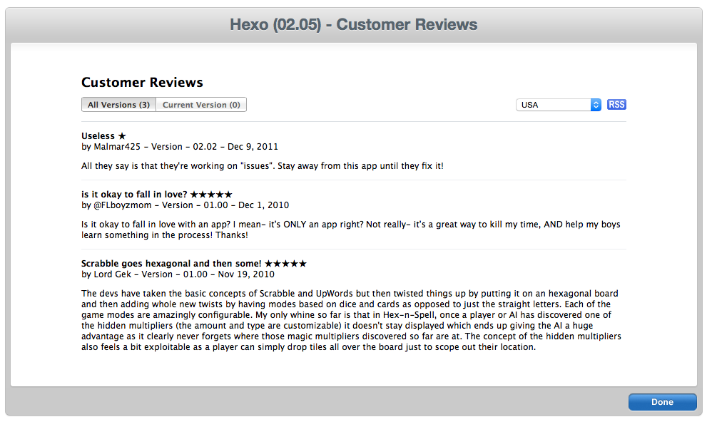](itunesconnect-images/reviews01.png)

## Summary

This article describes how to use iTunes Connect to prepare a Xamarin.iOS application for release to the App Store and how to maintain all of the information displayed about your application in the store.

## Related Links

- [Working with Images](~/ios/app-fundamentals/images-icons/index.md)
- [iOS App Development Workflow Guide: Distributing Applications](http://developer.apple.com/library/ios/#documentation/Xcode/Conceptual/ios_development_workflow/35-Distributing_Applications/distributing_applications.html)
- [App Store Submission Tips](https://developer.apple.com/appstore/resources/submission/tips.html)
- [App Store Review Guidelines](https://developer.apple.com/appstore/resources/approval/guidelines.html)
- [iTunes Connect Developer Guide](https://developer.apple.com/library/ios/documentation/LanguagesUtilities/Conceptual/iTunesConnect_Guide/Chapters/About.html#//apple_ref/doc/uid/TP40011225-CH1-SW1)
