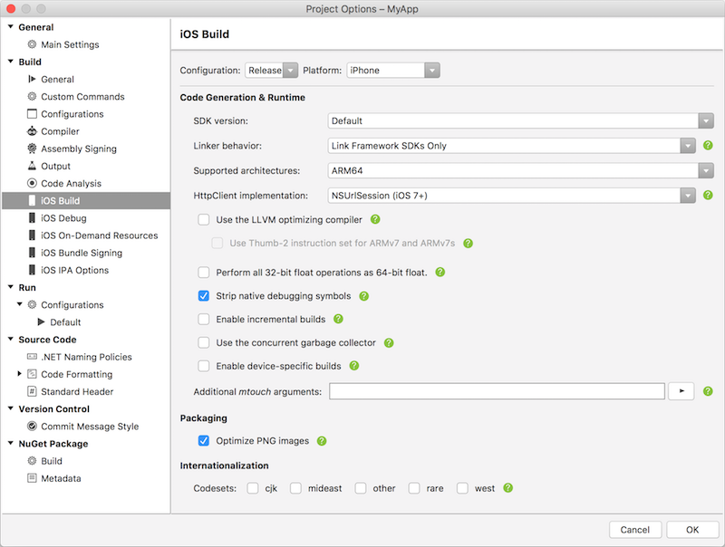
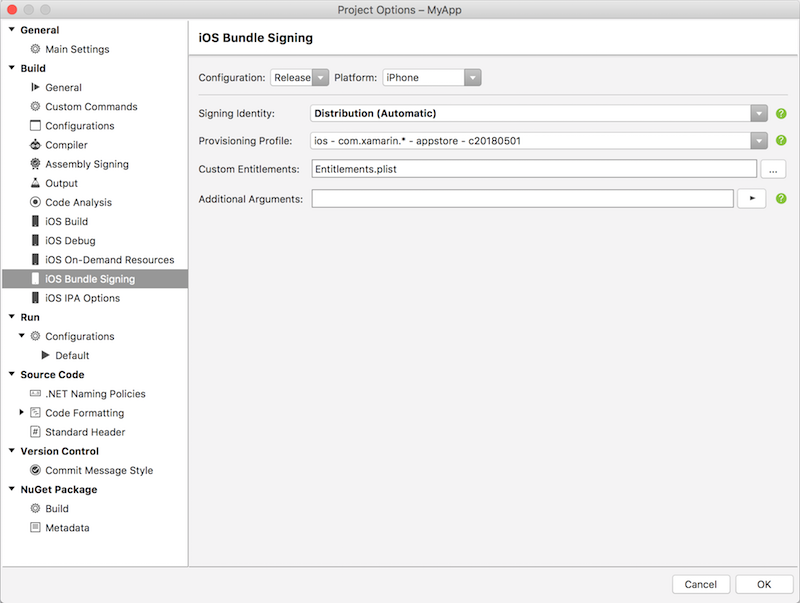
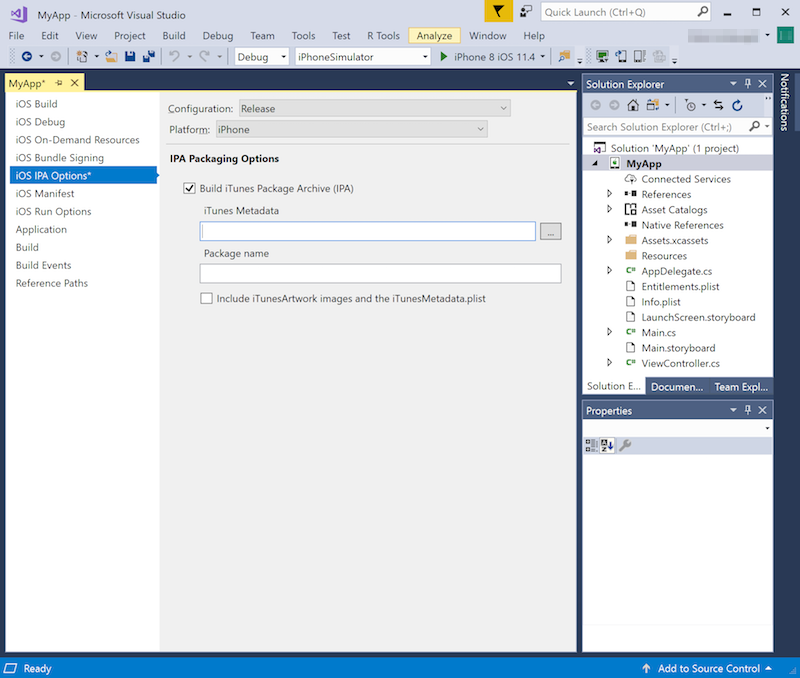
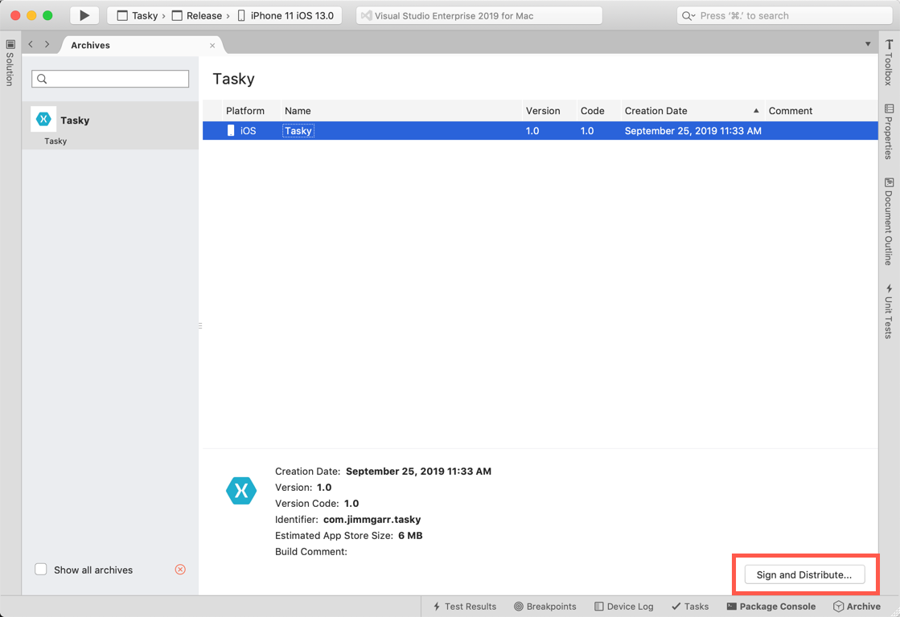
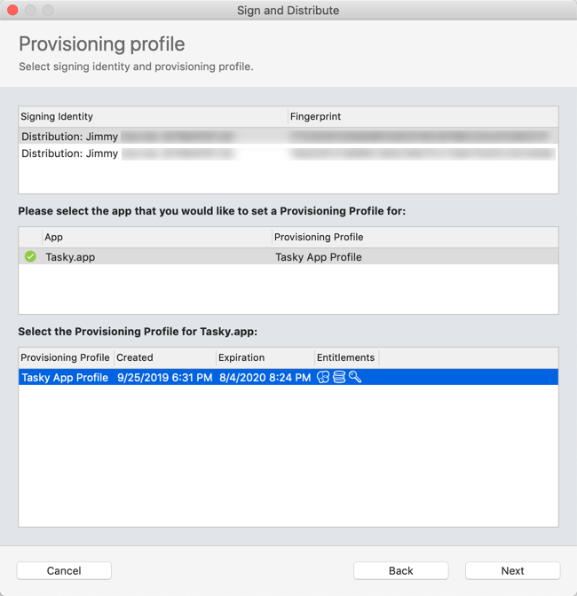
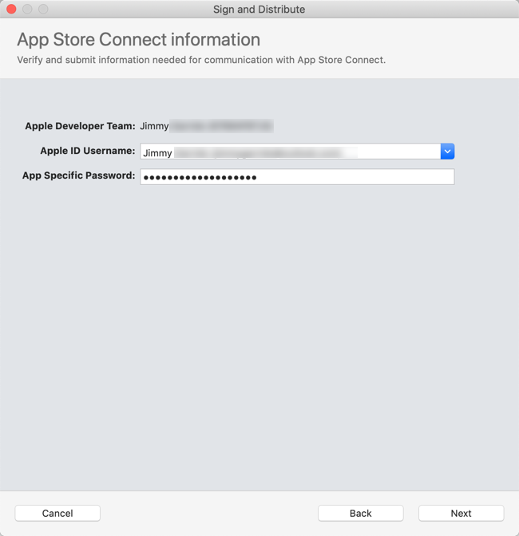
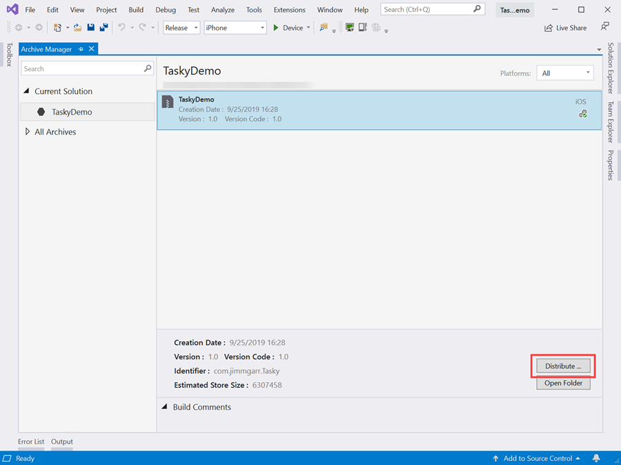
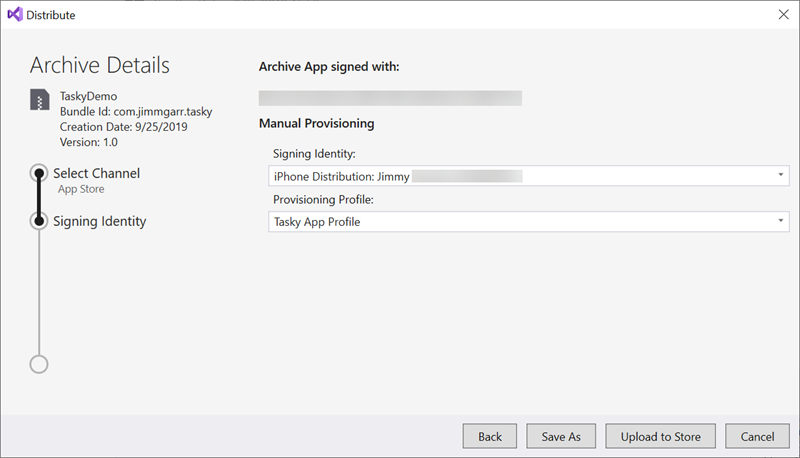
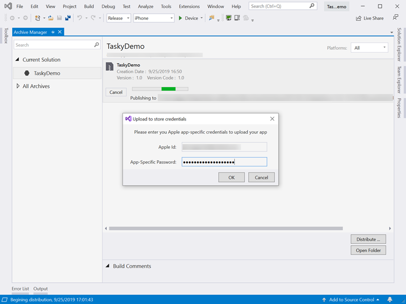
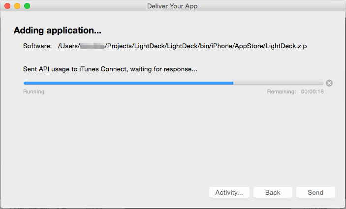

# Publishing Xamarin.iOS apps to the App Store

To publish an app to the [App Store](https://www.apple.com/ios/app-store/),
an app developer must first submit it – along with screenshots, a
description, icons, and other information – to Apple for review. After
approving the app, Apple places it on the App Store, where users can
purchase it and install it directly from their iOS devices.

This guide describes the steps to follow to prepare an app for the App
Store and send it to Apple for review. In particular, it describes:

> [!div class="checklist"]
>
> - Following the App Store Review Guidelines
> - Setting up an App ID and entitlements
> - Providing an App Store icon and app icons
> - Setting up an App Store provisioning profile
> - Updating the **Release** build configuration
> - Configuring your app in iTunes Connect
> - Building your app and submitting it to Apple

> [!IMPORTANT]
> Apple [has indicated](https://developer.apple.com/ios/submit/) that
> starting in March 2019, all apps and updates submitted to the App Store
> must have been built with the iOS 12.1 SDK or later, included in Xcode 10.1 or later.
> Apps should also support the iPhone XS and 12.9" iPad Pro screen sizes.

## App Store guidelines

Before submitting an app for publication in the App Store, make sure that
it meets the standards defined by Apple's [App Store Review
Guidelines](https://developer.apple.com/appstore/resources/approval/guidelines.html).
When you submit an app to the App Store, Apple reviews it to make sure
that it meets these requirements. If it does not, Apple will reject it –
and you will need to address the cited problems and resubmit.
Therefore, it is a good idea to become familiar the guidelines as early
as possible in the development process.

A couple of things to watch out for when submitting an app:

1. Make sure the app’s description matches its functionality.
2. Test that the app doesn’t crash under normal usage. This includes usage on every iOS device it supports.

Also take a look at [App Store-related resources](https://developer.apple.com/app-store/resources/) 
that Apple provides.

## Set up an App ID and entitlements

Every iOS app has a unique App ID, which has an associated set of
application services called *entitlements*. Entitlements allow apps to do
various things such as receive push notification, access iOS features
such as HealthKit, and more.

To create an App ID and select any needed entitlements, visit the
[Apple Developer Portal](https://developer.apple.com/account/) and follow
these steps:

1. In the **Certificates, IDs & Profiles** section, select **Identifiers > App IDs**.
2. Click the **+** button and provide a **Name** and **Bundle ID** for the new application.
3. Scroll to the bottom of the screen and select any **App Services** that will be required by your Xamarin.iOS application. App Services are further described in the [Working with capabilities in Xamarin.iOS](~/ios/deploy-test/provisioning/capabilities/index.md) guide.
4. Click the **Continue** button and follow the on-screen instructions to create the new App ID.

In addition to selecting and configuring the required application
services when defining your App ID, you must configure the App ID and
entitlements in your Xamarin.iOS project by editing the **Info.plist**
and **Entitlements.plist** files. For more information, take a look at
the [Working with Entitlements in
Xamarin.iOS](~/ios/deploy-test/provisioning/entitlements.md) guide, which
describes how to create an **Entitlements.plist** file and the meaning of
the various entitlement settings it contains.

## Include an App Store icon

When you submit an app to Apple, be sure that it includes an asset
catalog that contains an App Store icon. To learn how to do this, take a
look at the [App Store icons in
Xamarin.iOS](~/ios/app-fundamentals/images-icons/app-store-icon.md) guide.

## Set the apps icons and launch screens

For Apple to make an iOS app available on the App Store, it must have proper icons and launch screens for all of the iOS devices on which it can run. For more information about setting up app icons and launch screens, read the following guides:

- [Application icons in Xamarin.iOS](~/ios/app-fundamentals/images-icons/app-icons.md)
- [Launch screens for Xamarin.iOS apps](~/ios/app-fundamentals/images-icons/launch-screens.md)

## Create and install an App Store provisioning profile

iOS uses *provisioning profiles* to control how a particular application build can be deployed. These are files that contain information about the certificate used to sign an app, the App ID, and where the app can be installed. For development and ad hoc distribution, the provisioning profile also includes the list of allowed devices to which you can deploy the app. However, for App Store distribution, only certificate and App ID information are included since the only mechanism for public distribution is the App Store.

To create and install an App Store provisioning profile, follow these steps:

1. Log in to the [Apple Developer Portal](https://developer.apple.com/account/).
2. In **Certificates, IDs & Profiles**, select **Provisioning Profiles > Distribution**.
3. Click the **+** button, select **App Store**, and click **Continue**.
4. Select your app's **App ID** from the list and click **Continue**.
5. Select a signing certificate and click **Continue**.
6. Enter a **Profile Name** and click **Continue** to generate the profile.
7. Use Xamarin's [Apple Account Management](~/cross-platform/macios/apple-account-management.md) tools to download the newly-created provisioning profile to your Mac. If you're on a Mac, you can also download the provisioning profile directly from the Apple Developer Portal and double-click on it to install.

For detailed instructions, see the [Creating a distribution profile](~/ios/get-started/installation/device-provisioning/manual-provisioning.md#provisioningprofile) and [Selecting a distribution profile in a Xamarin.iOS project](~/ios/deploy-test/app-distribution/app-store-distribution/index.md#selectprofile).

## Update the Release build configuration

New Xamarin.iOS projects automatically set up **Debug** and **Release** _build configurations_. To properly configure the **Release** build, follow these steps:

# [Visual Studio for Mac](#tab/macos)

1. From the **Solution Pad**, open **Info.plist**. Select **Manual Provisioning**. Save and close the file.
2. Right-click on the **Project Name** in the **Solution Pad**, select **Options**, and navigate to the **iOS Build** tab.
3. Set **Configuration** to **Release** and **Platform** to **iPhone**.
4. To build with a specific iOS SDK, select it from the **SDK version** list. Otherwise, leave this value at **Default**.
5. Linking reduces the overall size of your application by stripping out unused code. In most cases, **Linker behavior** should be set to the default value of **Link Framework SDKs only**. In some situations, such as when using some third-party libraries, it may be necessary to set this value to **Don't Link** to ensure that needed code is not removed. For more information, refer to the [Linking Xamarin.iOS apps](~/ios/deploy-test/linker.md) guide.
6. Check **Optimize PNG images** to further decrease your application's size.
7. Debugging should _not_ be enabled, as it will make the build unnecessarily large.
8. For iOS 11, select one of the device architectures that supports **ARM64**. For more information on building for 64-bit iOS devices, please see the **Enabling 64-Bit Builds of Xamarin.iOS Apps** section of the [32/64-bit platform considerations](~/cross-platform/macios/32-and-64/index.md) documentation.
9. You may wish to use the **LLVM** compiler to build smaller and faster code. However, this option increases compile times.
10. Based on your application's needs, you may also wish to adjust the type of **Garbage Collection** being used and set up for **Internationalization**.

    After setting the options described above, your build settings should
    look similar to this:

    

    Also take a look at ths [iOS build mechanics](~/ios/deploy-test/ios-build-mechanics.md) guide, which further describes build settings.

11. Navigate to the **iOS Bundle Signing** tab. If the options here are not editable, make sure that **Manual Provisioning** is selected in the **Info.plist** file.
12. Make sure that **Configuration** is set to **Release** and **Platform** is set to **iPhone**.
13. Set **Signing Identity** to **Distribution (Automatic)**.
14. For **Provisioning Profile**, select the App Store provisioning profile [created above](#create-and-install-an-app-store-provisioning-profile).

    Your project's bundle signing options should now look similar to this:

    

15. Click **OK** to save changes to the project properties.

# [Visual Studio 2019](#tab/windows)

1. Make sure that Visual Studio 2019 has been [paired to a Mac build host](~/ios/get-started/installation/windows/connecting-to-mac/index.md).
2. Right-click on the **Project Name** in the **Solution Explorer**, select **Properties**.
3. Navigate to the **iOS Build** tab and set **Configuration** to **Release** and **Platform** to **iPhone**.
4. To build with a specific iOS SDK, select it from the **SDK Version** list. Otherwise, leave this value at **Default**.
5. Linking reduces the overall size of your application by stripping out unused code. In most cases, **Linker Behavior** should be set to the default value of **Link Framework SDKs only**. In some situations, such as when using some third-party libraries, it may be necessary to set this value to **Don't Link** to ensure that needed code is not removed. For more information, refer to the [Linking Xamarin.iOS apps](~/ios/deploy-test/linker.md) guide.
6. Check **Optimize PNG images** to further decrease your application's size.
7. Debugging should not be enabled, as it will make the build unnecessarily large.
8. For iOS 11, select one of the device architectures that supports **ARM64**. For more information on building for 64-bit iOS devices, please see the **Enabling 64-Bit Builds of Xamarin.iOS Apps** section of the [32/64-bit platform considerations](~/cross-platform/macios/32-and-64/index.md) documentation.
9. You may wish to use the **LLVM** compiler to build smaller and faster code. However, this option increases compile times.
10. Based on your application's needs, you may also wish to adjust the type of **Garbage Collection** being used and set up for **Internationalization**.

    After setting the options described above, your build settings should
    look similar to this:

    

    Also take a look at ths [iOS build mechanics](~/ios/deploy-test/ios-build-mechanics.md) guide, which further describes build settings.

11. Navigate to the **iOS Bundle Signing** tab. Make sure that **Configuration** is set to **Release**, **Platform** is set to **iPhone**, and that **Manual Provisioning** is selected.
12. Set **Signing Identity** to **Distribution (Automatic)**.
13. For **Provisioning Profile**, select the App Store provisioning profile [created above](#create-and-install-an-app-store-provisioning-profile).

    Your project's bundle signing options should now look similar to this:

    

14. Save the build configuration and close it.

# [Visual Studio 2017](#tab/win-vs2017)

1. Make sure that Visual Studio 2017 has been [paired to a Mac build host](~/ios/get-started/installation/windows/connecting-to-mac/index.md).
2. Right-click on the **Project Name** in the **Solution Explorer**, select **Properties**.
3. Navigate to the **iOS Build** tab and set **Configuration** to **Release** and **Platform** to **iPhone**.
4. To build with a specific iOS SDK, select it from the **SDK Version** list. Otherwise, leave this value at **Default**.
5. Linking reduces the overall size of your application by stripping out unused code. In most cases, **Linker Behavior** should be set to the default value of **Link Framework SDKs only**. In some situations, such as when using some third-party libraries, it may be necessary to set this value to **Don't Link** to ensure that needed code is not removed. For more information, refer to the [Linking Xamarin.iOS apps](~/ios/deploy-test/linker.md) guide.
6. Check **Optimize PNG images** to further decrease your application's size.
7. Debugging should not be enabled, as it will make the build unnecessarily large.
8. For iOS 11, select one of the device architectures that supports **ARM64**. For more information on building for 64-bit iOS devices, please see the **Enabling 64-Bit Builds of Xamarin.iOS Apps** section of the [32/64-bit platform considerations](~/cross-platform/macios/32-and-64/index.md) documentation.
9. You may wish to use the **LLVM** compiler to build smaller and faster code. However, this option increases compile times.
10. Based on your application's needs, you may also wish to adjust the type of **Garbage Collection** being used and set up for **Internationalization**.

    After setting the options described above, your build settings should
    look similar to this:

    

    Also take a look at ths [iOS build mechanics](~/ios/deploy-test/ios-build-mechanics.md) guide, which further describes build settings.

11. Navigate to the **iOS Bundle Signing** tab. Make sure that **Configuration** is set to **Release**, **Platform** is set to **iPhone**, and that **Manual Provisioning** is selected.
12. Set **Signing Identity** to **Distribution (Automatic)**.
13. For **Provisioning Profile**, select the App Store provisioning profile [created above](#create-and-install-an-app-store-provisioning-profile).

    Your project's bundle signing options should now look similar to this:

    

14. Navigate to the **iOS IPA Options** tab.
15. Make sure that **Configuration** is set to **Release** and **Platform** is set to **iPhone**.
16. Check the **Build iTunes Package Archive (IPA)** checkbox. This setting will cause each **Release** build (since that is the selected configuration) to generate an .ipa file. This file can be submitted to Apple for release on the App Store.

    > [!NOTE]
    > **iTunes Metadata** and **iTunesArtwork** are not necessary for App
    > Store releases. For more information, take a look at
    > [The iTunesMetadata.plist file in Xamarin.iOS apps](~/ios/deploy-test/app-distribution/itunesmetadata.md)
    > and [iTunes Artwork](~/ios/app-fundamentals/images-icons/app-icons.md#itunes-artwork).

17. To specify an .ipa filename that differs from the Xamarin.iOS project name, enter it in the **Package Name** field.

    

18. Save the build configuration and close it.

-----

## Configure your app in iTunes Connect

[iTunes Connect](https://itunesconnect.apple.com) is a suite of web-based tools for managing your iOS applications on the App Store. Your Xamarin.iOS application must be properly configured in iTunes Connect before it can be submitted to Apple for review and released on the App Store.

To learn how to do this, read the [Configuring an app in iTunes Connect](~/ios/deploy-test/app-distribution/app-store-distribution/itunesconnect.md) guide.

## Build and submit your app

With your build settings properly configured and iTunes Connect awaiting your submission, you can now build your app and submit it to Apple.

# [Visual Studio for Mac](#tab/macos)

1. In Visual Studio for Mac, select the **Release** build configuration and a device (not a simulator) for which to build.

    

2. From the **Build** menu, select **Archive for Publishing**.
3. Once the archive has been created, the **Archives** view will be displayed. Click **Sign and Distribute...** to open the publishing wizard.


    

    > [!NOTE]
    > By default the **Archives** view only shows archives for the open
    > solution. To see all solutions that have archives, check the **Show all
    > archives** checkbox. It is a good idea to keep old archives so that the
    > debug information they include can be used to symbolicate crash reports
    > if necessary.

4. Select the **App Store** distribution channel. Click **Next**.

5. Select **Upload** as the destination. Click **Next**.

6. In the **Provisioning profile** window, select your signing identity, app, and provisioning profile. Click **Next**.

    

7. In the **App Store Connect information** window, select an Apple ID username from the menu and enter [an app-specific password](https://support.apple.com/ht204397). Click **Next**.

    

8. Verify the details of your package and click **Publish**. After selecting a location to save the .ipa file, the wizard will upload your app to App Store Connect.

    > [!NOTE]
    > Apple may reject apps with the **iTunesMetadata.plist** included in the
    > .ipa file, resulting in an error such as the following:
    >
    > `ERROR: ERROR ITMS-90047: "Disallowed paths ( "iTunesMetadata.plist" ) found at: Payload/iPhoneApp1.app"`
    >
    > For a workaround to this error, take a look at [this post in the Xamarin Forums](https://forums.xamarin.com/discussion/40388/disallowed-paths-itunesmetadata-plist-found-at-when-submitting-to-app-store/p1).

# [Visual Studio 2019](#tab/windows)

> [!NOTE]
> Publishing to the App Store is supported in Visual Studio 2019 version 16.3 and higher.

1. Make sure that Visual Studio 2019 is [paired to a Mac build host](~/ios/get-started/installation/windows/connecting-to-mac/index.md).
2. Select **Release** from the **Solution Configurations** dropdown, and **iPhone** from the **Solution Platforms** dropdown.

    

3. From the **Build** menu, select **Archive...**. This will open the **Archive Manager** and begin creating an archive.

4. Once the archive has been created, click **Distribute...** to open the publishing wizard.

    

5. Select the **App Store** distribution channel.

6. Select your signing identity and provisioning profile. Click **Upload to Store**.

    

7. Enter your Apple ID and [an app-specific password](https://support.apple.com/ht204397). Click **OK** to begin uploading your app to App Store Connect.

    

# [Visual Studio 2017](#tab/win-vs2017)

> [!NOTE]
> Visual Studio 2017 does not support the full publishing workflow found in Visual Studio for Mac and Visual Studio 2019.
>
> The steps below are for Xcode 10.
>
> You can still follow the steps below to build an .IPA file, but to deploy to the App Store using Xcode 11 (which is required for iOS 13 support) you should [use Visual Studio for Mac](?tabs=macos#build-and-submit-your-app).

1. Make sure that Visual Studio 2017 has been [paired to a Mac build host](~/ios/get-started/installation/windows/connecting-to-mac/index.md).
2. Select **Release** from the Visual Studio 2017 **Solution Configurations** dropdown, and **iPhone** from the **Solution Platforms** dropdown.

    

3. Build the project. This creates an .ipa file.

    > [!NOTE]
    > The [Update the Release build configuration](#update-the-release-build-configuration)
    > section of this doc configured the app's build settings to create an
    > .ipa file for each **Release** build.

4. To find the .ipa file on the Windows machine, right-click on the Xamarin.iOS project name in the Visual Studio 2019 or Visual Studio 2017 **Solution Explorer** and choose **Open Folder in File Explorer**. Then, in the just-opened Windows **File Explorer**, navigate to the **bin/iPhone/Release** subdirectory. Unless you have [customized the .ipa file output location](#customize-the-ipa-location), it should be in this directory.
5. To instead view the .ipa file on the Mac build host, right-click the Xamarin.iOS project name in the Visual Studio 2019 or Visual Studio 2017 **Solution Explorer** (on Windows) and select **Show IPA File on Build Server**. This will open a **Finder** window on the Mac build host with the .ipa file selected.

    > [!TIP]
    >
    > The following steps are only valid if you're using Xcode 10, and building for iOS 12 and earlier. 
    >
    > To deploy to the App Store using Xcode 11 (for iOS 13), you should [use Visual Studio for Mac](?tabs=macos#build-and-submit-your-app) to build and upload your app. **Application Loader** will not be available for Xcode 11.

6. On the Mac build host, open **Application Loader**. In Xcode, select **Xcode > Open Developer Tool > Application Loader**.

    > [!NOTE]
    > For more information about the tool, take a look at [Apple's docs about Application Loader](https://help.apple.com/itc/apploader/#/apdS673accdb).

7. Log in to Application Loader (note that you must [create an app-specific password](https://support.apple.com/ht204397) for your Apple ID).
8. Select **Deliver Your App** and click the **Choose** button:

    

9. Select the .ipa file created above and click **OK**.
10. The Application Loader will validate the file:

    

11. Click the **Next** button and the application will be validated against the App Store:

    

12. Click the **Send** button to send the application to Apple for review.
13. The Application Loader will inform you when the file has been successfully uploaded.

    > [!NOTE]
    > Apple may reject apps with the **iTunesMetadata.plist** included in the
    > .ipa file, resulting in an error such as the following:
    >
    > `ERROR: ERROR ITMS-90047: "Disallowed paths ( "iTunesMetadata.plist" ) found at: Payload/iPhoneApp1.app"`
    >
    > For a workaround to this error, take a look at [this post in the Xamarin Forums](https://forums.xamarin.com/discussion/40388/disallowed-paths-itunesmetadata-plist-found-at-when-submitting-to-app-store/p1).

-----

## iTunes Connect status

To see the status of your app submission, log in to iTunes Connect and
select your app. The initial status should be **Waiting For Review**,
though it may temporarily read **Upload Received** while it is being processed.


## Tips and tricks

### Customize the .ipa location

An **MSBuild** property, `IpaPackageDir`, makes it possible to customize the .ipa file output location. If `IpaPackageDir` is set to a custom location, the .ipa file will be placed in that location instead of the default timestamped subdirectory. This can be useful when creating automated builds that rely on a specific directory path to work correctly, such as those used for Continuous Integration (CI) builds.

There are several possible ways to use the new property. For example, to output the .ipa file to the old default directory (as in Xamarin.iOS 9.6 and lower), you can set the `IpaPackageDir` property to `$(OutputPath)` using one of the following approaches. Both approaches are compatible with all Unified API Xamarin.iOS builds, including IDE builds as well as command-line builds that use **msbuild** or **mdtool**:

- The first option is to set the `IpaPackageDir` property within a `<PropertyGroup>` element in an **MSBuild** file. For example, you could add the following `<PropertyGroup>` to the bottom of the iOS app project .csproj file (just before the closing `</Project>` tag):

    ```xml
    <PropertyGroup>
      <IpaPackageDir>$(OutputPath)</IpaPackageDir>
    </PropertyGroup>
    ```

- A better approach is to add a `<IpaPackageDir>` element to the bottom of the existing `<PropertyGroup>` that corresponds to the configuration used to build the .ipa file. This is better because it will prepare the project for future compatibility with a planned setting on the iOS IPA Options project properties page. If you currently use the `Release|iPhone` configuration to build the .ipa file, the complete updated property group might look similar to the following:

    ```xml
    <PropertyGroup Condition=" '$(Configuration)|$(Platform)' == 'Release|iPhone'">
       <Optimize>true</Optimize>
       <OutputPath>bin\iPhone\Release</OutputPath>
       <ErrorReport>prompt</ErrorReport>
       <WarningLevel>4</WarningLevel>
       <ConsolePause>false</ConsolePause>
       <CodesignKey>iPhone Developer</CodesignKey>
       <MtouchUseSGen>true</MtouchUseSGen>
       <MtouchUseRefCounting>true</MtouchUseRefCounting>
       <MtouchFloat32>true</MtouchFloat32>
       <CodesignEntitlements>Entitlements.plist</CodesignEntitlements>
       <MtouchLink>SdkOnly</MtouchLink>
       <MtouchArch>ARMv7, ARM64</MtouchArch>
       <MtouchHttpClientHandler>HttpClientHandler</MtouchHttpClientHandler>
       <MtouchTlsProvider>Default</MtouchTlsProvider>
       <BuildIpa>true</BuildIpa>
       <IpaPackageDir>$(OutputPath)</IpaPackageDir>
    </PropertyGroup>
    ```

An alternate technique for **msbuild** command-line builds is to add a `/p:` command line argument to set the `IpaPackageDir` property. In this case note that **msbuild** does not expand `$()` expressions passed in on the command line, so it is not possible to use the `$(OutputPath)` syntax. You must instead provide a full path name.

```bash
msbuild /p:Configuration="Release" /p:Platform="iPhone" /p:ServerAddress="192.168.1.3" /p:ServerUser="macuser" /p:IpaPackageDir="%USERPROFILE%\Builds" /t:Build SingleViewIphone1.sln
```

Or the following on Mac:

```bash
msbuild /p:Configuration="Release" /p:Platform="iPhone" /p:IpaPackageDir="$HOME/Builds" /t:Build SingleViewIphone1.sln
```

With your distribution build created and archived, you are now ready to submit your application to iTunes Connect.

## Summary

This article described how to configure, build, and submit an iOS app for
release on the App Store.

## Related links

- [Apple Developer Portal (Apple)](https://developer.apple.com/account/)
- [iTunes Connect (Apple)](https://itunesconnect.apple.com)
- [App Store Review Guidelines (Apple)](https://developer.apple.com/appstore/resources/approval/guidelines.html)
- [Common App Rejections (Apple)](https://developer.apple.com/app-store/review/rejections/)
- [Working with capabilities in Xamarin.iOS](~/ios/deploy-test/provisioning/capabilities/index.md)
- [Working with entitlements in Xamarin.iOS](~/ios/deploy-test/provisioning/entitlements.md)
- [Configuring an app in iTunes Connect](~/ios/deploy-test/app-distribution/app-store-distribution/itunesconnect.md)
- [Application icons in Xamarin.iOS](~/ios/app-fundamentals/images-icons/app-icons.md)
- [Launch screens for Xamarin.iOS apps](~/ios/app-fundamentals/images-icons/launch-screens.md)
