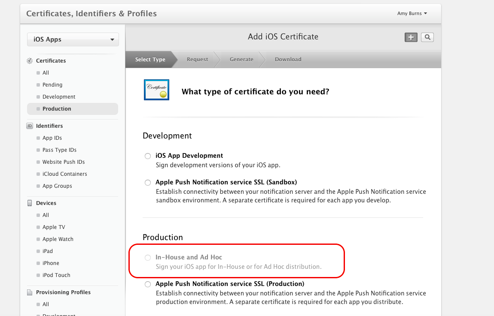
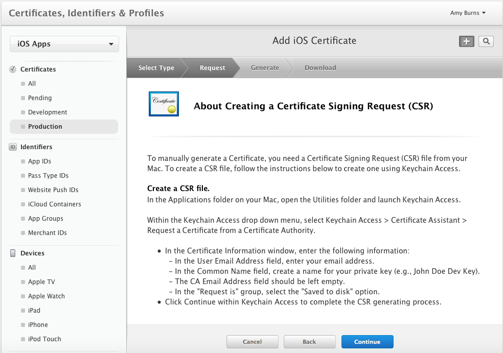
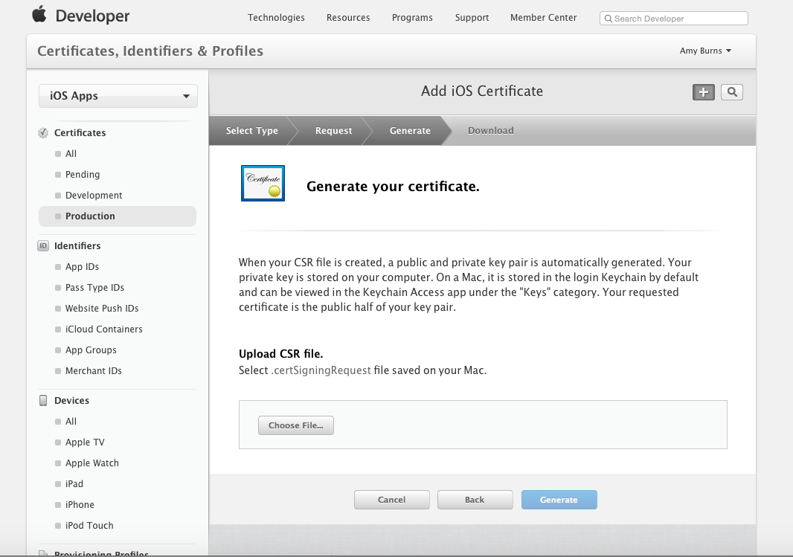
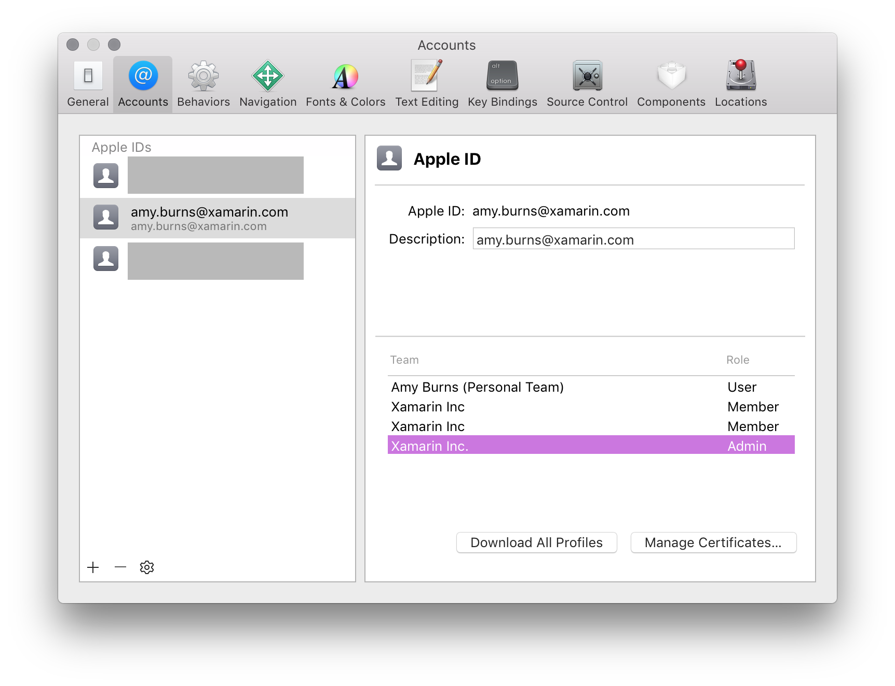
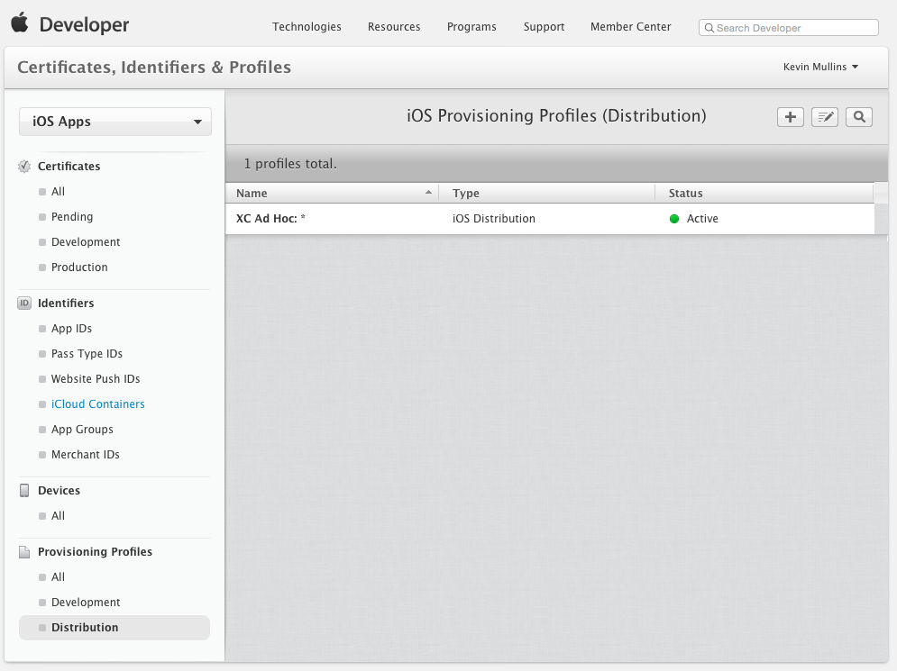
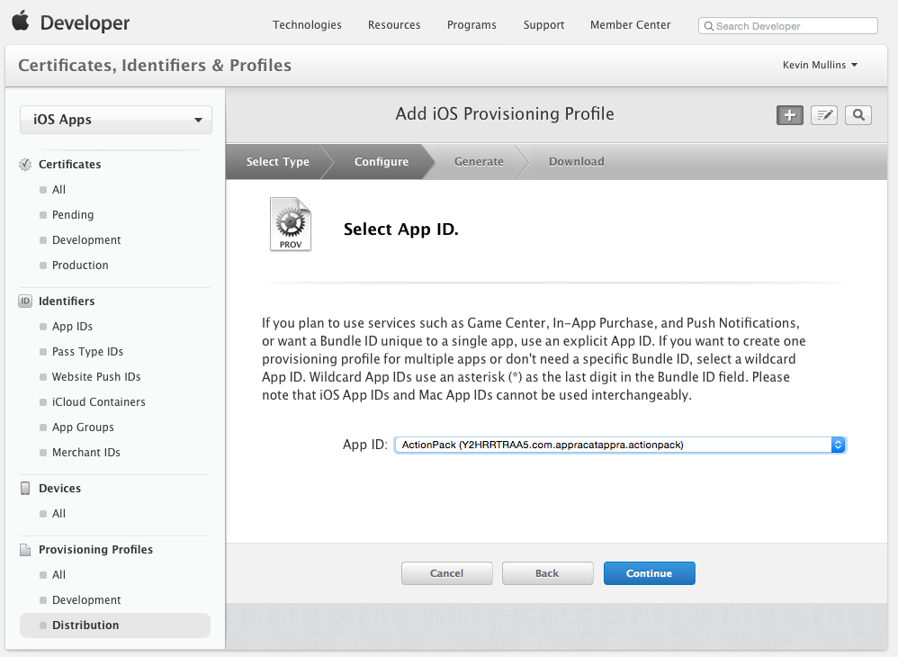
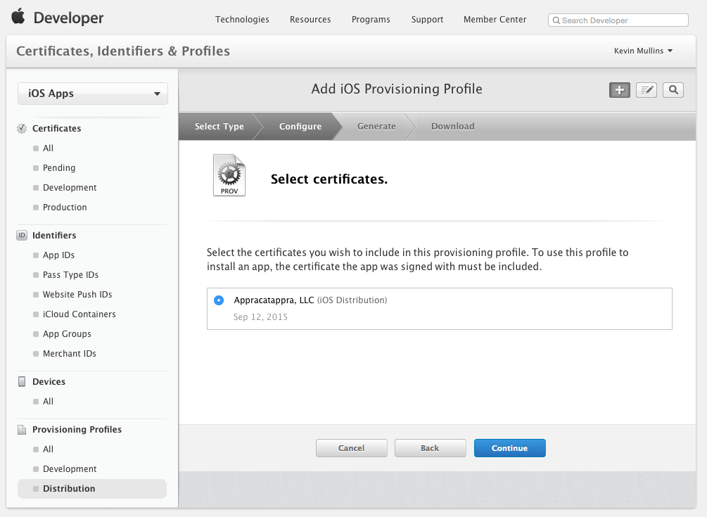
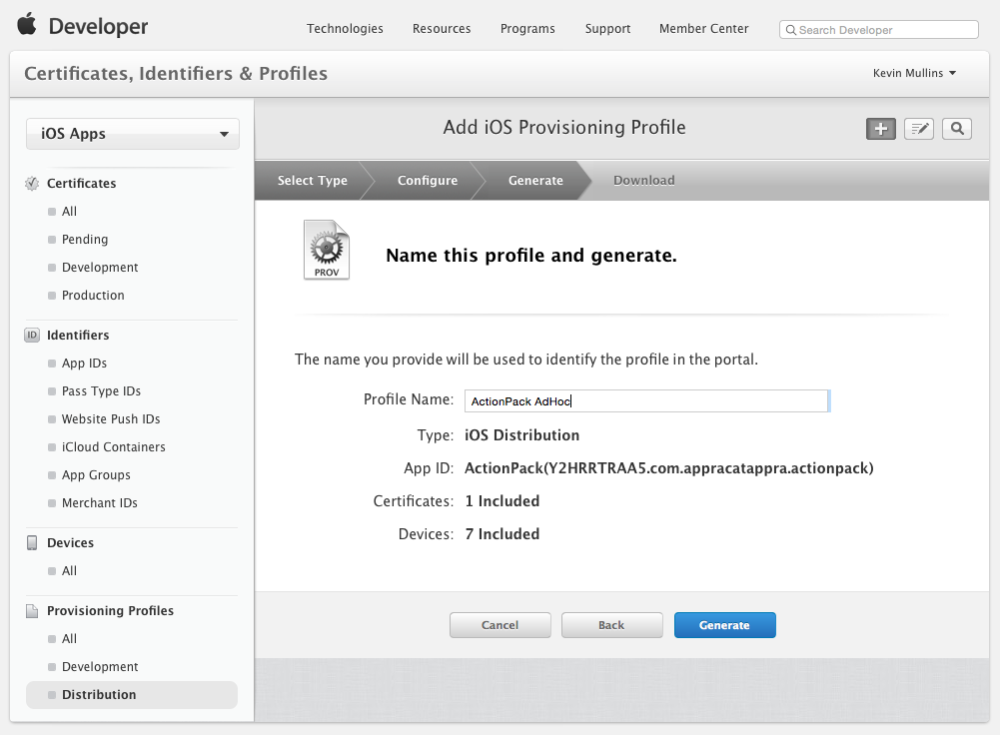

# In-House Distribution

_This document gives a brief overview of distribution of applications In-House, as a member of the Apple Enterprise Developer Program._

Once your Xamarin.iOS app has been developed, the next step in the software development lifecycle is to distribute your app to users. Proprietary apps can be distributed *In-House* (previously called Enterprise) through the **Apple Developer Enterprise Program**, which offers the following benefits:

- Your application does not need to be submitted for review by Apple.
- There are no limits to the amount of devices onto which you can deploy an application
	- It is important to note that Apple makes it very clear that In-House applications are for internal use only.

It is also important to note that the Enterprise Program:

- Does not provide access to iTunes Connect for distribution or testing (including TestFlight).
- The cost of membership is $299 per year.

All apps still need to be signed by Apple.

<a name="testing" />

## Testing your Application

Testing your application is carried out by using Ad Hoc distribution. For more information about testing, follow the steps in the [Ad-Hoc Distribution](~/ios/deploy-test/app-distribution/ad-hoc-distribution.md) guide. Be aware that you can only test on up to a maximum of 100 devices.

<a name="setup" />

## Getting Set Up for Distribution

As with other Apple Developer Programs, under the Apple Developer Enterprise Program, only Team Admins and Agents can create Distribution Certificates and Provisioning Profiles.

Apple Developer Enterprise Program certificates will last for three years, and provisioning profiles will expire after one year.

It is important to note that expired certificates cannot be renewed, and instead, you will have to replace the expired certificate with a new one, as detailed [below](#certificate).

<a name="certificate" />

## Creating a Distribution Certificate

1. Browse to the *Certificates, Identifiers & Profiles* section of the Apple Developer Member Center.
2. Under *Certificates*, select **Production**.
3. Click the **+** button to create a new Certificate.
4. Under the *Production* heading, select **In-House and Ad Hoc**:

   

5. Click Continue, and follow the instructions to create a Certificate Signing Request via Keychain Access:

   

6. Once you have created your CSR as instructed, click Continue, and upload your CSR to the Member Center:

   

7. Click Generate to create your certificate.
8. Download the completed certificate and double-click on the file to install it.
9. At this point, your certificate should be installed on the machine, but you may need to refresh your profiles, to ensure that they are visible in Xcode.

Alternatively, it is possible to request a Certificate via the Preferences dialog in Xcode. To do this, follow the steps below:

1. Select your team, and click *View Details*:

	

2. Next, click the **Create** button next to **iOS Distribution Certificate**:

   

2.   Next, click the **plus (+)** button and select **iOS App Store**:

   

<a name="profile" />

## Creating a Distribution Provisioning Profile

<a name="appid" />

### Creating an App ID

As with any other Provisioning Profile you create, an App ID will be required to identify the App that you will be distributing to the user's device. If you haven't already created this, follow the steps below to create one:

1. In the [Apple Developer Center](https://developer.apple.com/account/overview.action) browse to the *Certificate, Identifiers and Profiles* section. Select **App IDs** under **Identifiers**.
2. Click the **+** button and provide a **Name** which will identify it in the Portal.
3. The App prefix should be already set as your Team ID, and cannot be changed. Select either an Explicit or Wildcard App ID, and enter a Bundle ID in a reverse DNS format like: **Explicit**: com.[DomainName].[AppName] **Wildcard**:com.[DomainName].*
4. Select any [App Services](~/ios/get-started/installation/device-provisioning/index.md#appservices) that your app requires.
5. Click the **Continue** button and following the on screen instructions to create the new App ID.

Once you have the required components needed for creating a Distribution Profile, follow the steps below to create it:

1. Return to the Apple Provisioning Portal and select **Provisioning** > **Distribution**:

   

2. Click the **+** button and select the type of Distribution Profile that you want to create as **In-House**:

   

3. Click the **Continue** button and select App ID from the dropdown list that you want to create a Distribution Profile for:

   

4. Click the **Continue** button and select distribution certificate required to sign the application:

   

6. Click the **Continue** button and enter a **Name** for the new Distribution Profile:

   

7. Click the **Generate** button to create the new profile and finalize the process.

# [Visual Studio for Mac](#tab/vsmac)

 You may have to quit Visual Studio for Mac and have Xcode refresh it's list of available Signing Identities and Provisioning Profiles (by following the instructions in [Requesting Signing Identities](~/ios/get-started/installation/device-provisioning/manual-provisioning.md#download) section) before a new Distribution Profile is available in Visual Studio for Mac.

# [Visual Studio](#tab/vswin)

You may have to quit Visual Studio and have Xcode (on the Build Host's Mac) refresh its list of available Signing Identities and Provisioning Profiles (by following the instructions in the [Requesting Signing Identities](~/ios/get-started/installation/device-provisioning/manual-provisioning.md#download) section) before a new Distribution Profile is available in Visual Studio.

-----

<a name="inhouse" />

## Distributing your App In-House

With the Apple Developer Enterprise Program, the licensee is the person responsible for distributing the application, and for adhering to the [guidelines](http://adcdownload.apple.com/Documentation/License_Agreements__Apple_Developer_Enterprise_Program/Apple_Developer_Program_Enterprise_Agreement_20150608.pdf) set by Apple.

Your app can be distributed securely using a variety of different means, such as:

- Locally through iTunes
- MDM server
- An internal, secure web server
- Email

To distribute your app in any of these ways you must first create an IPA file, as explained in the next section.

### Creating an IPA for In-House Deployment

Once provisioned, applications can be packaged into a file known as an *IPA*. This is a zip file that contains the application, along with additional metadata and icons. The IPA is used to add an application locally into iTunes so that it can be synced directly to a device that is included in the provisioning profile.

For more information on creating an IPA see [IPA Support](~/ios/deploy-test/app-distribution/ipa-support.md) guide.

## Summary

This article gave a brief overview of distributing Xamarin.iOS applications In-House.

## Related Links

- [App Store Distribution](~/ios/deploy-test/app-distribution/app-store-distribution/index.md)
- [Ad Hoc Distribution](~/ios/deploy-test/app-distribution/ad-hoc-distribution.md)
- [The iTunesMetadata.plist File](~/ios/deploy-test/app-distribution/itunesmetadata.md)
- [IPA Support](~/ios/deploy-test/app-distribution/ipa-support.md)
