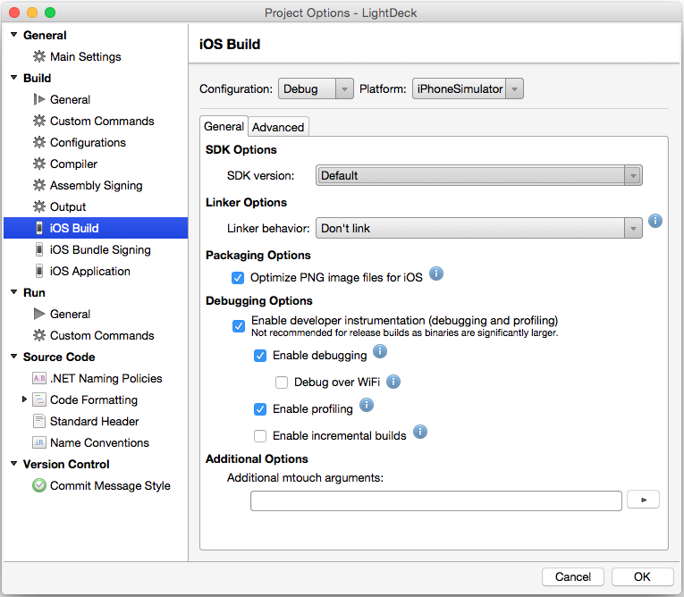
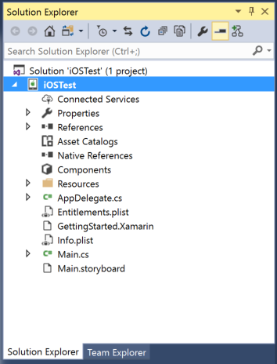
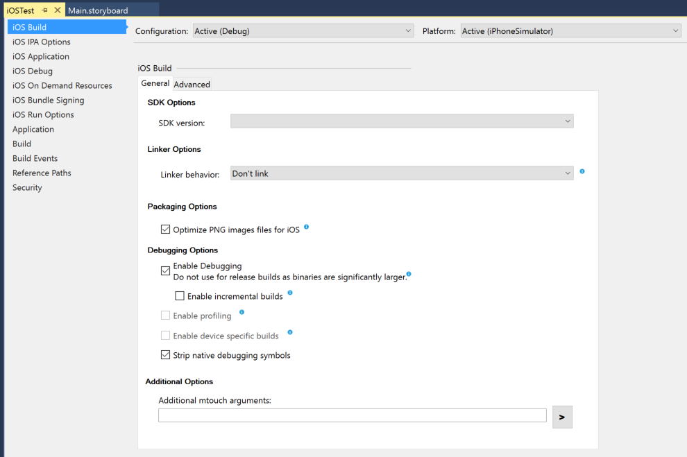

# Linking Xamarin.iOS Apps

When building your application, Visual Studio for Mac or Visual Studio calls
a tool called **mtouch** that includes a linker for managed code. It is
used to remove from the class libraries the features that the
application is not using. The goal is to reduce the size of the
application, which will ship with only the necessary bits.

The linker uses static analysis to determine the different code paths that
your application is susceptible to follow. It's a bit heavy as it has to go
through every detail of each assembly, to make sure that nothing discoverable is
removed. It is not enabled by default on the simulator builds to speed
up the build time while debugging. However since it produces smaller applications it can speed up AOT compilation and
uploading to the device, all *devices (Release) builds* are using the
linker by default.

As the linker is a static tool, it can not mark for inclusion types and
methods that are called through reflection, or dynamically instantiated. Several options exists to workaround this limitation.

<a name="Linker_Behavior" />

## Linker Behavior

# [Visual Studio for Mac](#tab/macos)

The linking process can be customized via the linker behavior
dropdown in **Project Options**. To access
this double-click on the iOS project and browse to **iOS Build > Linker Options**, as illustrated
below:

[](linker-images/image1.png#lightbox)

# [Visual Studio](#tab/windows)

The linking process can be customized via the linker behavior dropdown in the **Project Properties** in Visual Studio.

Do the following:

1. Right-click on the **Project Name** in the **Solution Explorer** and select **Properties**:

	
2. In the **Project Properties**, select **IOS Build**:

	
3. Follow the instructions below to change the linking options.

-----

The three main options are offered are described below:


### Don't Link

Disabling linking will make sure that no assemblies are modified. For
performance reasons this is the default setting when your IDE targets
for the iOS simulator. For devices builds this should only be used as
a workaround whenever the linker contains a bug that prevents your
application to run. If your application only works with *-nolink*,
please submit a [bug report](http://bugzilla.xamarin.com).

This corresponds to the *-nolink* option when using the command-line
tool mtouch.

<a name="Link_SDK_assemblies_only" />

### Link SDK assemblies only

In this mode, the linker will leave your assemblies untouched, and
will reduce the size of the SDK assemblies (i.e. what's shipped with
Xamarin.iOS) by removing everything that your application doesn't
use. This is the default setting when your IDE targets iOS devices.

This is the most simple option, as it does not require any change in
your code. The difference with linking everything is that the linker
can not perform a few optimizations in this mode, so it's a trade-off
between the work needed to link everything and the final application
size.

This correspond to the *-linksdk* option when using the command-line
tool mtouch.

<a name="Link_all_assemblies" />

### Link all assemblies

When linking everything, the linker can use the whole set of its
optimizations to make the application as small as possible. It will
modify user code, which may break whenever the code uses features in a
way that the linker's static analysis cannot detect. In such cases,
e.g. webservices, reflection, or serialization, some adjustements
might be required in your application to link everything.

This correspond to the *-linkall* option when using the command-line
tool **mtouch**.

<a name="Controlling_the_Linker" />

## Controlling the Linker

When you use the linker it will sometimes will remove code that you might
have called dynamically, even indirectly. To cover those cases the linker
provides a few features and options to allow you greater control on its
actions.

<a name="Preserving_Code" />

### Preserving Code

When you use the linker it can sometimes remove code that you might have
called dynamically either using System.Reflection.MemberInfo.Invoke, or by
exporting your methods to Objective-C using the `[Export]` attribute and then
invoking the selector manually.

In those cases, you can instruct the linker to consider either entire classes
to be used or individual members to be preserved by applying the
`[Xamarin.iOS.Foundation.Preserve]` attribute either at the class-level or the
member-level. Every member that is not statically linked by the application is
subject to be removed. This attribute is hence used to mark members that are not
statically referenced, but that are still needed by your application.

For instance, if you instantiate types dynamically, you may want to preserve
the default constructor of your types. If you use XML serialization, you may
want to preserve the properties of your types.

You can apply this attribute on every member of a type, or on the type
itself. If you want to preserve the whole type, you can use the syntax `[Preserve
(AllMembers = true)]` on the type.

Sometimes you want to preserve certain members, but only if the containing
type was preserved. In those cases, use `[Preserve (Conditional=true)]`

If you do not want to take a dependency on the Xamarin libraries -for
example, say that you are building a cross platform portable class
library (PCL) - you can still use this attribute.

To do this, you should just declare a PreserveAttribute class, and use
it in your code, like this:

```csharp
public sealed class PreserveAttribute : System.Attribute {
    public bool AllMembers;
    public bool Conditional;
}
```

It does not really matter in which namespace this is defined, the
linker looks this attribute by type name.

 <a name="Skipping_Assemblies" />

### Skipping Assemblies

It is possible to specify assemblies that should be excluded from the
linker process, while allowing other assemblies to be linked normally. This is
helpful if using `[Preserve]` on some assemblies is impossible (e.g. 3rd party
code) or as a temporary workaround for a bug.

This correspond to the `--linkskip` option when using the command-line
tool mtouch.

When using **Link All Assemblies** option, if you want to tell the linker to skip entire assemblies, put the following in the **Additional mtouch arguments** options of your top-level assembly:

```csharp
--linkskip=NameOfAssemblyToSkipWithoutFileExtension
```

If you want the linker to skip multiple assemblies, you include multiple `linkskip` arguments:

```csharp
--linkskip=NameOfFirstAssembly --linkskip=NameOfSecondAssembly
```

There is no user interface to use this option but it can be provided in the
Visual Studio for Mac Project Options dialog or the Visual Studio project Properties pane, within the **Additional mtouch arguments** text
field. (E.g. *--linkskip=mscorlib* would not link mscorlib.dll but would link
other assemblies in the solution).

<a name="Disabling_Link_Away" />

### Disabling "Link Away"

The linker will remove code that is very unlikely to be used on devices, e.g.
unsupported or disallowed. In rare occasion it is possible that an application
or library depends on this (working or not) code. Since Xamarin.iOS 5.0.1 the
linker can be instructed to skip this optimization.

This correspond to the *-nolinkaway* option when using the
command-line tool mtouch.

There is no user interface to use this option but it can be provided in the
Visual Studio for Mac Project Options dialog or the Visual Studio project Properties pane, within **Additional mtouch arguments** text
field. (E.g. *--nolinkaway* would not remove the extra code (about 100kb)).

### Marking your Assembly as Linker-ready

Users can select to just link the SDK assemblies, and not do any
linking to their code.  This also means that any third party libraries
that are not part of Xamarin's core SDK will not be linked.

This happens typically, because they do not want to manually add
`[Preserve]` attributes to their code.  The side effect is that third
party libraries will not be linked, and this in general is a good
default, as it is not possible to know whether a third party library
is linker friendly or not.

If you have a library in your project, or you are a developer of
reusable libraries and you want the linker to treat your assembly as
linkable, all you have to do is add the assembly-level attribute
[`LinkerSafe`](https://developer.xamarin.com/api/type/Foundation.LinkerSafeAttribute/),
like this:

```csharp
[assembly:LinkerSafe]
```

Your library does not actually need to reference the Xamarin libraries
for this.  For example, if you are building a Portable Class Library
that will run in other platforms you can still use a `LinkerSafe` attribute.
The Xamarin linker looks up the
`LinkerSafe` attribute by name, not by its actual type.  This means that
you can write this code and it will also work:

```csharp
[assembly:LinkerSafe]
// ... assembly attribute should be at top, before source
class LinkerSafeAttribute : System.Attribute {}
```

## Custom Linker Configuration

Follow the [instructions for creating a linker configuration file](~/cross-platform/deploy-test/linker.md).


## Related Links

- [Custom Linker Configuration](~/cross-platform/deploy-test/linker.md)
- [Linking on Mac](~/mac/deploy-test/linker.md)
- [Linking on Android](~/android/deploy-test/linker.md)
